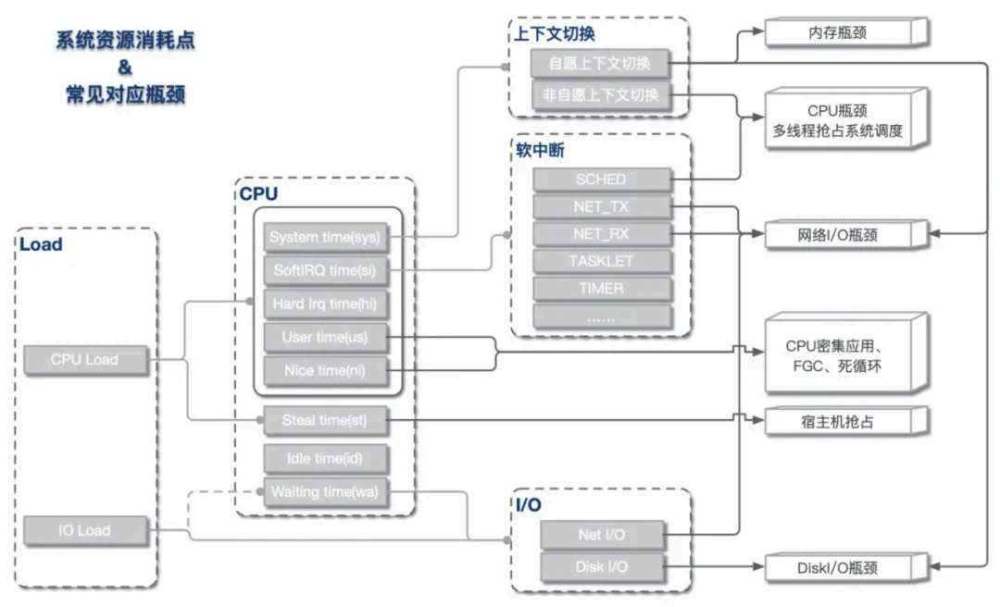
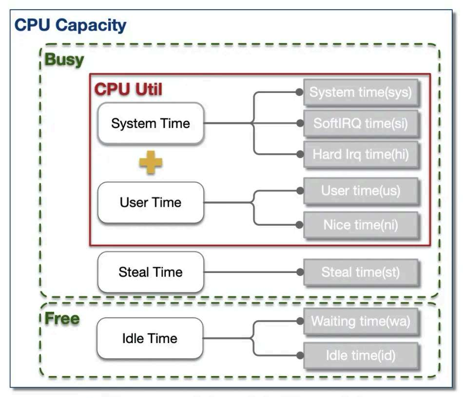
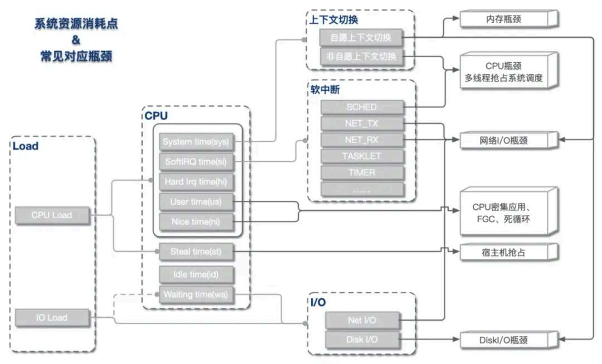
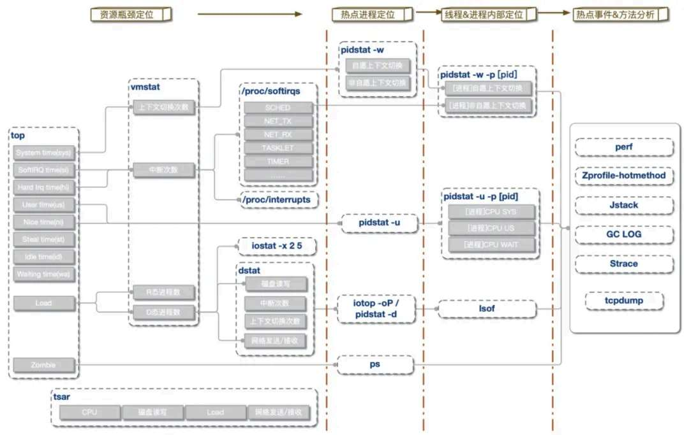
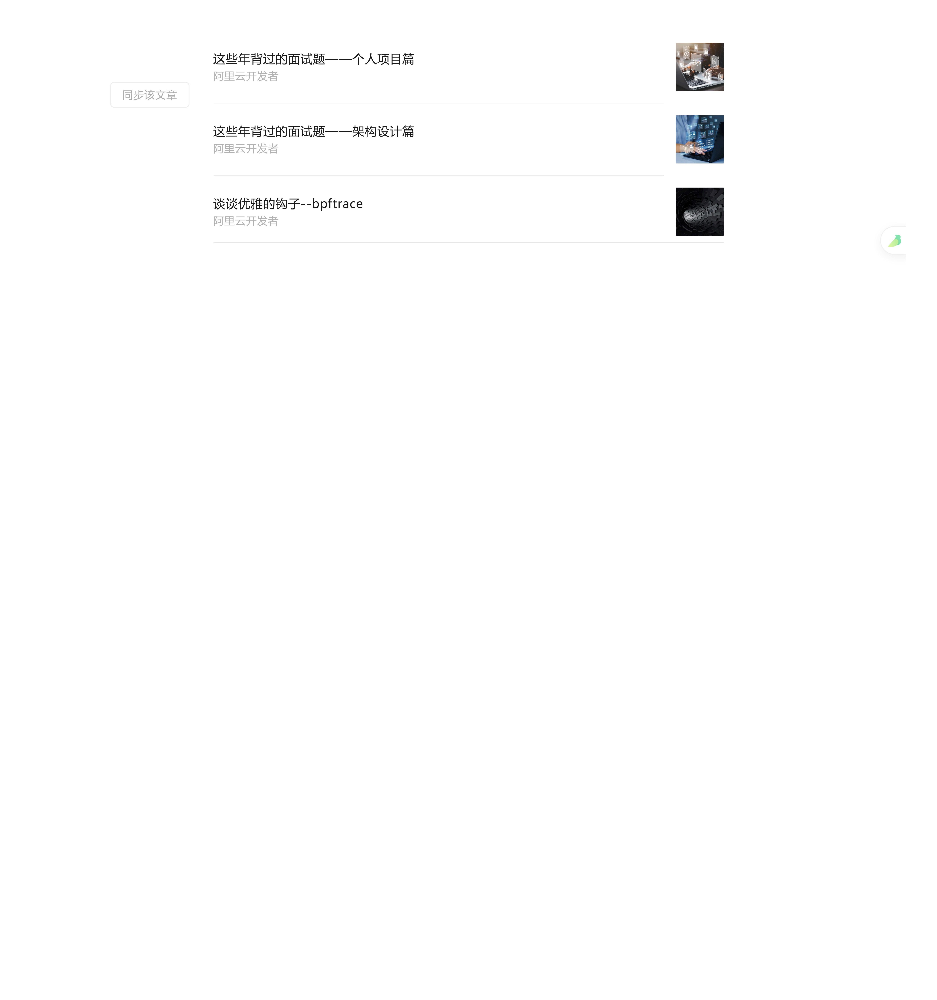

# CPU 飙高，系统性能问题如何排查

> 原文 PDF：`troubleshooting/CPU飙高，系统性能问题如何排查？.pdf`（已转文字 + 提取配图）

## 正文

```

```

## 配图

### 第 1 页 — 001-p01.jpeg


### 第 1 页 — 002-p01.jpeg



### 第 3 页 — 003-p03.jpeg



### 第 4 页 — 004-p04.jpeg



### 第 5 页 — 005-p05.jpeg



### 第 7 页 — 006-p07.jpeg


### 第 8 页 — 007-p08.jpeg



### 第 8 页 — 008-p08.jpeg


