# Redis 事务遇上 @Transactional 有大坑

> 原文 PDF：`faultcase/【故障现场】Redis 事务遇上 @Transactional 有大坑.pdf`（整页扫描，文字层缺失，已按页渲染为图片）

## 全文（图片版）

## 页面

### 第 1 页 — p01.png

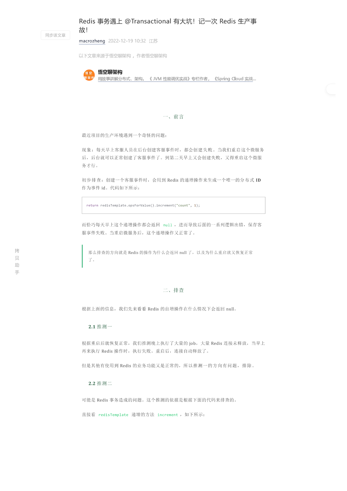

### 第 2 页 — p02.png

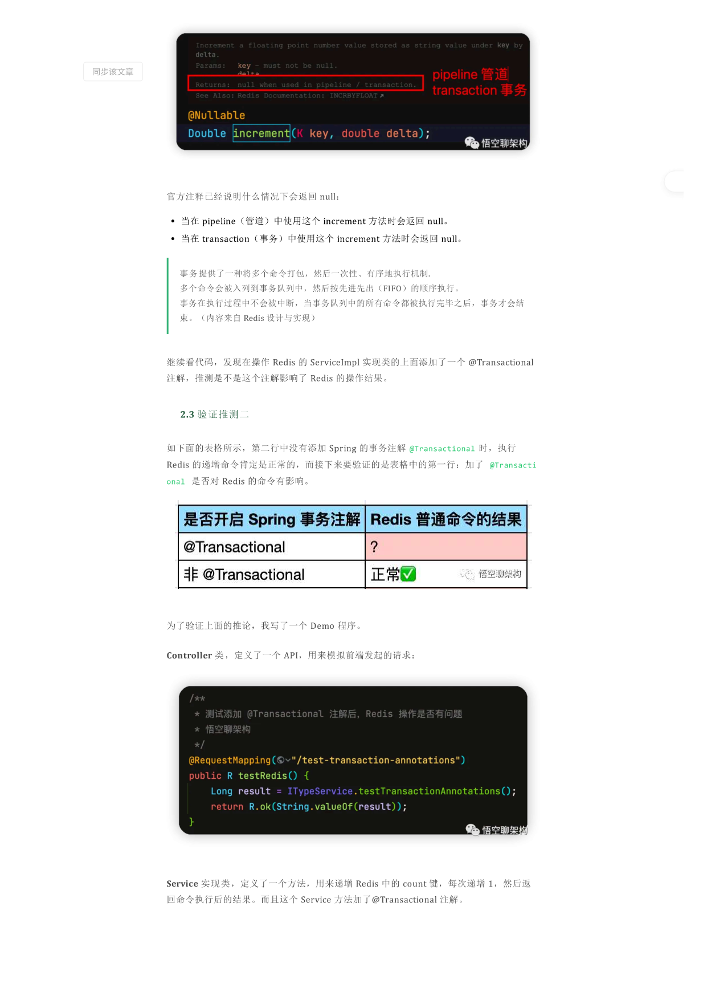

### 第 3 页 — p03.png

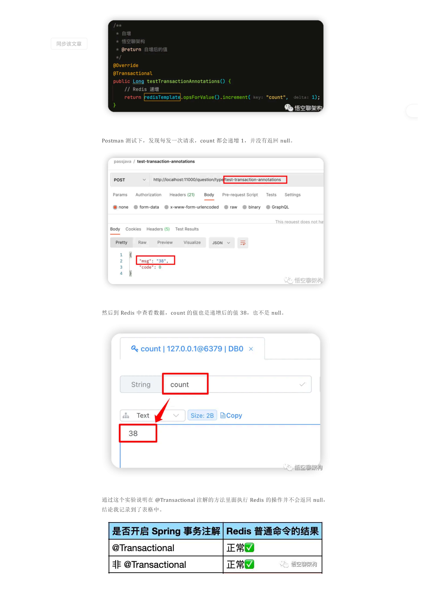

### 第 4 页 — p04.png

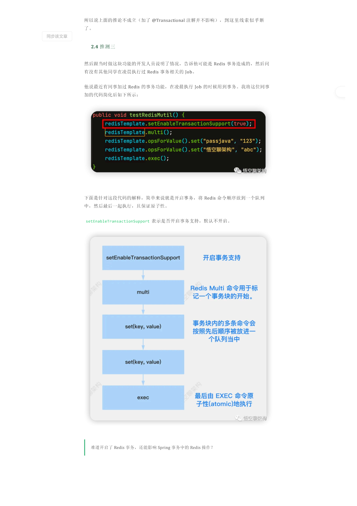

### 第 5 页 — p05.png

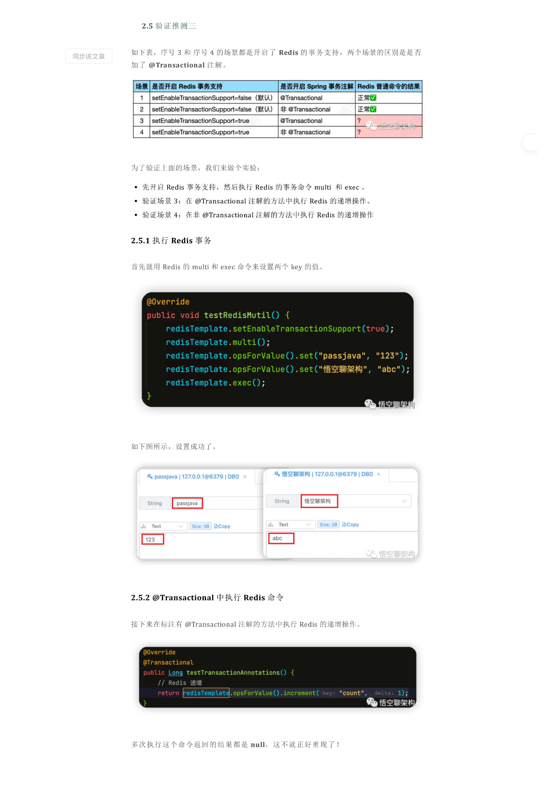

### 第 6 页 — p06.png

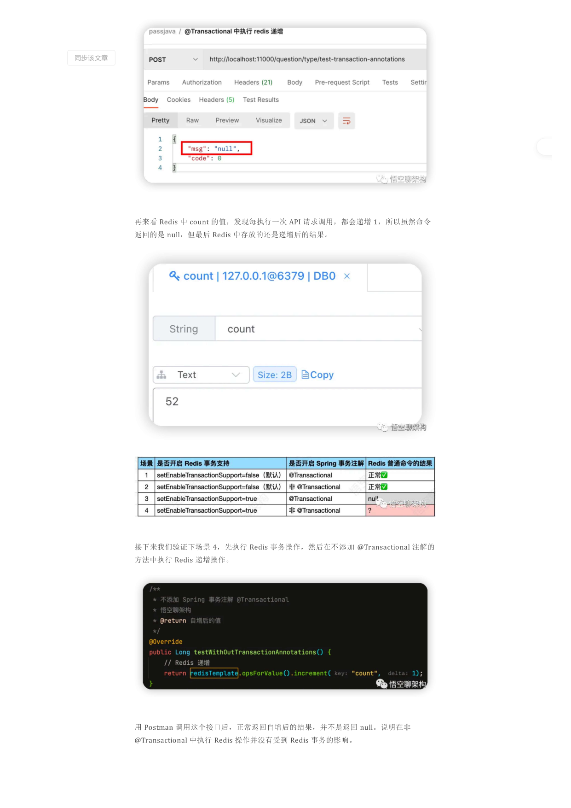

### 第 7 页 — p07.png

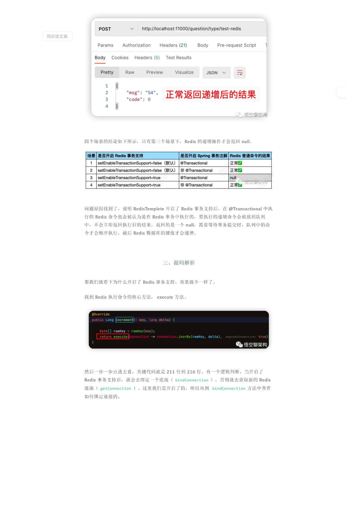

### 第 8 页 — p08.png

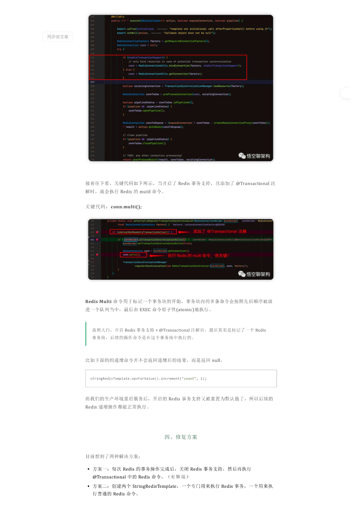

### 第 9 页 — p09.png

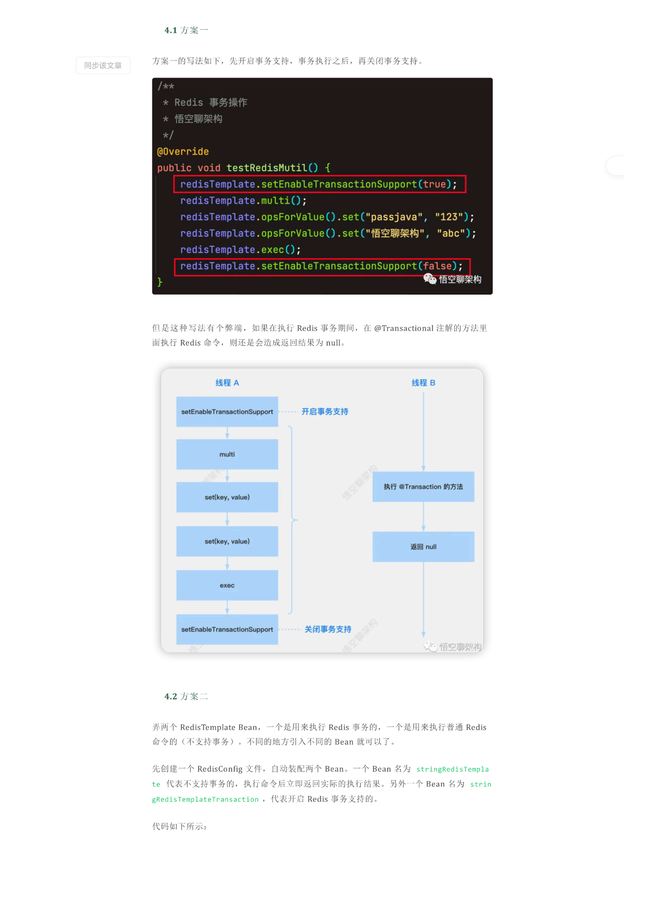

### 第 10 页 — p10.png

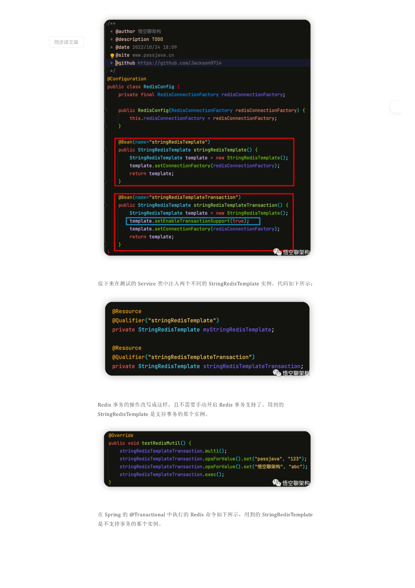

### 第 11 页 — p11.png

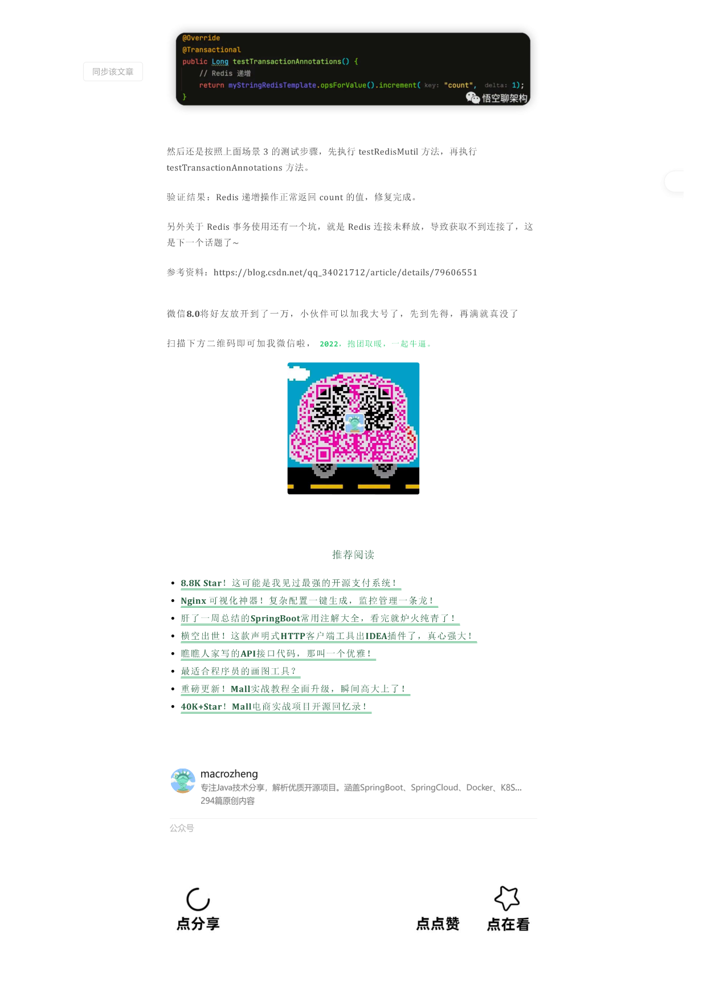

### 第 12 页 — p12.png

