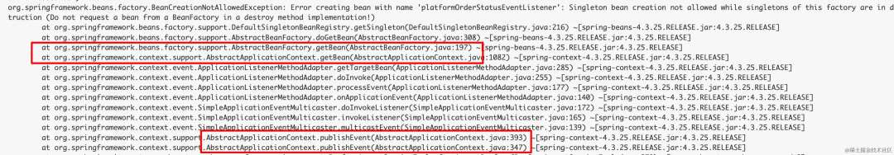
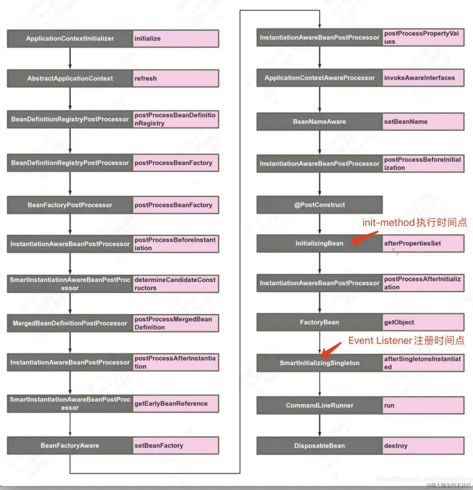
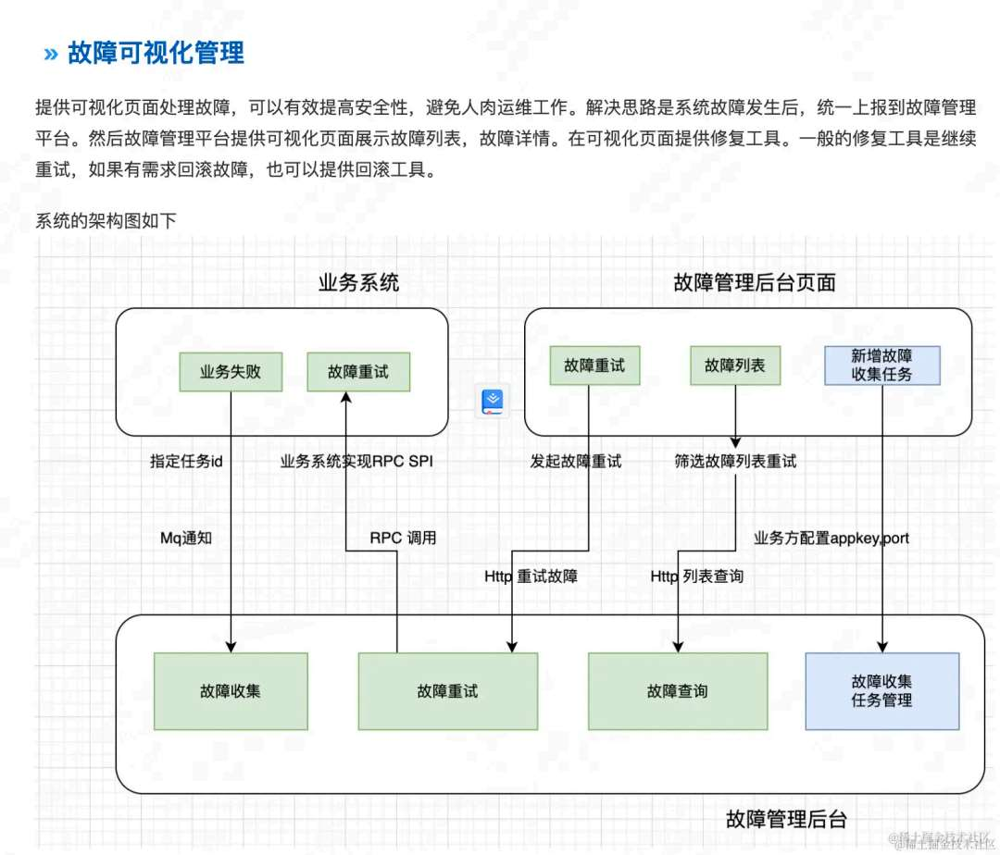

# 业务系统要优雅关闭才使用 Spring Event

> 原文 PDF：`faultcase/【故障现场】业务系统要优雅关闭才使用Spring Event.pdf`（已转文字 + 提取配图）

## 正文

```

```

## 配图

### 第 1 页 — 001-p01.jpeg


### 第 1 页 — 002-p01.jpeg



### 第 2 页 — 003-p02.jpeg



### 第 5 页 — 004-p05.jpeg



