# 事务里发普通消息的线上问题排查过程

> 原文 PDF：`faultcase/【故障现场】事务里发普通消息的线上问题排查过程.pdf`（已转文字 + 提取配图）

## 正文

```

```

## 配图

### 第 1 页 — 001-p01.jpeg

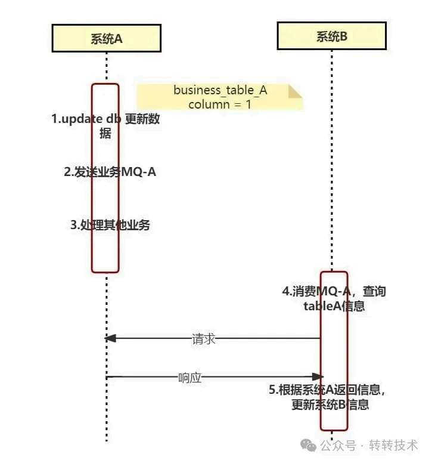

### 第 2 页 — 002-p02.jpeg

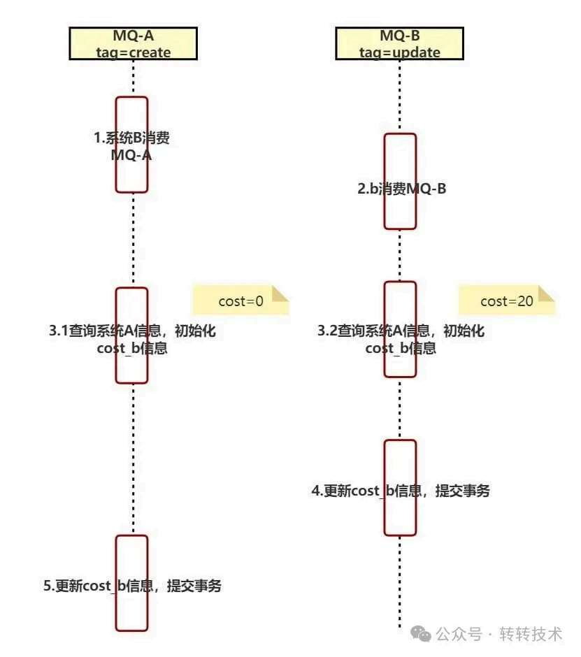

### 第 2 页 — 003-p02.jpeg

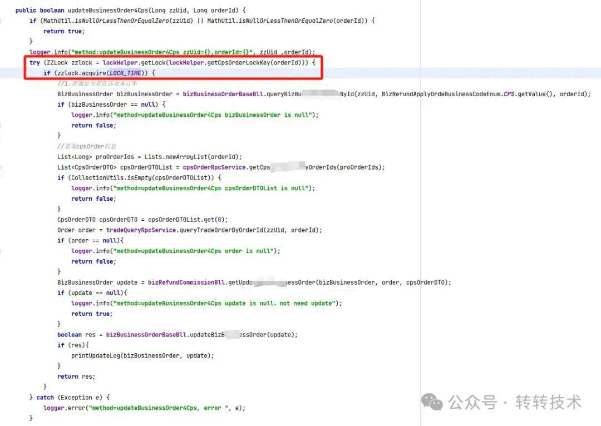

### 第 3 页 — 004-p03.jpeg

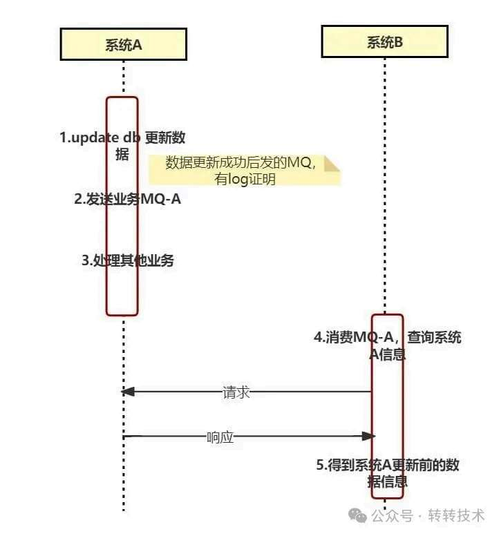

### 第 4 页 — 005-p04.jpeg

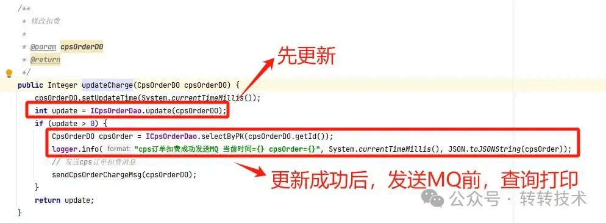

### 第 4 页 — 006-p04.jpeg

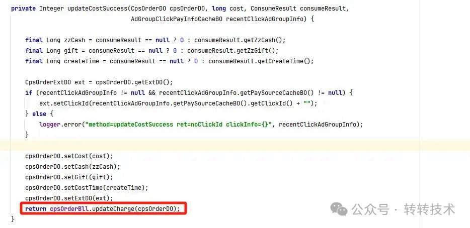

### 第 4 页 — 007-p04.jpeg

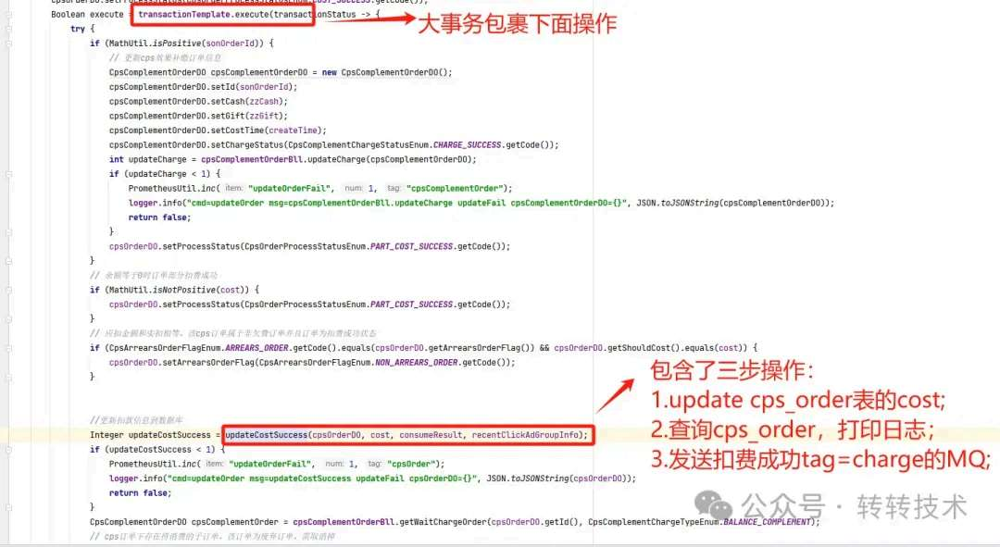

### 第 5 页 — 008-p05.jpeg

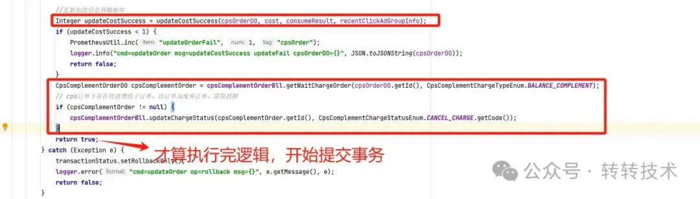

### 第 5 页 — 009-p05.jpeg

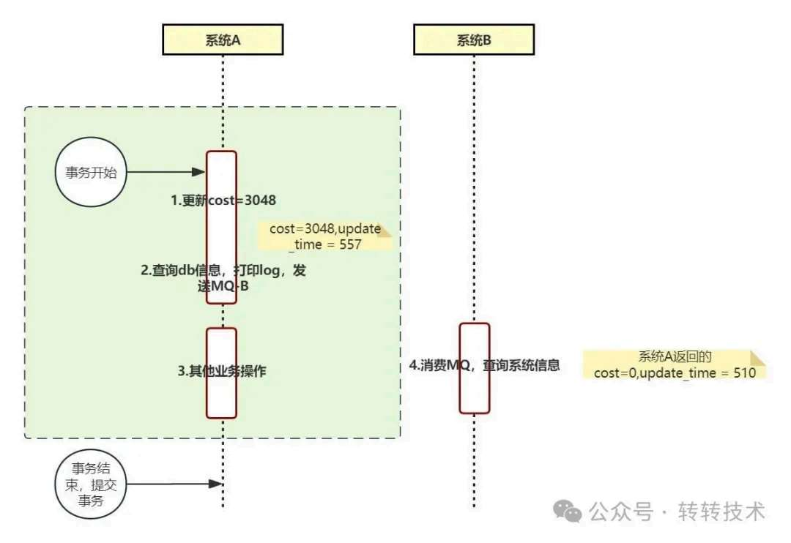

### 第 5 页 — 010-p05.jpeg

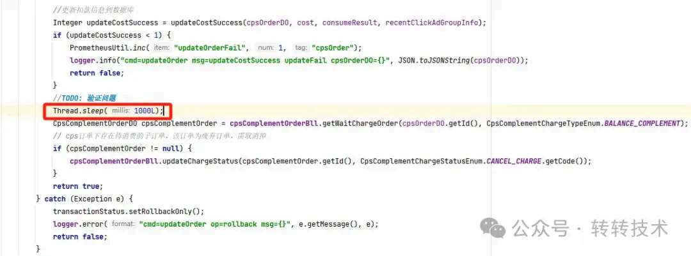

### 第 5 页 — 011-p05.jpeg

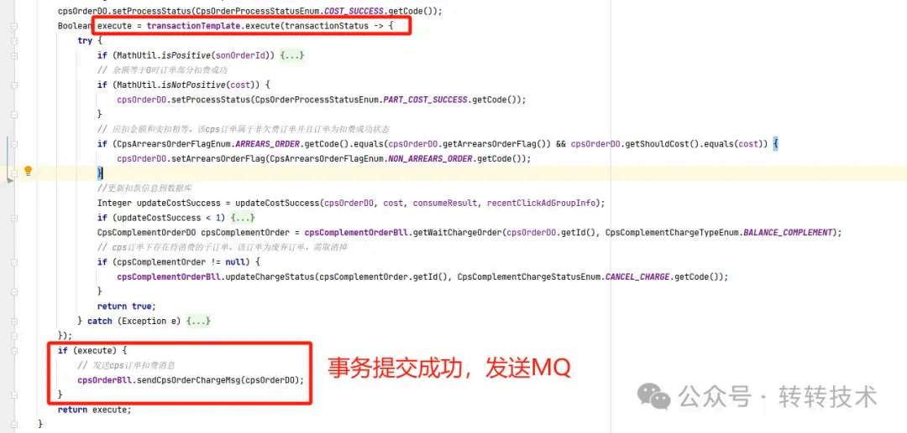

### 第 6 页 — 012-p06.jpeg

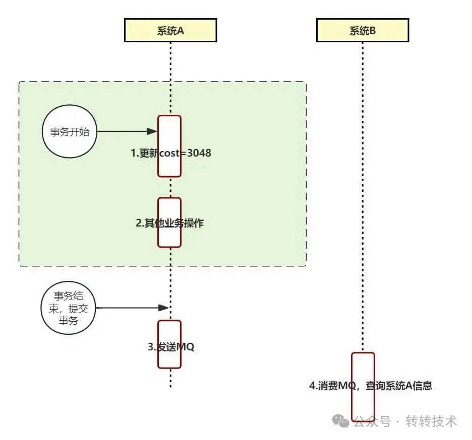

