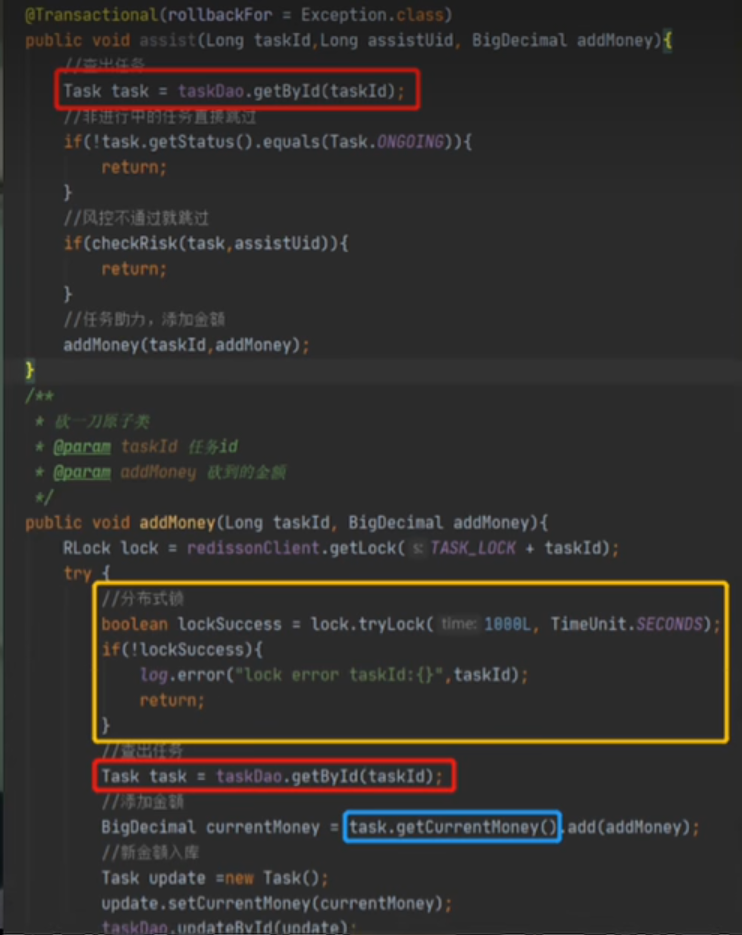
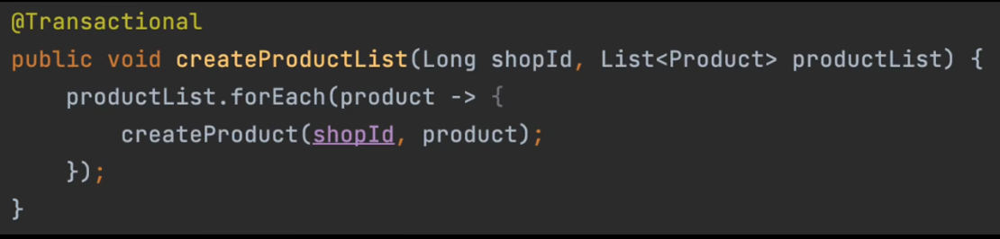
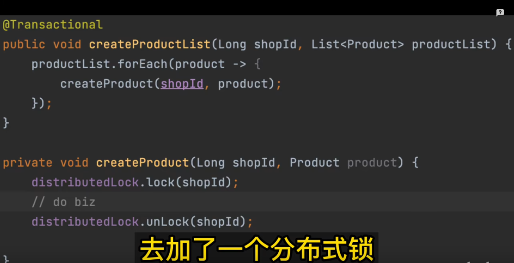
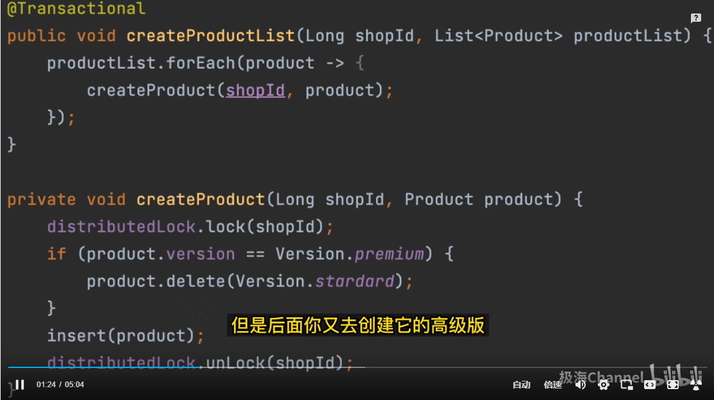
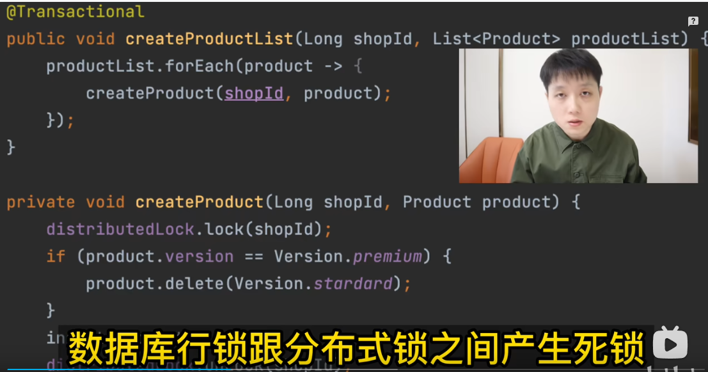
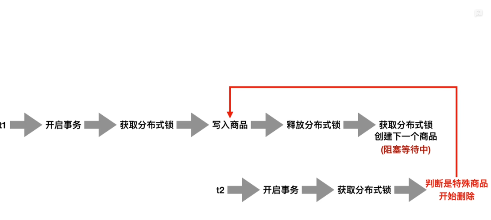

### 错误案例1



潜在问题:

`原因就是事务里套了锁，问题在于整个方法执行完了，锁解了，事务还没提交，此时下个任务却可以拿到锁`

1. 事务内开分布式锁, 可能会造成长事务.

   @Transaction是基于AOP实现的，那么也就是这个方法执行完毕后会提交事务，那如果在事务方法内使用分布式锁，就会变成先释放锁后提交事务，当此时并发上来就会出现问题。

2. 如果是读已提交，使用先读，进行金额判断， 如果金额还没有到目标那么加锁 在读取最新的，
   
    在次进行金额判断是否可以助力， 确实可以提升效率，这样做的好处，后面如果已经助力金额到达了，
    
    第一次读之后进行判断阻断方法执行，避免加锁， 缺点就是：默认隔离级别是可重复读，所以第二次读 不会读到最新的， 要使用这种方法得保障第二次读一定是最新的。  

   反过来，既然默认读是可以重复的，所以我们必须保障在事务开启之前就加锁，进行串行，这样A线程事务执行完提价事务之后释放锁， B线程再去获取锁，然后开始事务，这样B就可以感知到A事务执行结果。

3. 在同时使用声明式事务@Transaction时，分布式锁释放的时候无法保证事务一定提交，那当分布式锁释放的时候，事务还没有提交，

   那么另外一个线程就可以拿到分布式锁，拿到分布式锁就可以读取数据库的数据，但是此时事务还没有提交，那么在可重复读隔离级别下，

   读取的数据还是之前的数据，因此就导致出现这个问题。

其他方案:

**1、 数据库行锁**

1.1 update 语句的原子操作

```
update xxx set money=money+num where id = 1111
```
使用数据库行锁代替分布式锁。

`缺点`:  
    这种的缺点就是无法记录前后的变化。

1.2 select from update

可以使用select for update行级锁，这样锁的颗粒度比使用分布式锁小，支持更高的并发能力。另外不要随便使用分布式锁，很容易影响业务接口并发能力，尽可能把锁粒度控制在数据库行级锁。

**2、使用编程式事务**

2.1 可以使使用串行化，但是效率会变慢，不建议。
2.2 可以不使用声明式事务，可以使用编程式事务，那么这样就可以保证在分布式锁释放之前一定保证了事务去提交。


### 错误案例2











线程1还没释放行锁,发现是创建的是一个特殊商品, 就要去删除线程1创建的这个商品. (当然还得看数据库隔离级别)

线程2在等待线程1释放行锁，但是线程1没有释放行锁，线程1尝试获取分布式锁, 获取不到等待线程2释放分布式锁。

死锁:  t1 等待 t2的分布式锁, t2 等待t1的数据库行锁.


### 死锁通用解决方案

业务并发导致死锁是一个常见的问题，特别是在高并发的情况下。以下是一些通用的解决方案：

**1. 优化数据库设计：** 通过合理的数据库设计，可以减少死锁的发生。例如，使用合适的索引、避免长事务等。

**2. 减少锁的范围：** 在代码中，尽量减少锁的范围，只在必要的时候加锁。例如，只在修改数据时加锁，而不是在查询数据时也加锁。

**3. 使用乐观锁：** 乐观锁是一种不加锁的并发控制方法，通过版本号或时间戳等机制来保证数据的一致性。在高并发的情况下，乐观锁可以减少锁的竞争，提高系统的并发性能。

**4. 使用分布式锁：** 分布式锁是一种在分布式系统中实现锁的机制，可以避免单点故障和锁的竞争。例如，使用Redis等分布式缓存来实现分布式锁。

**5. 使用异步处理：** 在特殊业务逻辑处理时，可以考虑使用异步处理的方式，将业务逻辑放到消息队列中，异步处理后再返回结果。这样可以避免长时间的锁竞争，提高系统的并发性能。
   总之，针对不同的业务场景，可以采用不同的解决方案来避免死锁的发生。


