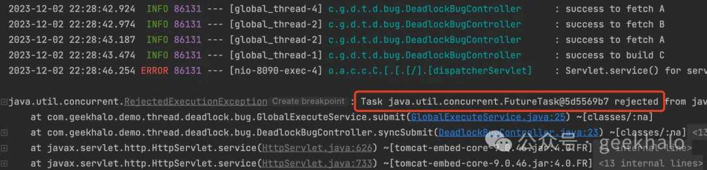
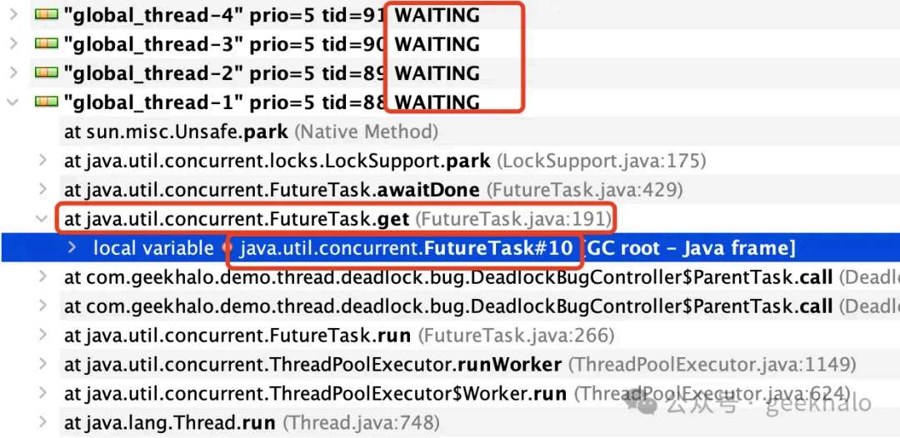
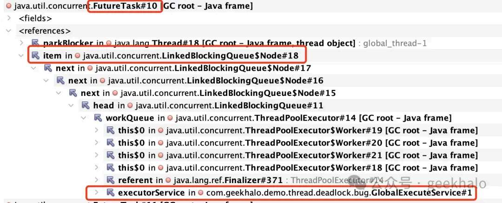
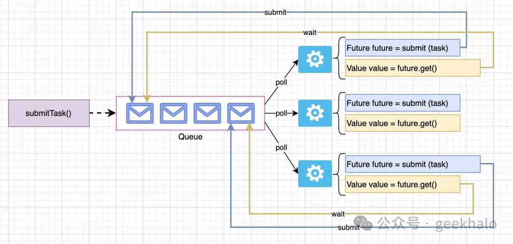
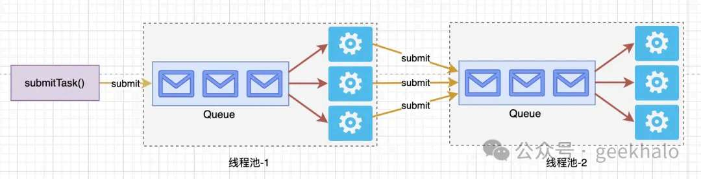

# 死锁：不要向自己运行的线程池提交任务

> 原文 PDF：`faultcase/【故障现场】死锁_不要向自己运行的线程池提交任务.pdf`（已转文字 + 提取配图）

## 正文

```

```

## 配图

### 第 1 页 — 001-p01.jpeg



### 第 3 页 — 002-p03.jpeg



### 第 3 页 — 003-p03.jpeg



### 第 3 页 — 004-p03.jpeg



### 第 4 页 — 005-p04.jpeg



