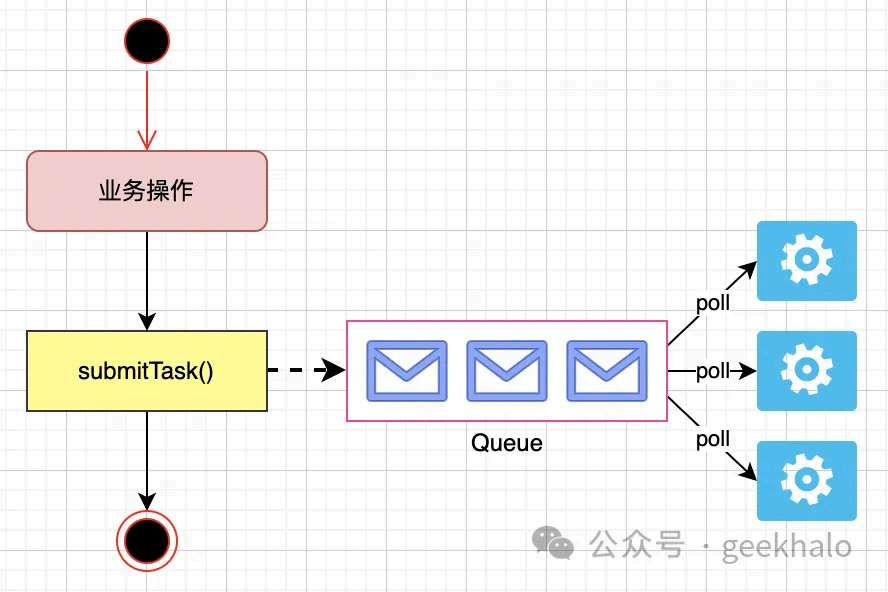
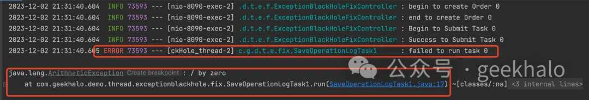
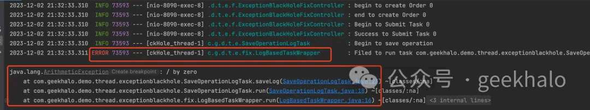
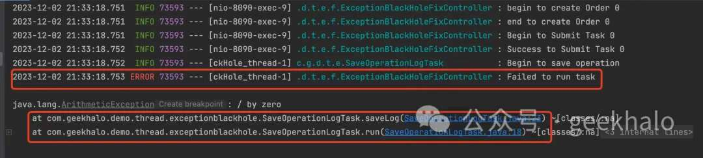
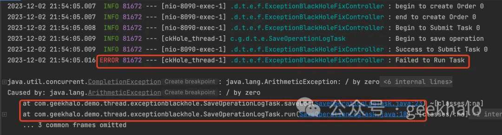

# 线程池异常黑洞及其防范策略

> 原文 PDF：`faultcase/【故障现场】线程池异常黑洞及其防范策略.pdf`（已转文字 + 提取配图）

## 正文

```

```

## 配图

### 第 2 页 — 001-p02.jpeg



### 第 3 页 — 002-p03.jpeg



### 第 4 页 — 003-p04.jpeg



### 第 5 页 — 004-p05.jpeg



### 第 5 页 — 005-p05.jpeg



### 第 6 页 — 006-p06.jpeg


### 第 6 页 — 007-p06.jpeg


