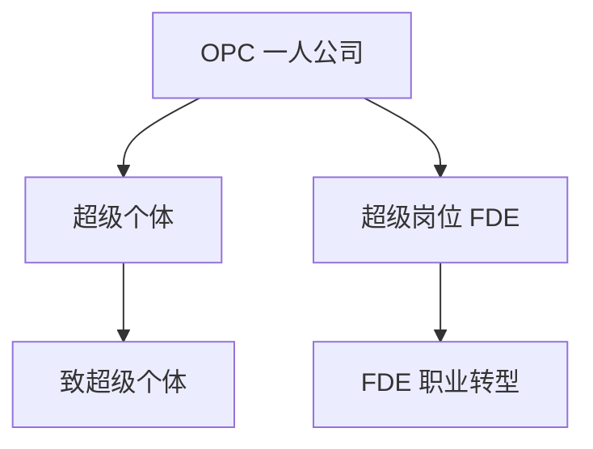

> **摘要** — 聚焦一人公司（One Person Company）、超级个体、超级岗位、FDE 等 AI 时代的个体崛起与职业转型探讨。



```markmap height=300
# OPC 一人公司
## 超级个体
- 00-01-致超级个体：Steve Jobs 的 Crazy Ones
## 超级岗位
- 01-01-FDE：Forward Deployed Engineer
```

---

# OPC 一人公司

> 聚焦一人公司（One Person Company）、超级个体、超级岗位、FDE 等 AI 时代的个体崛起与职业转型探讨。

---

## 超级个体

| 章节 | 内容 |
|------|------|
| [00-01-致超级个体](./00-01-zhi-chao-ji-ge-ti.md) | Steve Jobs 的 Crazy Ones 定义，AI Builder 特质 |

## 超级岗位

| 章节 | 内容 |
|------|------|
| [01-01-FDE——AI 时代的职业转型已经打响？](./01-01-fde-forward-deployed-engineer.md) | Forward Deployed Engineer 解析 |