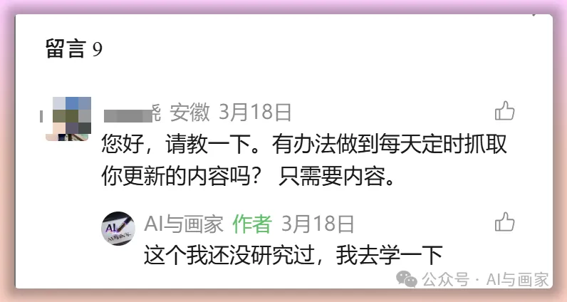
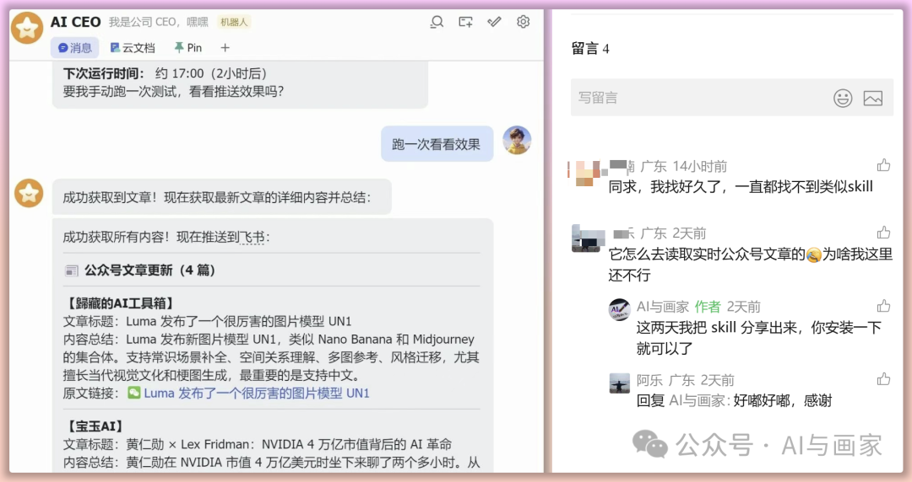
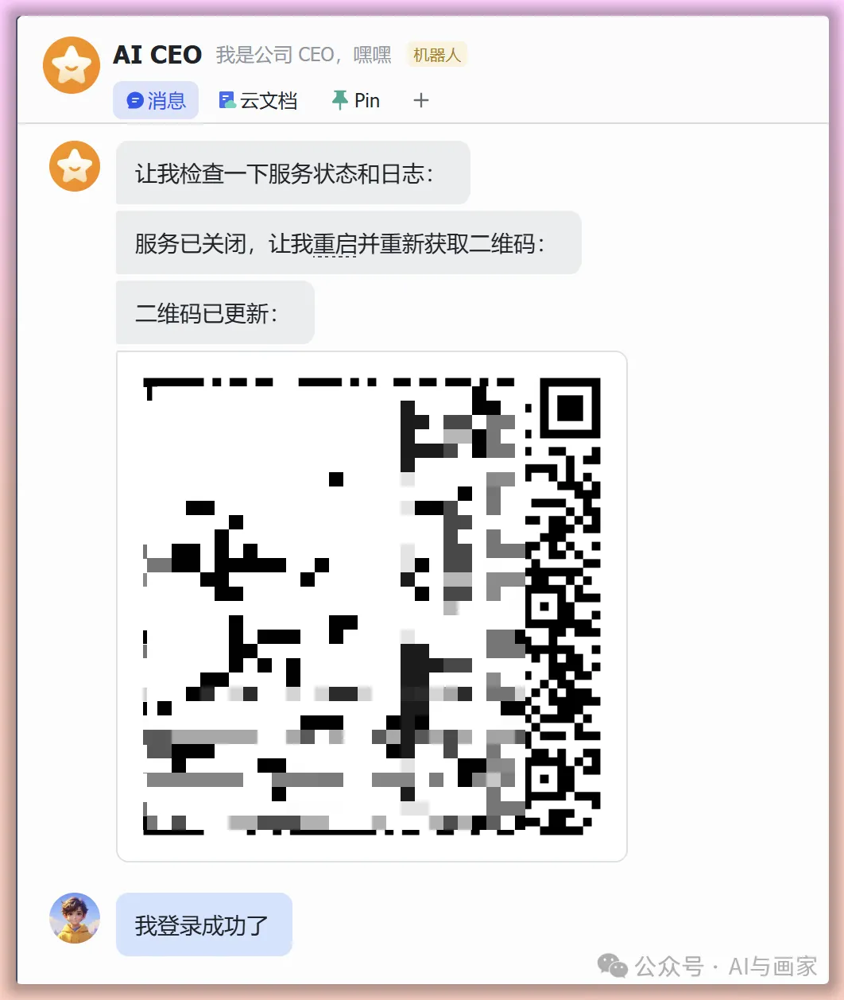
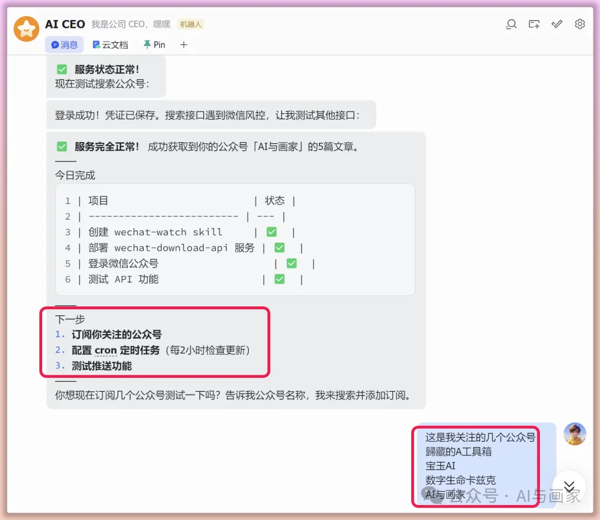
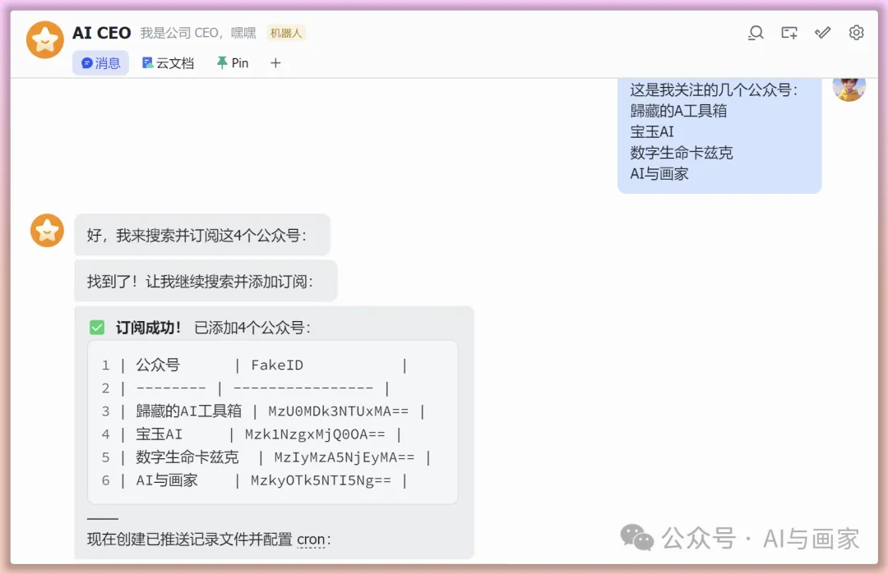
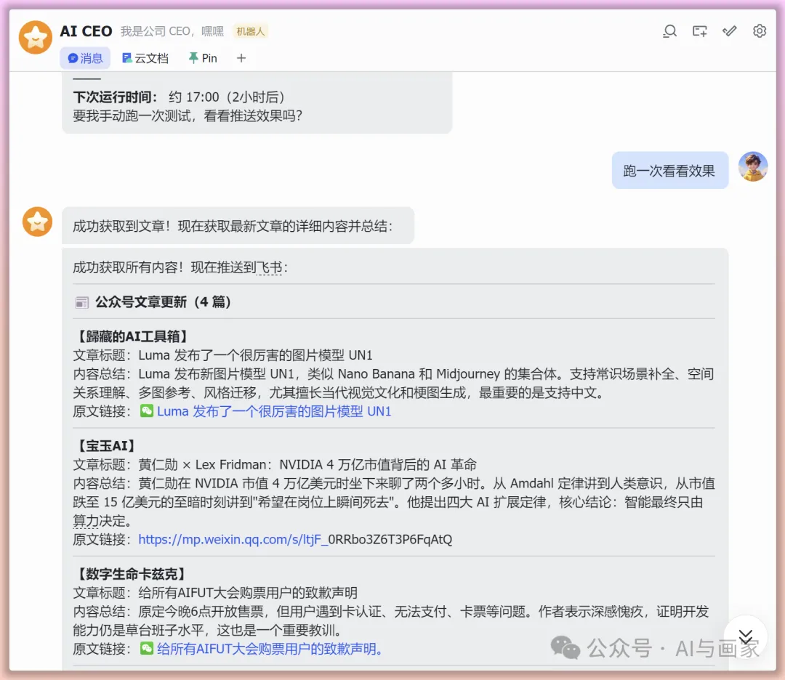

---
title: "《openclaw：让小龙虾🦞帮我订阅公众号》"
url: "https://mp.weixin.qq.com/s/04vWKtCOyRCKS4A4EbD3fg"
requestedUrl: "https://mp.weixin.qq.com/s/04vWKtCOyRCKS4A4EbD3fg"
author: "猫来gogogo"
coverImage: "https://mmbiz.qpic.cn/sz_mmbiz_jpg/duHjWexEwEqueibFQWLnUeD1m7lTYN3iaVEYBzADfa2MgY09rtdz9QKIibgqBPiat9hD5cey19jPlv3XQPm4oLw3n9fCJOmQQibuWibGBRpxy4iamU/0?wx_fmt=jpeg"
siteName: "微信公众平台"
summary: "上周我开源了一个【抓取公众号的 skill】：https://mp.weixin.qq.com/s/c"
adapter: "generic"
capturedAt: "2026-06-01T03:01:15.037Z"
conversionMethod: "defuddle"
kind: "generic/article"
---

# 《openclaw：让小龙虾🦞帮我订阅公众号》

原创 猫来gogogo *2026年3月30日 09:42*

## 1、背景

上周我开源了一个【抓取公众号的 skill】：

就是你发公众号链接，小龙虾会自动抓取，并写到飞书文档，或者本地 markdown 文档。

然后就有道友说，

能不能让 AI 自己检查更新，

然后总结推给我呢？

这……



然后我就跟 AI 研究了一下，

还真被我找到办法了。

我在小龙虾上跑了一下，真的可以：



果然，懒才是第一生产力啊！

既然是各位道友需要的，那我也不藏着掖着了，直接把这个 skill 开源，这个 skill 可以：

- ★
	定时轮询检测新文章
- ★
	获取文章内容、总结、推送飞书

## 2、如何使用？

### 2.1 前提条件

- ★
	电脑有 Docker 或者 Python 环境
- ★
	你有一个公众号，后面要扫码获取凭证

### 2.2 先放GitHub地址：

```
https://github.com/maolai7/agent-skills/tree/develop/wechat-watch
```

如果能打开GitHub，直接复制 GitHub 链接给你的小龙虾，或者其他AI，让它自己安装就行。

如果不能打开GitHub， **后台私信【公众号推送skill】，**

我会自动回复你这个skill文件。

你把文件下载下来以后，手动复制到你本地的 skill 文件夹目录下，就可以使用了。

如果有问题可以评论区留言，我再迭代优化。

### 2.3 如何使用这个 skill 呢？

让小龙虾安装好 skill 以后，直接跟 AI 说使用这个skill，

这时 AI 会启动一个服务，然后弹出一个二维码，

要用绑定公众号的微信，扫码登录一下。



登录成功后，AI会检测服务是否正常。

然后，就可以把你关注的公众号发给小龙虾了。

 

我让它试一下推送，然后就可以了。



你再让小龙虾设置一个定时任务，就可以自动定时给你推公众号了。

这个 skill 我目前设的是，早上10点和下午18点，你如果想要修改，直接跟小龙虾说就行。

使用起来也很简单，反正能让 AI 干的绝不自己干。

现在，就把这个技能带回家吧。

---

**往期精彩推荐：**

**[《如何在Windows系统养一个龙虾🦞 —— openclaw》](https://mp.weixin.qq.com/s?__biz=MzkyOTk5NTI5Ng==&mid=2247484820&idx=1&sn=d48353643601d50c3879c884ed3f72a0&scene=21#wechat_redirect)**

**[《openclaw：如何搭建一个AI团队？还能互相派活？》](https://mp.weixin.qq.com/s?__biz=MzkyOTk5NTI5Ng==&mid=2247484869&idx=1&sn=ba00982e091f891c5ac7e5e77dc936d4&scene=21#wechat_redirect)**

**[《openclaw：赋予每个 agent 独立的人格和做事准则》](https://mp.weixin.qq.com/s?__biz=MzkyOTk5NTI5Ng==&mid=2247484899&idx=1&sn=c43843a9a75db0abda8532cb910a5c32&scene=21#wechat_redirect)**

**[《openclaw：一键抓取公众号的 skill 来了》](https://mp.weixin.qq.com/s?__biz=MzkyOTk5NTI5Ng==&mid=2247484909&idx=1&sn=6cef3fce06ad1bb62c8681747495b26c&scene=21#wechat_redirect)**

**[养龙虾用哪个 AI 好？ 这个网站告诉你！](https://mp.weixin.qq.com/s?__biz=MzkyOTk5NTI5Ng==&mid=2247484947&idx=1&sn=ad6af80e3012bd2fdd204f3802804f4f&scene=21#wechat_redirect)**

---

感谢阅读~

希望其中内容， **能给你带来一点点启发。**

如果你觉得有收获，欢迎点个「在看」和「转发」，也欢迎关注。

我会持续 **分享更多 AI 学习和实践笔记。**

让我们一边学习，一边走进 AI 时代。

下次再见~

一起养龙虾🦞 · 目录

作者提示: 个人观点，仅供参考
