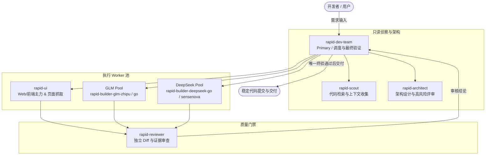
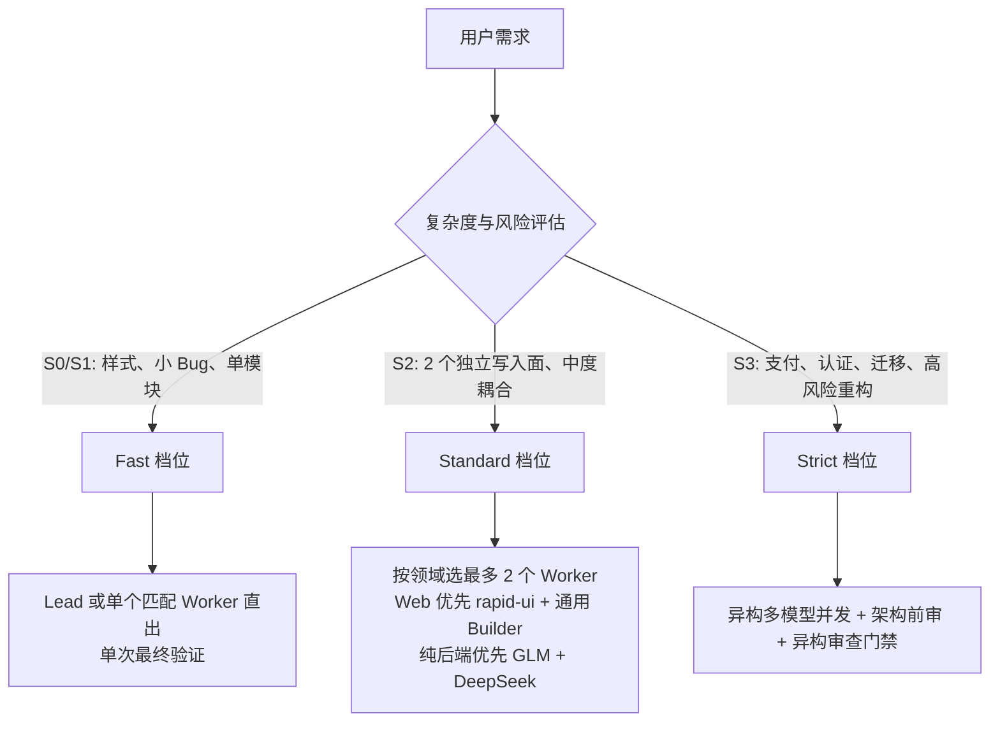

# OpenCode Rapid Agent Team 安装与架构实战指南

**项目来源：** [https://github.com/VastNext/opencode-rapid-agent-team](https://github.com/VastNext/opencode-rapid-agent-team)  
**文档归属：** OpenCode 专栏  
**安装范围：** 全局配置（`~/.config/opencode`）  
**验证状态：** 已完成全局安装并通过官方验证测试套件

---

## 1. 它是什么？

`VastNext/opencode-rapid-agent-team` 是一套为 OpenCode 量身定制的**异构并发开发团队配置**。它不是一个单纯修改 `opencode.json` 的配置片段，而是一整套带有自适应调度协议、多模型分工、安全边界与自验证机制的 Agent 团队体系。

核心入口是一个专用的 Primary Agent：

```text
rapid-dev-team
```

其核心理念是**根据需求复杂度自适应分级**，在小改动时保持单 Agent 直出，在大型改动时激活异构团队，杜绝“小需求过度组队、大需求缺乏复核”的工程通病。

---

## 2. 核心架构与角色分工

团队采用“单一入口 + 专职 Worker + 异构复核”的层次架构：



### 角色矩阵

| Agent 标识 | 角色定位 | 默认模型能力 | 权限约束 |
|---|---|---|---|
| `rapid-dev-team` | 主导调度者（Lead） | GPT-6 Astra（支持 Sol 回退） | 负责整体调度、唯一终验与交付 |
| `rapid-scout` | 侦察专家 | Gemini 3.7 Flash High | 默认只读，快速扫描与信息收敛 |
| `rapid-ui` | Web 开发主力 | Gemini 3.7 Flash High | 浏览器端 HTML/CSS/TS、DOM、前端框架、页面解析 |
| `rapid-builder-glm-zhipu` | 核心后端/逻辑 Worker | GLM-5.3-Flash（智谱通道） | 编码实现，禁止创建子 Agent 与危险 Git 指令 |
| `rapid-builder-glm-go` | 核心后端备选 Worker | GLM-5.3-Flash（OpenCode Go） | 扩充 GLM 吞吐并发 |
| `rapid-builder-deepseek-go` | 算法与逻辑 Worker | DeepSeek V4 Flash（Go 通道） | 算法实现与复杂业务切片 |
| `rapid-builder-deepseek-sensenova` | 算法与逻辑备选 Worker | DeepSeek V4 Flash（商汤通道） | 限制最大并发 1，带 RPM 退避 |
| `rapid-reviewer` | 独立审查员 | GPT-5.6 Luna | 必须不同于 Worker 的模型家族，独立复核证据 |
| `rapid-architect` | 架构与技术风险评估 | Claude Opus 4.6 Thinking | 默认只读，高风险架构分析与设计 |

---

## 3. 三档自适应执行机制

团队定义了清晰的复杂度路由，避免不必要的并发通信开销：



- **Fast（S0/S1）**：低风险单点改动，直接由 Lead 或最匹配的单个 Worker 交付，主线程只做一次最终验证，杜绝小题大做。
- **Standard（S2）**：中度功能改动，只有在存在明确不重叠的独立写入面时才并发，最多选派两个 Worker。
- **Strict（S3）**：高风险核心业务（认证、支付、数据迁移、大型重构），强制启用异构复核，以自动化测试结果为唯一准绳。

---

## 4. 安装流程

该仓库内置了遵循 OpenCode 标准配置规范的跨平台安装器，支持全局模式与项目级模式。

### 4.1 全局安装

```bash
# 1. 临时克隆仓库
git clone --depth 1 https://github.com/VastNext/opencode-rapid-agent-team.git /tmp/opencode-rapid-agent-team
cd /tmp/opencode-rapid-agent-team

# 2. 执行安装器（全局作用域）
python3 scripts/install.py --scope global

# 3. 运行完整性验证
python3 scripts/verify.py --scope global

# 4. 清理临时克隆目录
cd ~ && rm -rf /tmp/opencode-rapid-agent-team
```

### 4.2 安装产物映射

安装器会自动处理文件安置、冲突备份与环境变量注册：

```text
~/.config/opencode/
├── agents/
│   ├── rapid-dev-team.md                    # Primary 入口
│   ├── rapid-scout.md                       # Scout 子 Agent
│   ├── rapid-ui.md                          # Web 主力 Worker
│   ├── rapid-builder-glm-zhipu.md           # GLM 主通道
│   ├── rapid-builder-glm-go.md              # GLM 备用通道
│   ├── rapid-builder-deepseek-go.md         # DeepSeek 主通道
│   ├── rapid-builder-deepseek-sensenova.md  # DeepSeek 备用通道
│   ├── rapid-reviewer.md                    # 审查门禁
│   └── rapid-architect.md                   # 架构门禁
├── skills/
│   └── rapid-dev-team/
│       └── SKILL.md                         # 调度执行契约
├── commands/
│   └── rapid-dev.md                         # /rapid-dev 命令模板
├── commands.json                            # 注册 /rapid-dev 命令元数据
├── rapid-dev-team.env                       # 开启背景子 Agent 实验标记
└── backups/                                 # 自动生成的安装备份
```

---

## 5. 验证与排查

安装完成后，在终端中执行以下命令验证安装有效性：

### 5.1 运行官方验证脚本

```bash
python3 scripts/verify.py --scope global
```

预期输出应包含所有 Agent、Skill 以及 Primary 角色解析成功的绿标提示：

```text
✅ Agent: rapid-dev-team
✅ Agent: rapid-scout
...
✅ OpenCode resolves rapid-dev-team as primary
🎉 Rapid Dev Team 验证通过
```

### 5.2 验证 OpenCode 运行时解析

```bash
opencode debug agent rapid-dev-team
```

检查 JSON 输出中是否正确包含：

```json
{
  "name": "rapid-dev-team",
  "mode": "primary"
}
```

---

## 6. 使用方式

### 方式一：切换专用 Primary Agent

在 OpenCode 的 Agent 切换菜单中直接选择：

```text
rapid-dev-team
```

随后直接输入任务诉求，例如：

> 实现一个带 JWT 认证与分页查询的用户管理接口，并补充自动化集成测试。

### 方式二：快捷命令调用

在现有会话中通过命令调用：

```text
/rapid-dev 重构视频上传处理链路，提取两步上传抽象，并确保老接口兼容
```

---

## 7. 工程师避坑指南

1. **配置生效时机**：OpenCode 仅在启动阶段读取 `opencode.json` 及 `~/.config/opencode/` 下的配置，安装完成后**必须彻底重启 OpenCode 进程**。
2. **异构审查的本质**：不同 Provider 调用同一模型（例如通过不同代理调用同一版本的模型）仅能增加请求吞吐，**不构成**独立的架构审查；审查角色（Reviewer）必须采用不同的模型家族。
3. **安全拦截机制**：Worker 角色已被收紧权限，默认禁止执行 `git push`、`git reset` 与 `rm` 操作，代码合入与暂存由 Lead 在审查通过后统一接管。
