# 百万海外博主投放实战复盘：从找人、筛选到避坑，100 刀小博主意外带来 3000+ 深度用户拆解

做海外博主合作这么久，做过两个数据特别极端的案例。

一个是只有 1 万左右粉丝的小博主，当时长视频合作只花了 **$100**。视频上线后，从 GA 看，他带来了 **2,937 个用户，平均互动时长 9 分 01 秒，每位活跃用户的互动会话数 2.71。** 这是性价比非常高的一次合作。

但另一边，也花过 **$1,200** 找过看起来数据漂亮得多的大博主。上线后同样带来了 3552 用户。如果只统计“带来多少用户”，两次投放似乎差不多。但往后看，第二批用户的平均互动时长只有 **10 秒，回访用户是 0，每位活跃用户的互动会话数只有 0.29。**

一个 $100，一个 $1,200；带来的用户数量几乎一样，用户质量却完全是两回事。

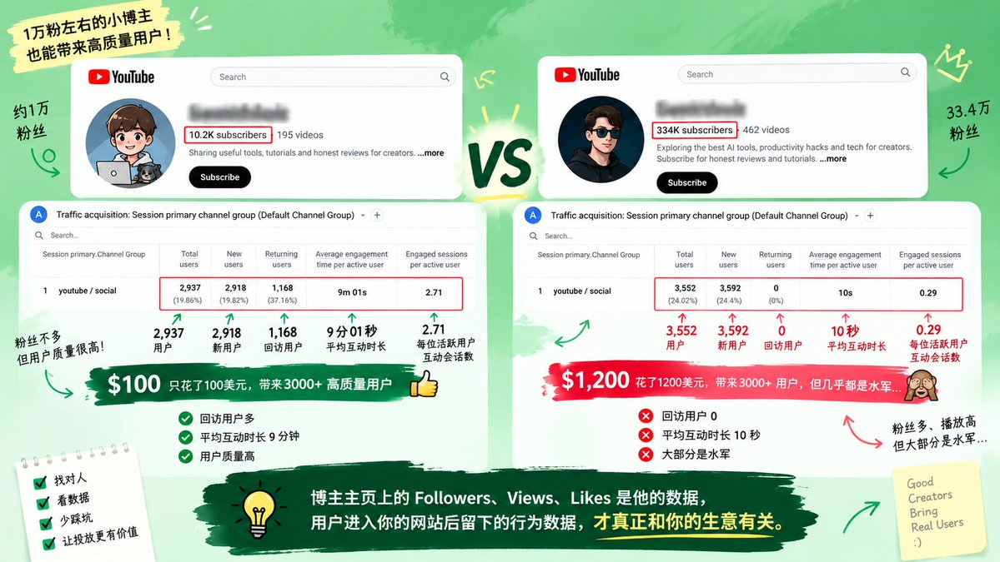

**博主主页上的 Followers、Views、Likes 是他的数据，用户进入网站以后留下的行为数据，才真正和业务增长有关。**

做海外博主合作，平台很多，**最推荐的还是 YouTube 的博主长视频合作**。

从最开始自己找博主、发邮件，到后面做筛选体系、Brief、排期、付款和数据复盘，前后投入不少，也踩过不少坑。本篇直接把实际在用的一套流程拆出来：**怎么找人、怎么看账号、怎么判断数据有没有问题、用什么工具、怎么联系和砍价、Brief 写什么、怎么排期，以及视频发出去以后到底看哪些数据。**

## 一、别着急花钱，先确定这次投放要解决什么

拿到一个新的博主推广需求，第一件事通常不是找达人，也不是先定粉丝体量。

先看一件事：**这个产品现在处于什么阶段？**

因为一个刚上线、连第一批真实用户都没有的产品，和一个已经验证过需求、准备放大增长的产品，找博主的逻辑完全不一样。

### 第一阶段：产品刚启动，先找“小而准”的博主积累种子用户

这是最容易花冤枉钱的阶段。新产品刚上线时，最缺的通常不是几十万曝光，而是**第一批愿意真正把产品用起来的人**。

这个阶段不优先找大博主，而是储备一批受众非常垂直、用户黏性强的小博主。粉丝可能只有 1～10 万，但观众是真的会听他讲完一款产品、愿意跟着尝试，博主本人配合度通常也更高。

内容上，更倾向于合作 **YouTube 长视频、完整 Tutorial 或深度测评**，而不是几十秒的口播。因为这时候博主的作用不只是“打广告”。他需要真的去注册、使用产品，把核心功能跑一遍，再把自己的体验讲给用户。这个过程本身其实也是一次产品测试：**哪些功能一看就懂？哪些地方需要解释半天？用户在评论区会问什么？真正使用之后会不会留下来？**

更重要的是，这批博主带来的第一批用户，也更有机会成为种子用户。他们不只是贡献一个注册数字，还可能深度体验产品、反复使用，甚至主动反馈问题与需求。

前面提到的那个 **$100、1 万粉左右的小博主**就是典型例子。单看粉丝量容易被过滤掉，但最后带来了接近 3000 个用户，平均互动 9 分钟，还有 1168 个回访用户。产品启动阶段，核心关注点是：**“他能不能帮我找到第一批真正愿意用产品的人？”** 关键词是：**精准、深度体验、种子用户。**

### 第二阶段：产品进入增长期，再开始放大 Reach

等第一批用户已经跑起来，产品体验也经过了一轮验证，目标发生变化：**已经知道谁会用、为什么用，下一步就是让更多同类用户看到。**

到了这个阶段，才明显提高博主的粉丝量级，比如开始重点测试 **50 万粉左右甚至更大的账号**。

因为前一个阶段已经解决了产品该怎么讲的问题：知道用户最关心哪个功能，什么场景最容易让人理解，哪种内容带来的用户质量更好。这个时候再把经过验证的卖点交给更大的博主，曝光才更有意义。

内容可以从一开始深度的 Tutorial，逐渐扩展到专题推荐、工具合集、场景演示，以及 Shorts、TikTok、Instagram 等更适合扩大覆盖的平台。

大博主最大的价值不一定是每一个用户都立即付费，而是帮助产品快速进入更多目标用户的视野。增长期关注指标变化为：**播放量、覆盖量、品牌搜索、Direct Traffic，以及不同博主带来的获客规模。** 关键词是：**放大、曝光、规模化获客。**

### 第三阶段：进入品牌期，用头部博主给品牌“加码”

当产品已经有了一定用户规模和行业认知，达人合作的任务再次转变：**怎么让更多人觉得，这是这个领域里一个值得信任、值得关注的品牌？**

这个阶段才适合去谈百万粉级别甚至行业头部的博主。这种合作单次成本可能非常高，单看注册成本未必最划算，但承担的任务不同：头部博主公开使用、测评或推荐产品，本身就在帮助品牌建立第三方背书。用户后续搜索品牌时持续看到不同量级创作者的内容，前期积累的内容逐渐形成品牌资产。

核心关注点是：进入更大的受众圈层、形成更强的行业背书、合作内容是否能被 PR 与官网案例等渠道二次复用。关键词是：**品牌、背书、行业影响力。**

**产品启动期，小博主可能比大博主更有价值；进入增长期，需要更大的博主帮你放大已经验证过的东西；真正到了品牌期，头部博主的价值才开始从单纯的流量，变成品牌背书。**

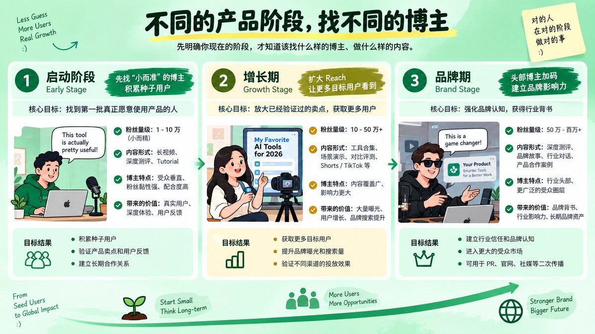

## 二、博主去哪找？常用方法

### 1. 直接搜竞品

看看哪些博主已经做过竞品 Review、Tutorial、Sponsored Content，再去看这些合作视频的数据。

这相当于竞品提前完成了一轮筛选：博主愿意接商单、内容方向与赛道相关、受众大概率有交集。

找到合适博主后，还可以用相关工具（如浏览器扩展中的类似频道推荐）顺藤摸瓜继续扩充候选池。

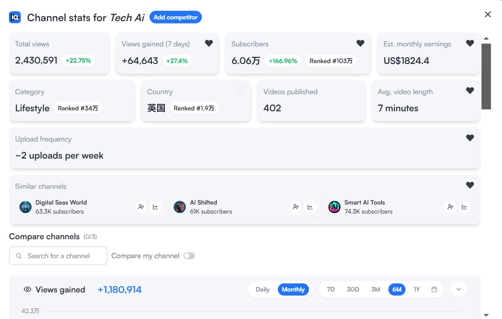

### 2. 场景化关键词拆解搜索

不要直接搜宽泛大词，而是把产品拆成用户真正会搜的场景词。例如推广 SEO 工具时：

`AI SEO tools`、`SEO tools for small business`、`AI keyword research`、`how to rank on Google`、`best SEO tools`

顺着搜索结果浏览时，重点关注：**哪些频道反复覆盖这个话题、最近视频播放是否稳定、评论区是否有真实用户讨论、以前是否推荐过同类工具。**

如果一个 3 万粉频道连续做过同类产品内容，视频播放稳定且评论区在主动讨论购买、替代方案与适配问题，即使粉丝量不大也应放进候选池，因为受众正在消费这类工具内容。

关键词挖掘路径建议：**大词 → 场景词 → 问题词 → 对比词**。越往后挖掘，频道可能越小，但受众往往越垂直。

### 3. 获取联系方式

YouTube 大部分商业合作邮箱可以直接在频道简介的 **About / 更多信息**里找到；如果主页挂了 Linktree 等聚合页，也可以顺藤摸瓜。X 上则可以直接私信。

如果一个账号没有 Business Email 且私信关闭，通常降低合作优先级，表明其商业合作意愿较弱。

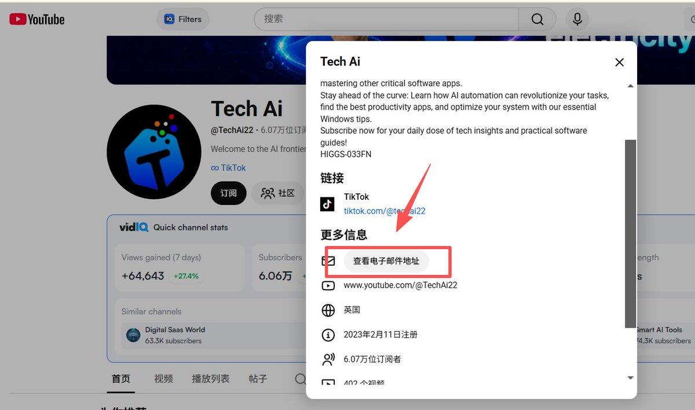

## 三、筛选博主的 5 个核心维度

### 1. Audience Match：粉丝到底是谁

粉丝多不等于有用。需核实受众来源地、年龄、语言、关注内容，以及是否符合产品目标客群。

**不要拿 Creator Location 代替 Audience Location。** 做英语内容的博主哪怕身处非英语本土地区，其实际受众可能遍布全球。必须看受众实际分布，而不是博主个人所在地。

### 2. 不只看日常播放，专门核查历史商单

有些博主日常视频播放量达 10 万+，但商业广告视频只有数千播放，说明受众对商业内容并不买账。

评估时必须对比：**日常内容播放中位数 VS 商业内容播放数据**。购买的本质是他的下一条商业内容，而非主页最火的日常视频。

### 3. Content Fit：产品融入是否顺畅

避免生硬植入。最理想的状态是：博主平时就在分享此类场景，产品只是自然成为解决问题的一种工具。博主讲解更顺畅，视频也不容易变成生硬读稿。

### 4. 竞品合作复盘

直接搜索竞品合作记录：谁合作过、合作过几次、视频表现如何、评论区反馈怎样。竞品连续多次复投的博主，比仅合作一次的更值得深入研究。

### 5. 与当前产品阶段匹配

早期测试期优先选择小中体量达人，测试更多受众画像、内容切角与地区；跑通增长模型后再加入 50 万粉级别达人扩大覆盖；品牌期再考虑百万级头部账号。

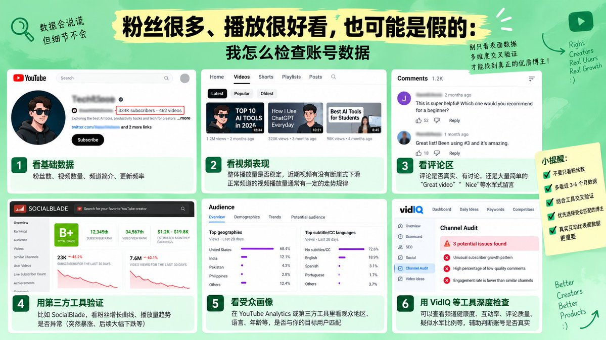

## 四、检查账号真实数据与防坑技巧

将数据拆分为多个层次交叉验证：**Followers → Views → Engagement → Comments → Growth Curve → Cross-platform → 站内转化数据。**

例如高订阅、不错播放量但评论仅几十条，且多为泛泛赞美的账号，需要提高警惕。优质互动更应包含对功能细节、价格、兼容性或与竞品差异的真实讨论。

行业常规参考区间：1～10 万粉博主互动率一般在 **3%～8%**；10 万粉以上通常在 **1%～3%**。明显过低需细查，异常偏高同样需要警惕。

### 异常涨粉识别

通过数据分析工具拉取半年至一年的订阅增长曲线：
- **机械规律**：固定周期呈现规则阶梯式暴涨（如每次精确暴涨数百后归零），高度疑似买粉。
- **自然走势**：长期平缓，因某几期爆款视频快速增长随后自然回落波动。

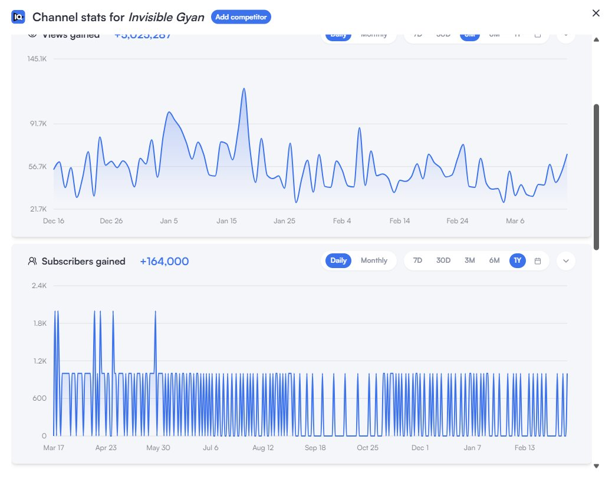

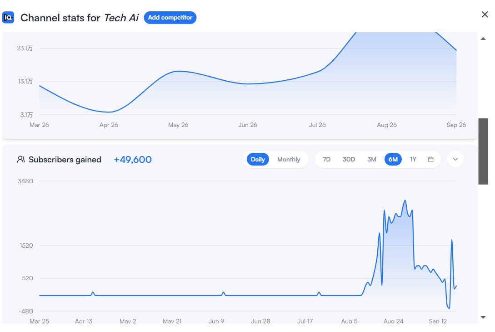

跨平台数据也是有效参考：若单一平台百万粉而关联主平台仅几百粉，且内容无法合理解释差异，需进一步核验。同时区分**虚假流量**与**低购买力真实流量**。

## 五、$100 与 $1200 两次合作的深层启示

$100 合作案例表明：**博主报价具有弹性空间**。当产品与受众高度契合、提供免费权益或具备长期合作潜力时，可以主动报出合理预算。

数据对比启示：
- A 博主（$100）：2,937 访问用户，1,168 回访，平均互动时长 9 分 01 秒。
- B 博主（$1,200）：3,552 访问用户，0 回访，平均互动时长 10 秒。

仅看引流用户数容易得出错误结论，结合互动时长与回访深度后质量完全相反。不能孤立看待 CPM、CPC、CTR，必须顺着完整链路向下追踪：

**视频播放 → UTM 点击 → 会话数 → 互动深度 → 注册转化 → 核心功能使用 → 付费转化。**

越往链路后方，越接近真实的商业价值。

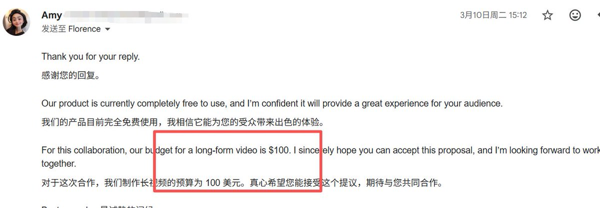

## 六、首封建联邮件结构

初次接洽邮件应力求精炼，博主没有时间阅读冗长文档。

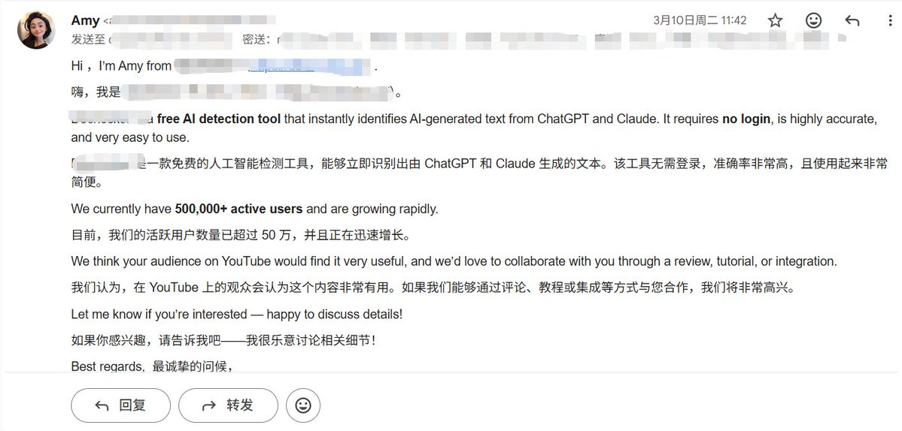

推荐结构：**我是谁 → 产品是什么 → 一条可信背书数据 → 为什么受众适合 → 意向合作形式 → 预算范围 → 询问意向。**

首封邮件的唯一目的是**确认合作意向**。对方回复后，再进一步沟通具体预算、脚本与排期。涉及报价、交付与付款节点的核心信息，务必保留书面记录。

## 七、Brief 撰写与内容把控

避免将 Brief 写成逐字稿，否则容易导致视频变成生硬朗读。

核心模块包含：
1. **背景与产品定义**：一句话明确产品定位与本次主推目标，附带 Demo 录屏与操作文档。
2. **素材包**：高清 Logo、功能界面、Use Case 演示素材。
3. **Must Talking Points**：建议只保留 **2～3 个最关键卖点**，给予创作者足够的表达空间。
4. **合作规范**：明确 UTM 追踪链接、视频时长、必出画面、CTA 位置与措辞、发布时间线。

**原则：品牌控制“说什么”与“不能说什么”，博主决定“怎么说”。**

### CTA 设计细节

不要仅把行为召唤（CTA）放在视频片尾，大部分观众难以坚持看到最后一秒。
- 核心功能演示完毕后，在**视频中段**植入一次明确 CTA。
- 视频尾部再次呼应。
- YouTube **置顶评论**同步放置追踪链接与权益说明。

## 八、合作排期与推进节奏

跨国红人合作建议预留 **3～4 周**周期：
- **发布前 2～3 周**：锁定人选、形式、排期并确认时区。
- **发布前 7～10 天**：提供定稿 Brief 与全套素材，避免后续大幅调整。
- **发布前 1 周**：博主创作、品牌集中审稿并一次性给出明确修改意见。
- **发布前 24 小时**：封版停止修改。
- **发布后 7 天**：监测初期峰值与持续长尾流量。

针对功能演示顺序等关键要素，在 Brief 发出后需二次提醒确认，避免重复返工。

## 九、付款机制与台账管理

常规付款节奏：**脚本/初稿验收后支付 50%，视频上线确认后支付剩余 50%，并要求开具正式 Invoice。**

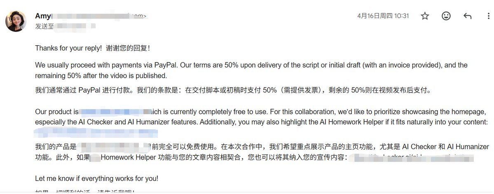

批量推进时建议维护两套台账：
1. **合作推进表**：记录账号信息、粉丝量、联系邮箱、进度状态、优先级、价格、覆盖区域与预排期。
2. **筛选评估表**：从受众、场景、竞品、商业表现、更新频率、合作印象等维度打分，统一评估标准。

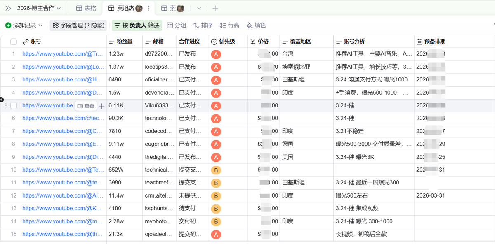

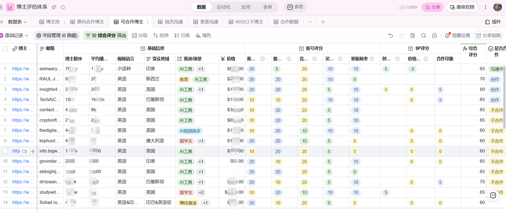

## 十、数据复盘与长尾追踪

视频发布后 48～72 小时内，除关注 UTM 直接转化外，还应综合观察：
- 官网直接访问（Direct Traffic）是否出现波峰。
- 品牌词在搜索引擎上的检索量波动。
- 自然注册曲线的整体抬升。

将每次合作的投入、播放量、点击量、GA 用户数、留存付费表现及复投建议完整沉淀入库，形成可持续迭代的创作者资产库。

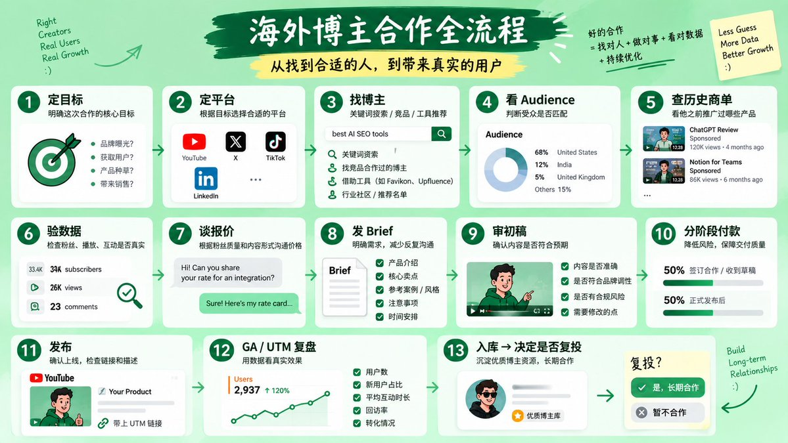

**核心总结流程**：

**定目标 → 定平台 → 找博主 → 看受众 → 查历史商单 → 验数据 → 谈报价 → 发 Brief → 审初稿 → 分阶段付款 → 发布 → GA/UTM 复盘 → 入库 → 决定是否复投。**

红人投放的核心价值不在于单纯的联系名单，而在于经过实操沉淀的**筛选标准、标准化协作流程，以及具备真实投放效果反馈的创作者数据库**。
