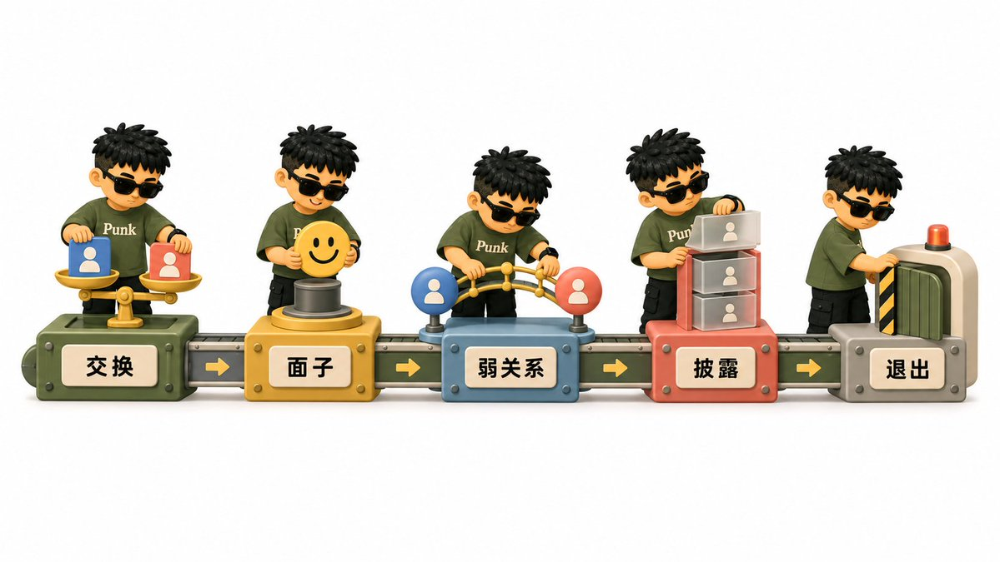
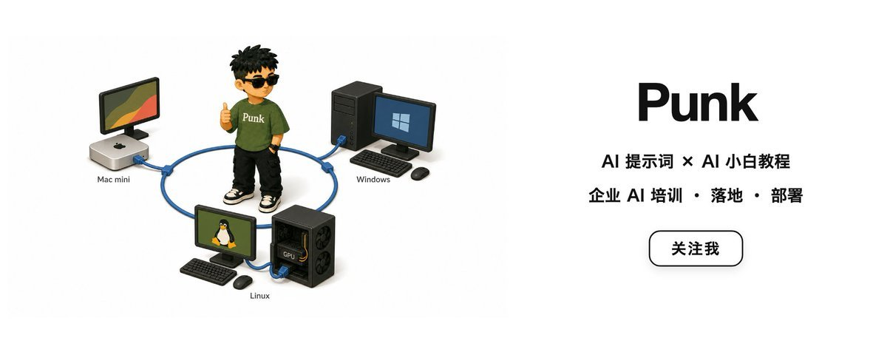

# 微信社交操作指南：从加好友到建立关系的全流程

前几天发了条短推，问了一句：加了微信之后，你们一般怎么跟陌生人开口聊？发现很多人都有同样的困扰——加完人不知道第一句说什么，聊着聊着变成免费咨询机，想约线下又怕唐突，不想聊了又不知道怎么收。

所以整理了一些过往经历，也借用了社会学和社交心理学里的几个概念，一块来深度探讨微信社交这件事。从加好友、破冰、继续聊天，到产生好感、商务合作和约线下，尽量把每一步为什么这么做讲清楚。

先讲底层逻辑，再讲实操。

第一部分：底层逻辑——在动手之前先搞清楚社交在运行什么规则

微信已经不只是通讯工具，它是中国社会中半正式的社交基础设施。一个人的微信列表在某种程度上就是他的社会资本账本。你在上面的每一次互动——加谁、怎么开口、回不回消息、多久回——都在传递关于你这个人的信息。在聊具体怎么操作之前，有几个底层原则需要先装进脑子里。后面所有的实操建议，都是从这些原则里长出来的。

## 1.1 社会交换理论——所有关系都在记账

人和人之间的互动包含交换：信息、情绪价值、资源、机会、陪伴都可以进入交换。社会交换理论关注人们如何衡量关系中的回报、成本、公平感和替代选择。它并不要求每一次互动即时等价，更强调一段时间内的互惠感受；当一方长期付出、另一方持续索取，关系满意度和继续投入的意愿通常会下降。

这在微信社交中的投射非常直接：你总是主动找人聊、总是回答别人的专业问题、总是转发有用的信息却得不到对等的回应——跟你“够不够好”没关系，纯粹是交换失衡了。后面关于咨询收费、拒绝白嫖的所有建议，底层逻辑都是这个：**保护交换的对等性，才能保护关系本身。**

## 1.2 人情与面子——中国社交的隐性操作系统

西方社交理论讲契约和效率，但中国社会的社交运行在另一套系统上——人情和面子。社会学家黄光国把它拆解为“人情法则”：人情是一种隐性债务，别人帮了你，你欠了人情；你帮了别人，对方也会记着。面子则是社交场上的通货，给面子是投资，伤面子是开战。

这意味着在微信上你不能只追求“高效”。有些看起来“浪费时间”的寒暄其实是在给面子，有些不直接说“不”的拒绝其实是在保护双方的人情账户。后面会看到，很多话术之所以那样设计——跟虚伪无关，在中国关系伦理中，直来直去的代价通常高于收益。

## 1.3 弱关系的力量——你的机会大概率来自不太熟的人

社会学家格兰诺维特在 1973 年提出了一个反直觉的发现：给人带来新工作、新机会、新信息的，往往是那些“认识但不太熟”的人，亲密好友反而排不上号。原因很简单——你的亲密朋友和你处在同一个信息圈子里，你知道的他们也知道；而弱关系连接着你触达不到的其他圈子。

这就是为什么你的微信列表需要管理，放任只会浪费它的潜力。那些你加了但只偶尔互动的人，不是无效社交——他们可能是你未来最有价值的信息桥梁。但弱关系也需要维护，方式是低频但持续的连接：在关键节点出现一次，让对方知道你还在、你还记得。

## 1.4 自我披露——关系深化的发动机

奥特曼和泰勒提出的“社会渗透理论”用自我披露的广度和深度解释关系如何发展。早期互动通常停留在事实层面（你做什么工作、在哪个城市）；随着信任增加，人们才会逐渐分享观点、经历和感受。这个过程需要渐进与互惠：你分享一点，对方也愿意打开一点，关系才有继续深入的空间。短时间内单方面倾倒大量隐私，可能给对方带来压力。

## 1.5 礼貌性疏忽——高手的退出方式

戈夫曼用“civil inattention”描述公共场合里一种克制的注意：人们短暂承认彼此的存在，同时避免过度注视或介入，以此维持相互舒适。把这个概念借到微信语境，可以得到一个实用提醒：每条消息未必都要回复，每个话题未必都要接住，每段关系未必都要经营。面对普通、低风险的关系，有意识地降低互动频率和深度，可以成为一种柔和的退出机制；面对纠缠、骚扰或越界，则需要更明确地拒绝、拉黑或寻求帮助。

## 1.6 总结

把上面五条收拢成一句话：**在微信上，你的每一步操作都在同时管理交换账户、维护面子体系、经营弱关系网络，而推进的发动机是适度的自我披露，退出的安全阀是礼貌性疏忽。** 搞清楚这个底层结构，后面的实操就变成了在每个场景下做出合乎逻辑的判断，用不着死记硬背话术。

第二部分：主动加好友

## 2.1 纯线上场景——你们从未见过面

你在某个社群、平台或朋友转介绍中看到对方，想主动建立联系。这是陌生人社交的起点，对方没有任何义务回应你，因此你的申请信息必须在三秒内回答清楚三个问题：你是谁、你从哪来、你要什么。

**加好友申请语模板：**

你好，我是【你的名字】，坐标【城市】，目前在做【你的工作/领域关键词】。在【具体渠道，如某个社群/某篇文章下/某位朋友推荐】看到你，觉得【一句具体的理由】，想加个微信交流一下，方便吗？

拆解这个模板的底层逻辑：

- **“我是谁”**——名字 + 所在城市 + 职业领域。这三项构成最小身份识别单元。Base 哪里看似无关紧要，实际上它帮助对方快速判断你们是否有线下交集的可能性，也给对方一个记忆锚点。
- **“从哪来”**——说清楚你是怎么找到对方的。“在 XX 社群看到你分享的内容”和凭空出现的“想加你聊聊”，可信度完全不同。渠道信息是信任的起点。
- **“要什么”**——意图不需要详尽，但必须具体。“交流一下”比“认识一下”稍好，但最好能再精确一步：“想请教你关于 XX 方面的经验”或“觉得我们在 XX 方向上可能有合作空间”。越具体，对方的心理负担越低——他知道该期待什么。

**避免的常见错误：**

- 空白申请或只写一个“你好”。对方每天可能收到几十条申请，没有信息等于没有理由通过。
- 过度客套但没有信息量：“久仰大名，一直想认识您！”——这句话对方无法回应，因为里面没有任何可以接住的内容。
- 一上来就发长段自我推销。申请阶段的目标只是通过，别想着成交。

## 2.2 线下活动后——你们见过面，现在转入线上

线下场景已经完成了初步筛选：你们在同一个活动中出现过，有过至少一次面对面的印象。这时加好友的门槛低得多，但同样需要一条信息让对方把你和那个场景关联起来。

**加好友申请语模板：**

你好，我是【名字】，今天在【活动名称/地点】跟你聊过【具体话题的一两个关键词】的那位。很高兴认识你，加个微信方便后续联系。

通过后的第一条消息也很关键。不要只发一个表情包或“加上了”。可以这样延续：

今天聊到的【某个话题】我回来又想了想，觉得你说的【某个观点】挺有意思。改天有机会可以接着聊。

这条消息的作用是锚定印象——你在对方心里从“活动上加的某个人”变成了“跟我讨论过 XX 话题且有自己想法的人”。在社会学中，这叫做**身份标定（identity anchoring）**：你通过一个具体的话题把自己从模糊的群体记忆中拎出来，变成一个有辨识度的个体。

第三部分：被加好友

## 3.1 对方有自我介绍

如果对方在申请时附带了清晰的自我介绍，这说明对方懂基本的社交礼仪，值得回应。通过后，你的回复应该对等——对方介绍了自己，你也简要介绍自己，同时回应对方的来意。

**参考回复：**

你好【对方名字】，我是【你的名字】，在【领域】方向做了【时间/内容】。看到你的介绍了，【对对方来意的回应】。

回应来意是关键动作。如果对方说“想交流”，你可以说“欢迎，有什么具体想聊的随时说”——这既是善意的开放，也是在温和地让对方把意图进一步明确。如果对方说“想请教”，这时候就需要判断是否进入咨询场景（后文详述）。

## 3.2 对方没有任何介绍或互动

通过好友申请后，对方既没发消息，也没进一步动作。这种情况在社交行为分析中通常意味着两种可能：对方是批量加人（你只是他的一个流量节点），或者对方社交主动性较低、不知道该说什么。

**处理方式：给出一个合理的等待窗口，然后果断决策。**

如果你习惯保持微信列表精简，可以给自己设一个 24 小时或 48 小时的观察窗口。这个时间不是通用礼仪，只是一条个人管理规则。有人工作忙、很少看微信，也有人加完后临时忘记回复，单凭沉默无法准确判断对方的动机。

观察期后有三个选择：

- **主动确认一次**：如果你对对方的身份或来意感兴趣，可以发一句：“你好，看到你加我了，请问我们是在哪里认识的，或者有什么想交流的吗？”给对方一次说明来意的机会。
- **保留但不主动**：如果对方身份清楚，你也不排斥保留这个连接，可以先放在弱关系标签下，等未来出现自然的互动节点。
- **删除**：如果对方身份不明、没有共同场景，或者你本来就不希望扩张通讯录，删除即可。微信列表是私人空间，你不需要为每一个连接承担维护义务。

## 3.3 线下见过面后被加好友

如果你们在活动或某个线下场合见过面，对方随后加了你的微信，处理逻辑会因你对对方的印象而不同：

- **你对对方印象不错**：可以主动打个招呼，延续线下的话题。“今天在【活动】聊得挺开心的，你之前提到的【话题】我也挺感兴趣”——这是给对方一个台阶，让对话自然地从线下延续到线上。
- **你对对方没什么印象或印象一般**：礼貌通过，等对方先说话。如果对方开口了，根据内容决定回应深度。如果对方同样沉默，按照 3.2 的逻辑处理。

## 3.4 身份不明、推销、骚扰或明显越界

有些好友申请从一开始就带着风险：身份含糊却打听隐私、刚通过就发链接或二维码、诱导转账投资、持续发送暧昧或露骨内容、在你拒绝后仍反复纠缠。遇到这类情况，不需要继续维持礼貌性互动。

处理顺序可以很简单：先停止提供个人信息，不点击陌生链接，不进行转账；需要时明确说一次“请不要继续发送这类内容”；对方继续越界就删除、拉黑或投诉。若涉及威胁、跟踪、诈骗或现实安全风险，保留截图和转账记录，及时联系平台、警方或可信任的人。柔和退出适用于普通关系，安全问题优先使用清晰边界。

第四部分：破冰之后——对话走向的判断与应对

好友加上了，第一轮寒暄完成了，接下来对话会自然分流。你需要快速判断这段对话的性质，然后选择对应的策略。

## 4.1 对方有咨询/业务需求——如何开口收费

这是很多专业人士最头疼的场景：对方加了你的微信，开始问专业问题，你回答了两三条之后意识到——这已经超出“交流”的范畴了，这就是咨询。

**判断标准：当对方的提问涉及到你需要花时间思考、调取专业知识、甚至需要为回答负责的时候，这就是咨询。**

关键是要在对方把免费咨询当成理所当然之前，把规则摆出来。越早越好，越自然越好。

**收费告知的参考话术：**

你问的这个方向我正好比较熟悉，这块如果要聊深一点的话，涉及到我的专业服务范围了。我现在提供【咨询形式，如一对一语音/文字咨询/方案定制】，费用是【价格/时长】。你看有需要的话我可以给你详细说说流程？

这段话的设计逻辑：

- **先肯定对方的问题是有价值的**（“你问的这个方向我正好比较熟悉”），这句话的作用是定性，让对方感到被认可。
- **自然地引出收费**（“涉及到我的专业服务范围”），避开冷冰冰的“我这个要收费的”，直接把收费和专业性绑定在一起。
- **把选择权交还给对方**（“你看有需要的话”），这是给对方一个体面的退出通道。对方可以说“好的，我了解一下”然后结束这个话题，双方都不尴尬。

**如果对方接受：** 进入正式的咨询流程，按客户关系维护。在微信中给对方打上“客户”标签（标签管理见第六部分）。

**如果对方拒绝或沉默：** 不需要追问。你可以用一句话收尾：

没关系，后续如果有需要随时找我就好。

然后停止在这个话题上继续提供免费输出。听起来冷漠，其实是边界。社会交换理论的基本原理在这里适用：持续单向输出而得不到回报（无论是经济回报还是关系深化），会导致你对这段关系产生隐性怨恨，最终反而破坏可能的长期连接。

## 4.2 如何拒绝“白嫖”

“白嫖”在社交语境中有一个更学术的名字——**单边社交提取（unilateral social extraction）**：一方持续从关系中获取价值，却不提供对等的回报。

常见的白嫖模式：

- 问完一个问题又问下一个，每个问题都“只是一个小问题”，但加在一起已经相当于一次完整咨询。
- “方便的时候帮我看一下”“就简单说两句就行”——这些限定词是在降低你拒绝的合理性，让你不好意思说不。
- 话题反复绕回到你的专业领域，但每次都包装成“随便聊聊”。

**应对策略：**

温和但清晰地把话题推回收费框架。你不需要解释为什么收费（你的专业值得付费本身就是充分理由），你只需要每次都一致地执行边界。

这个问题比较细了，三两句说不太清楚。如果你想深入了解的话，可以考虑约一次我的【咨询服务】，我可以系统地帮你梳理一下。

如果对方依然打太极——“改天再说吧”“等我考虑考虑”但过几天又来问新问题——你可以不再回应专业类问题，只维持基本的社交礼貌。这不需要戏剧化地“摊牌”，只需要安静地调整你的回应模式。不回答就是最清晰的回答。

## 4.3 你不想继续聊天——如何体面地退出

不是每段对话都值得继续。当你感到以下信号时，说明这段对话对你来说已经没有推进的意义：

- 你需要很久才能想到该回什么（跟忙不忙没关系，单纯没兴趣）。
- 对方的话题让你感到消耗而非愉悦或有收获。
- 你发现自己在应付而非交流。

**退出策略遵循一个原则：降低回应频率和深度，而非突然消失。**

具体操作：

- 回复间隔逐渐拉长，从秒回变成小时回，再变成半天或一天。
- 回复内容从展开讨论变成简短回应：“嗯嗯”“有道理”“好的了解”。
- 不主动发起新话题。

大多数有社交敏感度的人会读懂这个信号并自然减少联系。如果对方依然不断找你聊天，你可以用一句自然的结束语：

最近手头事情比较多，可能没法及时回消息，见谅啊。

说“撒谎”太重了，这就是第一部分讲的“礼貌性疏忽”的实际运用。戈夫曼所说的核心就在于此：在不伤害对方面子的前提下，管理你们之间的互动边界。直接说“我不想跟你聊了”是真诚的，但也是对对方面子的正面攻击——回到人情面子那条原则，在中国社会的关系伦理中，这种做法的代价通常高于收益。

## 4.4 你想继续聊天——如何推进关系

当你发现对方的回复是及时的、有内容的，话题能自然展开，你有兴趣继续了解这个人——这时候需要主动推进，光等关系自然发展只会等来冷却。线上关系如果不注入能量，会快速衰减。

**推进策略：**

**第一步：寻找共同话题锚点。** 翻看对方的朋友圈，寻找以下线索：

- 爱好（运动、阅读、旅行、美食、某个特定领域的兴趣）
- 最近的动态（去了哪里、做了什么、发了什么观点）
- 共同认识的人或共同参加过的活动

找到匹配点后，用它作为下一次对话的切入：

刚看到你朋友圈发的【内容】，正好我也【相关经历或兴趣】，你平时经常【相关活动】吗？

**第二步：从信息交换升级到观点交换。** 早期对话通常是事实层面的：“你做什么的”“你在哪个城市”“你平时喜欢什么”。要让关系推进，需要进入观点和感受层面——分享你对某件事的看法、你的某个经历、你的某种偏好。这就是第一部分讲的“自我披露”机制在实际操作中的样子：适度地分享个人信息，会激发对方的对等分享，关系的亲密度随之上升。

**第三步：创造持续互动的理由。** 分享一篇你觉得对方会感兴趣的文章、一个相关的活动信息、一条跟你们聊过的话题有关的新闻。这些“社交借口”让对话不依赖于你们中的某一方每次都主动发起。

**线下认识 vs. 纯线上认识的区别：**

线下认识的人在线上聊天时有一个天然优势——你们有共享的物理记忆。“那天活动上的【某个细节】”是一个只属于你们的话题空间。善用这个优势，把线下体验转化为线上对话的素材。

纯线上认识的人需要更多耐心。你们之间没有共享记忆，信任的建立完全依赖文字交互的质量。此时更需要注意节奏：不要一次性问太多问题（审讯感），不要每天都发消息（压迫感），也不要间隔太久才联系（遗忘感）。具体频率很难统一规定，观察双方自然形成的节奏更可靠：对方多久回复、会不会主动延伸话题、是否偶尔主动找你，都比“隔几天联系一次”更有参考价值。

## 4.5 聊出好感之后——如何从有兴趣走向进一步了解

微信聊天里产生好感很正常。真正需要判断的，是这份好感来自对现实中这个人的了解，还是来自文字互动留下的想象空间。尤其在纯线上认识的关系里，人很容易用有限的信息补全对方，把回复及时、表达温柔、兴趣相似理解成更明确的情感信号。

所以，有好感之后先别急着表白，也别突然把聊天强度拉满。先观察关系里有没有持续、双向的投入：

- 对方会主动开启话题，不只是礼貌回复。
- 对方记得你说过的细节，也愿意分享自己的日常、感受和安排。
- 你释放一点更个人化的信息后，对方会给出程度相近的回应。
- 对方愿意为互动投入时间，例如语音、通话或安排线下见面。
- 你表达轻微好感时，对方会接住、回抛，或者创造下一次互动。

这些信号需要结合起来看。单次秒回、经常点赞、使用亲昵称呼，都可能只是个人习惯，无法单独证明对方也喜欢你。

如果双方已经有一定熟悉度，可以用低压力的方式表达兴趣：

跟你聊天我还挺开心的，也想再多了解你一点。周末要不要一起去【具体地点/活动】？

这句话表达了好感，也保留了空间。对方接受邀约并继续投入，关系就可以自然往前走；对方模糊回应、持续回避或降低互动，及时收回投入即可。喜欢可以表达，回应不能索取。

还要注意两条边界。第一，工作关系、咨询关系或存在权力差异时，先判断表达好感会不会给对方带来压力。第二，在没有明确共识前，不要追问隐私、发送露骨内容、进行情绪绑架，也不要把普通友善直接解释成暧昧。

## 4.6 聊出合作可能——如何从“有机会合作”走到具体方案

商务合作最容易卡在一句“以后有机会一起做点事”。这句话适合表达善意，却不会自动产生项目。真正的合作需要完成一次关系切换：从泛泛交流进入目标、资源、责任和利益都清楚的工作对话。

先判断有没有真实的合作基础：双方需求是否互补、你能提供什么、对方能提供什么、合作能否产生具体结果、谁有决策权。只有兴趣，没有明确需求，最多算潜在线索。

第一次提出合作时，建议把五件事说清楚：合作背景、共同目标、双方分工、交付结果、下一步动作。可以这样开口：

上次聊到【具体问题】，我回去想了下，我们在【共同目标】上可能有个合作点。我这边可以负责【你的投入】，希望你这边提供【对方投入】，预计产出是【具体结果】。如果你也有兴趣，我们可以约 30 分钟把需求、预算和时间线对一下。

如果还处于试探阶段，可以先提出一个范围有限的小合作，例如一次联合活动、一篇共创内容或一个短周期项目。小项目能低成本检验双方的响应速度、专业能力、沟通方式和信用，再决定要不要扩大投入。

进入正式合作前，至少确认以下内容：

- 目标与交付物：最终要完成什么，什么状态算完成。
- 分工与负责人：谁做什么，谁有最终决定权。
- 时间节点：开始时间、阶段节点、交付日期。
- 费用与结算：报价、付款节点、税费和退款条件。
- 权益归属：署名、版权、客户资源、数据和成果如何使用。
- 退出机制：延期、违约、临时终止时怎么处理。

聊天记录可以帮助回溯，却替代不了正式确认。涉及金钱、长期投入、知识产权或客户资源时，把约定整理成文字方案或合同。熟人合作同样需要明确规则，规则清楚反而更能保护关系。

对方长期只说“可以聊聊”，却不愿确认目标、预算或下一步时间，通常说明合作优先级不高。礼貌保留连接即可，不必无限投入方案和沟通成本。

第五部分：从线上到线下——如何判断和邀约

## 5.1 判断是否可以约线下见面

不是所有线上聊得好的人都适合约线下。线下见面意味着双方都要投入时间和精力，且面对面互动的信息密度远高于文字——好的会更好，但不匹配也会更明显。

**可以考虑约线下的信号：**

- 你们的对话已经超越了信息交换阶段，进入了观点分享和个人经历交流的层面。
- 对方在对话中主动提到过线下相关的内容：“有机会一起【某个活动】”“你下次来【某个城市】可以约”。
- 你们有至少一个共同兴趣点已经反复聊到过，具备线下一起做某件事的基础。
- 双方的回复频率和深度大致对等——关系的推进是双向的，不是你在单方面投入热情。

**暂时不适合约线下的信号：**

- 对方的回复始终简短、客气但缺乏实质内容。
- 你们的对话内容还停留在表面信息层（互相问基本情况）。
- 对方从未主动发起过话题或延伸过你抛出的话题。
- 你提到过线下相关的话题，对方没有接住或转移了话题。

## 5.2 如何发出线下邀约

线下邀约的核心原则：**给出一个具体的、低承诺的、有退出通道的方案。**

不要说“改天出来见个面吧”——这种模糊邀约把组织工作推给了对方，且缺乏行动力。

**有效的邀约方式：**

你之前提到对【某个共同兴趣】挺感兴趣的，正好我看到【具体活动/具体地点】在【具体时间】有个【活动内容】，你要不要一起去？

这个邀约之所以有效：

- **有锚点**——关联到你们之前聊过的内容，不突兀。
- **有具体信息**——时间、地点、内容都有，对方做决策的成本很低。
- **低承诺**——一起参加一个活动比“出来吃个饭”压力小。活动提供了第三方话题和退出的自然节点——如果见面后发现不合适，活动结束各回各家，不需要额外的社交收尾。
- **有退出通道**——“你要不要”给了对方说“那天有事”的空间，不构成道德压力。

如果对方答应了，见面当天保持自然就好。如果对方婉拒，不要追问原因，也不要反复邀请。你可以隔一段时间后，用另一个自然的机会再尝试一次。如果两次邀约对方都没有接受，说明对方目前不想推进到线下关系，尊重这个信号。

## 5.3 第一次线下见面——安全、节奏和见面后的确认

纯线上认识的人第一次见面，优先选择交通方便、公开、人流稳定的场所，时间控制在一到两个小时内。把行程告诉可信任的人，各自前往、各自离开，避免第一次见面就进入对方住所、酒店、偏僻地点或高度依赖对方安排的行程。涉及饮酒时尤其要保留自主离开的能力。

见面的目标是验证线上印象，不需要一次决定关系。重点观察对方如何对待服务人员、如何处理分歧、是否尊重你的时间和身体边界，以及线上表达与现实行为是否一致。聊天热闹只能说明当下气氛不错，稳定和尊重更能说明一段关系有没有继续发展的基础。

见面后可以在当天或第二天明确反馈：

今天聊得挺开心的，尤其是【具体话题/细节】。下次如果你有空，我们可以一起去【具体活动】。

如果你只想维持普通联系，也可以简短表达感谢，不主动抛出下一次邀约。若对方提出继续见面而你没有意愿，直接说“谢谢邀请，不过我暂时不打算继续往这个方向发展”会比长期模糊回应更清楚。涉及暧昧关系时，清晰边界比让对方不断猜测更友善。

第六部分：微信标签管理——让你的社交网络可视化

微信标签是一个被严重低估的功能。它本质上是你的私人 CRM 系统——用好了，你能在需要的时候快速找到对你有帮助的人，也能避免把不合适的内容发给不合适的人。

## 6.1 推荐标签体系

按照关系性质和互动需要，建议建立以下标签维度：

**按关系类型：**

- 客户（已付费/有业务往来的人）
- 潜在客户（表达过兴趣但未成交）
- 同行/同业（同领域但不是竞争关系，可能有合作或资源互换的可能）
- 朋友（有情感连接，不只是利益交换）
- 弱关系（只加了微信，偶尔互动，保持连接但无深度往来）

**按认识渠道：**

- 线下活动-【活动名称/类型】
- 社群-【群名称】
- 朋友介绍-【介绍人姓名】
- 线上平台-【平台名称】

**按地域：**

- 同城
- 外地-【城市】

**按领域/行业（根据你自己的需要设置）：**

- 设计、技术、运营、投资、媒体……

## 6.2 标签使用的实操建议

- **加好友后立刻打标签**。不要等“以后再整理”——你会忘的。加好友的当下是你对对方信息最清楚的时候。
- **一个人可以有多个标签**。“客户 + 同城 + 线下活动认识”——多维度标签让你在不同场景下都能精准检索。
- **定期清理**。每隔一到两个月，翻一遍微信列表。那些你已经完全想不起来是谁、也没有任何互动的联系人，可以考虑删除。社交网络的价值不在于数量，在于密度和质量。
- **朋友圈分组发布**。标签的另一个重要用途是控制朋友圈的可见范围。客户看到你的专业内容，朋友看到你的生活内容，互不干扰。说白了就是成熟的社交边界管理。

所有的模板、话术和策略，都只是让你的真诚更有效率地传达出去的工具。如果底层没有真诚，再精妙的社交技巧也会被识破。人对虚假的直觉判断能力远超我们的想象。最好的社交策略永远是：带着清晰的意图和真实的善意去跟人打交道，然后把结果交给时间。

## **关于作者**

**Punk**｜中科大管理学硕士｜AI提示词、AI小白教程｜Punk系列Skills作者｜3个月赚了8位数｜Learn in Public｜FDE文章浏览量240w｜

[[@AdrianPunk115](https://x.com/AdrianPunk115)](https://x.com/@AdrianPunk115)

