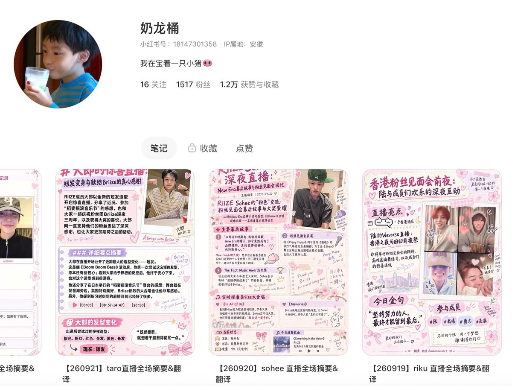
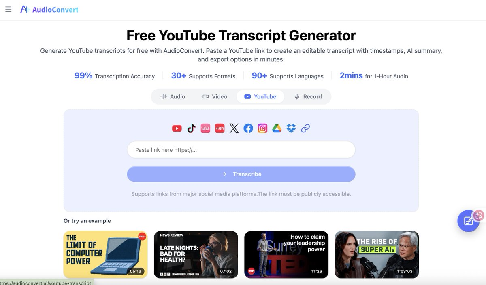
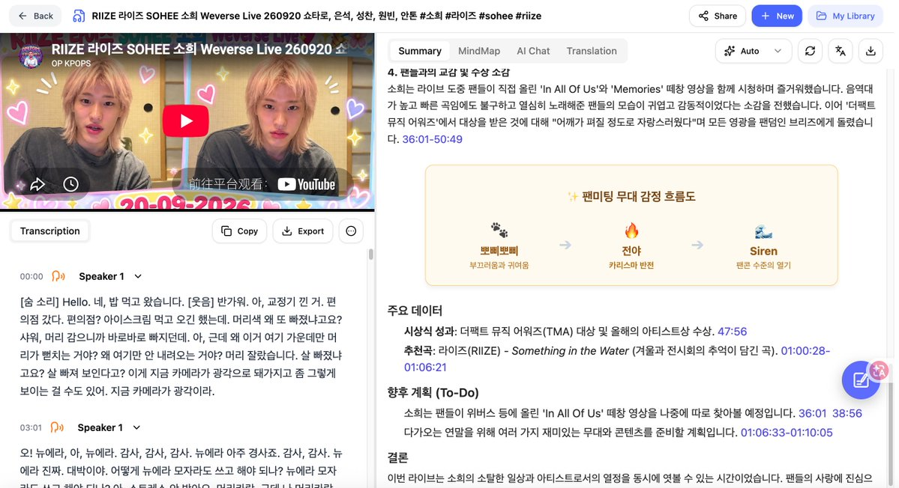
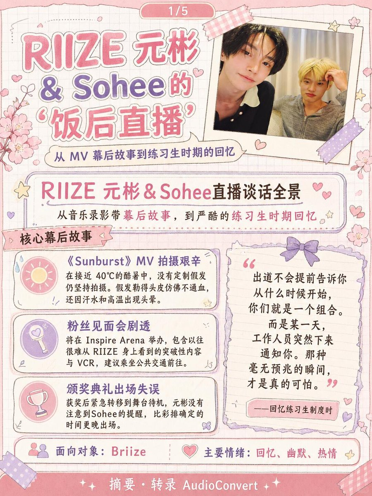
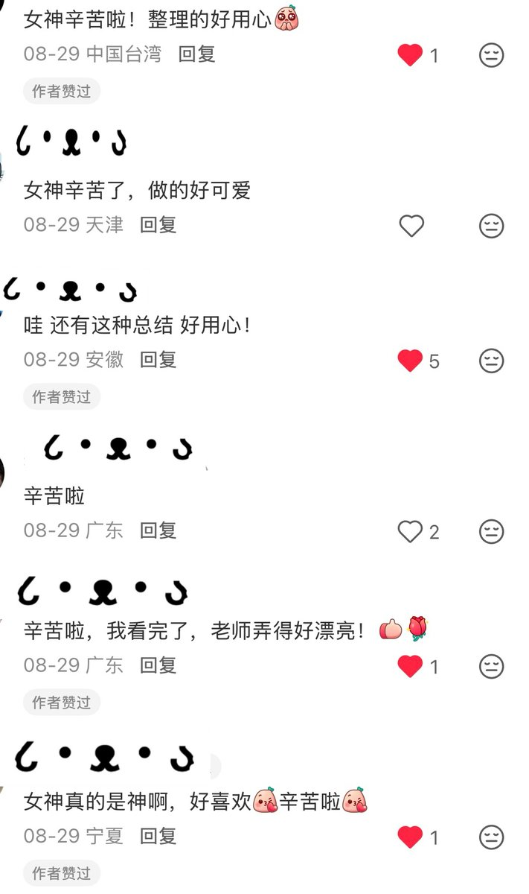

# 靠一套半自动化工作流，我把韩娱idol 直播做成小红书笔记，20天涨粉1500

hi，大家好，我是米饭joy，我又来分享我的社媒大结果了，上次是threads，这次是小红书。**目前我的小红书账号已经1516个粉丝了，而且我只要发帖必涨粉，有图有真相。**

实话告诉大家，我能在小红书拿到这个大结果，其实和我的兴趣爱好离不开关系，本人是一名十年资深追星女，从小学一直追到现在，近几年一直在追Kpop，所以我很敏锐地嗅到了这个商机。

现在就把这一套完整的SOP分享给大家，你能直接拿走起号的那种。

笔记制作全程交由AI完成，人工只需要review，大大节省时间，也完全不用每天绞尽脑汁想素材，我的素材就来源于idol直播，都是现成的。

**1.先准备两个AI工具**

- **音视频转录工具**，拿来做直播转录和翻译文字素材

- **ChatGPT老师，**拿来做图片素材，这位就不用多介绍了

**2\. 工作流主要分为 5 步：**

**2.1.1 获取最新直播素材**

YouTube找到直播场次之后，直接复制链接去转录

对饭圈女孩来说，**搬运速度很重要。直播结束后越早整理发布，越容易吃到第一波搜索和推荐流量，**如果idol直播结束，两天后你才发布，那么笔记的时效性也就大大降低了。

**2.1.2 用转录工具转录直播文字**

拿到链接后，上传到转录工具，直接导出完整韩语文本，如图所示，左边是整场直播转录文本，右边是直播摘要。

**2.1.3 用 Ghatgpt翻译和润色**

转录完成后，我会把文本交给 GPT 翻译和润色

prompt如下：

摘要：

请将【】的直播摘要内容翻译成中文， 保留表情符号。【】可能会提到成员姓名，成员姓名供你参考：【】，只输出翻译后的中文内容，不加额外说明或分析。以下是需要翻译的原文：

转录文本：

请将【】的直播转录内容翻译成中文，并改写为以【】为第一人称的温暖可爱叙述体。 【】可能会提到成员姓名，成员姓名供你参考： 【】语气风格： 语气温和、可爱、带一点亲昵感。 可酌情添加少量表情符号（如 😊、✨、🌸），每段不超过 2 个，整体不超过 5 个。 输出格式： 按直播的自然段落或话题转换处分段。 在每个主要段落开头标注时间戳（例如 \[03:25\]），不必对每一句话都标注。 只输出翻译后的中文内容，不加额外说明或分析。待翻译原文如下：

注意！！结果不能直接复制。

这里有个要求就是你最好提前了解你搬运的这个团体，否则人名错了你都不知道，直接发出去，会很尴尬，粉丝也会觉得你不是这个圈子里的人，她们可能不会买账。**因为饭圈语境、成员关系和一些内部梗，AI 不一定懂，所以必须人工review一遍。**

**2.1.4 用 GPTPlus 生成摘要和翻译图片**

纯文字版直播翻译很容易被划走，所以我把内容做成了**可爱的K-pop 粉丝手账，粉丝们很喜欢这种风格的图片。**

封面我会加上idol当天的直播画面截图，吸引点击，内页承载完整内容。整体保持统一的粉色、淡紫色剪贴簿风格。

图片prompt如下：

转录文本：

多页【】直播内容剪贴簿（页数不要太多，但是字不能太小！也不能模糊！字体可适当加粗），采用日系少女漫画分镜与对话气泡形式，每页像一张可阅读的漫画直播日记。以日系少女漫画对话页（shoujo manga dialogue page）为核心形式。每一页像一段可爱、温暖的动漫日记：【】的发言使用清晰的大号手写字体与圆润漫画对话气泡呈现，搭配简洁的旁白框、时间戳标签和重点句高亮。文字必须完整、准确、易读，排版整齐，行距舒适，不出现乱码、错别字、文字截断、拥挤换行或尴尬断句。 整体采用精致的 K-pop 粉丝手账 × 日漫少女漫画美学：柔和淡粉色、奶油白、淡紫色为主色调，背景带有若隐若现的网格笔记本纹理、漫画分镜边框与细腻纸张质感。页面点缀可爱的手绘胶带、爱心贴纸、樱花、小星星、丝带蝴蝶结、fluffy 涂鸦线条、闪光符号和精致的小贴纸，营造收藏直播回忆的感觉。 画面重点是"文字对话内容"，装饰丰富但不遮挡文字；整体留白充足、层级分明、阅读顺畅。可加入极少量不抢眼的日漫风小插图或可爱表情符号，不要出现真人照片，不要复杂人物主体。高清、干净、温馨、精致，像官方角色手账与粉丝漫画摘要的结合。每页底部中央保留一行非常小且清晰的文字："摘要&转录"。以下为需要准确排入的文字内容：

摘要：

多页【人名】直播摘要剪贴簿（页数尽量少，但是字不要太小，要便于阅读），采用日系少女漫画分镜与对话气泡形式，每页像一张可阅读的漫画直播日记。以日系少女漫画对话页（shoujo manga dialogue page）为核心形式。每一页像一段可爱、温暖的动漫日记，文字必须完整、准确、易读，排版整齐，行距舒适，不出现乱码、错别字、文字截断、拥挤换行或尴尬断句。 整体采用精致的 K-pop 粉丝手账 × 日漫少女漫画美学：柔和淡粉色、奶油白、淡紫色为主色调，背景带有若隐若现的网格笔记本纹理、漫画分镜边框与细腻纸张质感。页面点缀可爱的手绘胶带、爱心贴纸、樱花、小星星、丝带蝴蝶结、fluffy 涂鸦线条、闪光符号和精致的小贴纸，营造收藏直播回忆的感觉。 标题用淡粉色。可加入极少量不抢眼的日漫风小插图或可爱表情符号，不要出现真人照片，不要复杂人物主体。高清、干净、温馨、精致，像官方角色手账与粉丝漫画摘要的结合。在第一张照片里插入我提供的照片（可以把照片调节地与图片风格更适配，但是不要对照片里的人物面部有任何改动）只有第一张照片需要插入，其他的照片都不需要。每页底部中央保留一行非常小且清晰的文字："摘要·转录"。 字不要太小！字迹不要模糊，一页放不下，就放两页。以下为本页需要准确排入的文字内容：

AI 会完成大部分视觉设计，但文字是否清楚、分页是否合理、人物有没有变形，仍然花一点时间人工检查，因为**如果出现一些很基础的错误，也是在消耗粉丝的信任。**

**3.总结**

这套工作流也可以复制到其他场景，比如转录一些播客内容，做成垂直类栏目播客摘要账号，让上班族快速了解播客内容，也有一定受众。

做这个小红书账号的过程中，当我看到很多粉丝的评论，大部分都是一些鼓励的话，说我总结得很好、做得很好、很需要这种博主，**我也就越来越想把这个账号做好，也会不断调整prompt、修改图片排版、搬运得更快，我不想辜负每一个粉丝宝宝，做X也是一样，会用心经营好自己的X账号，给大家输出有用的内容！**

给大家看一些我的粉丝宝宝们的评论吧，她们都很可爱，一直夸我kkk，我做的也很开心，蒽，我是一个需要鼓励的孩子~🧡

以上就是我的小红书运营工作流啦，希望大家看完能够有所收获。

**关于作者**

**米饭joy**｜十年资深追星族，近年专注 Kpop｜小红书/X 内容创作者

[[@loverboyy0321](https://x.com/loverboyy0321)](https://x.com/@loverboyy0321)
