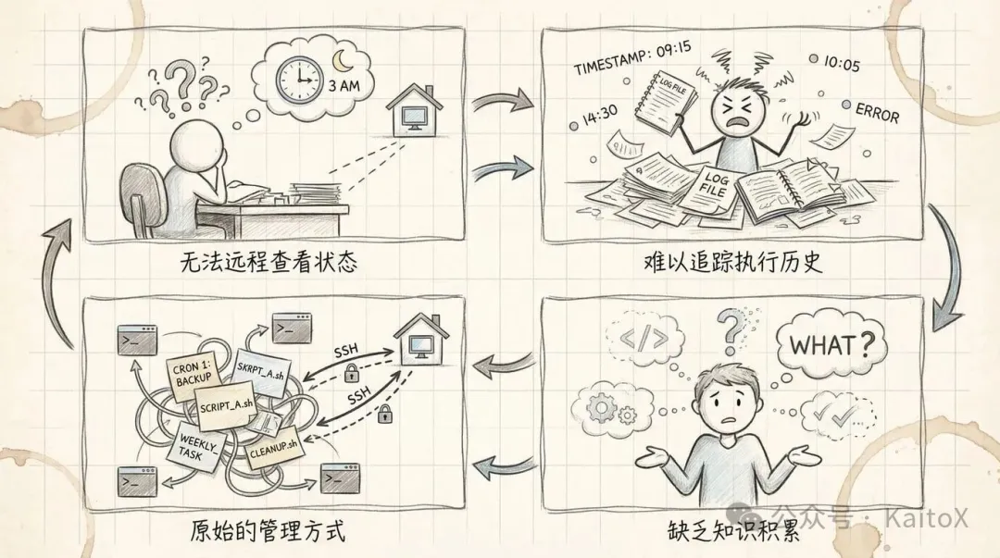
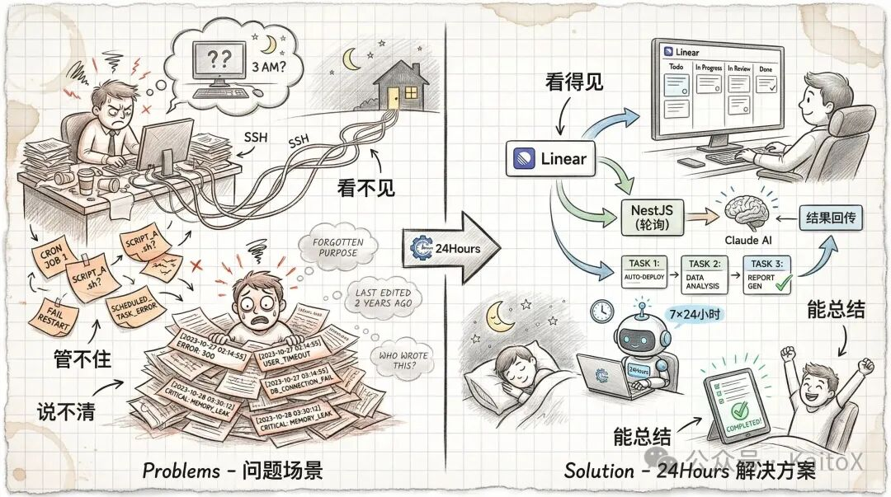
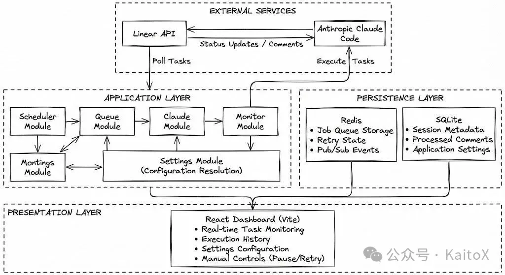
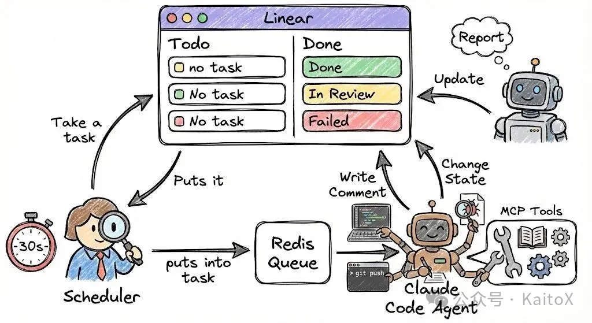

## 前言

周六下午两点，我打开电脑，花了 6 小时搭建了一个叫 **24Hours** 的自动化系统，让 Claude Code 成为我的 7×24 小时助理。

核心思路很简单： **把 Linear 项目管理和 Claude Code SDK 打通** 。我在 Linear 创建任务，系统自动轮询拉取，交给 Claude Code 执行，结果回传到 Linear。这样一来，AI 就能在我睡觉、上班、出差的时候自动干活——写代码、更新文档、生成报告。

为什么选这个方案？因为我发现大多数自动化脚本的问题不是"能不能跑"，而是"看不见、管不住、没记录"。Linear 解决了任务管理和状态追踪的问题，Claude Code 解决了 AI 执行能力的问题。两者结合，就是一个完整的自动化闭环。

这是 **Vibe Coding** 系列的新篇章。如果说之前的文章关注产品设计，这次就是关注工程效率。本文会详细拆解系统的架构设计、技术选型、核心实现，以及我踩过的坑。更重要的是， **这套思路可以复用到任何项目管理工具** （飞书多维表格、Meego、TAPD 等）。

接下来，我会从"为什么造这个系统"开始讲起。

## 我为什么造24Hours？

## 痛点分析



作为上班族的我每天早上需要起床上班，大多数时间是在公司度过。起初，我在家里的电脑上搞了一些定时脚本——自动备份数据、爬取资讯、定时构建项目……挺方便的。但随着脚本越来越多（5+个），问题开始暴露：

### 1\. 任务状态不透明

脚本多了之后，我常常记不清自己到底部署了哪些任务，也不知道它们是否执行成功——往往要等到发现某个功能挂了才意识到问题。

### 2\. 执行历史难追溯

想查看上周某个脚本跑出的数据，还得专门回到家里的电脑上翻记录。

### 3\. 管理方式太原始

手头有多个项目，经常记不清某个任务是在哪个仓库里跑的。

### 4\. 无法形成知识沉淀

这些脚本到底做了什么、产出了什么价值，我自己都说不清楚。

**总结一句话：我需要一个能"看得见、管得住、能总结"的自动化系统。**

## 解决方案



结合 **Linear 项目管理** 和 **Claude Code SDK** ，打造一个生产级的自动化系统—— **24Hours** ，让 AI 成为我的 7×24 小时待命助理。

### 核心工作流程

1. **在 Linear 上提需求** - 创建一个任务，描述你想做的事
2. **系统自动轮询拉取** - NestJS 服务每 30 秒检查一次待办任务，并把需求分配给Claude Code
3. **Claude Code 执行任务** - AI 理解需求，调用工具，生成代码或内容
4. **结果自动回传** - 执行结果以评论形式同步到 Linear，状态自动流转

### 核心价值

- **统一管理入口** ：所有自动化任务都在 Linear 看板上可视化，告别散落的 crontab 脚本
- **全程可追溯** ：每个任务的执行历史、输出结果、失败原因都有完整记录
- **工作生活融合** ：将个人 TodoList 和自动化任务无缝整合，一个看板管理所有事项
- **持续演进能力** ：通过 MCP 协议, Claude Skill 等扩展 AI 能力，让它能操作 Git、数据库、API 等任何系统

### 使用场景示例

#### 场景一:自动生成工作周报

在 Linear 中创建一个每周日自动运行的循环任务：“统计本周任务完成情况，生成周报并同步至 Notion”。周一早晨醒来，一份涵盖了任务数量、完成率及关键成果的周报已自动呈现在你的 Notion 中，同时 Linear 的任务评论区也同步保留了完整的数据明细。

**场景二:一键发布博客文章**

在 Linear 创建任务并附上刚写好的博客。AI 会自动调用预设的发布流程:优化 Markdown 格式、添加合适的标签、生成 SEO 友好的元数据,最后推送到 GitHub 仓库触发自动部署。

这就是 **Linear + Claude Code + MCP + Skills** 的威力—— **最强的项目管理工具 + 最强的通用 Agent + 可扩展的工具生态** ，让 AI 真正成为你的 7×24 小时生产力助手。

## 系统架构设计

## 整体架构



系统采用经典的"生产者-消费者"架构，分为四层：

**外部服务层（External Services）：连接 Linear 和 Claude，一个负责任务管理** ，一个 **负责 AI 执行** 。

**应用层（Application）：** 是核心，包含任务调度、队列管理、AI 执行和监控四个模块，它们协同工作完成任务的自动化流转。

**持久化层（Persistence）：** 用 Redis 存储任务队列，用 SQLite 保存会话记录和配置，确保数据不丢失。

**展示层（Presentation）：** 提供实时监控面板，让你随时查看任务状态、执行历史，还能手动干预。

这套架构的优势在于：模块解耦易扩展，队列机制保可靠，全程可观测好调试。

## 技术选型

为了保证系统的稳定性和扩展性，我选择了以下技术栈：

| 组件 | 技术选择 | 说明 |
| --- | --- | --- |
| **任务管理** | Linear | 支持多端访问，API 完善，是目前最适合开发者的 PM 工具 |
| **后端框架** | NestJS | 基于 TypeScript，模块化设计，内置了优秀的定时任务和队列支持 |
| **AI 执行** | Claude Code SDK | Anthropic 官方推出的 SDK，原生支持 MCP 协议 |
| **任务队列** | Bull (Redis) | 确保任务不会丢失，支持重试和并发控制 |
| **持久化** | Sqlite | 轻量级嵌入式数据库，零部署、零依赖 |
| **部署** | Docker | 容器化部署，一键启动 |

### 为什么选择这些技术?

你可能会问:为什么不直接写个 Python 脚本?

**答案很简单: 我们需要的不是一次性脚本,而是一个可靠的自动化系统。**

- **Linear** - 提供完善的任务状态管理,让 AI 知道该做什么、做到哪一步
- **NestJS** - 长期运行的守护进程,自动轮询任务、管理队列,无需人工干预
- **Claude Code + MCP + Skill** - 核心能力。让 AI 不只会"聊天",还能"干活":读取任务、执行代码、回复结果

**简单来说: Linear 管任务,NestJS 管调度,Claude Code管执行。三者配合,实现真正的自动化闭环。**

## 核心流程



### 一句话说清楚

**系统每 30 秒扫一次 Linear，发现新任务就扔进队列，然后让 Claude Code 去干活，干完了回来汇报。**

### 三个关键流程

**1\. 发现任务 → 进队列**

```
Linear (Todo) → Scheduler 轮询 → Redis 队列 → 状态改为 In Progress
```

**作用：** 防止重复执行，保证任务不丢失。

**2\. 队列 → Claude Code 执行**

```
队列取任务 → 初始化 Claude Code → 注入 MCP 工具 → 开始执行
```

**关键点：** MCP 让 Claude Code 能操作 Linear——读任务、写评论、改状态。

**3\. 执行 → 汇报结果**

```
Claude Code 边干边汇报 → 写评论到 Linear → 完成后改状态 (Done/In Review/Failed)
```

**效果：** 全程透明，随时知道 AI 在干什么。

## 伪代码实现

下面用伪代码展示三个核心流程的实现逻辑。代码已经大幅简化，只保留关键步骤，帮你快速理解系统是怎么跑起来的。

### 1\. 任务轮询（每 30 秒执行一次）

系统定时扫描 Linear，发现新任务就锁定并扔进队列。

```
// 定时任务：每 30 秒执行一次 @Cron('*/30 * * * * *') async pollTasks() {   // 1. 从 Linear 拉取所有 Todo 状态的任务   const todoTasks = await linear.getTasksByStatus('Todo');      for (const task of todoTasks) {     // 2. 原子性操作：改状态为 In Progress（防止重复执行）     await linear.updateStatus(task.id, 'In Progress');          // 3. 发条评论告诉用户"我开始干活了"     await linear.addComment(task.id, '🤖 任务已接收，开始执行...');          // 4. 扔进 Redis 队列，等待 Worker 处理     await queue.add('execute', { taskId: task.id });   } }
```

### 2\. 任务执行（Worker 从队列取任务）

Worker 从队列取出任务，调用 Claude Agent SDK 执行，边执行边汇报进度。

```
// Worker 处理器：处理队列中的任务 @Process('execute') async handleTask(job: Job) {   const { taskId } = job.data;      // 1. 从 Linear 读取任务详情   const task = await linear.getTask(taskId);      // 2. 组装 prompt（任务标题 + 描述 + 附件）   const prompt = \`请完成以下任务：
标题：${task.title}
描述：${task.description}\`;      // 3. 初始化 Claude Agent，注入 Linear MCP 工具   const agent = await claude.createAgent({     prompt,     mcpServers: {       linear: { /* Linear MCP 配置 */ }     }   });      // 4. 开始执行，实时汇报进度   for await (const message of agent.stream()) {     if (message.type === 'assistant') {       // Claude 说话了，写到 Linear 评论区       await linear.addComment(taskId, message.text);     }   }      // 5. 执行完成，判断是否需要人工审核   const needsReview = checkIfNeedsReview(task);   const finalStatus = needsReview ? 'In Review' : 'Done';   await linear.updateStatus(taskId, finalStatus); }
```

### 3\. 反馈处理（用户在 Linear 评论区给反馈）

系统定时检查 In Review 任务的新评论，把反馈传给 Claude 继续执行。

```
// 定时任务：每 30 秒检查一次 In Review 任务 @Cron('*/30 * * * * *') async pollReviewFeedback() {   // 1. 拉取所有 In Review 状态的任务   const reviewTasks = await linear.getTasksByStatus('In Review');      for (const task of reviewTasks) {     // 2. 读取新评论（排除 Bot 自己的评论）     const newComments = await linear.getNewComments(task.id);          if (newComments.length > 0) {       // 3. 合并所有反馈       const feedback = newComments.map(c => c.body).join('
');              // 4. 恢复之前的 Claude 会话（用 session_id）       const sessionId = await getSessionId(task.id);              // 5. 把反馈传给 Claude，继续执行       await queue.add('feedback', {         taskId: task.id,         sessionId,         feedback       });     }   } }
```

**核心要点：**

- **轮询 + 队列** ：定时扫描 Linear，发现任务就扔进 Redis 队列，保证不丢失
- **状态锁定** ：任务一旦被拉取就改为 In Progress，防止重复执行
- **实时汇报** ：Claude Code 执行过程中的每一步都写到 Linear 评论区，全程透明
- **会话复用** ：通过 session\_id 恢复 Claude 会话，实现多轮对话

## Linear 状态设计

## 为什么需要状态流？

**简单来说：状态就是任务的"生命周期"标签，让系统和 AI 知道该干什么。**

## 5 个核心状态

我在 Linear 中创建一个名为 `24hours` 的 Team，专为AI跑自动化任务实现，配置以下状态：

| 状态 | 含义 | 谁来改 |
| --- | --- | --- |
| **Backlog** | 草稿箱 | 创建任务时候设置 |
| **Todo** | 等待执行 | 你创建任务时设置 |
| **In Progress** | AI 正在干活 | 系统自动改 |
| **In Review** | 等你确认 | AI 完成后自动改 |
| **Done** | 大功告成 | 你确认后改 |
| **Failed** | 执行失败 | 系统自动改 |

## 状态怎么流转？

```
你在Linear中创建任务 (Todo)     ↓ 系统发现并锁定 (In Progress)     ↓ Claude Code 执行任务并更新状态     ↓   ┌─────┼─────┐   ↓     ↓     ↓ Done  In Review  Failed       ↓   你确认通过       ↓     Done
```

**核心逻辑：**

- **Todo → In Progress** ：防止重复执行
- **In Progress → Done/In Review/Failed** ：AI 根据执行结果自动流转
- **In Review → Done** ：你最终确认

**提示：** 涉及写代码、发邮件、删文件等敏感操作的任务会自动进入 In Review，让你有机会审核。

## 常见问题解答

**Q: Claude 怎么理解我的任务？**

**A:** 系统会把你在 Linear 创建的任务标题、描述、附件等信息自动组装成一个完整的 prompt 传给 Claude。Claude 通过 MCP 工具可以直接读取任务详情、查看评论历史、更新状态，就像一个真实的团队成员一样理解你的需求。

**Q: 我怎么和 Claude 互动？**

**A:** 你不需要切换到其他工具。Claude 执行任务时会实时在 Linear 评论区汇报进度，你可以直接在评论区给反馈（比如"这个方案不行，换个思路"），系统会自动把你的反馈传给 Claude，它会基于你的意见继续调整。

**Q: 如何保证执行安全？**

**A:** 你可以通过 workspace path 限制 Claude 只能访问特定目录的文件。更重要的是，涉及写代码、发邮件、删除文件等敏感操作的任务会自动进入 In Review 状态，必须经过你的人工确认才会真正执行，确保 AI 不会"失控"。

**Q: 任务失败了怎么办？**

**A:** 系统内置了 3 次自动重试机制（间隔 5s、10s、20s）。如果还是失败，任务状态会变为 Failed，你可以在监控面板手动重试，或者在 Linear 评论区补充更多信息（比如错误日志、环境配置），系统会自动重新执行。

## 效果演示

**项目已开源：** https://github.com/kuangjiajia/24hours

<video src="https://mpvideo.qpic.cn/0bc3kmabeaaa3eaaiplrgzuvau6dcjjqaeqa.f10002.mp4?dis_k=e0bb1aee6715d408ffc03be46a31c8e4&amp;dis_t=1780307565&amp;play_scene=10120&amp;auth_info=aqTh4OMhV0RN27THhFJLCDo0HUplNhJnNmEHZjdTZR1MejULPWsoPjxTbBwNakcr&amp;auth_key=8828ac4eed2e1221652cb8f85a3c9859&amp;vid=wxv_4352458581854502915&amp;format_id=10002&amp;support_redirect=0&amp;mmversion=false">您的浏览器不支持 video 标签</video>

## 结语

**这套方案最大的价值不是代码本身，而是思维方式的转变。**

大多数人写自动化脚本时，关注的是"能不能跑"。但真正的生产力提升，来自于"看得见、管得住、能总结"。这就是为什么我选择用 Linear 做任务管理，而不是简单地写个 crontab——工程化思维，让 AI 从"玩具"变成"工具"。

**AI 不是来替代你的，而是成为你的延伸。** 它帮你处理重复性工作，让你有更多时间思考和创造。随着 MCP 协议和 Claude Skill 生态的发展，AI 能操作的边界会越来越广——今天是 Linear，明天可能是你公司内部的任何系统。

**这个系统还远未完美。** 任务优先级、多 Agent 协作、智能重试……都有优化空间。但它已经能用，而且真的能提高效率。这就够了。

**工具不是问题，思路才是关键。** 如果你也有类似的痛点，不妨动手试试。哪怕不用这套技术栈，核心思路也能复用到你熟悉的工具上。

希望这篇文章能给你一些启发。也欢迎关注我的公众号，后续我会持续分享我在AI方面的一些实战。

最后我拉了一个交流群，有兴趣的同学可以加入，我会持续的在群中分享一些个人的思考和高质量文章


收录于Vibe Coding实战