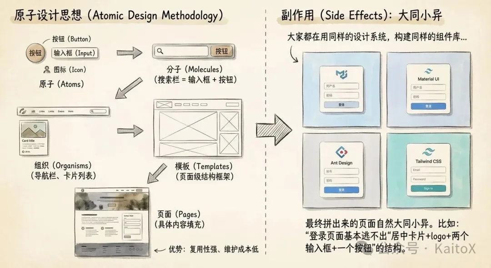
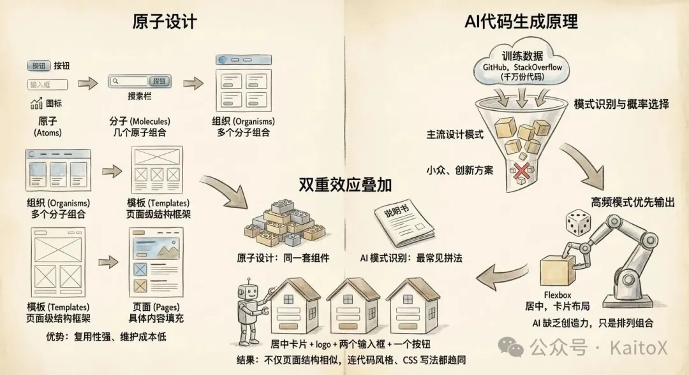
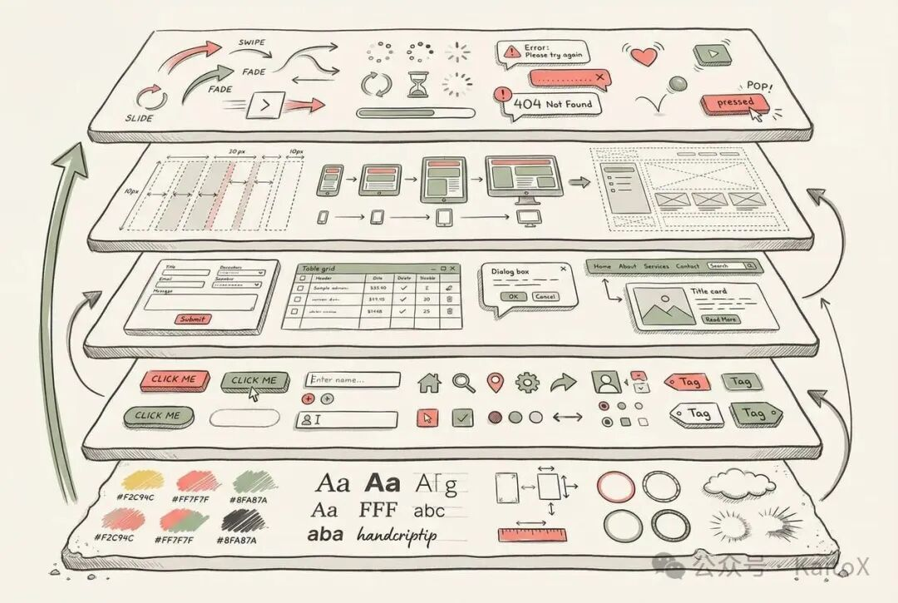
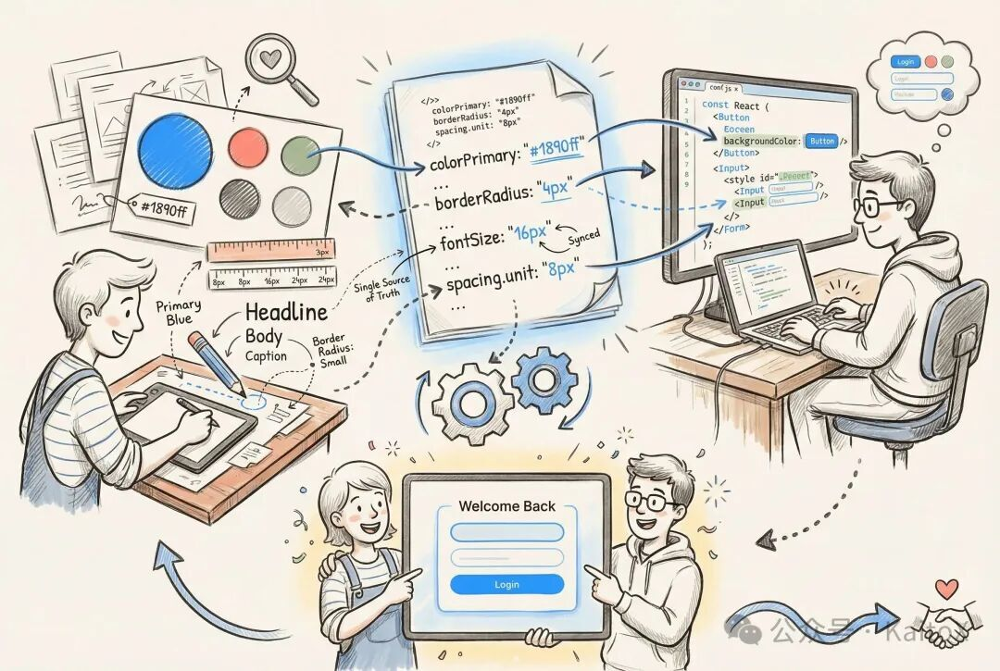
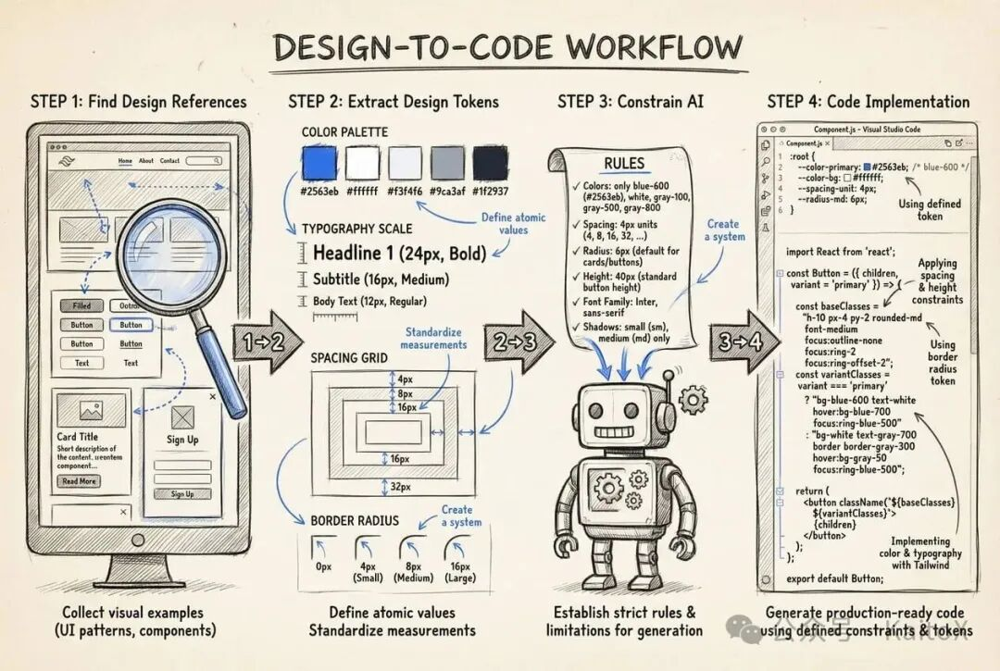

# Vibe Coding与设计（一）：如何实现有设计感的网站？

原创 KaitoX *2026年1月8日 17:30*


## 前言

欢迎来到Kaito的“ **Vibe Coding 与设计** ”系列! 这个系列专为想用 AI 做出有设计感网站的开发者准备——不仅教你 **怎么做**,更让你理解 **为什么这样做** 。

在第一篇中,我们将从底层原理出发,探讨 AI 生成页面为何千篇一律,并给出一套可操作的解决方案: **如何通过设计 Token 约束 AI,让它生成具有个人风格的网站** 。

## 为什么AI生成的页面千篇一律?

## 现象观察

如果你用过 Cursor、GitHub Copilot 或其他 AI 编码工具生成页面,可能会发现一个有趣的现象:不同人、不同场景生成的页面看起来总是那么相似——同样的布局结构、相似的组件样式、几乎一致的交互模式。

这背后并非巧合,而是两个关键因素共同作用的必然结果。

## 第一层原因:原子设计方法论



现代前端开发普遍采用"原子设计"(Atomic Design)思想,将界面拆解为五个层次:

- **原子**:最基础的元素(按钮、输入框、图标)
- **分子**:几个原子组合(搜索栏 = 输入框 + 按钮)
- **组织**:多个分子组合(导航栏、卡片列表)
- **模板**:页面级结构框架
- **页面**:具体内容填充

这套方法论的优势是 **复用性强、维护成本低**,但副作用明显:大家都在使用同样的设计系统(Material UI、Ant Design、Tailwind CSS),构建同样的组件库,最终拼装出来的页面自然大同小异。

**举个例子**:一个登录页面,无论谁设计,基本逃不出"居中卡片 + Logo + 两个输入框 + 一个按钮"的结构。

## 第二层原因:AI 的工作原理


AI 代码生成的本质是 **模式识别与概率选择**,这决定了它的输出特征:

### 1\. 训练数据决定输出范围

- AI 学习的是 GitHub、StackOverflow 等平台上的海量代码
- 这些代码中,主流设计模式占据绝对多数
- 小众、创新的方案因样本稀少,AI 难以学习或学不好

### 2\. 高频模式优先输出

- AI 会选择"出现概率最高"的代码模式
- 比如卡片布局、Flexbox 居中、响应式栅格——这些都是训练数据中的"高频词"
- 结果就是 AI 生成的代码趋向"最安全、最常见"的方案

### 3\. 缺乏真正的创造力

- AI 不理解设计意图,只是在已有模式中做排列组合
- 无法像人类设计师那样基于品牌调性、用户情感进行创新

## 双重效应叠加



当原子设计方法论遇上 AI 的工作原理,同质化问题被进一步放大:

- **设计层面**:原子设计让所有人使用同一套组件体系
- **实现层面**:AI 优先选择训练数据中最常见的实现方式
- **最终结果**:不仅页面结构相似,连代码风格、CSS 写法都趋于一致

就像用同一套乐高积木(原子设计),按照说明书上最常见的拼法(AI 模式识别)搭建房子,最终盖出来的房子自然长得很像。

## 如何打破这种困境?

理解了同质化的根源后,破局之道就变得清晰了:**如何让 AI 生成具有差异化的设计?**

答案其实很简单——当我们没有明确告诉 AI 我们的需求时,AI 就会采用默认决策。要让你的网页与众不同,就需要主动提供你的设计诉求(颜色、布局、动效等)。

但在此之前,我们需要先理解:**一个网页到底由哪些元素构成?**只有掌握了这些,才能知道应该向 AI 提供什么样的约束条件。

## 设计系统的本质:从规范到实现



从设计规范的角度看,任何网页都可以拆解为以下几个层次:

- **视觉基础**:颜色、字体、间距、圆角、阴影等设计 Token
- **基础组件**:按钮、输入框、图标、标签等原子级元素
- **复合组件**:表单、表格、对话框、导航栏等功能模块
- **布局模式**:栅格系统、响应式规则、页面框架
- **交互反馈**:动效、过渡、加载状态、错误提示

这就是设计系统(Design System)的骨架——从最底层的视觉变量,到最上层的页面模板,层层组装。接下来,让我们通过一个实际案例,看看这套体系如何落地。

## 设计系统案例: Shadcn/ui 的组装逻辑



我们以 **Shadcn/ui** 为例,看看一个现代化的设计系统是如何将 **设计规范转化为可编程的代码资产**,最终落地到业务页面的:

### 第一层:设计规范的代码化(Token 沉淀)

Shadcn/ui 通过 CSS 变量和 Tailwind 配置来沉淀设计 Token:

```
/* globals.css */ @layer base {   :root {     --background: 0 0% 100%;     --foreground: 222.2 84% 4.9%;     --primary: 222.2 47.4% 11.2%;     --primary-foreground: 210 40% 98%;     --radius: 0.5rem;     /* 更多设计变量... */   }     .dark {     --background: 222.2 84% 4.9%;     --foreground: 210 40% 98%;     --primary: 210 40% 98%;     --primary-foreground: 222.2 47.4% 11.2%;   } }
```
```
// tailwind.config.ts export default {   theme: {     extend: {       colors: {         background: "hsl(var(--background))",         foreground: "hsl(var(--foreground))",         primary: {           DEFAULT: "hsl(var(--primary))",           foreground: "hsl(var(--primary-foreground))",         },       },       borderRadius: {         lg: "var(--radius)",         md: "calc(var(--radius) - 2px)",         sm: "calc(var(--radius) - 4px)",       },     },   }, }
```

### 第二层:组件开发的工程化(Token 消费)

基于 Radix UI 和 Tailwind,Shadcn/ui 提供了 **可复制粘贴的组件代码**:

```
// components/ui/button.tsx import { Slot } from "@radix-ui/react-slot"; import { cva, type VariantProps } from "class-variance-authority";  const buttonVariants = cva(   "inline-flex items-center justify-center rounded-md text-sm font-medium",   {     variants: {       variant: {         default: "bg-primary text-primary-foreground hover:bg-primary/90",         outline: "border border-input bg-background hover:bg-accent",       },       size: {         default: "h-10 px-4 py-2",         lg: "h-11 rounded-md px-8",       },     },     defaultVariants: {       variant: "default",       size: "default",     },   } );  // 补充 ButtonProps 类型定义(原代码缺失) type ButtonProps = VariantProps<typeof buttonVariants> &   React.ButtonHTMLAttributes<HTMLButtonElement> & {     asChild?: boolean;   };  export function Button({
  variant,
  size,
  asChild = false,
  ...props
}: ButtonProps) {   const Comp = asChild ? Slot : "button";   return (     <Comp className={buttonVariants({ variant, size })} {...props} />   ); }
```

### 第三层:业务模板的组装(完整数据流)

再往上,就是把组件组合成完整的业务模块:

```
// 业务组件:登录表单 import { Button } from "@/components/ui/button"; import { Input } from "@/components/ui/input"; import { Label } from "@/components/ui/label"; import { useForm } from "react-hook-form";  // 定义表单数据类型(替代 any,提升类型安全) type LoginFormData = {   username: string;   password: string; };  export function LoginForm() {   const { register, handleSubmit } = useForm<LoginFormData>();    const onSubmit = (data: LoginFormData) => {     console.log("登录信息:", data);   };    return (     <form onSubmit={handleSubmit(onSubmit)} className="space-y-4 max-w-sm">
      <div className="space-y-2">
        <Label htmlFor="username">用户名</Label>
        <Input
          id="username"
          placeholder="请输入用户名"
          {...register("username", {
            required: "用户名不能为空",
          })}
        />
      </div>

      <div className="space-y-2">
        <Label htmlFor="password">密码</Label>
        <Input
          id="password"
          type="password"
          placeholder="请输入密码"
          {...register("password", {
            required: "密码不能为空",
          })}
        />
      </div>

      <Button type="submit" className="w-full">
        登录
      </Button>
    </form>   ); }
```

这套基于 CSS 变量和 Tailwind 的分层体系,带来了三个核心优势:

1. **可维护性**:修改设计规范时,只需调整 CSS 变量值,所有组件自动响应变化
2. **可复用性**:组件代码直接存在你的项目中,可以自由定制和扩展(如添加新的变体)
3. **可扩展性**:通过 Tailwind 的工具类和 CVA(Class Variance Authority),轻松创建新的设计变体

理解了设计系统的组装逻辑后,接下来我们就可以着手打造自己的个性化网站了。

## AI时代，如何实现有个人风格的网站?



理解了同质化的根源和设计系统的组装逻辑后,我们可以总结出一个可操作的实现路径**:寻找设计参考 → 提取设计 Token → 约束 AI 生成 → 编码落地** 。下面详细说明每一步的操作方法。

## 第一步:寻找高质量的设计参考

设计参考的质量直接决定了最终产出的水准。以下是几个推荐方向:

**1\. 设计作品集平台**

- **Dribbble**:高质量的 UI 设计作品,适合寻找创意灵感
- **Behance**:完整的设计项目案例,能看到系统化的设计思路
- **Awwwards**:获奖级别的网站设计,适合学习前沿趋势

**2\. 现代设计系统文档**

- **Vercel Design**:极简主义风格的典范
- **Linear Design**:注重细节和微交互的设计
- **GitHub Primer**:清晰的开发者友好设计

**3\. 设计稿资源**

- **Figma Community**:可直接获取完整的设计稿文件
- **UI8、Creative Market**:付费但质量极高的设计模板

**选择建议**:不要只看单个页面,要选择有完整设计系统的案例(包含多种组件状态、响应式适配、深色模式等),这样才能提取出系统化的设计规范。

## 第二步:系统化提取设计 Token

拿到设计参考后,需要像考古学家一样"挖掘"出背后的设计基因。这里提供一个结构化的提取清单:

**1\. 颜色系统**

```
主色调: - Primary: #2563eb (品牌主色) - Primary Hover: #1d4ed8 (交互态)  中性色: - Background: #ffffff / #0a0a0a (明/暗) - Foreground: #171717 / #fafafa - Border: #e5e5e5 / #262626 - Muted: #f5f5f5 / #1a1a1a  语义色: - Success: #10b981 - Warning: #f59e0b - Error: #ef4444 - Info: #3b82f6
```

**2\. 字体规范**

```
字体族: - 英文: Inter, -apple-system, sans-serif - 中文: "PingFang SC", "Microsoft YaHei" - 代码: "JetBrains Mono", monospace  字号阶梯: - xs: 12px / 0.75rem - sm: 14px / 0.875rem - base: 16px / 1rem - lg: 18px / 1.125rem - xl: 20px / 1.25rem - 2xl: 24px / 1.5rem  行高: - tight: 1.25 - normal: 1.5 - relaxed: 1.75
```

**3\. 间距系统**

```
基础单位: 4px (0.25rem)  间距阶梯: - 1: 4px - 2: 8px - 3: 12px - 4: 16px - 6: 24px - 8: 32px - 12: 48px - 16: 64px
```

**4\. 圆角与阴影**

```
圆角: - sm: 4px - md: 6px - lg: 8px - xl: 12px - 2xl: 16px - full: 9999px  阴影: - sm: 0 1px 2px rgba(0,0,0,0.05) - md: 0 4px 6px rgba(0,0,0,0.1) - lg: 0 10px 15px rgba(0,0,0,0.1) - xl: 0 20px 25px rgba(0,0,0,0.1)
```

**5\. 过渡动画**

```
动画时长: - fast: 150ms (快速反馈,如按钮悬停) - base: 200ms (标准过渡,如下拉菜单) - slow: 300ms (复杂动画,如模态框) - slower: 500ms (页面级过渡)  缓动函数: - ease-in: cubic-bezier(0.4, 0, 1, 1) - ease-out: cubic-bezier(0, 0, 0.2, 1) - ease-in-out: cubic-bezier(0.4, 0, 0.2, 1) - spring: cubic-bezier(0.34, 1.56, 0.64, 1)  常用过渡属性: - colors: transition-colors duration-200 - transform: transition-transform duration-300 - opacity: transition-opacity duration-200 - all: transition-all duration-200
```

\[别的规范…\]

**提取工具推荐**:

- **Figma Inspect 模式**:直接查看设计稿中的 CSS 属性
- **浏览器开发者工具**:分析现有网站的样式
- **AI 提取** (推荐 Google Gemini 3 Pro)

## 第三步:将 Token 融入 AI 代码生成流程

提取完设计 Token 后,关键是让 AI 理解并严格遵守这些约束。你可以创建 `.cursorrules` 文件或自定义 Claude Code 的 Skill:

```
# 设计系统约束  你是一个严格遵守设计规范的前端工程师。在生成代码时,必须使用以下设计 Token:  ## 颜色系统 - 主色调: bg-blue-600 hover:bg-blue-700 - 中性色: bg-white text-gray-900 border-gray-200 - 语义色: 成功(green-500) 警告(amber-500) 错误(red-500)  ## 间距规范 - 组件内边距: p-4 (16px) - 组件间距: space-y-4 gap-4 - 页面边距: px-6 py-8  ## 圆角规范 - 按钮/输入框: rounded-md (6px) - 卡片: rounded-lg (8px) - 头像: rounded-full  ## 字体规范 - 标题: font-semibold text-xl - 正文: font-normal text-base - 辅助文字: text-sm text-gray-600  ## 组件规范 - 按钮高度: h-10 (40px) - 输入框高度: h-10 - 最大内容宽度: max-w-7xl mx-auto  ## 禁止事项 - 不要使用 blue-500 以外的蓝色 - 不要使用 8px 以外的圆角(除非是 rounded-full) - 不要使用内联样式 - 不要使用任意值(如 w-[123px])
```

**实际案例:生成一个按钮组件**

❌ **没有约束的提示词**:

```
帮我生成一个按钮组件
```

AI 可能生成:

```
<button classname="bg-blue-500 text-white px-3 py-2 rounded">   点击我 </button>
```

✅ **有约束的提示词**:

```
基于设计系统生成按钮: - 主色调: bg-blue-600 hover:bg-blue-700 - 高度: h-10 - 内边距: px-4 - 圆角: rounded-md - 字体: font-medium text-sm
```

AI 会生成:

```
<button classname="h-10 px-4 bg-blue-600 hover:bg-blue-700 text-white font-medium text-sm rounded-md transition-colors">   点击我 </button>
```

## 第四步:编码实现的最佳实践

提取了 Token 并约束了 AI 后,最后一步是将设计系统落地到代码中。

**推荐技术栈**:

```
框架: Next.js 16+ (App Router) 样式: Tailwind CSS 3.4+ 组件: Radix UI / Headless UI 类型: TypeScript 动效: Framer Motion
```

**代码组织结构**:

```
src/ ├── styles/ │   └── globals.css          # 设计 Token 定义 ├── lib/ │   └── design-tokens.ts     # Token 的 TS 类型定义 ├── components/ │   ├── ui/                  # 基础组件(Button, Input...) │   ├── layouts/             # 布局组件 │   └── features/            # 业务组件 └── app/                     # 页面路由
```

**核心实现:在 globals.css 中定义 Token**

```
@tailwind base; @tailwind components; @tailwind utilities;  @layer base {   :root {     /* 颜色系统 */     --color-primary: 217 91% 60%;     --color-background: 0 0% 100%;     --color-foreground: 0 0% 9%;     --color-border: 0 0% 90%;          /* 间距系统 */     --spacing-unit: 0.25rem; /* 4px */          /* 圆角系统 */     --radius-sm: 0.25rem;     --radius-md: 0.375rem;     --radius-lg: 0.5rem;          /* 字体系统 */     --font-sans: 'Inter', -apple-system, sans-serif;     --font-mono: 'JetBrains Mono', monospace;   }      .dark {     --color-background: 0 0% 9%;     --color-foreground: 0 0% 98%;     --color-border: 0 0% 20%;   } }
```

**在 tailwind.config.ts 中消费 Token**

```
import type { Config } from 'tailwindcss'  const config: Config = {   content: ['./src/**/*.{js,ts,jsx,tsx,mdx}'],   theme: {     extend: {       colors: {         primary: 'hsl(var(--color-primary))',         background: 'hsl(var(--color-background))',         foreground: 'hsl(var(--color-foreground))',         border: 'hsl(var(--color-border))',       },       borderRadius: {         sm: 'var(--radius-sm)',         md: 'var(--radius-md)',         lg: 'var(--radius-lg)',       },       fontFamily: {         sans: ['var(--font-sans)'],         mono: ['var(--font-mono)'],       },     },   },   plugins: [], }  export default config
```

**创建基础组件示例**

```
// components/ui/button.tsx import { cva, type VariantProps } from 'class-variance-authority' import { ButtonHTMLAttributes, forwardRef } from 'react'  const buttonVariants = cva(   // 基础样式(来自设计 Token)   'inline-flex items-center justify-center font-medium transition-colors',   {     variants: {       variant: {         primary: 'bg-primary text-white hover:bg-primary/90',         outline: 'border border-border bg-background hover:bg-foreground/5',       },       size: {         default: 'h-10 px-4 text-sm rounded-md',         lg: 'h-12 px-6 text-base rounded-lg',       },     },     defaultVariants: {       variant: 'primary',       size: 'default',     },   } )  type ButtonProps = ButtonHTMLAttributes<HTMLButtonElement> &   VariantProps<typeof buttonVariants> & {     asChild?: boolean   }  export const Button = forwardRef<HTMLButtonElement, ButtonProps>(   ({ className, variant, size, ...props }, ref) => {     return (       <button
        ref={ref}
        className={buttonVariants({ variant, size, className })}
        {...props}
      />     )   } )  Button.displayName = 'Button'
```

**关键优势**:

1. **中心化管理**:所有设计决策集中在 CSS 变量中,修改一处即可全局生效
2. **类型安全**:通过 CVA 和 TypeScript 确保组件使用的一致性
3. **AI 友好**:清晰的 Token 定义让 AI 更容易理解和遵守约束
4. **主题切换**:通过切换 CSS 类(如 `.dark`)即可实现深色模式

通过这四步,你就能让 AI 生成的页面摆脱"千篇一律"的困境,拥有独特的设计风格。核心思路是:**不要让 AI 做设计决策,而是让 AI 在你定义的设计语言中编码实现** 。

## 结语

AI 生成网页千篇一律的根源在于:**原子设计的标准化** 与 **AI 的高频模式选择** 。我们要实现有设计感的网站，并不意味着我们要放弃 AI,而是学会驾驭它——通过系统化提取设计 Token 并约束 AI 生成,让它成为你设计语言的执行者。

这套方法论的价值不止于做出好看的网站,更在于培养 **设计工程化思维** 。记住,设计系统是迭代出来的,不必追求一开始就完美。从核心的颜色、字体、间距入手,在实践中逐步完善。

掌握了这些基础，我们已经就可以实现一个具有设计感的网站了。下一期,我会从零开始, 带你使用AI工具构建一个具备设计感的网站。敬请期待!

（喜欢的同学可以点个关注，后续我会带来更多的AI理论和实践分享）

Vibe Coding与设计 · 目录
