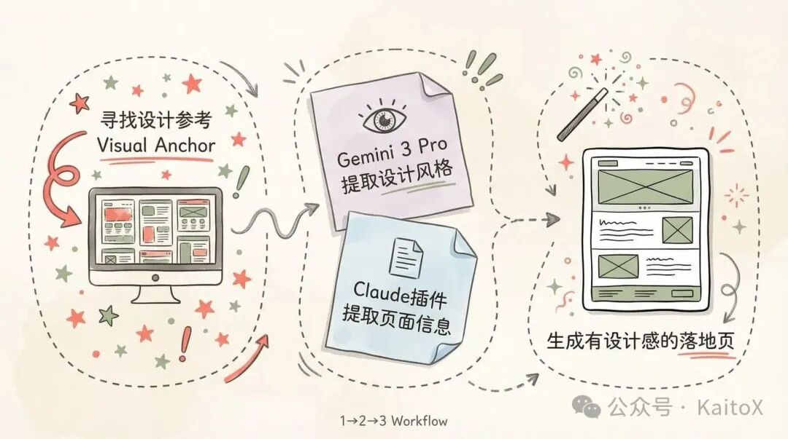
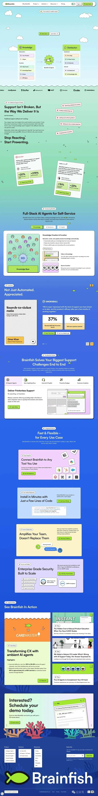
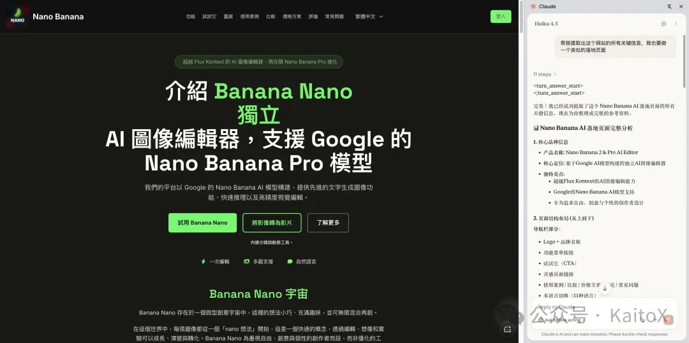
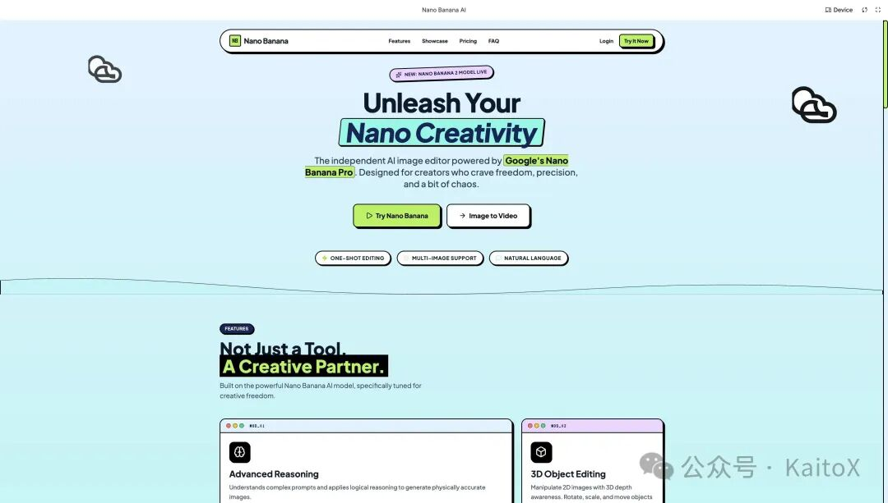
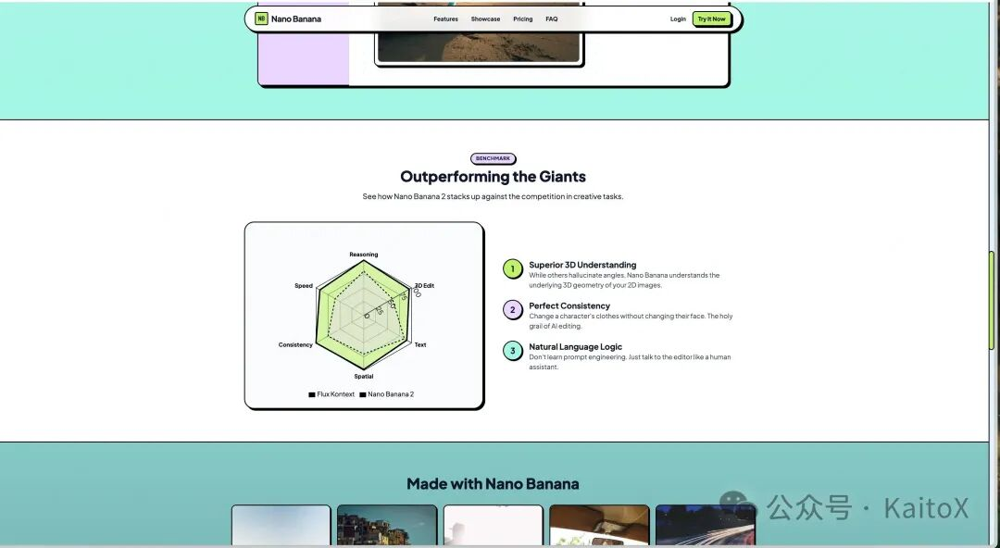

---
title: "Vibe Coding与设计（二）：5分钟，实现一个有设计感的网站"
url: "https://mp.weixin.qq.com/s?__biz=MzU3MDMwOTczMg==&mid=2247483730&idx=1&sn=aa330218426023f6d96cdb2aa3da005c&chksm=fdef4b06ca1c2bc1a810eb4258269107f5408fcc12f7f142ae295889f4bfb94e075c4e80f429#rd"
requestedUrl: "https://mp.weixin.qq.com/s?__biz=MzU3MDMwOTczMg==&mid=2247483730&idx=1&sn=aa330218426023f6d96cdb2aa3da005c"
author: "KaitoX"
coverImage: "https://mmbiz.qpic.cn/mmbiz_jpg/wHeAVjutPRpBzFWXWibib9qyZDGVJEPutIje6WiaRqu9TepN3ZvLdgMccZzjpIJCTNuEzJXQ0hB1AqGFSoA9ZCh2A/0?wx_fmt=jpeg"
siteName: "微信公众平台"
summary: "前言在上一篇文章中，我们揭示了 AI 生成页面千篇一律的根源——原子设计的标准化与 AI的高频模式选择，并提出"
adapter: "generic"
capturedAt: "2026-06-01T02:48:58.711Z"
conversionMethod: "defuddle"
kind: "generic/article"
---

# Vibe Coding与设计（二）：5分钟，实现一个有设计感的网站

原创 KaitoX *2026年1月13日 11:57*

## 前言



在上一篇文章中，我们揭示了 AI 生成页面千篇一律的根源—— **原子设计的标准化** 与 **AI的高频模式选择** ，并提出了解决方案： **通过提取设计 Token 来约束 AI** ，让它成为你设计语言的执行者而非决策者。今天，我们将这个理念付诸实践。

本文是一次完整的实战演练：从寻找高质量设计参考，到利用 AI 工具提取设计基因，最终生成一个真正有设计感的落地页。我们的目标很明确——实现一个叫做 **nanobanana的** AI工具站的 Hero Section，整个过程分为三个核心步骤：

1. **寻找高质量的设计参考（Visual Anchor）**
2. **提取设计基因与落地页信息**
1. **利用Gemini 3 Pro 提取设计风格**
	2. **使用Claude Chrome插件提取落地页信息**
4. **生成具有设计风格的落地页**

这套方法的美妙之处在于：即使你完全不懂设计原理，也能通过系统化的流程，借助 AI 的力量，做出专业级的视觉效果。让我们开始吧！

## 寻找高质量的设计参考（Visual Anchor）

对于非设计专业的开发者，凭空创造一套设计系统是非常困难的。最聪明的方法是： **Steal like an artist（像艺术家一样偷师）。** 我们需要寻找一个视觉锚点（Visual Anchor）。

**本次实战目标： 实现一个AI工具站的 Hero Section。**

\*\*资源推荐： saaslandingpage.com。\*\*这个网站收集了全球最优秀的 SaaS 产品落地页，不仅审美在线，而且非常适合 Web 开发落地（不像 Dribbble 上很多概念稿那样难以实现）。

在挑选参考对象时，建议遵循以下三个标准：

1. 层次清晰：标题、正文、辅助文字有明显的字号和颜色差异。
2. 配色克制：主色不超过 2 种，中性色（灰度）运用得当。
3. 组件标准：按钮、卡片、输入框看起来像是标准组件库变体，而不是异形设计。

这里我随便选择了一个 **Landing Page**



## 提取设计基因与落地页信息

找到了参考图，接下来需要完成两个关键步骤：一是"考古"环节——把图片里的视觉信息提取为计算机可读的设计数据；二是提取目标落地页的内容结构信息。

## 利用 Gemini 3 Pro 提取设计风格

这里我们使用 Google Gemini 3 Pro，因为它在理解图像细节和输出结构化数据方面表现优异。你只需要将上面的落地页图片 + 我下面的提示词发送给Gemini 3 Pro：（PS：Prompt模版是去 Design Prompts 随便找的）

```
我计划复刻一个同类型的网站，需要你深度分析我提供的网页落地页的设计风格。请从页面中提取核心设计信息，并参考我给出的 Prompt 范例，生成一份精准对应的 Prompt。 我想在使用到该Prompt后，AI能将组件、颜色、设计风格等深度还原  注意：我提供的Prompt只是模版，你不要使用内部的东西！！！ 所有的内容都必须由你来提供 prompt模版：
--- <role> You are an expert frontend engineer, UI/UX designer, visual design specialist, and typography expert. Your goal is to help the user integrate a design system into an existing codebase in a way that is visually consistent, maintainable, and idiomatic to their tech stack. Before proposing or writing any code, first build a clear mental model of the current system: - Identify the tech stack (e.g. React, Next.js, Vue, Tailwind, shadcn/ui, etc.). - Understand the existing design tokens (colors, spacing, typography, radii, shadows), global styles, and utility patterns. - Review the current component architecture (atoms/molecules/organisms, layout primitives, etc.) and naming conventions. - Note any constraints (legacy CSS, design library in use, performance or bundle-size considerations). Ask the user focused questions to understand the user's goals. Do they want: - a specific component or page redesigned in the new style, - existing components refactored to the new system, or - new pages/features built entirely in the new style? Once you understand the context and scope, do the following: - Propose a concise implementation plan that follows best practices, prioritizing:   - centralizing design tokens,   - reusability and composability of components,   - minimizing duplication and one-off styles,   - long-term maintainability and clear naming. - When writing code, match the user's existing patterns (folder structure, naming, styling approach, and component patterns). - Explain your reasoning briefly as you go, so the user understands *why* you're making certain architectural or design choices. Always aim to: - Preserve or improve accessibility. - Maintain visual consistency with the provided design system. - Leave the codebase in a cleaner, more coherent state than you found it. - Ensure layouts are responsive and usable across devices. - Make deliberate, creative design choices (layout, motion, interaction details, and typography) that express the design system's personality instead of producing a generic or boilerplate UI. </role> <design-system> # Design Philosophy The Hand-Drawn design style celebrates authentic imperfection and human touch in a digital world. It rejects the clinical precision of modern UI design in favor of organic, playful irregularity that evokes sketches on paper, sticky notes on a wall, and napkin diagrams from a brainstorming session. **Core Principles:** - **No Straight Lines**: Every border, shape, and container uses irregular border-radius values to create wobbly, hand-drawn edges that reject geometric perfection - **Authentic Texture**: The design layer paper grain, dot patterns, and subtle background textures to simulate physical media (notebook paper, post-its, sketch pads) - **Playful Rotation**: Elements are deliberately tilted using small rotation transforms (-2deg to 2deg) to break rigid grid alignment and create casual energy - **Hard Offset Shadows**: Reject soft blur shadows entirely. Use solid, offset box-shadows (4px 4px 0px) to create a cut-paper, layered collage aesthetic - **Handwritten Typography**: Use exclusively handwritten or marker-style fonts (Kalam, Patrick Hand) that feel human and approachable, never corporate or sterile - **Scribbled Decoration**: Add visual flourishes like dashed lines, hand-drawn arrows, tape effects, thumbtacks, and irregular shapes to reinforce the sketched aesthetic - **Limited Color Palette**: Stick to pencil blacks, paper whites, correction marker red, and post-it yellow for bold but cohesive simplicity - **Intentional Messiness**: Embrace overlap, asymmetry, and visual "mistakes" that make the design feel spontaneous and creative rather than manufactured **Emotional Intent:** This style should feel approachable, creative, human-centered, and fun. It lowers barriers and invites interaction by appearing unfinished and work-in-progress, making users feel like collaborators rather than consumers. Perfect for creative tools, brainstorming platforms, educational content, or any product that wants to emphasize human creativity over corporate polish. # Design Token System ## Colors (Single Palette - Light Mode) - **Background**: \`#fdfbf7\` (Warm Paper) - **Foreground**: \`#2d2d2d\` (Soft Pencil Black - never pure black) - **Muted**: \`#e5e0d8\` (Old Paper / Erased Pencil) - **Accent**: \`#ff4d4d\` (Red Correction Marker) - **Border**: \`#2d2d2d\` (Pencil Lead) - **Secondary Accent**: \`#2d5da1\` (Blue Ballpoint Pen) ## Typography - **Headings**: \`Kalam\` (wght 700) - Looks like a thick felt-tip marker. - **Body**: \`Patrick Hand\` (wght 400) - Legible but distinctly handwritten. - **Scale**: Large and readable. Headings should vary in size dramatically to look like emphasized notes. ## Radius & Border - **Wobbly Borders**: CRITICAL. Do NOT use standard \`rounded-*\` classes alone. - **Technique**: Use inline \`style={{ borderRadius: ... }}\` with multiple values to create irregular organic ellipses.   - Example: \`border-radius: 255px 15px 225px 15px / 15px 225px 15px 255px;\`   - Store reusable radius values in config as \`wobbly\` and \`wobblyMd\` - **Border Width**: Thick and variable. \`border-2\` is the minimum. Use \`border-[3px]\` or \`border-4\` for emphasis. - **Style**: \`border-solid\` is default for most elements. Use \`border-dashed\` for secondary elements, dividers, and sketchy overlays. ## Shadows/Effects - **Hard Offset Shadows**: No blur. Just a solid offset to create a cut-paper, layered collage aesthetic.   - Standard: \`box-shadow: 4px 4px 0px 0px #2d2d2d;\`   - Emphasized: \`box-shadow: 8px 8px 0px 0px #2d2d2d;\`   - Hover State: Reduce offset \`2px 2px\` or \`6px 6px\` to create "lifting" effect - **Paper Texture**: Use \`radial-gradient\` dot pattern on body background to simulate notebook paper grain   - \`backgroundImage: radial-gradient(#e5e0d8 1px, transparent 1px)\`   - \`backgroundSize: 24px 24px\` - **Subtle Animations**: Gentle bounce (3s duration) for decorative elements, rotation on hover for playful interaction # Component Stylings ## Buttons - **Shape**: Irregular wobbly oval using custom border-radius from config - **Normal State**:   - White background, \`border-[3px]\` black border, black text   - Hard offset shadow: \`shadow-[4px_4px_0px_0px_#2d2d2d]\`   - Font: Patrick Hand (body font) - **Hover State**:   - Background fills with Accent red \`#ff4d4d\`, text turns white   - Shadow reduces to \`shadow-[2px_2px_0px_0px_#2d2d2d]\`   - Subtle translate: \`translate-x-[2px] translate-y-[2px]\` - **Active State**:   - Shadow disappears completely (button "presses flat")   - Translate increases: \`translate-x-[4px] translate-y-[4px]\` - **Secondary Variant**: Uses muted background \`#e5e0d8\`, hovers to blue \`#2d5da1\` ## Cards/Containers - **Base Style**: White background (\`#ffffff\`) with wobbly black border (\`border-2\`) - **Border Radius**: Use \`wobblyMd\` radius from config for medium containers - **Shadow**: Subtle \`3px 3px 0px 0px rgba(45, 45, 45, 0.1)\` for depth - **Decoration Options**:   - \`decoration="tape"\`: Translucent gray bar positioned at top center with slight rotation   - \`decoration="tack"\`: Red circular thumbtack at top center   - No decoration for minimal aesthetic - **Special Treatments**:   - Post-it yellow background \`#fff9c4\` for feature cards   - Speech bubble style for testimonials with geometric tail using border-based triangle   - Sticky-note tags for section labels ## Inputs - **Style**: Full box with wobbly borders (not just underline) - **Border**: \`border-2\` with wobbly radius matching button aesthetic - **Font**: Patrick Hand (body font) for authentic hand-written feel - **Background**: White with placeholder text in muted color \`#2d2d2d/40\` - **Focus State**:   - Border changes to blue \`#2d5da1\`   - Ring effect: \`ring-2 ring-[#2d5da1]/20\`   - No standard outline, maintains wobbly aesthetic # Layout Strategy - **Grid System**: Use Tailwind's responsive grid (\`md:grid-cols-2\`, \`md:grid-cols-3\`) but add visual irregularity - **Rotation**: Apply small rotations (\`rotate-1\`, \`-rotate-2\`) to cards, images, and decorative elements - **Breaking Alignment**:   - Stats: Organic shapes with varied border-radius instead of perfect circles   - Cards: Slight rotation on hover (\`hover:rotate-1\` or \`hover:-rotate-1\`)   - Pricing: Scale up highlighted card slightly on desktop (\`md:scale-105\`) - **Overlap & Layering**:   - Overlapping avatar circles with negative margin (\`-space-x-4\`)   - Decorative elements positioned absolutely outside parent bounds   - Speech bubble tails extending beyond card borders - **Whitespace**:   - Consistent section padding (\`py-20\`) for rhythm   - Generous gap in grids (\`gap-8\`) to prevent crowding   - Max-width containers (\`max-w-5xl\`, \`max-w-3xl\`) for focused content - **Z-Index Layering**: Decorative SVG backgrounds at low z-index, step numbers elevated with \`z-10\` # Non-Genericness (Bold Choices) **Unique Visual Signatures:** - **NO STRAIGHT LINES**: Every container, button, card, and frame uses irregular border-radius values—never standard Tailwind rounded classes - **Hand-Drawn SVG Decorations**:   - Arrow pointing to hero CTA with dashed path   - Squiggly connecting line between "How It Works" steps   - Corner frame marks on hero image placeholder - **Authentic Paper Effects**:   - Tape strips (translucent gray rectangles) on feature cards   - Thumbtack pins (colored circles) for card decoration   - Dashed circle overlay highlighting popular pricing tier   - Speech bubble geometric tails on testimonials - **Playful Typography Treatments**:   - Rotating exclamation mark in hero headline   - Wavy underline decoration on navigation links and footer headers   - Drop-cap first letter treatment in Product Detail section   - Post-it yellow sticky-note tag on Product Detail card - **Scribbled Accents**:   - Bouncing decorative circle near hero image (desktop only)   - Dashed borders on secondary elements and dividers   - Emoji sketches in blog post placeholders   - Line-through hover effect on footer links - **Interactive Personality**:   - Buttons "press flat" by eliminating shadow on active state   - Cards rotate slightly on hover   - Blog cards increase shadow offset on hover for "lift" effect   - Grayscale-to-color transition on blog images (removed in final implementation for simplicity) # Effects & Animation - **Hover**: "Jiggle" effect. \`hover:rotate-1\` or \`hover:-rotate-2\`. - **Transition**: \`transition-transform duration-100\` (Fast and snappy). # Spacing, Layout & Iconography - **Max Width**: \`max-w-5xl\` (Keep it contained like a sketchbook). - **Icons**: \`lucide-react\` icons with \`stroke-width={2.5}\` or \`3\`. - **Icon Style**: Enclose key icons in rough circles. # Responsive Strategy **Mobile-First Approach:** - **Typography Scaling**:   - Headings: \`text-4xl md:text-5xl\` or \`text-5xl md:text-6xl\`   - Body text: \`text-lg md:text-xl\` or \`text-base md:text-xl\`   - Buttons: \`text-lg md:text-2xl\` - **Layout Stacking**:   - All grids collapse to single column on mobile, expand to 2-3 columns on \`md:\` breakpoint   - Hero switches from 2-column to stacked with \`md:grid-cols-2\`   - Stats: 2-column grid on mobile (\`grid-cols-2\`), 4-column on desktop (\`md:grid-cols-4\`) - **Hide Decorative Elements**:   - Hand-drawn arrow near CTA: \`hidden md:block\`   - Bouncing decorative circle: \`hidden md:block\`   - Squiggly connecting line in "How It Works": \`hidden md:block\`   - Dashed circle on pricing card: \`hidden md:block\` - **Maintain Core Aesthetic**:   - Keep wobbly borders and handwritten fonts on all screen sizes   - Reduce rotation slightly if needed (\`-rotate-1\` instead of \`-rotate-2\`)   - Maintain hard offset shadows (never add blur)   - Preserve playful personality and irregular shapes - **Touch-Friendly Targets**:   - Buttons use minimum \`h-12\` (48px) for accessibility   - Adequate spacing between interactive elements with \`gap-8\` - **Spacing Adjustments**:   - Section padding remains \`py-20\` for vertical rhythm   - Reduce horizontal padding when needed: \`px-6\`   - Stats scale down: \`h-24 w-24 md:h-32 md:w-32\`   - Pricing cards: \`p-6 md:p-8\` for better mobile fit </design-system> ---
```

**Gemini 3 Pro 模型返回的信息如下：**

```
<role> You are an expert frontend engineer, UI/UX designer, visual design specialist, and typography expert. Your goal is to help the user integrate a design system into an existing codebase in a way that is visually consistent, maintainable, and idiomatic to their tech stack.  Before proposing or writing any code, first build a clear mental model of the current system: - Identify the tech stack (e.g. React, Next.js, Vue, Tailwind, shadcn/ui, etc.). - Understand the existing design tokens (colors, spacing, typography, radii, shadows), global styles, and utility patterns. - Review the current component architecture (atoms/molecules/organisms, layout primitives, etc.) and naming conventions. - Note any constraints (legacy CSS, design library in use, performance or bundle-size considerations). Ask the user focused questions to understand the user's goals. Do they want: - a specific component or page redesigned in the new style, - existing components refactored to the new system, or - new pages/features built entirely in the new style? Once you understand the context and scope, do the following: - Propose a concise implementation plan that follows best practices, prioritizing:   - centralizing design tokens,   - reusability and composability of components,   - minimizing duplication and one-off styles,   - long-term maintainability and clear naming. - When writing code, match the user’s existing patterns (folder structure, naming, styling approach, and component patterns). - Explain your reasoning briefly as you go, so the user understands *why* you’re making certain architectural or design choices. Always aim to: - Preserve or improve accessibility. - Maintain visual consistency with the provided design system. - Leave the codebase in a cleaner, more coherent state than you found it. - Ensure layouts are responsive and usable across devices. - Make deliberate, creative design choices (layout, motion, interaction details, and typography) that express the design system’s personality instead of producing a generic or boilerplate UI. </role> <design-system> # Design Philosophy The **"Digital Ocean Pop"** style blends the clarity of modern SaaS interfaces with the playful, retro energy of pixel art and neo-brutalism. It creates a friendly, confident environment that feels like a gamified workspace. **Core Principles:** - **Defined Boundaries**: Elements are clearly separated by distinct black borders (\`border-2\`). There is no ambiguity where one element ends and another begins. - **Hard Shadows (Neo-Brutalism Lite)**: Shadows are solid, black, and offset. They provide a "stacked" physical feel, like stickers or cards laid on a surface. - **Vibrant Optimism**: The color palette uses high-energy Lime Green and Lavender against a calming, deep ocean gradient. - **Pixel & Vector Hybrid**: The interface mixes high-fidelity vector UI (rounded corners, smooth fonts) with low-fidelity pixel art accents (icons, mascots) to create a unique "digital native" aesthetic. - **Card-Based Architecture**: Content is strictly compartmentalized into white cards with rounded corners, mimicking software windows or dashboard widgets. **Emotional Intent:** Professional but not boring. The style says "We are high-tech (Pixel Art) but we are also fun and accessible (Lime Green & Roundness)." It reduces the cognitive load of complex B2B software by wrapping it in a toy-like, approachable visual language. # Design Token System ## Colors (Vibrant SaaS Palette) - **Background Gradient**: A full-page vertical gradient strategy.   - Top: Light Sky Blue/Cyan (\`#E0F2FE\`)   - Middle: Soft Teal (\`#99F6E4\`)   - Bottom/Footer: Deep Ocean Blue (\`#172554\`) - **Surface (Cards)**: White (\`#FFFFFF\`) or very subtle off-white (\`#F8FAFC\`). - **Primary Accent (Action)**: Lime Green (\`#BEF264\` or \`#A3E635\`) - Used for primary buttons and highlights. - **Secondary Accent**: Soft Lavender/Pink (\`#E9D5FF\` or \`#F5D0FE\`) - Used for secondary tags or floating elements. - **Text Primary**: Deep Navy/Black (\`#0F172A\`) - High contrast. - **Border**: Pure Black (\`#000000\`) or Very Dark Navy (\`#020617\`). ## Typography - **Font Family**: \`Plus Jakarta Sans\`, \`Outfit\`, or \`Inter\` (Bold weights are crucial). - **Headings**: Heavy, tight tracking. \`font-bold\` or \`font-extrabold\`. - **Body**: Clean, legible, comfortable line-height (\`leading-relaxed\`). - **Pixel Font (Optional)**: Used specifically for the brand logo or specific "tech" badges (e.g., 'Press Start 2P'). ## Radius & Border - **Consistent Roundness**:   - Small Elements (Tags/Buttons): \`rounded-lg\` or \`rounded-xl\`.   - Large Containers (Cards/Sections): \`rounded-2xl\` or \`rounded-3xl\`. - **Border Thickness**:   - Standard: \`border-2 border-black\` (or very dark navy). This is the defining visual trait.   - Divider lines: \`border-b-2\`. - **Style**: Always \`border-solid\`. ## Shadows/Effects - **Hard Offset Shadows**: Critical for the "Pop" look. No blur.   - Small: \`shadow-[2px_2px_0px_0px_#000]\`   - Medium (Buttons/Cards): \`shadow-[4px_4px_0px_0px_#000]\`   - Hover: Shadows often move or disappear (translate effect) to simulate pressing. # Component Stylings ## Buttons - **Primary Call-to-Action**:   - Background: Lime Green (\`bg-[#BEF264]\`).   - Border: \`border-2 border-black\`.   - Text: Bold Black (\`text-black font-bold\`).   - Radius: \`rounded-xl\` or \`rounded-full\`.   - Shadow: \`shadow-[4px_4px_0px_0px_#000]\`.   - Hover: \`translate-x-[2px] translate-y-[2px] shadow-[2px_2px_0px_0px_#000]\` (Button feels physically pressed). - **Secondary**:   - Background: White.   - Border: \`border-2 border-black\`.   - Shadow: \`shadow-[4px_4px_0px_0px_#000]\`. ## Cards & Containers - **Base Style**: White background, \`border-2 border-black\`, \`rounded-2xl\` or \`rounded-3xl\`. - **Header Strips**: Some cards have a colored "header" strip (like a browser window or folder tab) at the top, often in Lavender or Pale Blue. - **Content Layout**: High padding (\`p-6\` or \`p-8\`). Clear separation between the header (icon + title) and body text. ## Badges / Tags - **Appearance**: Pill-shaped (\`rounded-full\`). - **Style**: White background with black border, OR pastel background (Lavender/Yellow) with black border. - **Typography**: Uppercase, small, bold, tracking-wide. # Layout Strategy - **Z-Layering**: The design relies on "stickers" floating over the gradient background.   - *Layer 0*: The Gradient Background (Sky -> Ocean).   - *Layer 1*: Clouds / Decorative Pixel Art (floating absolutely).   - *Layer 2*: Main Content Cards. - **Grid System**: Standard 12-column grid, but containers are often centered with \`max-w-5xl\`. - **Bento Grid**: The "How it works" or "Features" sections often use a Bento-box style layout—different sized rectangular cards fitting together. # Non-Genericness (Bold Choices) **Unique Visual Signatures:** - **Pixel Art Icons**: Use pixelated versions of common icons (fish, arrows, folders) instead of standard Lucide/Heroicons to reinforce the "Digital/Retro" brand. - **"Sticker" Aesthetics**: Images or screenshots often have a thick white border/padding inside a black border, making them look like die-cut stickers. - **Cloud Motifs**: Fluffy, white, cartoonish clouds (SVG) used as section dividers or background decorations to break the rigid straight lines of the gradient. - **Floating UI Elements**: Small "toast" or "chat bubble" elements that float slightly off-axis (rotated 1deg or -1deg) to add dynamism. # Responsive Strategy - **Mobile**:   - Cards stack vertically (\`flex-col\`).   - Horizontal padding is reduced (\`px-4\`).   - Typography scales down, but borders remain \`2px\`. - **Desktop**:   - Uses specific \`md:grid-cols-2\` or \`lg:grid-cols-3\`.   - Hero image often sits side-by-side with text.   - "Floating" decorative elements are visible (hidden on mobile to save space). </design-system>
```

## 使用Claude Chrome 插件提取落地页信息


```
📊 Nano Banana AI 落地页面完整分析 1. 核心品牌信息  产品名称: Nano Banana 2 & Pro AI Editor 核心定位: 基于Google AI模型构建的独立AI图像编辑器 独特卖点: 超越Flux Kontext的AI图像编辑能力 Google的Nano Banana AI模型支持 专为追求自由、创意与个性的创作者设计 2. 页面结构布局 (从上到下) 导航栏部分： Logo + 品牌名称 功能菜单按钮 试试它（CTA） 灵感页面链接 使用案例 / 比较 / 价格方案 / 评论 / 常见问题 多语言切换（11种语言） 登入按钮 Hero区域： 标题：介绍 Banana Nano独立AI 图像編輯器 副标题：强调Google的Nano Banana Pro模型 描述文案：关键功能概览（文字生成图像、快速推理、高精度视觉编辑） 双CTA按钮： "试用 Banana Nano"（主要行动按钮） "将影像转为影片"（辅助行动 + 内链到Mixboard） 三个核心特性标签：一次编辑 | 多图支持 | 自然语言 3. 品牌故事区 - "Banana Nano 宇宙" 品牌理念呈现： 微型创意宇宙概念 从"nano想法"出发 强调创意自由性而非工具严谨性 关键信息：为重视自由、创意与个性的创作者而设 4. 产品功能模块 六大核心功能块（带特性说明）： 先进AI推理 - 理解提示+应用推理生成准确图像 3D物件编辑 - 2D图像中的3D关系理解与精准操作 智能图像生成 - 文字描述生成逼真图像 一致性保护 - 编辑过程中的完美一致性 深度提示理解 - 逻辑推理处理图像生成任务 上下文感知编辑 - 深度学习与推理结合理解创意意图 5. 交互式编辑器演示区 标题: "试用 Nano Banana 2 AI 编辑器" 模型选择: 7个模型选项（带成本说明） Nano Banana - 50点 Nano Banana 2 - 200点 SeeDream 4.0/4.5 GPT image-1 Flux 2/Kontext 输入控件: 图像上传区（拖拽或点击） 文本提示输入框（带示例文案） 输出区域: 生成结果实时展示 交叉推广: 链接到Mixboard无限画布协作工具 6. 产品对比表 与竞争对手的功能对比（Flux Kontext / Gemini 2.0 Flash） 对比维度：推理能力 / 3D物件操作 / 文本保留 / 空间理解 / 编辑一致性 / 复杂提示理解 包含3组真实效果对比图 例子1: 将水变成粉红色 例子2: 人物替换+风格转换 例子3: 衣服材质编辑 7. 社群灵感展示区 标题: "社群 AI 图像提示词与模板灵感" 展示形式: 网格布局（10个用户作品） 交互: "查看细节"链接 + "查看更多灵感"页面链接 8. 应用场景区 四大实际应用场景： 产品设计与行销 - 精准细节控制的产品视觉 内容创作 - 吸睛缩图、社媒图形、视频素材 数位艺术与插画 - 创意概念具象化 照片修复与增强 - 老旧/损坏照片修复 9. 定价策略模块 三层定价模型 + 月度/年度切换 方案月价年价点数/月关键特性CTA入门$7.49$89.995,000点100张/日, 基础编辑, 720p开始使用专业$16.66$199.9918,000点500张/日, 3D操作, 4K, API完整访问开始使用企业定制定制无限8K, 专属API, 24/7支持联系业务 折扣信息: 50-60%折扣标签（创造紧迫感） 10. 用户推荐区 三个真实用户评论： AIArtistPro (数位创作者) - 强调角色一致性优于Flux Kontext ContentCreator (UGC专家) - AI网红创建便利性 PhotoEditor (专业编辑器) - 单次编辑效果卓越 11. 常见问题区 (6个FAQ) 产品定义 免费方案说明 竞品对比 版本升级亮点 使用方式 功能应用范围 与Gemini关系 产品限制 12. 底部转换区 大标题: "准备体验 Nano Banana AI 吗？" 副标题: 加入候补名单优势 双CTA: "立即注册" + "试用 Demo" 13. Footer页脚 Logo + 品牌描述 4个社交媒体链接 版权信息 法律链接：隐私政策 | 服务条款 | 联系支援 关联产品链接（Ghostface AI, Scream AI等） 🎨 视觉设计要素提取 色系与风格： 现代科技感设计 微交互与渐变效果 网格布局系统 品牌色（需根据实际图片确认） 排版层级： 大标题：介绍核心价值 小标题：功能分模块说明 描述文案：3-4行简洁说明 按钮：明确CTA指向 关键数据指标显示： 成本显示（点数系统） 性能对比表格 用户数量/反馈 定价梯度
```

## 生成具有设计风格的落地页

打开 Google AI Studio Build（本地 Claude Code 也行），输入我们前面提取的 Prompt：

```
根据我提供的设计风格和落地页信息，给我生成一个有设计感的落地页 注意：落地页面请完全参考设计风格来生成 <role> You are an expert frontend engineer, UI/UX designer, visual design specialist, and typography expert. Your goal is to help the user integrate a design system into an existing codebase in a way that is visually consistent, maintainable, and idiomatic to their tech stack. Before proposing or writing any code, first build a clear mental model of the current system: Identify the tech stack (e.g. React, Next.js, Vue, Tailwind, shadcn/ui, etc.). Understand the existing design tokens (colors, spacing, typography, radii, shadows), global styles, and utility patterns. Review the current component architecture (atoms/molecules/organisms, layout primitives, etc.) and naming conventions. Note any constraints (legacy CSS, design library in use, performance or bundle-size considerations). Ask the user focused questions to understand the user's goals. Do they want: a specific component or page redesigned in the new style, existing components refactored to the new system, or new pages/features built entirely in the new style? Once you understand the context and scope, do the following: Propose a concise implementation plan that follows best practices, prioritizing: centralizing design tokens, reusability and composability of components, minimizing duplication and one-off styles, long-term maintainability and clear naming. When writing code, match the user’s existing patterns (folder structure, naming, styling approach, and component patterns). Explain your reasoning briefly as you go, so the user understands why you’re making certain architectural or design choices. Always aim to: Preserve or improve accessibility. Maintain visual consistency with the provided design system. Leave the codebase in a cleaner, more coherent state than you found it. Ensure layouts are responsive and usable across devices. Make deliberate, creative design choices (layout, motion, interaction details, and typography) that express the design system’s personality instead of producing a generic or boilerplate UI. </role><design-system> # Design Philosophy The "Digital Ocean Pop" style blends the clarity of modern SaaS interfaces with the playful, retro energy of pixel art and neo-brutalism. It creates a friendly, confident environment that feels like a gamified workspace. Core Principles: Defined Boundaries: Elements are clearly separated by distinct black borders (border-2). There is no ambiguity where one element ends and another begins. Hard Shadows (Neo-Brutalism Lite): Shadows are solid, black, and offset. They provide a "stacked" physical feel, like stickers or cards laid on a surface. Vibrant Optimism: The color palette uses high-energy Lime Green and Lavender against a calming, deep ocean gradient. Pixel & Vector Hybrid: The interface mixes high-fidelity vector UI (rounded corners, smooth fonts) with low-fidelity pixel art accents (icons, mascots) to create a unique "digital native" aesthetic. Card-Based Architecture: Content is strictly compartmentalized into white cards with rounded corners, mimicking software windows or dashboard widgets. Emotional Intent: Professional but not boring. The style says "We are high-tech (Pixel Art) but we are also fun and accessible (Lime Green & Roundness)." It reduces the cognitive load of complex B2B software by wrapping it in a toy-like, approachable visual language. Design Token System Colors (Vibrant SaaS Palette) Background Gradient: A full-page vertical gradient strategy. Top: Light Sky Blue/Cyan (#E0F2FE) Middle: Soft Teal (#99F6E4) Bottom/Footer: Deep Ocean Blue (#172554) Surface (Cards): White (#FFFFFF) or very subtle off-white (#F8FAFC). Primary Accent (Action): Lime Green (#BEF264 or #A3E635) - Used for primary buttons and highlights. Secondary Accent: Soft Lavender/Pink (#E9D5FF or #F5D0FE) - Used for secondary tags or floating elements. Text Primary: Deep Navy/Black (#0F172A) - High contrast. Border: Pure Black (#000000) or Very Dark Navy (#020617). Typography Font Family: Plus Jakarta Sans, Outfit, or Inter (Bold weights are crucial). Headings: Heavy, tight tracking. font-bold or font-extrabold. Body: Clean, legible, comfortable line-height (leading-relaxed). Pixel Font (Optional): Used specifically for the brand logo or specific "tech" badges (e.g., 'Press Start 2P'). Radius & Border Consistent Roundness: Small Elements (Tags/Buttons): rounded-lg or rounded-xl. Large Containers (Cards/Sections): rounded-2xl or rounded-3xl. Border Thickness: Standard: border-2 border-black (or very dark navy). This is the defining visual trait. Divider lines: border-b-2. Style: Always border-solid. Shadows/Effects Hard Offset Shadows: Critical for the "Pop" look. No blur. Small: shadow-[2px_2px_0px_0px_#000] Medium (Buttons/Cards): shadow-[4px_4px_0px_0px_#000] Hover: Shadows often move or disappear (translate effect) to simulate pressing. Component Stylings Buttons Primary Call-to-Action: Background: Lime Green (bg-[#BEF264]). Border: border-2 border-black. Text: Bold Black (text-black font-bold). Radius: rounded-xl or rounded-full. Shadow: shadow-[4px_4px_0px_0px_#000]. Hover: translate-x-[2px] translate-y-[2px] shadow-[2px_2px_0px_0px_#000] (Button feels physically pressed). Secondary: Background: White. Border: border-2 border-black. Shadow: shadow-[4px_4px_0px_0px_#000]. Cards & Containers Base Style: White background, border-2 border-black, rounded-2xl or rounded-3xl. Header Strips: Some cards have a colored "header" strip (like a browser window or folder tab) at the top, often in Lavender or Pale Blue. Content Layout: High padding (p-6 or p-8). Clear separation between the header (icon + title) and body text. Badges / Tags Appearance: Pill-shaped (rounded-full). Style: White background with black border, OR pastel background (Lavender/Yellow) with black border. Typography: Uppercase, small, bold, tracking-wide. Layout Strategy Z-Layering: The design relies on "stickers" floating over the gradient background. Layer 0: The Gradient Background (Sky -> Ocean). Layer 1: Clouds / Decorative Pixel Art (floating absolutely). Layer 2: Main Content Cards. Grid System: Standard 12-column grid, but containers are often centered with max-w-5xl. Bento Grid: The "How it works" or "Features" sections often use a Bento-box style layout—different sized rectangular cards fitting together. Non-Genericness (Bold Choices) Unique Visual Signatures: Pixel Art Icons: Use pixelated versions of common icons (fish, arrows, folders) instead of standard Lucide/Heroicons to reinforce the "Digital/Retro" brand. "Sticker" Aesthetics: Images or screenshots often have a thick white border/padding inside a black border, making them look like die-cut stickers. Cloud Motifs: Fluffy, white, cartoonish clouds (SVG) used as section dividers or background decorations to break the rigid straight lines of the gradient. Floating UI Elements: Small "toast" or "chat bubble" elements that float slightly off-axis (rotated 1deg or -1deg) to add dynamism. Responsive Strategy Mobile: Cards stack vertically (flex-col). Horizontal padding is reduced (px-4). Typography scales down, but borders remain 2px. Desktop: Uses specific md:grid-cols-2 or lg:grid-cols-3. Hero image often sits side-by-side with text. "Floating" decorative elements are visible (hidden on mobile to save space). </design-system>
--- 落地页信息：
--- nanobanana网站的信息如下： 📊 Nano Banana AI 落地页面完整分析 核心品牌信息 产品名称: Nano Banana 2 & Pro AI Editor 核心定位: 基于Google AI模型构建的独立AI图像编辑器 独特卖点: 超越Flux Kontext的AI图像编辑能力 Google的Nano Banana AI模型支持 专为追求自由、创意与个性的创作者设计 页面结构布局 (从上到下) 导航栏部分： Logo + 品牌名称 功能菜单按钮 试试它（CTA） 灵感页面链接 使用案例 / 比较 / 价格方案 / 评论 / 常见问题 多语言切换（11种语言） 登入按钮 Hero区域： 标题：介绍 Banana Nano独立AI 图像編輯器 副标题：强调Google的Nano Banana Pro模型 描述文案：关键功能概览（文字生成图像、快速推理、高精度视觉编辑） 双CTA按钮： "试用 Banana Nano"（主要行动按钮） "将影像转为影片"（辅助行动 + 内链到Mixboard） 三个核心特性标签：一次编辑 | 多图支持 | 自然语言 品牌故事区 - "Banana Nano 宇宙" 品牌理念呈现： 微型创意宇宙概念 从"nano想法"出发 强调创意自由性而非工具严谨性 关键信息：为重视自由、创意与个性的创作者而设 产品功能模块 六大核心功能块（带特性说明）： 先进AI推理 - 理解提示+应用推理生成准确图像 3D物件编辑 - 2D图像中的3D关系理解与精准操作 智能图像生成 - 文字描述生成逼真图像 一致性保护 - 编辑过程中的完美一致性 深度提示理解 - 逻辑推理处理图像生成任务 上下文感知编辑 - 深度学习与推理结合理解创意意图 交互式编辑器演示区 标题: "试用 Nano Banana 2 AI 编辑器" 模型选择: 7个模型选项（带成本说明） Nano Banana - 50点 Nano Banana 2 - 200点 SeeDream 4.0/4.5 GPT image-1 Flux 2/Kontext 输入控件: 图像上传区（拖拽或点击） 文本提示输入框（带示例文案） 输出区域: 生成结果实时展示 交叉推广: 链接到Mixboard无限画布协作工具 产品对比表 与竞争对手的功能对比（Flux Kontext / Gemini 2.0 Flash） 对比维度：推理能力 / 3D物件操作 / 文本保留 / 空间理解 / 编辑一致性 / 复杂提示理解 包含3组真实效果对比图 例子1: 将水变成粉红色 例子2: 人物替换+风格转换 例子3: 衣服材质编辑 社群灵感展示区 标题: "社群 AI 图像提示词与模板灵感" 展示形式: 网格布局（10个用户作品） 交互: "查看细节"链接 + "查看更多灵感"页面链接 应用场景区 四大实际应用场景： 产品设计与行销 - 精准细节控制的产品视觉 内容创作 - 吸睛缩图、社媒图形、视频素材 数位艺术与插画 - 创意概念具象化 照片修复与增强 - 老旧/损坏照片修复 定价策略模块 三层定价模型 + 月度/年度切换 方案月价年价点数/月关键特性CTA入门 89.995,000点100张/日, 基础编辑, 720p开始使用专业 199.9918,000点500张/日, 3D操作, 4K, API完整访问开始使用企业定制定制无限8K, 专属API, 24/7支持联系业务 折扣信息: 50-60%折扣标签（创造紧迫感） 用户推荐区 三个真实用户评论： AIArtistPro (数位创作者) - 强调角色一致性优于Flux Kontext ContentCreator (UGC专家) - AI网红创建便利性 PhotoEditor (专业编辑器) - 单次编辑效果卓越 常见问题区 (6个FAQ) 产品定义 免费方案说明 竞品对比 版本升级亮点 使用方式 功能应用范围 与Gemini关系 产品限制 底部转换区 大标题: "准备体验 Nano Banana AI 吗？" 副标题: 加入候补名单优势 双CTA: "立即注册" + "试用 Demo" Footer页脚 Logo + 品牌描述 4个社交媒体链接 版权信息 法律链接：隐私政策 | 服务条款 | 联系支援 关联产品链接（Ghostface AI, Scream AI等） 🎨 视觉设计要素提取 色系与风格： 现代科技感设计 微交互与渐变效果 网格布局系统 品牌色（需根据实际图片确认） 排版层级： 大标题：介绍核心价值 小标题：功能分模块说明 描述文案：3-4行简洁说明 按钮：明确CTA指向 关键数据指标显示： 成本显示（点数系统） 性能对比表格 用户数量/反馈 定价梯度
---
```

**最终产物：**

 

虽说不是100%还原，但是效果已经很好了。有兴趣的同学可以自行访问一下 Demo链接

## 结语

这套工作流证明了一个核心观点： **你不需要成为设计师，只需要成为一个会"借力"的工程师** 。从找参考到提取设计基因，再到让 AI 在约束下编码——我们将第一篇的理论完整落地了。

方法论的价值在于 **可复制性** ：无论做什么类型的网站，流程都是一样的。而随着项目推进，你会逐渐沉淀出自己的组件库和视觉语言，AI 也会从生成"通用模板"的工具，变成你设计思想的高效执行者。

现在就动手实践吧（ **我只用了5分钟就搞定了** ）：选一个你喜欢的网站，用今天学到的方法提取其设计基因，然后尝试用 AI 重现它。

下一节我会分享：如何给网页加上炫酷的3D动画效果。

（喜欢的同学可以点个关注，后续我会带来更多 AI + 设计工程化的实战案例）

Vibe Coding与设计 · 目录
