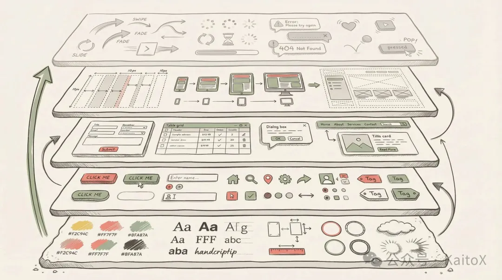
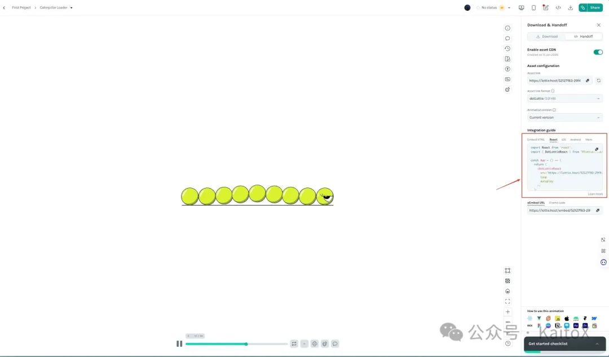

# Vibe Coding与设计（三）：两步搞定前端动效，让网站瞬间 “活” 起来

原创 KaitoX *2026年1月15日 10:21*

## 前言

欢迎回到 Kaito 的“ **Vibe Coding 与设计** ”系列！

在第一篇《如何实现有设计感的网站》中，我们通过拆解网页设计的五个层次—— **视觉基础、基础组件、复合组件、布局模式、交互反馈** ，建立了设计系统的理论框架。

在第二篇《5分钟，实现一个有设计感的网站》中，我们利用 AI 快速落地了一个名为 **Nanobanana** 的 AI 工具站。虽然页面结构完整、配色也不错，但如果你仔细观察，会发现它少了一点“灵魂”。

**这点缺失的“灵魂”，就是第五个层次——交互反馈（Interactive Feedback）。**



现在的网页就像一张精美的海报，虽然好看，但它是静止的、冷漠的。当你把鼠标移到按钮上时，它没有反应；当你滚动页面时，内容生硬地出现。这种体验在当今的 Web 标准下，只能算是“及格”，远称不上“出色”。

今天这篇文章，我们将为 Nanobanana 注入生命。我们将探讨 **如何通过动画（Animation）提升用户体验，** 并深入讲解两种核心的技术方案： **Lottie** 与 **Motion，** 最后基于第二节中生成的页面，在页面中增加相应的动画，让我们的网站“活”起来。

## 为什么你的网站需要动画？

很多开发者认为动画只是“锦上添花”的装饰，甚至觉得它会拖慢性能。但在 Vibe Coding 的理念中， **动画是设计语言的一部分** 。

好的动画能解决三个关键问题：

1. **引导视线** ：告诉用户哪里是重点，下一步该看哪里。
2. **提供反馈** ：确认用户的操作已被系统接收（比如按钮按下的回弹）。
3. **塑造性格（Vibe）** ：
- 苹果官网的动画：缓慢、优雅、流畅 -> **高端、精致**
	- Duolingo 的动画：Q弹、夸张、快速 -> **有趣、亲切**

## 两大流派：Lottie vs Motion

在 Web 前端开发中，实现动画主要有两大主流流派。理解它们的区别，是选对工具的关键。

## 1\. Lottie 动画：设计师的秘密武器

**Lottie** 是一种基于 JSON 的动画文件格式。它的工作流是：
设计师在 After Effects (AE) 中制作复杂的矢量动画 -> 导出为 JSON 文件 -> 开发人员通过 Lottie 库在 Web/App 端渲染。

- **优点** ：
- **表现力极强** ：可以实现极度复杂的角色动画、形变、插画动态，这是纯代码很难写出来的。
	- **跨平台** ：一套 JSON，Web、iOS、Android 通用。
	- **矢量高清** ：放大缩小不失真。
- **缺点** ：
- **交互性弱** ：虽然可以控制播放/暂停/进度，但很难精细控制动画内部的具体元素（比如让角色的衣服随鼠标变色）。
	- **文件体积** ：复杂动画的 JSON 文件可能达到几百 KB 甚至 MB。
- **适用场景** ：Hero Section 的主视觉、复杂的 Loading 动画、空状态插画、徽章/图标动画。

## 2\. Motion (Code-Driven)：开发者的魔法棒

这里主要指 **Framer Motion** (React) 或 **GSAP** 这类代码驱动的动画库。它们通过操作 DOM 元素的 CSS 属性（transform, opacity）来实现动画。

- **优点** ：
- **交互性极强** ：可以完美响应鼠标移动、滚动位置、组件状态（Hover/Tap）。
	- **轻量灵活** ：不需要加载外部的大文件，所有逻辑都在 JS Bundle 中。
	- **布局感知** ：最强大的功能是 `layout` 属性，可以让元素在布局变化（如列表重新排序）时自动平滑过渡。
- **缺点** ：
- **制作复杂插画困难** ：如果你想画一个挥手的小人，用代码写 `path` 会累死人。
- **适用场景** ：页面转场、滚动入场效果（Scroll Reveal）、按钮微交互、列表排序、弹窗展开。

## 总结对比

| 特性 | Lottie | Motion (Framer Motion) |
| --- | --- | --- |
| **核心驱动** | 设计师 (AE/Figma) | 开发者 (Code) |
| **擅长领域** | 复杂插画、角色动作 | UI 交互、布局过渡 |
| **可控性** | 整体控制 (播放/暂停) | 极细颗粒度 (每个属性) |
| **文件依赖** | 需要 JSON 资源文件 | 依赖 JS 库 |
| **最佳用途** | **视觉锚点 (Visual Anchor)** | **交互反馈 (Feedback)** |

## 实战演练：为 Nanobanana 注入灵魂

制定策略：为了达到最佳效果，我们将 **混合使用** 这两种技术。

1. **Hero Section** ：使用 **Lottie** 放置一个动态的 AI 机器人，作为视觉中心。
2. **UI 交互** ：使用 **Framer Motion** 制作按钮回弹、卡片滚动浮现等效果。

## 第一步：集成 Lottie 打造视觉焦点

关于 Lottie 动画，我推荐两种获取方式：

第一种是使用 Magic Animator（https://www.figma.com/community/plugin/1520062874404933233/magic-animator-ai-animation-generator-for-figma%EF%BC%89%EF%BC%8C%E5%8A%9F%E8%83%BD%E6%AF%94%E8%BE%83%E5%BC%BA%E5%A4%A7%EF%BC%8C%E5%8F%AF%E4%BB%A5%E7%9B%B4%E6%8E%A5%E6%8A%8A%E8%90%BD%E5%9C%B0%E9%A1%B5%E8%BD%AC%E6%88%90%E5%8A%A8%E7%94%BB%EF%BC%8C%E4%BD%86%E6%98%AF%E8%A6%81%E6%94%B6%E8%B4%B9%EF%BC%8C%E6%9C%89%E5%85%B4%E8%B6%A3%E7%9A%84%E5%90%8C%E5%AD%A6%E5%8F%AF%E4%BB%A5%E8%87%AA%E8%A1%8C%E7%A0%94%E7%A9%B6%E3%80%82

第二种是去 LottieFiles（https://lottiefiles.com/featured-free-animations%EF%BC%89 中找免费动画放到 Hero Section 中。

考虑到成本因素，我选择在 LottieFiles 中寻找免费动画来提升页面质感。

首先，寻找与页面风格相符的 Lottie 动画，我找的是这个毛毛虫（https://lottiefiles.com/free-animation/caterpillar-loader-0Zi0BMLHdP%EF%BC%89%EF%BC%9A



然后点击 Handoff，然后复制相关代码到项目中，告知 AI "在页面的 xxx 区域增加这个 Lottie 动画"就好了，比如我输入的 Prompt：

```
请在HeroSection中，新增一个 lottie 动画: import React from 'react'; import { DotLottieReact } from '@lottiefiles/dotlottie-react'; const App = () => { return ( <dotlottiereact src="https://lottie.host/52127f83-29f4-4954-b66f-b1e2041b16a3/FvVzWmqJDL.lottie" loop="" autoplay=""> ); }; </dotlottiereact>
```

加上毛毛虫效果后，我们的页面变成了以下效果，感觉还不错，有质感了很多，但是缺少动画看着还是有点儿生硬：

<video src="https://mpvideo.qpic.cn/0b2e7eabwaaa3yaow7dhoruvb6oddp4qagya.f10002.mp4?dis_k=675417527eb04afce06fda5d3a5f3dbc&amp;dis_t=1780282248&amp;play_scene=10120&amp;auth_info=SMrC/XA6JRfZ/LSrJgoVbENgNTYZN2ceZVFacidBVFl4J39hTUVfZlEkbyIeBjY=&amp;auth_key=b5573b7e3dfda753963678f2c81311e0&amp;vid=wxv_4342398109801431041&amp;format_id=10002&amp;support_redirect=0&amp;mmversion=false">您的浏览器不支持 video 标签</video>

## 第二步：使用 Framer Motion 增加交互质感

Framer Motion 是基于代码的动画库，实现方式比 Lottie 更灵活，直接告诉AI就好。我们可以针对页面的不同区域做精细调整，比如我输入的 Prompt 是：

```
整体：在页面中增加点儿Framer Motion动画 局部：在 Community Love 的内容区域，增加多几个评论，然后增加 Framer Motion动画，让他横向滚动起来
```

<video src="https://mpvideo.qpic.cn/0bc32eatoaabcuampvdgnbuvduodg7iqcnya.f10002.mp4?dis_k=38ff8dde8826af533e3fa60ce6ef5b40&amp;dis_t=1780282248&amp;play_scene=10120&amp;auth_info=dY/fn6BWbnBH2f/krHRbQ21GZGZlSGc1TmsACX5yEgRTd3ArMB8RCjZRJz8lTFdg&amp;auth_key=cec50303ab88cedaf628384e64675d71&amp;vid=wxv_4342400741609832453&amp;format_id=10002&amp;support_redirect=0&amp;mmversion=false">您的浏览器不支持 video 标签</video>

大家可以仔细看一下这两个版本的区别，已经有了过渡动画，以及评论也滚动起来了，看起来非常有质感！（PS：毛毛虫被我换成了大香蕉）

成品链接：https://aistudio.google.com/app/prompts?state=%7B%22ids%22:%5B%221n\_4LKI7ZW2oODpok559AhfsOGoRL3q\_3%22%5D,%22action%22:%22open%22,%22userId%22:%22117025274085543710851%22,%22resourceKeys%22:%7B%7D%7D&usp=sharing

## 结语

**仅用 5 分钟，我们就让 Nanobanana 从静态页面蜕变成了一个会呼吸、有温度、能互动** 的现代网站。

**Vibe Coding** 的本质，是用工程师的理性去表达设计师的感性——动画不是装饰，而是 **产品性格的视觉化呈现** 。

**三条建议：**

1. **先找感觉** ：去 LottieFiles 或 Framer Motion 官网找灵感
2. **小步快跑** ：从 Hero Section 的一个动画开始，不要贪多
3. **善用 AI** ：直接把 Lottie 代码或效果描述丢给 AI，比翻文档快 10 倍

从第一篇的理论框架，到第二篇的 5 分钟搭建页面，再到本篇的 5 分钟加入动画—— **一个完整的「有 Vibe 的网站」已经呈现在你眼前** 。

下一期想看什么内容？欢迎留言！

也欢迎关注我的公众号，后续我会持续分享 AI 工程化实践、设计系统搭建等内容。让我们一起，用 AI 的效率 + 设计的温度，做出真正有灵魂的产品。

Vibe Coding与设计 · 目录
