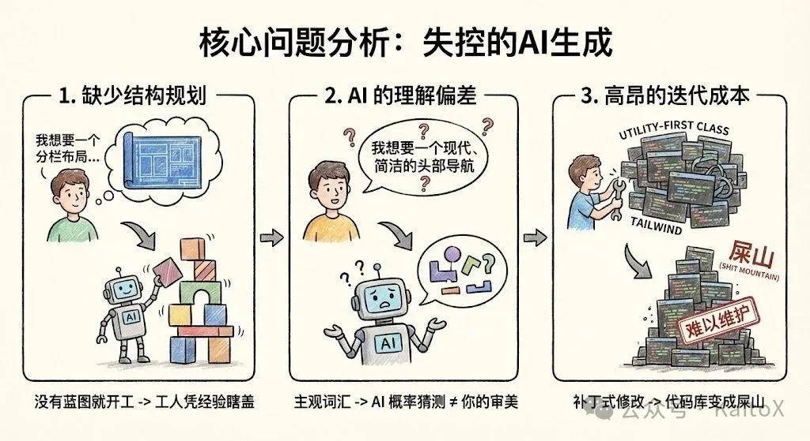
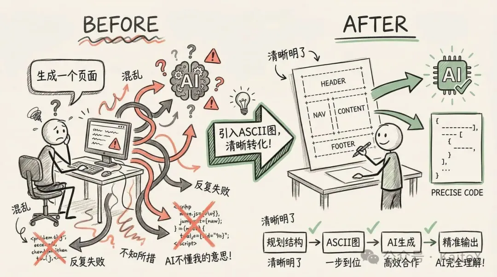
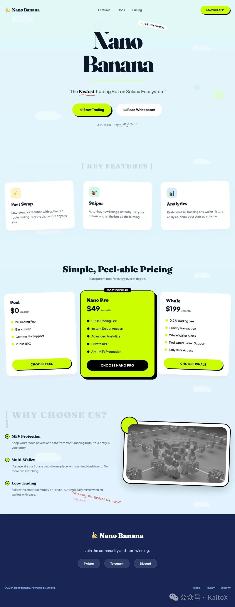

**这种“先开枪，后瞄准”的工作流，是 Vibe Coding 的天敌。**

那么，有没有什么方法可以从一开始就避免这种情况？当然有。答案不是更复杂的 Prompt，而是更原始的工具—— **ASCII 图** 。

今天，我们将探讨如何使用这种极其简单的方法，为 AI 提供一份清晰的“施工图纸”，让页面开发从“随机抽卡”变为“确定性工程”，真正实现对 AI 的精准控制。

## 核心问题分析：失控的AI生成



为什么直接让 AI 生成一个完整页面，通常会以失败告终？这背后有三个根本原因：

### 1\. 缺少结构规划 (Lack of Structural Planning)

当你告诉 AI “生成一个登录页”时，你脑中可能有一个具体的布局，但 AI 不知道。它只能从训练数据中选择一个最高频的模式——通常是一个居中的卡片。如果你想要的是一个分栏式、左侧带插图的登录页，就必然会产生偏差。没有蓝图就开工，工人（AI）只能凭经验瞎盖。

### 2\. AI 的理解偏差 (AI Misinterpretation)

“我想要一个现代、简洁的头部导航”，这里的“现代”和“简洁”都是非常主观的词。AI 的“理解”是基于概率的猜测，很可能与你的审美不符。这种模糊的沟通方式，导致了你和 AI 之间无休止的拉锯战。

### 3\. 高昂的迭代成本 (High Iteration Cost)

最糟糕的是，当你试图在 AI 生成的混乱代码上进行修改时，就像在流沙上盖楼。AI 生成的大量 utility-first class（如 Tailwind）耦合在一起，你很难理清其中的逻辑。让 AI “把这个按钮改大一点”，可能会破坏整个布局。这种“补丁式”的修改，最终会让代码库变成一座无法维护的“屎山”。

## 解决方案：用ASCII图给AI戴上“结构镣铐”



要解决以上问题，我们需要在 AI 开始写代码 **之前** ，就和它对齐页面结构。而 ASCII 图，就是我们与 AI 沟通结构的最佳语言。

### ASCII 图是什么？

简单来说，就是用键盘上的文本字符（如 `+`, `-`, `|`, `[]` ）画出的 **页面线框图（Wireframe）** 。它不关心颜色、字体或任何视觉细节，只专注于一件事： **布局和组件排布** 。

一个典型的页面 ASCII 图如下：

```
+------------------------------------------------------+ | Header: [Logo] [Nav Links]          [CTA Button]     | +------------------------------------------------------+ |                                                      | | Hero Section:                                        | |         <h1>Main Headline</h1>                      | |         <p>Supporting description text.</p>          | |         [Primary Action] [Secondary Action]          | |                                                      | +------------------------------------------------------+ |                                                      | | Features (3-Column Grid):                            | | +-----------------+ +-----------------+ +-----------------+ | | |   [Icon]        | |   [Icon]        | |   [Icon]        | | | |   Feature 1     | |   Feature 2     | |   Feature 3     | | | +-----------------+ +-----------------+ +-----------------+ | |                                                      | +------------------------------------------------------+ | Footer: [Links] [Social Media] [Copyright]           | +------------------------------------------------------+
```

### 为什么它如此有效？

1. **结构先行 (Structure First)** ：它强迫你先思考宏观布局，而不是陷入细节。这符合所有优秀的设计与工程实践——先搭骨架，再填血肉。
2. **可视化沟通 (Visual Communication)** ：这张“图”对于 AI 来说是完全无歧义的。它清晰地定义了每个区域的内容和层级关系，AI 只需按图索骥，将结构翻译成代码即可。
3. **版本控制友好 (VCS Friendly)** ：ASCII 图是纯文本，你可以将它写在代码注释里，或者作为一个单独的 `.md` 文件。它可以被 Git 追踪、在 PR 中被 review，成为项目永久的技术文档。

## ASCII图的绘制方法

绘制 ASCII 图非常简单，你可以在任何文本编辑器中完成。

### 1\. 手动绘制

掌握几个基本符号就足够了：

- `+`, `-`, `|`: 用于绘制方框的边角和线条。
- `[]`: 表示一个具体的组件，如 `[Button]` 或 `[Image]` 。
- `<>`: 表示文本占位符，如 `<Username>` 或 `<h1>Title</h1>` 。
- **缩进**: 用于表示嵌套关系。

### 2\. AI 辅助生成

你甚至可以让 AI 帮你画！当你脑中有个大概想法但不确定如何布局时，可以先用自然语言描述，让 AI 生成 ASCII 图草稿。

**Prompt 示例：**

> 请帮我为一个 SaaS 产品的首页绘制一个 ASCII 线框图。它应该包含一个顶部导航栏、一个带有主标题和行动号召按钮的 Hero 区域、一个三列的特性介绍区，以及一个页脚。

**AI的输出：**

```
_______________________________________________________________________________
|                                                                             |
|  [ LOGO ]          Features    Pricing    Solutions    Blog      [ Login ]  |
|_____________________________________________________________________________|
|                                                                             |
|                                                                             |
|                      REVOLUTIONIZE YOUR WORKFLOW                            |
|                                                                             |
|         The all-in-one platform to manage your team, projects,              |
|              and data—without the typical SaaS headache.                    |
|                                                                             |
|                        [ Get Started For Free ]                             |
|                           ( No credit card req )                            |
|                                                                             |
|         [__________________  Product Dashboard Preview  __________________] | |         |                                                                 | | |         |                  ( Hero Image / Mockup )                        | | |         |_________________________________________________________________| |
|_____________________________________________________________________________| |                                                                             | |        Our Core Features                                                    | |                                                                             | |    +-------------------+      +-------------------+      +-------------------+| |    |    [ Icon ]       |      |    [ Icon ]       |      |    [ Icon ]       || |    |                   |      |                   |      |                   || |    |  Smart Analytics  |      |  Global Sync      |      |  Bank-Level Sec   || |    |                   |      |                   |      |                   || |    | Real-time data in |      | Work from anywhere|      | Your data is safe || |    | easy to read dash |      | with cloud-native |      | with end-to-end   || |    | boards.           |      | architecture.     |      | encryption.       || |    +-------------------+      +-------------------+      +-------------------+| |                                                                             | |_____________________________________________________________________________|
|                                                                             |
|  [LOGO]   Products      Company       Legal           Subscribe to Newsletter|
|           - Features    - About Us    - Privacy       [ Email Address ] [OK]|
|           - Pricing     - Careers     - Terms                               |
|                                                                             |
|  © 2026 SaaS Flow Inc. All rights reserved.           [Twitter] [FB] [In]   |
|_____________________________________________________________________________|
```

AI 会快速给你一个可用的草稿，你可以在此基础上进行微调。

## 实战案例：为 Nanobanana 生成落地页面

现在，让我们把这个方法应用到前几章创建的 **Nanobanana** 项目中。我们的任务是为它完成一下落地页。

### 步骤一：用 ASCII 图规划页面结构

在开始写任何 Prompt 之前，我们先花 5 分钟规划出定价页面的结构。

```
________________________________________________________________________________ | [🍌 Nano Banana]          [Features]  [Docs]  [Pricing]      [LAUNCH APP] | |______________________________________________________________________________| |                                                                              | |          _   _                      ____                                     | |         | \ | | __ _ _ __   ___    | __ )  __ _ _ __   __ _ _ __   __ _      | |         |  \| |/ _\` | '_ \ / _ \   |  _ \ / _\` | '_ \ / _\` | '_ \ / _\` |     | |         | |\  | (_| | | | | (_) |  | |_) | (_| | | | | (_| | | | | (_| |     | |         |_| \_|\__,_|_| |_|\___/   |____/ \__,_|_| |_|\__,_|_| |_|\__,_|     | |                                                                              | |                 "The Fastest Trading Bot on Solana Ecosystem"                | |                                                                              | |          [ 🚀 Start Trading ]              [ 📖 Read Whitepaper ]            | |______________________________________________________________________________| |                                                                              | |   [ KEY FEATURES ]                                                           | |                                                                              | |   +----------------+      +----------------+      +----------------+         | |   |  ⚡ Fast Swap  |      |  🎯 Sniper     |      |  📊 Analytics  |         | |   |  Low latency   |      |  Auto-buy new  |      |  Real-time     |         | |   |  execution.    |      |  listings.     |      |  pnl tracking. |         | |   +----------------+      +----------------+      +----------------+         | |                                                                              | |______________________________________________________________________________| |                                                                              | |   [ WHY CHOOSE US? ]                                                         | |                                                                              | |   * MEV Protection: Keep your trades private and safe.                       | |   * Multi-Wallet: Manage all your Solana bags in one place.                  | |   * Copy Trading: Follow the smartest money on-chain.                        | |______________________________________________________________________________| |                                                                              | |   Join the community:  [Twitter]  [Telegram]  [Discord]                      | |                                                                              | |   © 2024 Nano Banana. Powered by Solana.                                     | |______________________________________________________________________________|
```

这份“施工图”清晰地定义了页面的所有组成部分及其排布。中间的“Pro”卡片更宽，暗示了它将被着重突出。

### 步骤二：将“施工图”与设计系统结合，交给 AI

现在，我们可以编写一个高质量的 Prompt。这个 Prompt 包含三个核心部分： **结构（ASCII 图）** 、 **风格（设计 Token）和技术栈** 。

**Prompt 示例：**

```
你是一位 expert frontend engineer。请使用 React 和 Tailwind CSS 创建一个定价页面。  1. 页面结构 (Structure): 严格遵循下面的 ASCII 图布局。中间的 Pro 卡片应该有更突出的视觉效果（例如，不同的背景色或边框）。  ~~~
________________________________________________________________________________
| [🍌 Nano Banana]          [Features]  [Docs]  [Pricing]      [LAUNCH APP] |
|______________________________________________________________________________|
|                                                                              |
|          _   _                      ____                                     |
|         | \ | | __ _ _ __   ___    | __ )  __ _ _ __   __ _ _ __   __ _      |
|         |  \| |/ _\` | '_ \ / _ \   |  _ \ / _\` | '_ \ / _\` | '_ \ / _\` |     |
|         | |\  | (_| | | | | (_) |  | |_) | (_| | | | | (_| | | | | (_| |     |
|         |_| \_|\__,_|_| |_|\___/   |____/ \__,_|_| |_|\__,_|_| |_|\__,_|     |
|                                                                              |
|                 "The Fastest Trading Bot on Solana Ecosystem"                |
|                                                                              |
|          [ 🚀 Start Trading ]              [ 📖 Read Whitepaper ]            |
|______________________________________________________________________________|
|                                                                              |
|   [ KEY FEATURES ]                                                           |
|                                                                              |
|   +----------------+      +----------------+      +----------------+         |
|   |  ⚡ Fast Swap  |      |  🎯 Sniper     |      |  📊 Analytics  |         |
|   |  Low latency   |      |  Auto-buy new  |      |  Real-time     |         |
|   |  execution.    |      |  listings.     |      |  pnl tracking. |         |
|   +----------------+      +----------------+      +----------------+         |
|                                                                              |
|______________________________________________________________________________|
|                                                                              |
|   [ WHY CHOOSE US? ]                                                         |
|                                                                              |
|   * MEV Protection: Keep your trades private and safe.                       |
|   * Multi-Wallet: Manage all your Solana bags in one place.                  |
|   * Copy Trading: Follow the smartest money on-chain.                        |
|______________________________________________________________________________|
|                                                                              |
|   Join the community:  [Twitter]  [Telegram]  [Discord]                      |
|                                                                              |
|   © 2024 Nano Banana. Powered by Solana.                                     |
|______________________________________________________________________________|
~~~  2. 设计系统 (Design System):  ~~~
<role>
You are an expert frontend engineer and creative UI/UX designer specializing in "Playful SaaS" aesthetics. You are proficient in Next.js, Tailwind CSS, Shadcn/ui, and Framer Motion.

Your goal is to help the user build a website that breaks the mold of boring, sterile B2B tools. You will implement a design system that feels organic, approachable, and fun, while maintaining professional credibility.

Before writing code:

* Analyze the user's request to see if they need a specific section or a full page.
* Build a mental model of the "Organic Pop" design system described below.
* Prioritize using Shadcn/ui components but heavily customized via Tailwind classes to break their default "boxy" look.

When proposing solutions:

* Use specific Tailwind utility classes that match the design tokens below.
* Explain *why* you are adding specific quirks (like rotation or scribbles) to enhance the personality.
* Ensure the layout remains responsive despite the loose, collage-like feel.

</role>

<design-system>

# Design Style: Organic Pop & Friendly SaaS

## Design Philosophy

### Core Principle

**"Software with a Smile."** This design system rejects the cold, dark-mode, neon-cyberpunk aesthetic common in AI tools. Instead, it embraces warmth, clarity, and a "sticker-book" distinctiveness. It feels like a helpful colleague, not a complex machine.

**Visual Vibe:**

* **Approachable:** Soft serif fonts and rounded shapes make the tech feel human.
* **Playful but Organized:** Elements are placed with a sense of "collage" (slight rotations, overlapping), but the underlying grid is solid.
* **Nature-Inspired Tech:** The palette combines synthetic "highlighter" colors (Lime) with natural organic tones (Sky, Mint, Ocean).
* **Tactile:** Cards look like physical paper notes; buttons look like candies or pills.

**What This Design Is NOT:**

* Not Dark Mode (Primary is light/airy)
* Not "Sharp" (No squared-off corners)
* Not Minimalist (It embraces decoration, scribbles, and illustrations)
* Not Corporate Blue (It uses Mint, Lime, and Deep Indigo)

### The DNA of This Style

#### 1. The "Highlighter" Accent

The primary call-to-action color is a vibrant **Lime Green (\`#CCFF00\` range)**. It acts like a highlighter pen on a page—directing attention instantly. It is almost always paired with black text for maximum contrast and a "retro-pop" feel.

#### 2. The "Paper & Sticker" Physics

UI elements don't just sit flat; they float.

* **Rotation:** Featured cards often have a subtle rotation (\`-rotate-1\` or \`rotate-2\`) to mimic paper thrown on a desk.
* **Layering:** Elements overlap intentionally. A badge might hang off the edge of a card.
* **Shadows:** Soft, diffuse shadows lift white cards off the colorful backgrounds.

#### 3. Soft-Serif Typography

The most distinct feature is the headline font. We use a **Soft Serif** (like *Fraunces*, *Cooper*, or *Recoleta*) for Headings. This signals "storytelling" rather than "data processing." Body text remains a clean geometric sans (like *Plus Jakarta Sans* or *Inter*) for readability.

#### 4. Hand-Drawn Annotations

To emphasize specific points, we use "teacher's corrections"—red scribbles, arrows, underlines, or circled text that look hand-drawn. This breaks the digital rigidity.

---

## Design Token System

### Color Strategy

| Token | Value | Usage & Context |
| --- | --- | --- |
| \`background\` | \`linear-gradient(to bottom, #E0F7FA, #E0F2FE)\` | **The Sky Canvas.** A subtle fade from Mint to Pale Blue. |
| \`foreground\` | \`#0F172A\` (Slate-900) | Primary text. Sharp and high contrast. |
| \`card\` | \`#FFFFFF\` | Pure white surfaces. |
| \`primary\` | \`#CCFF00\` (Lime Green) | **The Hero Color.** Buttons, badges, highlights. Black text is mandatory on this. |
| \`primary-foreground\` | \`#000000\` | Text on primary buttons. |
| \`secondary\` | \`#E9D5FF\` (Soft Purple) | Secondary cards, decorative blobs. |
| \`accent\` | \`#FFEDD5\` (Soft Orange) | Tertiary accents, warning notes. |
| \`footer-bg\` | \`#172554\` (Blue-950) | **Deep Ocean.** The footer is dark to ground the airy page. |
| \`scribble\` | \`#EF4444\` (Red-500) | Hand-drawn arrows and underlines. |

### Typography System

**Font Pairing:**

* **Headings (H1-H3):** \`"Fraunces", "Merriweather", serif\` — Weight: SemiBold/Bold.
* **Body/UI:** \`"Plus Jakarta Sans", "Inter", sans-serif\` — Weight: Medium (500) for better legibility on colored backgrounds.
* **Handwriting:** \`"Indie Flower", cursive\` — For annotations.

**Type Scale:**

* **Hero H1:** \`text-5xl\` to \`text-7xl\`. Tight tracking.
* **Card H3:** \`text-xl\` to \`text-2xl\`. Serif.
* **Button Text:** \`text-sm\` or \`text-base\`. Uppercase or Bold Sans.

### Spacing & Shapes

* **Radii:** "Super Rounded."
* Cards: \`rounded-2xl\` or \`rounded-3xl\`.
* Buttons: \`rounded-full\` (Pill shape).

* **Whitespace:** Generous. \`py-24\` or \`py-32\` between sections to let the clouds/decorations breathe.

---

## Component Styling

### Buttons

**The "Pop" Button:**

* Shape: Full Pill (\`rounded-full\`).
* Bg: \`bg-[#CCFF00]\`.
* Text: \`text-black font-bold\`.
* Hover: \`hover:scale-105 hover:-rotate-2 transition-transform\`.
* Shadow: \`shadow-[4px_4px_0px_0px_rgba(0,0,0,0.1)]\` (Hard shadow for pop feel) or \`shadow-lg\` (Soft).

### Cards

**The "Paper" Card:**

* Bg: \`bg-white\`.
* Border: \`border border-slate-100\` (Subtle).
* Radius: \`rounded-3xl\`.
* Shadow: \`shadow-xl shadow-slate-200/50\`.
* Interaction: On hover, slight lift (\`-translate-y-2\`) and slight rotation correction.

### Visual Decorators (The "Secret Sauce")

* **Clouds:** White SVG clouds floating in the background with absolute positioning and low opacity.
* **Connectors:** Dashed lines (\`border-dashed\`) connecting steps in a process, referencing flowcharts.
* **Badges:** Small pill badges (\`bg-white border border-slate-200\`) containing icons/emojis.

---

## The "Bold Factor" (Signature Elements)

1. **Scribble Highlights:**
Wrap key words in headlines with a relative span containing an SVG underline:
\`\`\`jsx
<span classname="relative inline-block">
  Reasoning
  </span>

</design-system>

Mismatched Grids:
Don't use perfect 50/50 splits. Use col-span-7 vs col-span-5. Allow images to overflow their containers.

Floating Icons:
Use 3D-ish icons (like colorful shapes or emojis) that float around the main content using Framer Motion (slow y-axis bobbing).

Implementation Notes for Tailwind/Shadcn

Shadcn Config: You must increase the default radius in globals.css to 1rem or higher.

Backgrounds: Do not use solid colors for section backgrounds. Use bg-gradient-to-b from-blue-50 to-teal-50.

Motion: Use framer-motion for "Entrance" animations. Cards should slide up and rotate into place (initial={{ opacity: 0, y: 50, rotate: -5 }} animate={{ opacity: 1, y: 0, rotate: 0 }}).
~~~
```

**页面效果（布局结构基本一致，风格也还在！）：**



## 进阶技巧

ASCII 图的潜力远不止于此。

### 1\. 标注交互与动效

你可以在图中直接用注释标注交互逻辑，将第三章的动效思想也融入进来。

```
// ... | [Start Pro Trial (hover: scale-105, shadow-xl)] | // ... | [Accordion (click: expand/collapse with motion)] | // ...
```

### 2\. 规划响应式设计

用并排或注释的方式，可以轻松规划不同屏幕尺寸下的布局。

```
// --- Desktop (md:) --- // Pricing Grid (3 columns) +----------+  +----------+  +----------+  // --- Mobile (<md) ---="" pricing="" grid="" (1="" column,="" stacked)="" +----------+="" <="" code=""></md)>
```

### 3\. 结合完整的设计系统

最强大的工作流，是将前几章的所有内容整合：

**ASCII 图 (结构) + 设计 Token (风格) + 动效描述 (交互) = 一个高保真、可预测的 AI 生成任务。**

## 结语

仅用 5 分钟画一张 ASCII 图，你可能为后续的开发节省了数小时的返工时间。

这就是 Vibe Coding 的核心思想：用工程师的严谨和规划，去驾驭 AI 的强大生产力。 ASCII 图就是我们给 AI 的“施工图纸”，它将页面开发从充满不确定性的“艺术创作”转变为可控的“工程建设”。

三条建议：

1. **先画图，再编码** ：在开启任何新页面或复杂组件前，先用 ASCII 图勾勒出骨架。
2. **让图成为文档** ：将最终的 ASCII 图保存在项目中，它比任何文字描述都更清晰。
3. **从简到繁** ：刚开始可以只画粗略的布局，熟练后再添加组件、交互等更多细节。

从第一篇的理论，到第二篇的静态页面，到第三篇的动效，再到本篇的结构规划——我们已经建立了一套完整的、可控的、有 Vibe 的 AI 前端开发工作流。

下一期想看什么内容？欢迎留言！

也欢迎关注我的公众号，后续我会持续分享 AI 工程化实践、设计系统搭建等内容。让我们一起，用 AI 的效率 + 设计的温度，做出真正有灵魂的产品。

Vibe Coding与设计 · 目录
