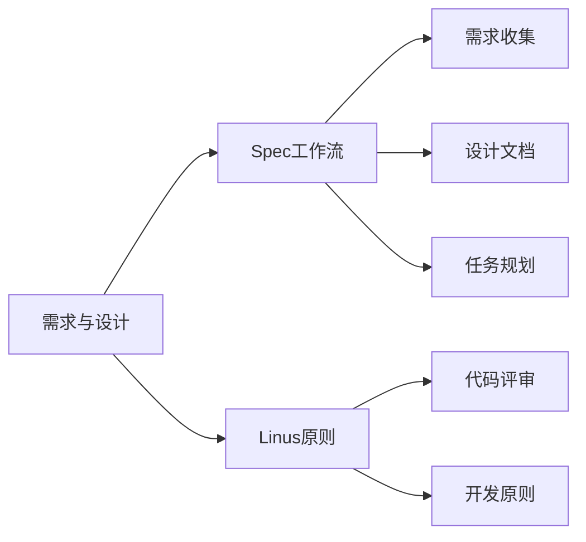

> **摘要** — 需求与设计章节，包含 Spec 工作流和 Linus 原则。

---

# 需求与设计

## 内容

- [02-01-spec-workflow](/guide/ai/vibe/02-01-spec-workflow/) — Spec 工作流
- [02-02-linus-principle](/guide/ai/vibe/02-02-linus-principle/) — Linus 原则