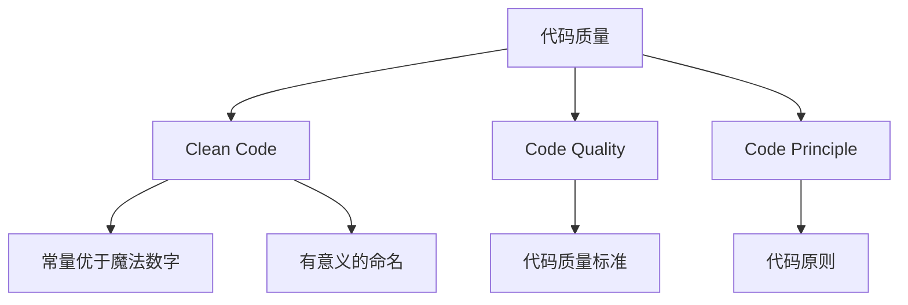

> **摘要** — 代码质量章节，包含 Clean Code、Code Quality、Code Principle 三个主题。

---

# 代码质量

## 内容

- [03-01-clean-code](/guide/ai/vibe/03-01-clean-code/) — 清洁代码规范
- [03-02-code-quality](/guide/ai/vibe/03-02-code-quality/) — 代码质量标准
- [03-03-code-principle](/guide/ai/vibe/03-03-code-principle/) — 代码原则