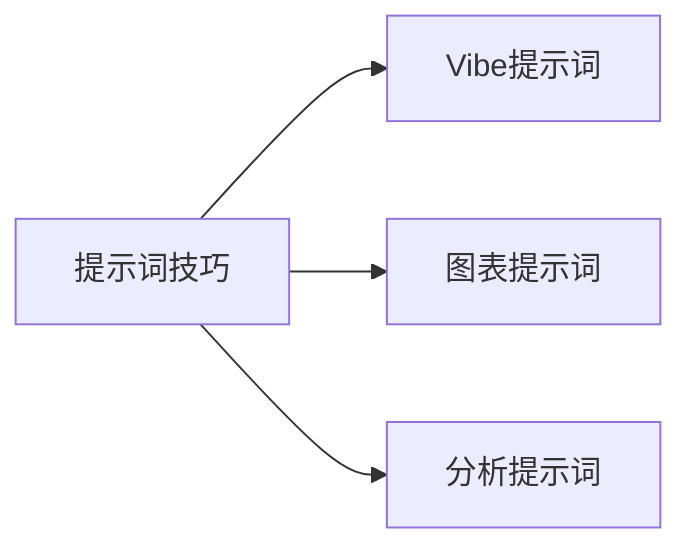

> **摘要** — 提示词技巧章节，包含 Vibe 提示词、图表提示词、分析提示词三个主题。

---

# 提示词技巧

## 内容

- [04-01-vibe-prompts](/guide/ai/vibe/04-01-vibe-prompts/) — Vibe 提示词
- [04-02-diagram-prompt](/guide/ai/vibe/04-02-diagram-prompt/) — 图表提示词
- [04-03-analysis-prompt](/guide/ai/vibe/04-03-analysis-prompt/) — 分析提示词