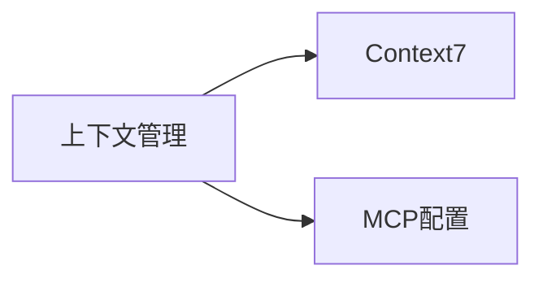

> **摘要** — 上下文管理章节，包含 Context7 和 MCP 配置两个主题。

```mermaid
graph LR
    A[上下文管理] --> B[Context7]
    A --> C[MCP配置]
```

---

# 上下文管理

## 内容

- [05-01-context7](/guide/ai/vibe/05-01-context7/) — Context7
- [05-02-mcp](/guide/ai/vibe/05-02-mcp/) — MCP 配置