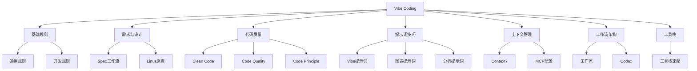

> **摘要** — 收录 Vibe Coding 相关的开发规范、提示词技巧、上下文管理和工作流架构等内容。



```markmap height=320
# Vibe Coding 指南
## 01 基础规则
- 01-01-vibe通用规则：角色定位和核心原则
- 01-02-askme：常见问答
## 02 需求与设计
- 02-01-spec-workflow：Spec工作流
- 02-02-linus-principle：Linus原则
## 03 代码质量
- 03-01-clean-code：清洁代码规范
- 03-02-code-quality：代码质量标准
- 03-03-code-principle：代码原则
## 04 提示词技巧
- 04-01-vibe-prompts：Vibe提示词
- 04-02-diagram-prompt：图表提示词
- 04-03-analysis-prompt：分析提示词
## 05 上下文管理
- 05-01-context7：Context7
- 05-02-mcp：MCP配置
## 06 工作流与架构
- 06-01-workflow：工作流
- 06-02-codex：Codex
## 07 工具栈与CLI
- 07-01-toolstack：Vercel/Supabase/Stripe/Cloudflare 全配齐
```

---

# Vibe Coding 指南

## 目录

### 01 基础规则

| 章节 | 内容 |
|------|------|
| [01-01-vibe通用规则](/guide/ai/vibe/01-01-vibe-rules/) | Vibe 开发的角色定位和核心原则 |
| [01-02-askme](/guide/ai/vibe/01-02-askme/) | 常见问答 |

### 02 需求与设计

| 章节 | 内容 |
|------|------|
| [02-01-spec-workflow](/guide/ai/vibe/02-01-spec-workflow/) | 需求收集、设计文档、任务规划的标准化流程 |
| [02-02-linus-principle](/guide/ai/vibe/02-02-linus-principle/) | 代码评审和开发原则 |

### 03 代码质量

| 章节 | 内容 |
|------|------|
| [03-01-clean-code](/guide/ai/vibe/03-01-clean-code/) | 清洁代码规范 |
| [03-02-code-quality](/guide/ai/vibe/03-02-code-quality/) | 代码质量标准 |
| [03-03-code-principle](/guide/ai/vibe/03-03-code-principle/) | 代码原则 |

### 04 提示词技巧

| 章节 | 内容 |
|------|------|
| [04-01-vibe-prompts](/guide/ai/vibe/04-01-vibe-prompts/) | Vibe 提示词模板和技巧 |
| [04-02-diagram-prompt](/guide/ai/vibe/04-02-diagram-prompt/) | 图表绘制的提示词 |
| [04-03-analysis-prompt](/guide/ai/vibe/04-03-analysis-prompt/) | 三层思维分析提示词 |

### 05 上下文管理

| 章节 | 内容 |
|------|------|
| [05-01-context7](/guide/ai/vibe/05-01-context7/) | Context7 上下文管理技术 |
| [05-02-mcp](/guide/ai/vibe/05-02-mcp/) | Model Context Protocol 配置 |

### 06 工作流与架构

| 章节 | 内容 |
|------|------|
| [06-01-workflow](/guide/ai/vibe/06-01-workflow/) | Vibe 开发工作流 |
| [06-02-codex](/guide/ai/vibe/06-02-codex/) | Codex 相关内容 |

### 07 工具栈与CLI

| 章节 | 内容 |
|------|------|
| [07-01-toolstack](/guide/ai/vibe/07-toolstack/) | Vercel / Supabase / Stripe / Cloudflare / GSC+GA4 / Resend / SSH Agent 全链路工具链速配 |

### 08 Hooks 与规则

| 章节 | 内容 |
|------|------|
| [08-01-什么时候该用 Hooks](./08-hooks/08-01-when-to-use-hooks.md) | Prompt 表达意图，Hook 固化规则 |
| [08-02-Hooks 打造自动化 Claude Code 工作流](./08-hooks/08-02-hooks-automation-workflow.md) | 5 个核心事件、三种类型、实际配置示例 |
| [08-03-Vibe Coding 12 原则](./08-hooks/08-03-vibe-coding-12-principles.md) | 12Factor.me 四阶段学习路径：准备/执行/协作/迭代 |