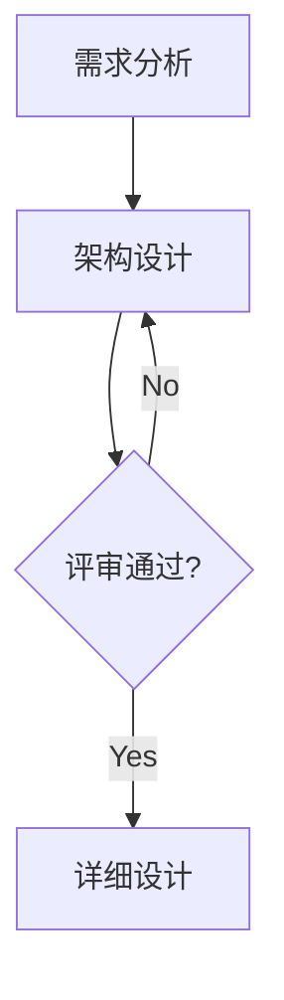

# 高级图表支持

System Vault 原生支持多种图表，方便进行架构设计与思路梳理。

## 1. Mermaid (流程图与时序图)

得益于 `vitepress-plugin-mermaid`，你可以直接在代码块中使用 mermaid 语法：



### 常用用法
- **Sequence Diagram (时序图)**: 用于描述对象间的交互。
- **Gantt Chart (甘特图)**: 用于项目进度规划。
- **Entity Relationship (ER图)**: 用于数据库建模。

---

## 2. Markmap (思维导图)

我们集成了自定义的 `markdown-it-markmap` 插件，允许通过 Markdown 层级自动生成思维导图。

```markmap height=300
# 知识库特性
## 核心底座
- VitePress
- Vue 3
- Vite
## 扩展增强
- Mermaid
- Markmap
- LXGW Fonts
```

### 控制参数
- `height=N`: 指定思维导图的高度（像素）。
- `full`: 使导图宽度占满屏幕。
