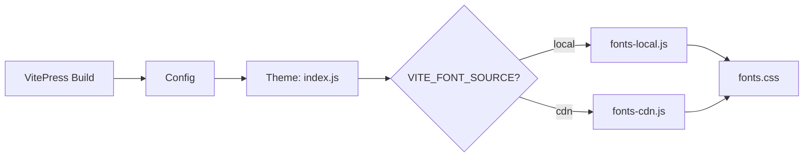

# 字体系统设计

本知识库默认集成了 **霞鹜文楷 (LXGW WenKai)**，提供极其出色的中文阅读体验。

## 设计目标
1.  **高清晰度**: 针对屏幕阅读进行优化的楷体，减少视觉疲劳。
2.  **加载优化**: 支持 Local 部署与 CDN 动态切换。
3.  **兼容性**: 在 SSR 阶段不发生布局坍塌，水合后动态注入 CSS。

## 架构示意

## 使用说明
在 `package.json` 的脚本中可以看到：
- `npm run dev`: 默认使用 `local` 字体。
- `build`: 默认使用构建时指定的源。

如需切换到 CDN，可设置环境变量 `VITE_FONT_SOURCE=cdn`。
