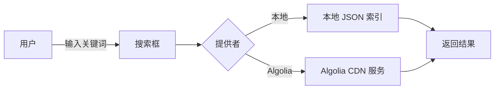

# 搜索功能

为了提高站点内容的可发现性，我们在 VitePress 配置中启用了内置的本地全文搜索。

## 实现方式

下面的示意图展示了用户查询时的流程：



此图帮助理解在 `local` 模式下所有内容均保留在站点内，而 `algolia` 模式则发送请求到外部服务。

## 实现方式

1. **打开配置文件**
   编辑项目的 `docs/.vitepress/config.js`，在 `themeConfig` 部分添加如下设置：

```js
search: {
  provider: 'local',
  options: {
    maxSuggestions: 10,
  }
},
```

- `provider: 'local'` 使用 VitePress 自带的索引机制，不需要外部服务。
- `options` 可以传递更多参数，比如 `maxSuggestions` 或 `lang`。

2. **构建期间生成索引**
   当执行 `vitepress build` 或 `vitepress dev` 时，系统会扫描所有页面并产生一个 JSON 索引文件。
   索引构建过程包括：

   ```mermaid
   flowchart TD
     A[读取 Markdown 文件] --> B[提取标题 & 内容 & 元数据]
     B --> C[小写化 & 分词]
     C --> D["构建页面记录(title,url,headers,keywords)"]
     D --> E[汇总所有记录]
     E --> F[生成 search-index.json]
     F --> G[嵌入构建输出]
   ```

   - 读取每个 Markdown 文件，提取标题、段落和元数据。
   - 对文本内容进行小写化、去重词及简单分词（汉字会按字符拆分）。
   - 为每个页面生成一条记录，包含 `title`、`url`、`headers` 等字段，以及本页的关键词数组。
   - 将所有记录汇总成一个 `search-index.json` 文件并嵌入到构建输出的静态资源中。

   因为使用的是本地方案，索引直接包含在构建输出里，无需额外下载，客户端搜索会在这个 JSON 里执行查找。

3. **前端交互**
   搜索框位于页面右上角，用户输入关键词后会即时在本地索引中查找匹配条目，
   并在下拉列表中显示建议结果。点击结果即可跳转。

## 使用说明

- 搜索框默认可见于所有页面的导航栏。
- 查询支持中文和英文，内建简单分词。
- 如果希望定制行为，例如排除某些目录、增加排序权重，可在 `config.js` 中进一步配置或使用插件。

## Algolia 可选方案

如果站点规模较大或者希望借助外部搜索服务提供更强的查询能力、语义搜索、实时更新等功能，可以改用 Algolia。

- 需注册 Algolia 帐号并创建 Index，然后在 `config.js` 中配置：
  ```js
  search: {
    provider: 'algolia',
    options: {
      appId: 'YourAppId',
      apiKey: 'YourSearchApiKey',
      indexName: 'your_index_name',
    }
  }
  ```
- 构建时仍然会生成站点内容的 JSON，但实际查询在客户端通过 Algolia 的 CDN 执行。
  注意：VitePress 不会自动将本地生成的 `search-index.json` 上传到 Algolia，
  你需要使用 Algolia 的 API 或 DocSearch 工具/爬虫在构建后手动同步索引。
- 适用于需要全文搜索、词干分析、自定义权重、多语言支持或希望与 Algolia 现有方案（如 DocSearch）无缝结合的项目。
  配置 `provider: 'algolia'` 只会改变 **查询方式**，**不会**负责索引上传。
相比 `local` 模式，Algolia 方案的缺点包括：

1. 需要付费或有调用额度限制。
2. 配置与部署稍微复杂，需要维护 API 密钥。
3. 搜索结果依赖第三方服务的可用性。

结合业务需求选择：

- 小型个人文档、内部资料：使用本地 `local` 模式更简单，无需额外成本。
- 面向公共访问、内容不断增长或需要高级搜索功能：可以考虑 Algolia。

## 相关文档

- [VitePress 搜索指南](https://vitepress.dev/guide/search)

该功能无需依赖外部平台，搭配 `npm run dev` 本地开发或构建即可自动生效。