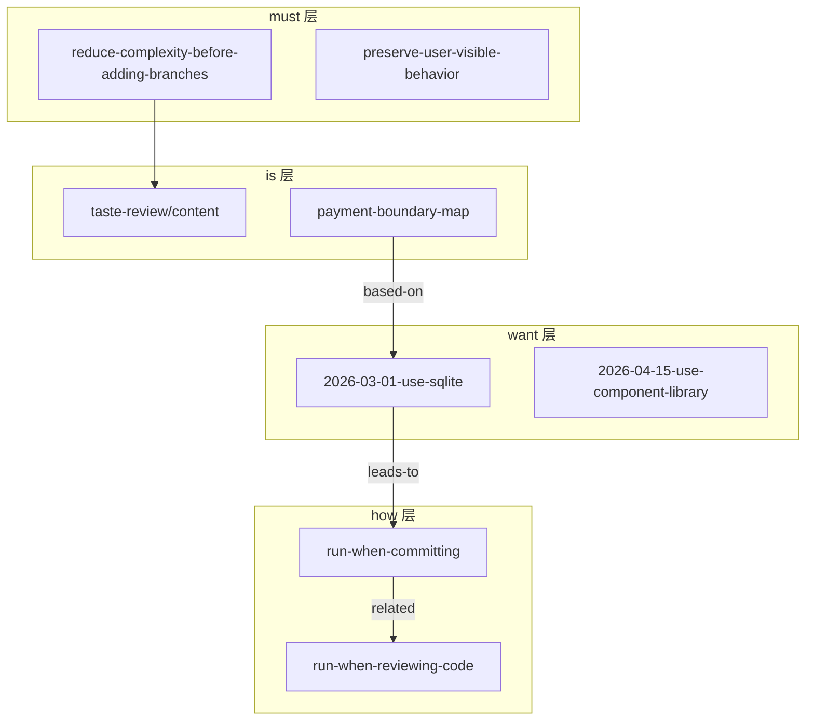
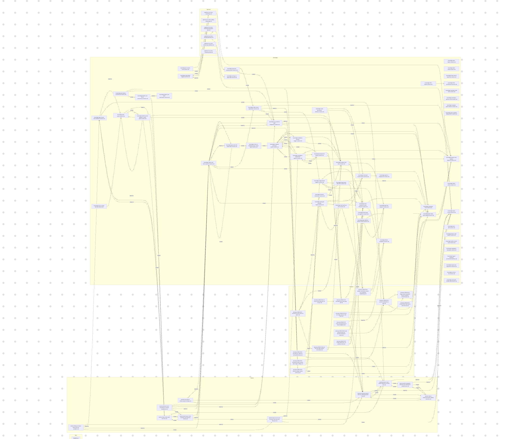
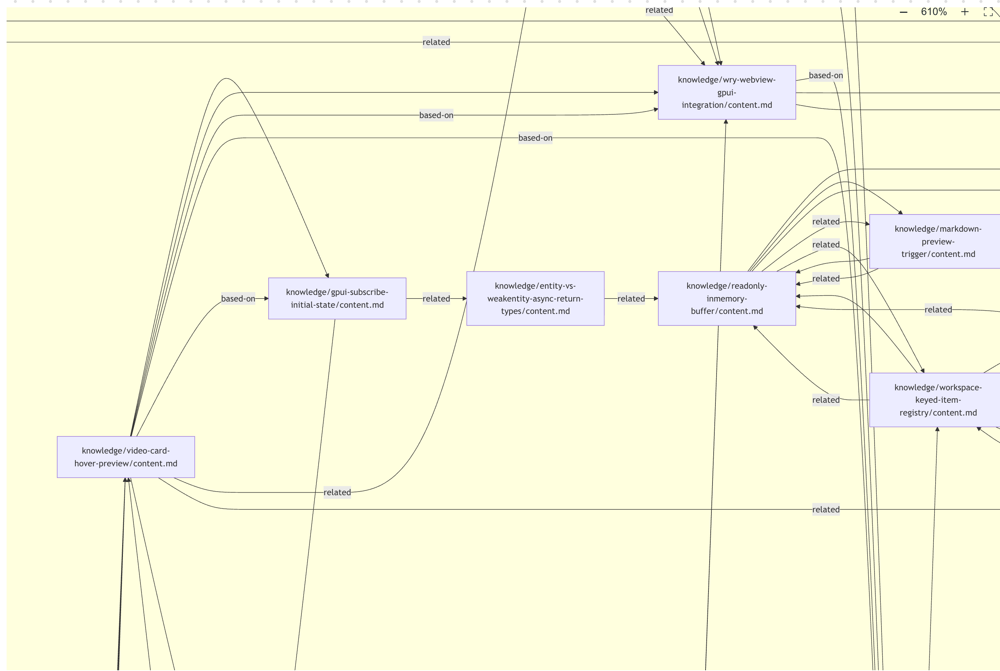

# Pensieve：让 AI Agent 拥有持续生长的项目记忆

> Pensieve 是一个自增长的 AI Agent 项目知识库技能，运行在 AI 工具的 Skill 系统之上，兼具最少上下文使用量和全工具兼容性。它将传统的静态 CLAUDE.md 升级为四层结构化知识体系，让每一次对话都比上一次更精准。

---

## 一、核心问题：为什么需要 Pensieve？

### 1.1 传统静态文档的三大痛点

| 痛点 | 表现 | 后果 |
|------|------|------|
| **维护负担** | 每换一个会话就要重新解释项目规范 | 重复劳动，浪费时间 |
| **上下文爆炸** | 将整个 CLAUDE.md 全文注入每次调用 | Token 消耗高、延迟增加 |
| **知识断层** | 三周前的决策理由、架构边界全部丢失 | 重复踩坑、决策反复 |
| **更新滞后** | 人工撰写、人工更新，容易遗忘 | 标准随心情变化，代码审查质量不稳定 |

### 1.2 Pensieve 的解决思路

> **不是存储文档，而是让每一次开发对话自动积累经验。**

Pensieve 的核心理念来自一个观察：**日常开发本身就是知识的来源**——Commit 时有架构决策、Review 时有代码品味、Debug 时有根因分析。这些经验如果能被自动捕获并写入知识库，AI Agent 就能像经验丰富的开发者一样「开箱即知」，而不是每次都从零开始探索。

```
开发 → Commit → Review（pipeline）
         ↓
    自动积累经验
         ↓
  maxim / decision / knowledge / pipeline
```

### 1.3 核心价值对比

| | CLAUDE.md / agents.md | Pensieve |
|---|---|---|
| **形态** | 单个静态文件 | 四层结构化知识体系 |
| **维护方式** | 手动撰写、手动更新 | 自动积累、自动对齐 |
| **范围** | 项目约定 | 约定 + 决策 + 事实 + 工作流 |
| **关联方式** | 扁平 | 语义链接形成知识图谱 |
| **上下文消耗** | 全量注入 | 按需路由，最小消耗 |

---

## 二、四层知识模型：MUST / WANT / HOW / IS

Pensieve 将项目知识划分为四个语义层级，每层回答一个不同的问题。层级之间通过语义链接（`[[...]]`）相互关联，形成知识图谱。

### 2.1 四层语义对照

```
┌─────────────────────────────────────────────────────────┐
│                     Pensieve 知识体系                    │
├──────────┬────────────┬─────────────────────┬───────────┤
│ 语义层级 │  知识类型  │      回答的问题      │ 跨项目？  │
├──────────┼────────────┼─────────────────────┼───────────┤
│ MUST     │ maxim      │ 什么绝对不能违反？   │  ✅ 是    │
│ WANT     │ decision   │ 为什么选这个方案？   │  ❌ 否    │
│ HOW      │ pipeline   │ 这类任务该怎么跑？   │  视情况   │
│ IS       │ knowledge  │ 当前的客观事实是什么？│ ❌ 否    │
└──────────┴────────────┴─────────────────────┴───────────┘
```

### 2.2 MUST 层 — Maxims（工程箴言）

**回答**：什么规则是跨项目、跨语言都必须遵守的？

**特征**：
- 违反它会显著增加回归风险
- 换项目、换语言依然成立
- 一句话能说清楚

**示例**：

```markdown
# Reduce complexity before adding branches

> When logic grows hard to read, simplify structure first 
> and branch later only if necessary.

## Quote
"If you need more than 3 levels of indentation, 
you're screwed anyway; fix your program."

## Guidance
- Split large functions by responsibility.
- Keep control flow shallow and explicit.
- Prefer clear naming over explanatory comments.

## Boundaries
- Small, local branches are acceptable when they improve clarity.

## Context Links
- Based on: [[knowledge/taste-review/content]]
- Related: [[maxims/prefer-pragmatic-solutions]]
```

**工具提示**：Maxims 应保持稀缺，不要把一次性偏好塞进去。

### 2.3 WANT 层 — Decisions（架构决策）

**回答**：这个项目做了哪个选择、为什么选它而不是其他方案？

**特征**：
- 包含明确的 `Context`（上下文）和 `Alternatives Considered`（考虑过的备选方案）
- 删除它会让未来的错误更容易发生
- 三个月后读它能节省大量弯路

**必须包含的内容**：
- Context（背景）
- Problem（问题）
- Alternatives Considered（考虑过的备选方案 + 为什么没选）
- Decision（最终决策）
- **Exploration Reduction**（探索减少）:
  - What to ask less next time（下次少问什么）
  - What to look up less next time（下次少查什么）
  - Invalidation condition（失效条件）

**格式**：`decisions/{YYYY-MM-DD}-{statement}.md`

```markdown
# Use SQLite for local persistence

## One-line Conclusion
> Use SQLite over Redis for local persistence due to zero infrastructure overhead.

## Context Links
- Based on: [[knowledge/db-boundary-map]]
- Leads to: [[pipelines/run-when-committing]]

## Context
Our team needs a zero-config persistence layer that works in development and production without external services.

## Problem
Managing Redis adds operational overhead. SQLite provides ACID guarantees without any runtime service.

## Alternatives Considered
- Option A: Redis — requires Docker/managed service, adds deployment complexity
- Option B: PostgreSQL — overkill for single-node usage patterns

## Decision
Use SQLite via better-sqlite3, co-located with the application binary.

## Consequence
- Zero infrastructure dependencies
- File-based backup works with git
- Concurrent write performance is limited (acceptable for single-user tools)

## Exploration Reduction
- What to ask less next time: "what database should we use for this?"
- What to look up less next time: SQLite setup docs
- Invalidation condition: When multi-user concurrent writes become a primary concern
```

### 2.4 HOW 层 — Pipelines（可执行工作流）

**回答**：这类重复性任务的标准执行步骤是什么？

**创建条件**（必须同时满足）：
1. 同类任务已经重复出现多次
2. 步骤顺序不可互换
3. 每个步骤都有可验证的完成标准

**文件名规范**：`run-when-*.md`（`run-when-committing.md`、`run-when-reviewing-code.md`）

**示例：Commit Pipeline 结构**

```markdown
---
id: run-when-committing
type: pipeline
title: Commit Pipeline
status: active
created: 2026-02-28
tags: [pensieve, pipeline, commit, self-improve]
description: Mandatory commit-stage pipeline. Trigger words: commit, git commit.
---

# Commit Pipeline

Before committing, automatically extract insights from the session context + diff 
and capture them, then perform atomic commits.

## Signal Judgment Rules
- Only capture insights that are reusable and evidence-backed
- Classify by semantic layers: IS->knowledge, WANT->decision, MUST->maxim

## Task Blueprint

### Task 1: Decide whether to capture
**Goal**: Quickly determine if this commit contains worth-capturing experience
**Read**: git diff --cached, current session context
**Steps**: Check for signals (bug root cause / architectural decision / new pattern / ...)
**Completion**: Clear determination with one-line rationale

### Task 2: Auto-capture
**Goal**: Extract insights, write to user data, without asking user
**Read**: self-improve.md, git diff --cached, session context
**Steps**: 
1. Read spec → generate content → write to short-term/ or in-place
2. Refresh state: maintain-project-state.sh --event self-improve
**Completion**: Files written, graph refreshed

### Task 3: Atomic commits
**Goal**: Perform atomic git commits
**Steps**: 
1. Cluster by reason for change
2. Each cluster = one atomic commit
3. Title < 50 chars, imperative mood, explain WHY not WHAT
**Completion**: All staged changes committed independently

## Failure Fallback
- `git diff --cached` empty → skip capture, output notice
- Capture fails → log reason, continue to Task 3, suggest doctor
```

**关键规则**：
- Body 只能包含任务编排、验证循环、失败回退
- 冗长的背景/理由必须拆分为 `knowledge/decision/maxim` 并用 `[[...]]` 链接回来
- 必须至少有一个有效 `[[...]]` 链接

### 2.5 IS 层 — Knowledge（系统事实）

**回答**：哪些客观事实如果不记录下来，就会反复拖慢执行？

**特征**：
- 必须是可验证的或可追溯的
- 是"客观事实"而非"我们决定这么做"
- 探索型 knowledge 应包含：状态转换、症状→根因→定位、边界与归属、反模式、验证信号

**格式**：
```
knowledge/{name}/
├── content.md       # 主体内容
└── source/          # 可选，原始来源
```

```markdown
# Payment Module Boundary Map

## Source
src/payment/*.ts + internal wiki

## Summary
Payment module has three entry points and two side-effect boundaries.

## Content
### Entry Points
- `PaymentService.charge()` — async, returns transaction ID
- `PaymentService.refund()` — async, triggers reconciliation
- `PaymentService.settle()` — cron job, processes batch settlements

### State Transitions
- PENDING → PROCESSING → SETTLED
- PENDING → FAILED (retry up to 3x)
- PROCESSING → REFUND_REQUESTED → REFUNDED

### Symptom → Root Cause → Location
- "Transaction not found" → missing idempotency key → `PaymentService.charge()` missing key deduplication
- "Double charge" → race condition → `settle()` lacks row-level lock

### Boundaries
- Payment module NEVER calls NotificationService directly
- All side effects go through `PaymentEventBus`
```

---

## 三、知识图谱：让四层知识互联

层级之间通过三种语义链接相互关联：

| 链接类型 | 起点约束 | 终点约束 | 说明 |
|---------|---------|---------|------|
| **Based on** | 任意层 | `knowledge` / `decision` | 依赖的前置知识或决策 |
| **Leads to** | 任意层 | `pipeline` / `decision` | 导致的流程或后续决策 |
| **Related** | 任意层 | 任意层 | 并行相关主题 |

### 3.1 图谱生成机制

`generate-user-data-graph.sh` 脚本扫描整个 `.pensieve/` 目录，解析所有 `[[...]]` 链接，生成 Mermaid 格式的知识图谱：



实际产出的知识图谱示例（来自 Pensieve 官方项目）：





### 3.2 链接解析规则

```
规则一：short-term 中的链接不加 short-term/ 前缀
        ✅ [[decisions/2026-03-16-foo]]
        ❌ [[short-term/decisions/2026-03-16-foo]]

规则二：promote（从 short-term 移动到 long-term）时无需更新任何引用
        图谱解析器在处理 short-term 时会去掉前缀，与 long-term 共享节点 ID

规则三：decision 和 pipeline 必须至少有一个 [[...]] 链接
        否则 doctor 会报告 MUST_FIX
```

---

## 四、七大工具：知识循环的驱动引擎

```
┌────────────────────────────────────────────────────────┐
│              Pensieve 七大工具                           │
├──────────┬──────────────────────────────────────────────┤
│ init     │ 初始化项目数据目录 + 填充种子文件              │
│ upgrade  │ 刷新全局技能源码                               │
│ migrate  │ 迁移旧版数据 + 清理废弃结构                    │
│ doctor   │ 只读扫描：检查 frontmatter/链接/目录结构       │
│ self-improve │ 从对话/diff 中提取洞察，写入 short-term     │
│ refine   │ 短时记忆分类整理 + 压缩                        │
│ sync-instructions │ 将 pipeline 短路由写入 CLAUDE.md      │
└──────────┴──────────────────────────────────────────────┘
```

### 4.1 init — 项目初始化

**触发时机**：首次将 Pensieve 集成到项目时

**执行流程**：
1. 创建 `<project>/.pensieve/{maxims,decisions,knowledge,pipelines,short-term}/`
2. 从 `.src/templates/pipelines/` 填充默认 Pipeline（`run-when-committing.md` 等）
3. 从 `.src/templates/knowledge/` 填充默认 Knowledge（`taste-review/content.md`）
4. 生成初始 `state.md` 和 `.state/` 目录
5. 启动基线探索（扫描最近 commits 和热点文件，产出「待持久化候选」列表，但不自动写入）
6. 提醒用户运行 `doctor --strict` 进行验证

**关键特性**：幂等设计——已存在的目录不会被覆盖

### 4.2 self-improve — 自动积累洞察

**触发时机**：任务轮次结束且有明确可复用的结论时

**写入策略**：
- **新文件** → 默认写入 `short-term/{type}/`（staging 区域）
- **修改已有文件** → 直接原地编辑，不走 short-term
- **用户明确要求** → 可跳过 short-term 直接写入 long-term

**语义分类规则**：
| 洞察类型 | 语义层 | 写入位置 |
|---------|-------|---------|
| 发现了 bug 根因 | IS | `knowledge/` |
| 做了架构或设计决策 | WANT | `decision/` |
| 发现了跨项目通用规律 | MUST | `maxim/` |
| 某类任务有标准化流程 | HOW | `pipeline/` |

**自动刷新**：写入后自动执行 `maintain-project-state.sh --event self-improve`，刷新 `state.md` 和知识图谱

### 4.3 doctor — 健康检查

**检查范围**：
1. **Frontmatter**：所有 `maxim/decision/pipeline/knowledge` 文件是否有必需字段
2. **链接完整性**：所有 `[[...]]` 是否有对应目标文件（broken links）
3. **目录结构**：`maxims/decisions/knowledge/pipelines` 四层目录是否齐全
4. **关键种子文件**：`pipelines/run-when-*.md` 和 `knowledge/taste-review/content.md` 是否与模板一致
5. **Short-term TTL**：`short-term/` 中超过 7 天的条目触发提醒
6. **指令对齐**：`CLAUDE.md` / `AGENTS.md` 中 Pensieve 短路由块是否正确

**输出格式**：
```
## 1) Executive Summary
- Overall status: FAIL / PASS_WITH_WARNINGS / PASS
- MUST_FIX: 3
- SHOULD_FIX: 2
- Suggested next step: `migrate`

## 2) Must Fix (by priority)
1. [GRAPH-001] Unresolved link [[decisions/2026-04-01-foo]]
   File: decisions/2026-03-01-bar.md

## 5) Action Plan
1. Run `migrate` to complete structure migration
```

### 4.4 refine — 短时记忆整理

**触发时机**：定期（或 doctor 提醒）处理 `short-term/` 中的条目

**决策**：
- 保留（promote）→ `mv` 到对应的 long-term 目录
- 删除 → 确认后删除
- 合并 → 多个相关 short-term 条目合并为一个 decision

**规则**：`short-term/` 中的链接不需要加 `short-term/` 前缀——解析器会去掉前缀，与 long-term 共享节点 ID

---

## 五、自增强循环：开发即积累

Pensieve 的核心价值不在于静态存储，而在于建立了开发活动与知识积累之间的自动化闭环：

```
    ┌─────────────────────────────────────────┐
    │           开发会话 / Commit / Review     │
    └──────────────────────┬──────────────────┘
                           │
              ─────────────┼─────────────
                           ▼
    ┌──────────────────────────────────────────┐
    │  Commit Pipeline（自动触发）              │
    │  1. 判断是否有值得捕获的洞察              │
    │  2. 从 diff + 对话中提取洞察               │
    │  3. 分类写入 short-term 或 in-place      │
    │  4. 刷新 state.md + 图谱                  │
    └──────────────────────┬──────────────────┘
                           │
                           ▼
              ┌────────────────────────┐
              │  .pensieve/ 知识库     │
              │  maxims/decisions/     │
              │  knowledge/pipelines/  │
              └───────────┬────────────┘
                          │
           ┌─────────────┼─────────────┐
           ▼             ▼             ▼
      MUST 层         WANT 层        HOW 层
    （跨项目规则）   （当前决策）    （工作流）
           │             │             │
           └─────────────┴─────────────┘
                          │
                          ▼
    ┌──────────────────────────────────────────┐
    │  下一次开发会话                          │
    │  AI Agent 按需加载对应层知识             │
    │  → 不再重复踩坑                          │
    │  → 不再重复探索                          │
    └──────────────────────────────────────────┘
```

### 5.1 典型使用场景

| 场景 | 操作 | 效果 |
|------|------|------|
| 验证 AI 生成的方案 | `"use pensieve to check the accuracy of this plan"` | 自动交叉检查 maxims 和 decisions，拦截违反架构约定的方案 |
| 定位模块入口 | `"use pensieve to locate the entry point of the payment module"` | 直接返回 knowledge 中已有的探索结果，无需全局搜索 |
| 分析影响范围 | `"use pensieve to analyze which workflows this refactoring will affect"` | 通过知识图谱的关联链追溯依赖和设计意图 |
| 提交代码 | `"use pensieve conventions to commit code"` | 自动先做 self-improve 捕获洞察，再执行原子提交 |
| 代码审查 | `"use pensieve to review the code taste of recent commits"` | 按 taste-review pipeline 执行，结论自动回流到知识库 |

---

## 六、架构设计：系统代码与用户数据的物理隔离

### 6.1 双根目录结构

```
~/.claude/skills/pensieve/          # 全局技能（单次安装，git 追踪）
├── SKILL.md                        #   静态路由文件
├── .src/                           #   系统代码（模板/脚本/规范/核心引擎）
│   ├── core/pensieve_core.py       #   核心引擎
│   ├── core/doctor_engine.py        #   检查报告生成器
│   ├── core/schema.json             #   目录/文件/生命周期定义
│   ├── scripts/                     #   20 个 bash 脚本
│   ├── templates/                   #   种子内容模板
│   ├── references/                  #   各层规范文档
│   └── tools/                       #   7 个工具规格说明
└── agents/                          #   agent/UI 元数据

<project>/.pensieve/                # 项目级用户数据（可版本控制）
├── maxims/                         #   工程箴言（long-term）
├── decisions/                       #   架构决策（long-term）
├── knowledge/                       #   系统事实（long-term）
├── pipelines/                       #   可执行工作流（long-term）
├── short-term/                      #   临时缓存（7天 TTL）
├── state.md                         #   动态状态文件
├── .gitignore                       #   只忽略 .state/
└── .state/                          #   运行时产物（doctor 报告/图谱/备份）
```

### 6.2 为什么必须物理隔离？

| 隔离原因 | 说明 |
|---------|------|
| `git pull` 更新系统代码时不会意外覆盖用户数据 | 系统代码在 `~/.claude/skills/pensieve/`；用户数据在 `<project>/.pensieve/` |
| 一个系统安装服务所有项目 | 各项目有独立的项目知识，互不干扰 |
| 用户数据可版本控制 | `.pensieve/` 目录可以在项目 repo 中提交和共享 |
| Schema 单点定义 | `schema.json` 定义了所有目录名、关键文件路径、迁移路径 |

### 6.3 状态生命周期

```
EMPTY → SEEDED → DRIFTED → ALIGNED
  ↑        ↑        ↑         ↑
init失败   init成功  有must_fix  doctor通过
```

| 状态 | 说明 | 触发工具 |
|------|------|---------|
| `EMPTY` | `.pensieve/` 根目录或必需子目录缺失 | init |
| `SEEDED` | 根目录存在，但关键文件缺失或模板不一致 | init / migrate |
| `DRIFTED` | 必须修复的 must_fix 问题存在 | migrate / self-improve |
| `ALIGNED` | 所有结构检查通过，状态干净 | doctor |

---

## 七、安装与使用

### 7.1 Claude Code 环境

```bash
# 1. 全局安装系统代码（一次性）
git clone -b main https://github.com/kingkongshot/Pensieve.git \
  ~/.claude/skills/pensieve

# 2. 安装 hooks（推荐：自动同步知识图谱）
bash ~/.claude/skills/pensieve/.src/scripts/install-hooks.sh

# 3. 初始化项目数据
cd <your-project>
bash ~/.claude/skills/pensieve/.src/scripts/init-project-data.sh

# 4. 验证
bash ~/.claude/skills/pensieve/.src/scripts/run-doctor.sh --strict
```

### 7.2 其他 AI 工具（Cursor / 通用 Agent）

```bash
# 安装技能到对应客户端的 skill 目录
git clone -b main https://github.com/kingkongshot/Pensieve.git <client-skill-path>/pensieve

# 初始化项目
cd <your-project>
bash <client-skill-path>/pensieve/.src/scripts/init-project-data.sh
```

### 7.3 更新系统代码

```bash
# 全局更新，所有项目立即生效
cd ~/.claude/skills/pensieve && git pull --ff-only

# 验证各项目
cd <your-project>
bash ~/.claude/skills/pensieve/.src/scripts/run-doctor.sh --strict
```

---

## 八、核心技术实现

### 8.1 图谱生成（generate-user-data-graph.sh）

扫描 `.pensieve/` 下所有 `.md` 文件，提取 `[[...]]` 链接，生成 Mermaid 格式图谱：

```
扫描所有 *.md
    ↓
解析 [[link-target]] 格式
    ↓
区分 resolved（目标存在）和 unresolved（目标缺失）
    ↓
按语义层分组，生成 Mermaid graph
    ↓
输出到 .state/pensieve-user-data-graph.md
```

### 8.2 Doctor 检查引擎（doctor_engine.py）

接收三个输入 JSON：
- `scan.json`：目录结构和 deprecated paths 检查结果
- `frontmatter.json`：所有文件的 frontmatter 字段合规性
- `graph.md`：图谱解析结果（links resolved/unresolved 统计）

生成结构化报告，关键逻辑：
1. 收集结构问题 + frontmatter 问题 + unresolved links
2. 分类为 MUST_FIX / SHOULD_FIX / INFO
3. 短时项 TTL 检查（created + 7 天）
4. 根据 schema.json 的 `next_step` 配置决定建议工具
5. 输出 markdown 报告 + JSON 摘要

### 8.3 语义层分类算法（self-improve）

```python
# 分类决策树
if is_cross_project and is_cross_language and violation_increases_regression_risk:
    → MUST 层（maxim）
elif clarifies_tradeoffs or explains_architectural_choice:
    → WANT 层（decision）
elif recurring_task and non_interchangeable_steps and verifiable_completion:
    → HOW 层（pipeline）
elif factual and verifiable and would_repeatedly_slow_execution:
    → IS 层（knowledge）
```

### 8.4 Schema 约束（schema.json）

定义了 Pensieve 的「宪法」——所有脚本和检查都围绕它运行：

- `required_dirs`：四层目录必须存在
- `critical_files`：关键模板文件及其比较模式
- `legacy_paths`：旧版路径映射（migrate 工具用于清理）
- `memory/start_marker + end_marker`：Claude auto memory 插入位置
- `instructions/required_fragments`：`CLAUDE.md` / `AGENTS.md` 中必须包含的 Pensieve 路由块

---

## 九、与 Linus Prompt 的演进关系

Pensieve 最初以「Linus Torvalds 风格引导 Prompt」闻名——用「good taste」「don't break userspace」「paranoid about simplicity」来约束 Agent 行为。

这个工程哲学依然存在于核心，但现在已不是孤立的 Prompt，而是一套**可执行的原则体系**：

| 类型 | 内建内容 | 效果 |
|------|---------|------|
| **maxim** | 4 条 Linus 风格工程原则 | Agent 自动避免补丁式代码，先简化再扩展，保持现有行为 |
| **pipeline** | Commit + Review + Refactor 三套流程 | 每次 commit/review/refactor 都检查标准，结论自动回流到知识库 |
| **knowledge** | Code-taste review 标准 | 「好代码」变成可执行定义 |

**尝试方式**：
- `"Use pensieve to review the code taste of recent commits"`
- `"Use pensieve to commit local changes"`

---

## 十、信息来源

- [Pensieve 官方仓库 — kingkongshot](https://github.com/kingkongshot/Pensieve)
- [中文 README](https://github.com/kingkongshot/Pensieve/blob/zh/README.md)
- [Pensieve SKILL.md](https://github.com/kingkongshot/Pensieve/blob/main/SKILL.md)
- [Pensieve CHANGELOG](https://github.com/kingkongshot/Pensieve/blob/main/CHANGELOG.md)
- [Pensieve 架构设计 — nova-vault-studio](/docs/md/guide/ai/agentic-engineer/)