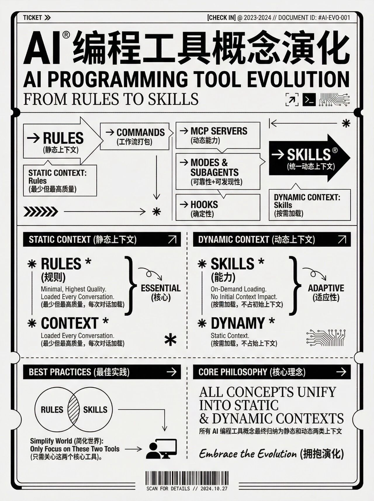
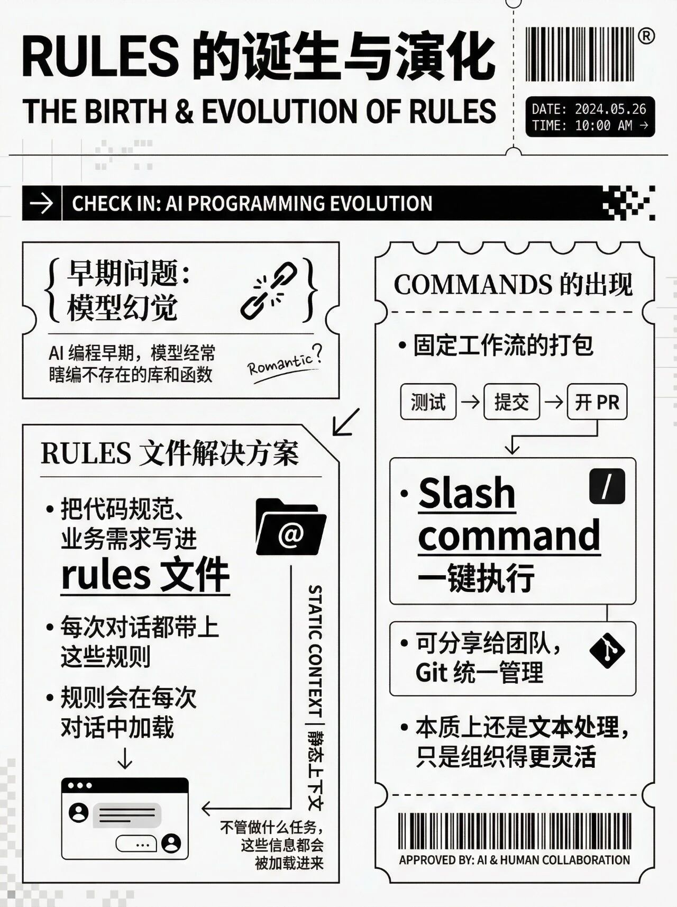
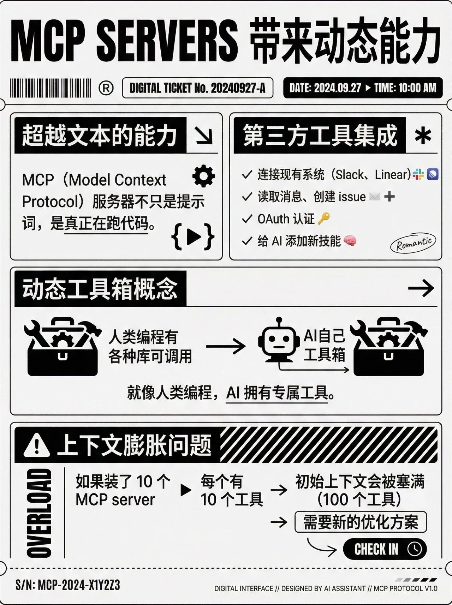
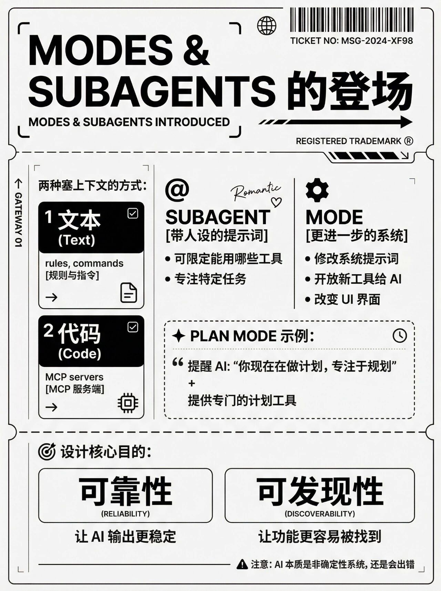
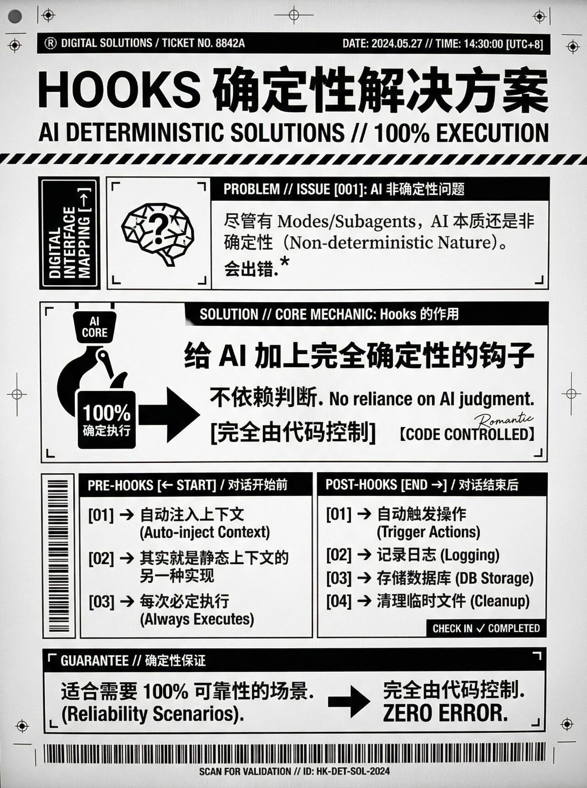
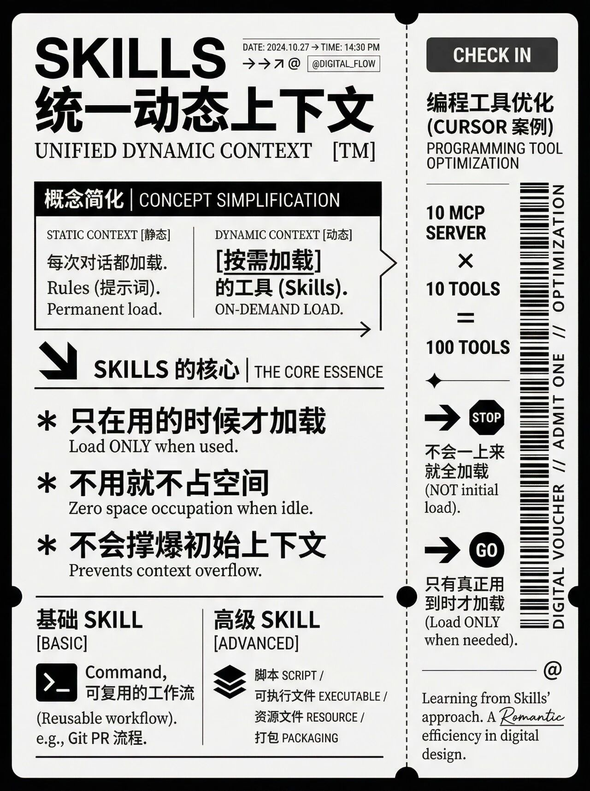
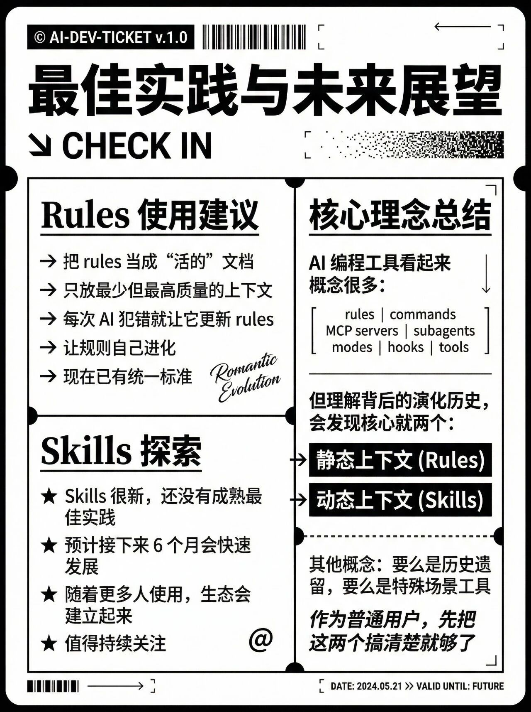
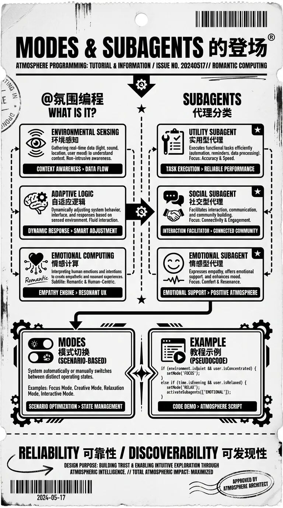

# AI 编程经验分享 —— 从认知到落地的完整幻灯片

> 这是一套 AI 编程经验分享的 PPT 幻灯片归档。基于 2026 年 3 月的内部分享整理，覆盖 AI 编程基础认知、SDD 理念、工具链、冷启动案例和实战经验。

---

## 分享主题

**目标受众**：技术人员（主要）、产品/AI 兴趣者（次要）

**预期收获**：
1. AI 编程基础认知 —— 了解 AI 编程的基本概念、能力边界与适用场景
2. 快速搭建 AI 开发环境的思路 —— 掌握从 0 到 1 构建 AI 编程环境的方法
3. 一套可落地的 AI 开发流程 —— 从需求、设计到编码的实践流程
4. 一些实用的 AI 开发工具 —— 推荐提升效率的常用工具与实践经验

## 演讲流程

| 序号 | 环节 | 内容 |
|------|------|------|
| 1 | 概念引入 | 简要介绍 AI 编程相关概念 |
| 2 | 开发理念 | 引入 SDD（Spec-Driven Development）等 AI 开发理念 |
| 3 | 工具介绍 | 常用 AI 开发工具链展示 |
| 4 | 冷启动案例 | 工程级 AI 项目从零到一 |
| 5 | 实战经验 | 真实对话历史与踩坑记录 |
| 6 | 扩展阅读 | 推荐学习资料 |
| 7 | Q&A | 互动问答 |

---

## 幻灯片存档

以下为分享中使用的主要幻灯片：

---

## 补充素材

---

## 相关资源

- [Skills 说明文档](https://github.com/dantefung/nova-vault-studio) — 项目中的 skill 目录概览
- [Superpowers Skills](https://github.com/dantefung/nova-vault-studio) — 流程型 skill：brainstorming、TDD、systematic-debugging 等
- [Vibe Coding](https://wiki.int.zuzuche.info/display/erc/vibe+coding) — AI Engineering Best Practices
