# 白嫖警告：这个图表 Skill，太猛了！正在悄悄拉高所有人的审美标准

最近我发现了一个开源项目叫 Lieflat Charts，在 GitHub 上已经拿到 2k star 了。简单说，它是一套专门给 AI Agent 用的数据可视化 skill，Claude Code、Codex 、WorkBuddy 等这些主流 Agent 都能直接装上用。在介绍它之前，我必须说：这是一个能够做出顶级审美图表的 Skill。先说它最打动我的地方：审美是统一的。字体、留白、线条、动效，全部遵循同一套视觉语法。这意味着你不管出什么图，风格都是协调的，不会东一个配色西一个字号，拼在一起像缝合怪。图表类型覆盖得也很全，60 多种。柱状图、折线图、面积图、直方图这些基础款自然不用说，热力图、小提琴图、环形关系图、桑基图这类复杂图型也都有，部分还支持交互操作。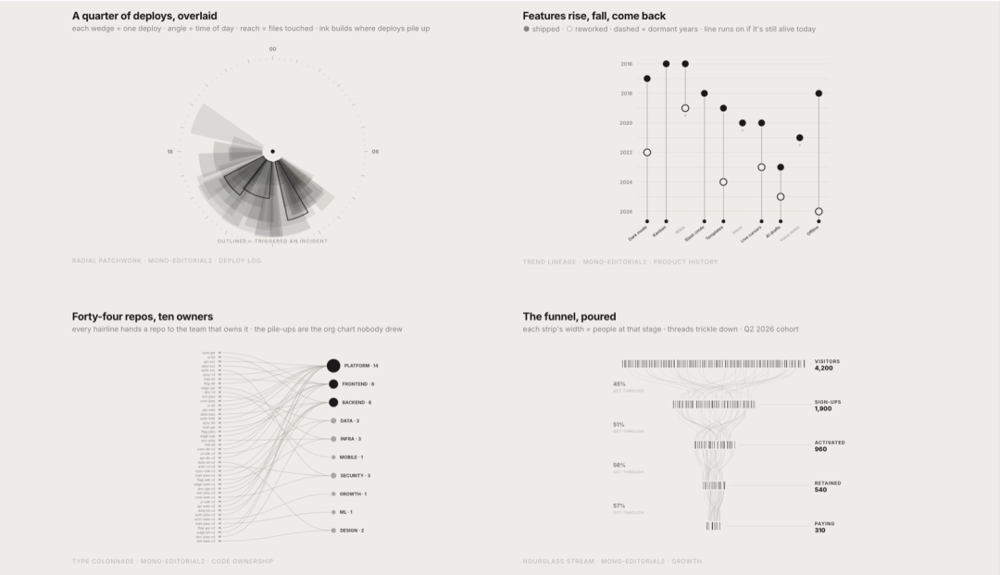配色方面走的是克制路线，默认黑白灰单色打底，干净利落。如果你需要一点色彩表达，也提供了青瓷蓝、椰林绿、编辑红三种色系可选，后续还会继续扩展。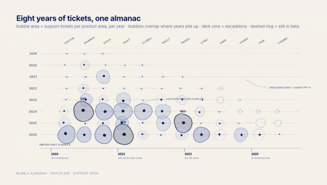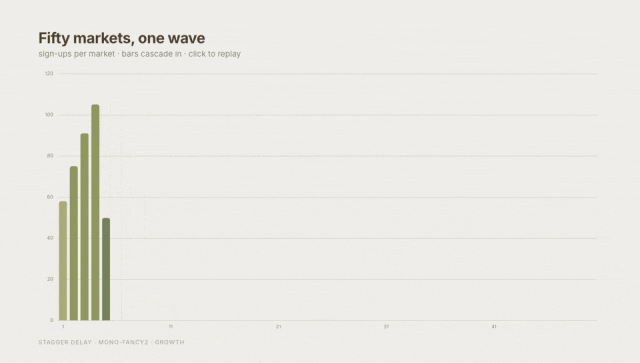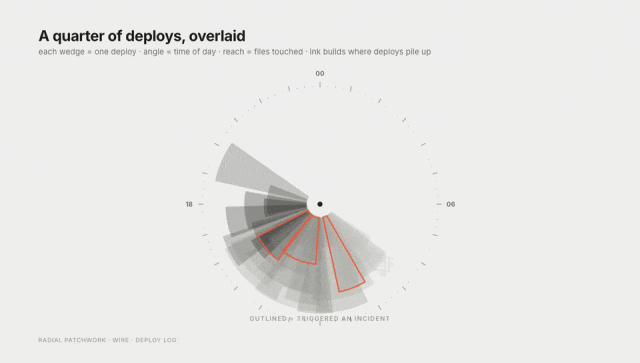它的底层原理是用 HTML 来渲染图表，这个思路带来一个很实用的好处：动效非常丰富，而且可以无缝嵌入 HTML 做的 PPT 里。如果你需要传统 PPT 格式，也可以让 Agent 把图表转成动图再贴进去，灵活度很高。而且，使用门槛极低。装好之后，你只需要把数据丢给 agent，或者告诉它你想可视化什么主题，它会自动选择合适的图表类型帮你出图。如果你要出完整的数据报告，它还有一个报告模式，一键生成带图表的可视化报告。说白了，以前做一张好看的图表，你得懂设计、懂配色、懂排版，现在这些活儿全交给一个 Skill 就搞定了。对经常需要做数据展示的人来说，非常值得一试。光说不练假把式，对吧，接下来，我带大家在 WorkBuddy 当中实操一下。只需要在 WorkBuddy 当中执行下面这条命令，就可以直接将这个 Skill 安装到 WorkBuddy 当中。npx skills add https://github.com/larashero3-dotcom/lieflat-charts --skill lieflat-chartsBASH安装完成之后，我们就可以调用这个 Skill，我就把我前几天写的一个公众号文章，介绍 GPT-6 的文章发给它，让它用图表的形式总结一下 。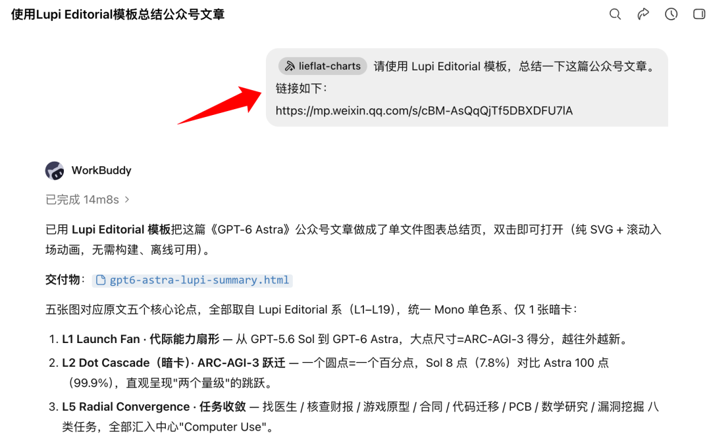经过几分钟的工作，很快一个图表网页就制作完成了，大家可以看看效果。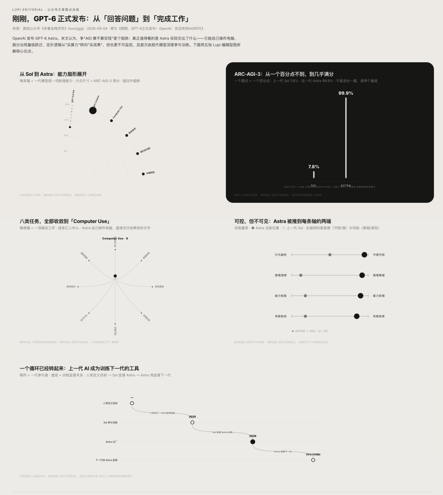怎么样，是不是很高大上，当你想给文章进行配图的时候，你还可以这么执行命令。它就会帮你给文章生成合适的图表。请读取这篇公众号文章，为这篇公众号文章制作 3 张合适的中文版图表。默认先比较 Lupi Editorial 和 Lupi Basics 候选；两组都不适配时，再使用 Glance。文章如下：https://mp.weixin.qq.com/s/fSktbxy-4Z5MxLDdesilRABASH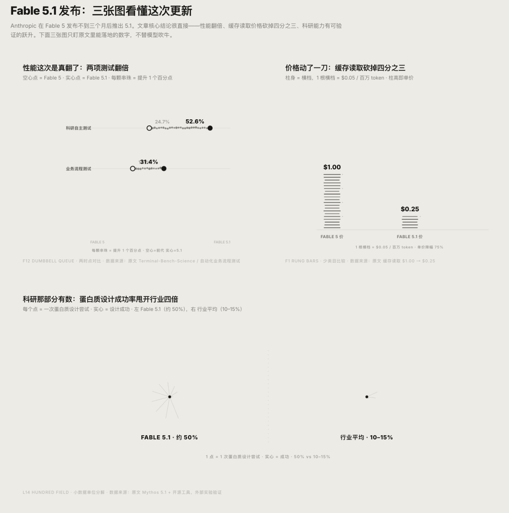当然了，你也可以直接给一组数据，让它基于数据生成相应的图表，比如：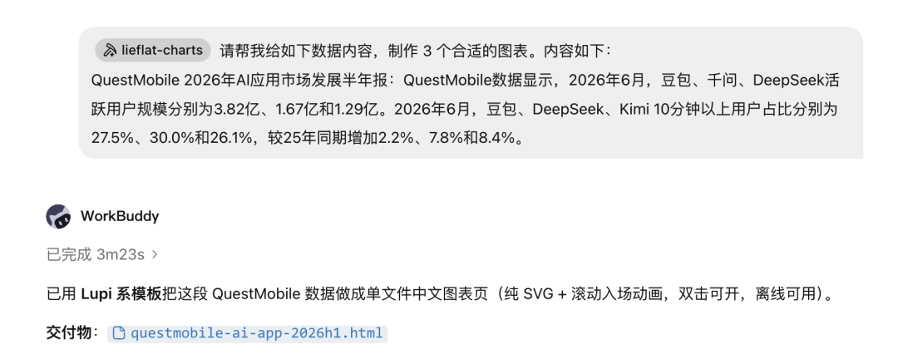我给了 2026 年 AI 应用市场半年报告的数据，它给生成的图表如下：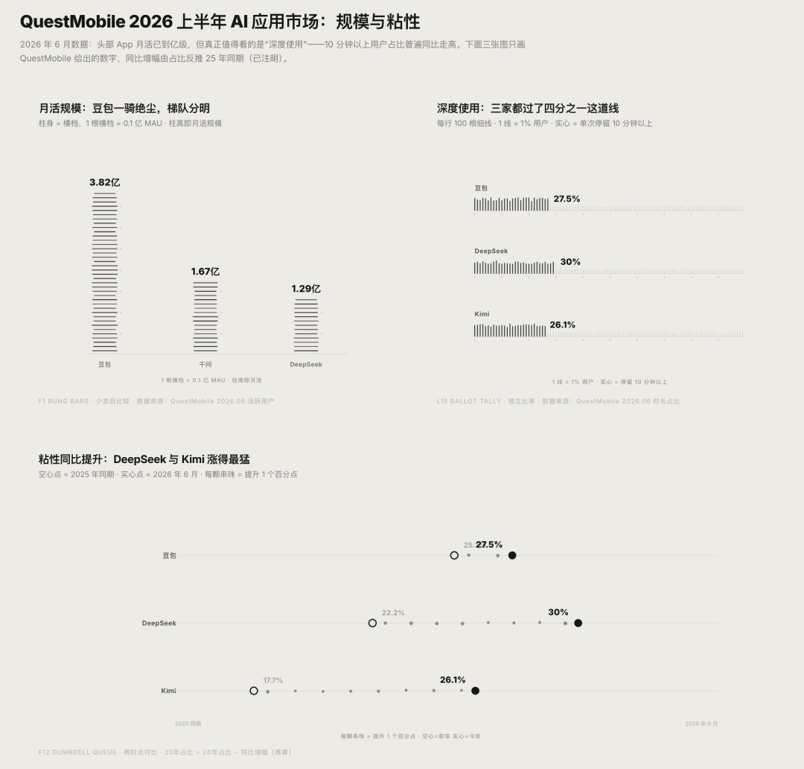我想说的是，这个图表 Skill 的强大，不仅仅是顶级的审美，更重要的是支持的模板和样式很多。各种类型的内容都支持。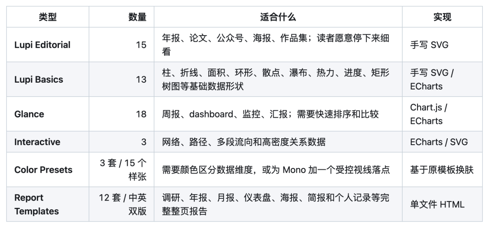我们可以重点看看报告模式，你只需要说：请基于数据生成年度数据报告，它就帮你生成对应的报告海报。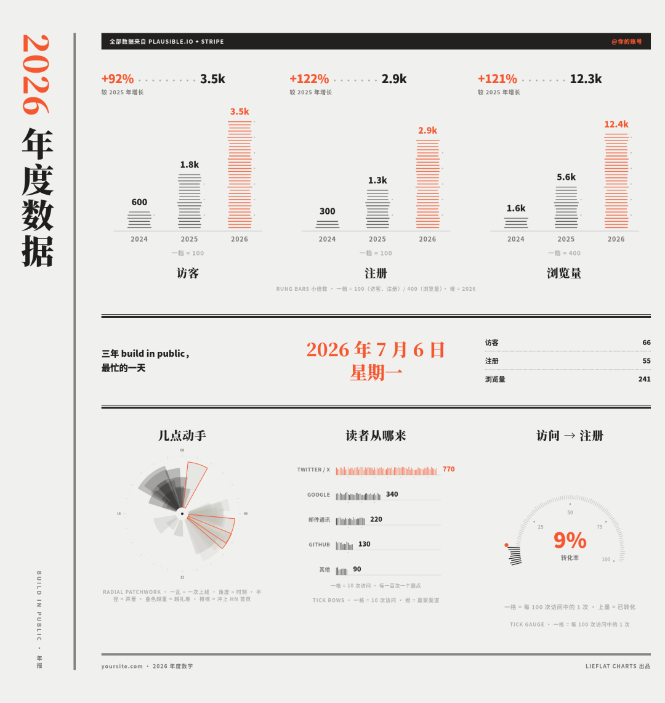大家可以看看，它支持各种类型的报告，报告样式很多，多达 12 种报告模板样式。每套模板都提供中文版和英文版，覆盖调研报告、研究简报、业务数据报告、财报与金融经济分析、产品记录、dashboard、海报，以及运动、旅行和年度生活数据记录等从工作到个人的需求。模板名称代表版式性格，不是使用场景的限制；同一套模板可以根据数据结构迁移到不同类型的报告。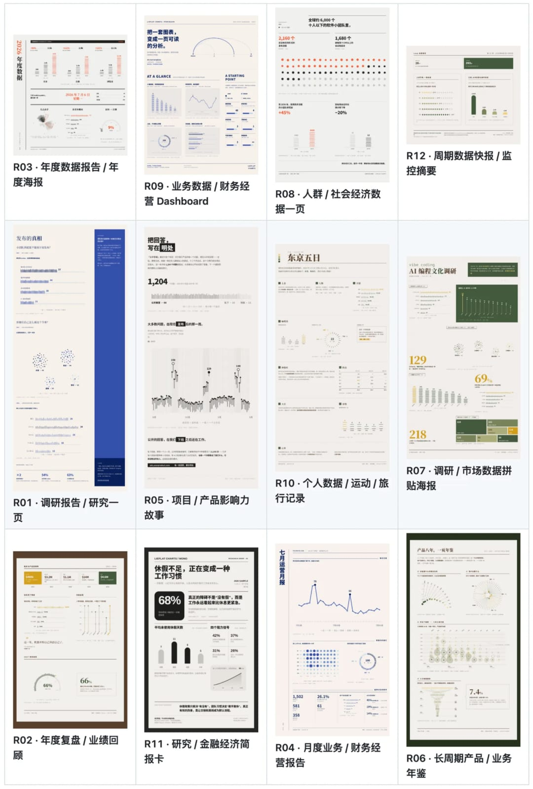是不是很牛逼？感兴趣的同学可以评论区留言互动，我发给你 Skill 的开源地址。

最近我发现了一个开源项目叫 Lieflat Charts，在 GitHub 上已经拿到 2k star 了。简单说，它是一套专门给 AI Agent 用的数据可视化 skill，Claude Code、Codex 、WorkBuddy 等这些主流 Agent 都能直接装上用。

在介绍它之前，我必须说：这是一个能够做出顶级审美图表的 Skill。

先说它最打动我的地方：审美是统一的。字体、留白、线条、动效，全部遵循同一套视觉语法。这意味着你不管出什么图，风格都是协调的，不会东一个配色西一个字号，拼在一起像缝合怪。

图表类型覆盖得也很全，60 多种。柱状图、折线图、面积图、直方图这些基础款自然不用说，热力图、小提琴图、环形关系图、桑基图这类复杂图型也都有，部分还支持交互操作。

配色方面走的是克制路线，默认黑白灰单色打底，干净利落。如果你需要一点色彩表达，也提供了青瓷蓝、椰林绿、编辑红三种色系可选，后续还会继续扩展。

它的底层原理是用 HTML 来渲染图表，这个思路带来一个很实用的好处：动效非常丰富，而且可以无缝嵌入 HTML 做的 PPT 里。如果你需要传统 PPT 格式，也可以让 Agent 把图表转成动图再贴进去，灵活度很高。

而且，使用门槛极低。装好之后，你只需要把数据丢给 agent，或者告诉它你想可视化什么主题，它会自动选择合适的图表类型帮你出图。如果你要出完整的数据报告，它还有一个报告模式，一键生成带图表的可视化报告。

说白了，以前做一张好看的图表，你得懂设计、懂配色、懂排版，现在这些活儿全交给一个 Skill 就搞定了。对经常需要做数据展示的人来说，非常值得一试。

光说不练假把式，对吧，接下来，我带大家在 WorkBuddy 当中实操一下。

只需要在 WorkBuddy 当中执行下面这条命令，就可以直接将这个 Skill 安装到 WorkBuddy 当中。

npx skills add https://github.com/larashero3-dotcom/lieflat-charts --skill lieflat-chartsBASH

npx skills add https://github.com/larashero3-dotcom/lieflat-charts --skill lieflat-charts

npx skills add https://github.com/larashero3-dotcom/lieflat-charts --skill lieflat-charts

BASH

安装完成之后，我们就可以调用这个 Skill，我就把我前几天写的一个公众号文章，介绍 GPT-6 的文章发给它，让它用图表的形式总结一下 。

经过几分钟的工作，很快一个图表网页就制作完成了，大家可以看看效果。

怎么样，是不是很高大上，当你想给文章进行配图的时候，你还可以这么执行命令。它就会帮你给文章生成合适的图表。

请读取这篇公众号文章，为这篇公众号文章制作 3 张合适的中文版图表。默认先比较 Lupi Editorial 和 Lupi Basics 候选；两组都不适配时，再使用 Glance。文章如下：https://mp.weixin.qq.com/s/fSktbxy-4Z5MxLDdesilRABASH

请读取这篇公众号文章，为这篇公众号文章制作 3 张合适的中文版图表。默认先比较 Lupi Editorial 和 Lupi Basics 候选；两组都不适配时，再使用 Glance。文章如下：https://mp.weixin.qq.com/s/fSktbxy-4Z5MxLDdesilRA

请读取这篇公众号文章，为这篇公众号文章制作 3 张合适的中文版图表。默认先比较 Lupi Editorial 和 Lupi Basics 候选；两组都不适配时，再使用 Glance。

文章如下：https://mp.weixin.qq.com/s/fSktbxy-4Z5MxLDdesilRA

BASH

当然了，你也可以直接给一组数据，让它基于数据生成相应的图表，比如：

我给了 2026 年 AI 应用市场半年报告的数据，它给生成的图表如下：

我想说的是，这个图表 Skill 的强大，不仅仅是顶级的审美，更重要的是支持的模板和样式很多。各种类型的内容都支持。

我们可以重点看看报告模式，你只需要说：请基于数据生成年度数据报告，它就帮你生成对应的报告海报。

大家可以看看，它支持各种类型的报告，报告样式很多，多达 12 种报告模板样式。每套模板都提供中文版和英文版，覆盖调研报告、研究简报、业务数据报告、财报与金融经济分析、产品记录、dashboard、海报，以及运动、旅行和年度生活数据记录等从工作到个人的需求。模板名称代表版式性格，不是使用场景的限制；同一套模板可以根据数据结构迁移到不同类型的报告。

是不是很牛逼？感兴趣的同学可以评论区留言互动，我发给你 Skill 的开源地址。
