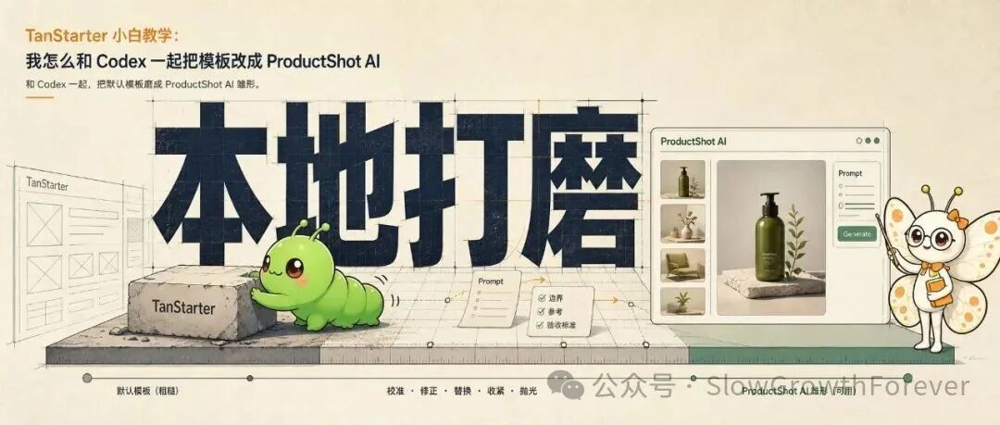
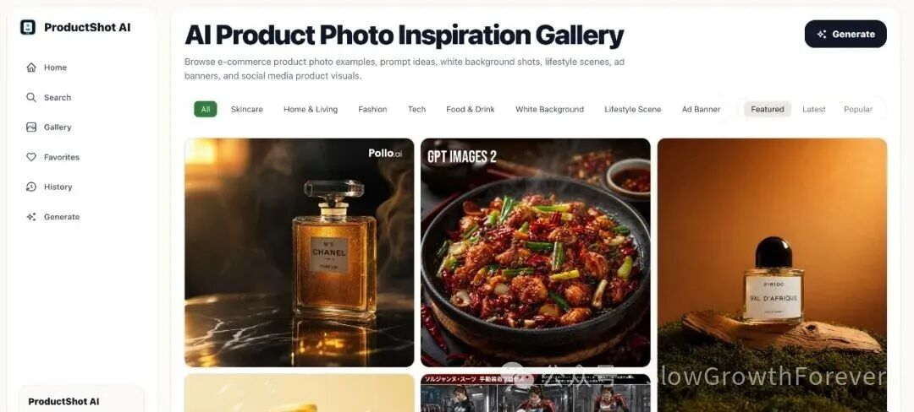
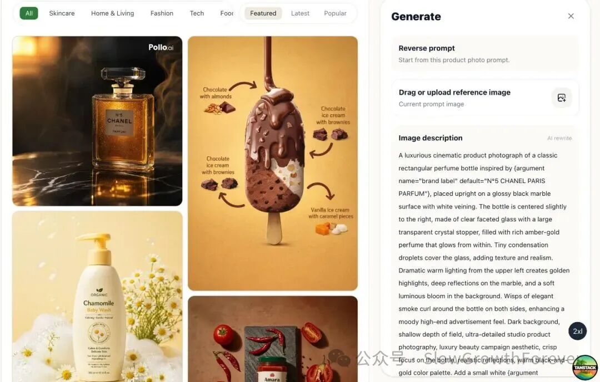

# TanStarter 小白教学：和 Codex 一起把模板改成电商配图平台

> 附一键提示词。你不需要懂技术，但得知道自己想要什么，并且讲得明白。

<!-- more -->

## 核心观点

模板是模板，怎么变成你要的产品形态？本着有 AI 千万不要动手的原则，脏活累活都交给 AI 干。

**关键洞察**：你如果只是跟 Codex 说一句"帮我把这个模板改成电商图片生成 SaaS"，这基本等于没说。它会开始猜，猜首页，猜功能，猜风格，猜路由。最后改出来一个"AI 味很浓"的产品。

**正确做法**：不断告诉 Codex：
- 我要什么
- 我不要什么
- 参考谁
- 验收标准是什么
- 哪里改错了
- 下一步只改哪里

---

## 第一步：替换，不是删除

一上来不要说"删掉模板内容"。很多人会删除没用的东西，但删完以后页面空了，结构也没了。

商业模版里有的东西，绝大部分是有用的。TanStarter 原来有导航、页脚、定价页、法务页，这些对 SaaS 是有用的。

**要求是"替换"**：把模板壳子变成 ProductShot AI 的壳子。



---

## 第二步：首页结构决策

一开始想做传统首页：上面讲产品，中间讲功能，下面放 Pricing、FAQ、Resources。

但看了 meigen 以后，意识到这种结构**不适合图片生成产品**（不适合自传播）。用户打开网站，第一反应不是读价值主张，直接上图片流，先吸引住用户。

**新方向**：
- 把 `/` 作为真正 Home，展示图片流
- `/gallery` 不再作为独立页面，访问时跳到 `/`
- 首页默认是 3 列图片流
- 点击 Generate 后，图片流变成 2 列，右侧出现生图工作台



**收获**：用户不需要先被教育，直接让他开始上手玩。

---

## 第三步：Prompt 详情页

参考 meigen 的详情页，最关心的布局：左边主图别动，右边内容自己滚，底部按钮一直在。

**指令**：
- 参考 meigen 优化 /prompt 页面
- 左侧主图固定不动
- 右侧操作按钮固定在最下面不动
- 滚动条只影响右侧



**核心想法**：不想做一个单独的 /create 页面。用户在看一张图，想用这个 Prompt 继续生成，最好就在当前页面完成，减少跳转。

---

## 第四步：数据结构设计

和 Codex 讨论图片和提示词怎么管理。

**方案**：一条 Prompt 记录绑定一组图片资产，不要让图片和 Prompt 分开飘着。

因为在这个产品里，**Prompt 不是普通文案，是核心资产**。每张公开图都应该知道：
- 它对应哪个 Prompt
- 它属于哪个分类
- 它是什么生成模式
- 它适合什么商品
- 它从哪里来
- 它是什么许可证

**架构思维**：现在先不要上数据库。因为后面要做 SEO、详情页、相关内容、收藏、生成记录，如果现在数据结构乱，后面一定返工。

---

## 第五步：导入真实素材

让 Codex 去找真实素材，不可能一页一页地自己生成。

**筛选条件**：
- 只选适合 ProductShot AI 的电商商品图和广告图
- 分类覆盖 Skincare、Home & Living、Fashion、Tech、Food & Drink
- 模式覆盖 White Background、Lifestyle Scene、Ad Banner、Social Post
- 图片下载到 public/gallery
- 每条数据保留 source 和 license

最后 Codex 导入了 30 组图片和 Prompt，作为网站起始的瀑布流。

---

## 第六步：SEO 优化

meigen 做到不好的一点是，每张图的内链是 id：`/prompt/2068748402889023638`

这丢失了 SEO 流量。告诉 Codex，把所有的 prompt 内链换成有意义的关键词：

```
/prompt/urban-fruit-juice-ad-poster
```

并直接更新到 sitemap 中。

---

## 总结

和 Codex 合作，你要像产品负责人一样给信息：

> 你不需要懂技术，但得知道自己想要什么，并且讲得明白。自己都不知道要什么，Codex 可能会带你更快地跑偏。

---

## 一键 Prompt（精华）

```
你正在一个基于 TanStarter 的项目中工作。
目标是把原始 TanStarter SaaS 模板改造成 ProductShot AI：
一个 Gallery-first 的 AI 电商商品图生成平台。

项目定位：ProductShot AI 是给电商卖家的 AI 商品图生成平台。
用户可以浏览商品图灵感，打开某个 Prompt 详情页，复制 Prompt，
使用当前 Prompt 或当前图片作为参考图继续生成电商展示图。

产品形态参考 meigen.ai，但不是纯图片社区，而是"图片流 + 生图工具"。

请从当前项目开始完成以下改造：

一、清理模板痕迹
1. 删除或替换所有 TanStarter / MkFast / mksaas 相关对外文案
2. 删除 Blog 相关入口和页面
3. 删除 Resources（导航、页脚、首页都不能出现）
4. 不要新增 /create 页面
5. 保留必要页面：/、/prompt/:slug、/pricing、/about、/contact、/privacy、/terms、/cookie

二、路由结构
1. / 是真正 Home，展示 Gallery-first 图片流
2. /gallery 重定向到 /
3. Prompt 详情页使用 slug，不使用数字 id
4. sitemap 中只保留有效页面

三、首页结构
- 左侧导航栏
- 主区域顶部有分类/模型/排序筛选
- 主区域是 masonry 图片流，默认最大 3 列
- 点击 Generate 后变成 2 列 + 右侧生成工作台

四、Prompt 详情页
- 桌面端页面高度固定为 100vh
- 左侧主图固定，不随页面滚动
- 右侧详情栏独立滚动
- 右侧底部操作按钮固定在最下面

五、验证
- pnpm run check 通过
- pnpm run build 通过
- / 返回 200
- /prompt/luxury-amber-perfume-ad 返回 200
- /gallery 重定向 /
```

---

## 相关文章

- [Claude Code 6 个核心命令](./claude-code-6-commands.md) — /goal、/loop、/batch 等命令详解
- [Vibe Coding 方法论](/guide/cs/software-philosophy/index.md) — 规划驱动的 AI 结对编程
