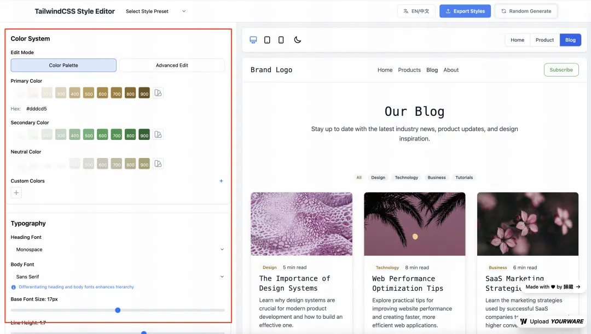
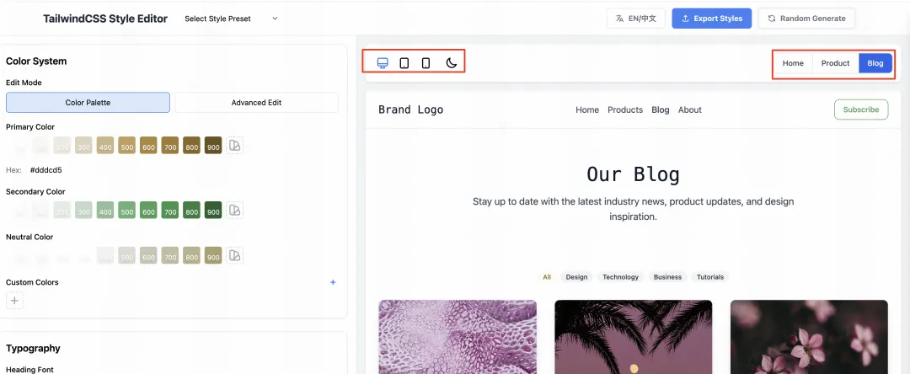
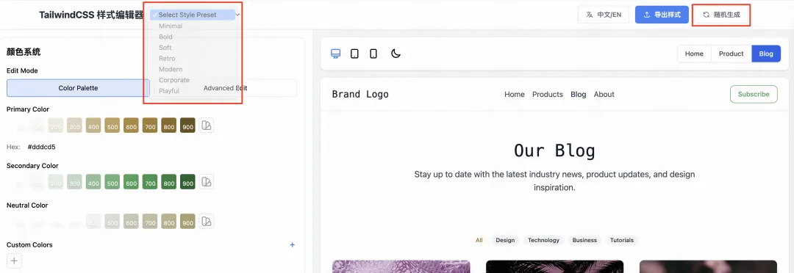
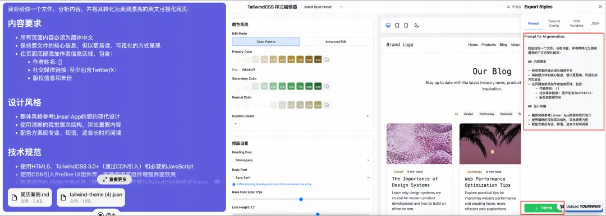
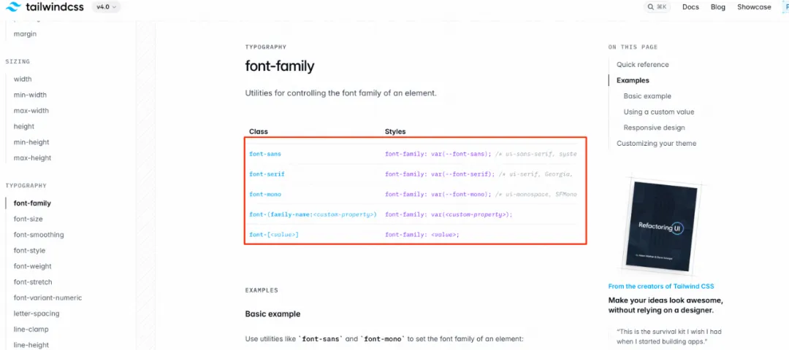
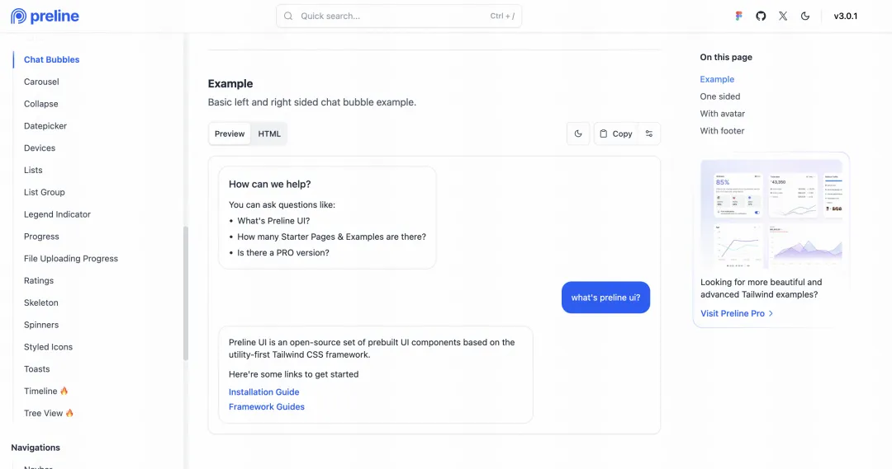

&#x2D;&#x2D;&#x2D;
title: **先介绍一下怎么使用**


原创 歸藏的 AI 工具箱 歸藏的AI工具箱 *2025年03月21日 17:24  北京*


前段时间很多人用了我那套帮你从文档生成漂亮可视化网页的提示词。

后面也有很多朋友基于那个进行了很多创新，但是我发现有个问题一直没有被解决。

**模型每次生成的结果过于随机了&#x20;**，有时候很好看，有时候虽然好看但是不太符合我的喜好。

所以就想能不能让大家用更加可视化的方式探索方案，之后再生成。

还真让我搞出来了一套非常优雅的方案，我写了一个样式探索工具。

**你可以自己在这个网页上自定义各种基础的样式，或者你可以直接点击随机生成，直到随机到你喜欢的 。**

**然后用用新的提示词和网页导出的文件就可以生成更加漂亮可控的网页&#x20;**。

不用担心每次随机都很丑，我做了很多的视觉约束，会保证每次生成的基本美学表现。

**可以来试试： https://60mcp23013.yourware.so/**

比如下面这就是同样的一个简历用了我这个工具生成的不同样式的结果，是不是感觉比上个版本强了非常多。

## **先介绍一下怎么使用**

整个页面的核心就是两个部分一个是调整样式，一个是导出样式和提示词。

首先你可以在页面左侧对网页样式进行调整，比如主题色、辅助色、字体、大小、字间距、按钮样式等。



然后可以在右侧预览，预览这里我也做的很细，做了三个页面首页、产品、博客，方便你在不同的页面内容上预览。

另外预览的部分还支持手机、电脑、平板不同页面宽度的预览，另外咱们的夜间模式也是有的。



我知道你们看着左边密密麻麻的元素头疼，所以还给大家两个兜底，首先你可以选择预设的各种风格模板，另外的话 **可以点击「随机生成」按钮，点完所有的元素都会变化，多点几次选你们喜欢的就好了&#x20;**。



最后就是导出和如何使用了，点击导出样式之后，你可以在左侧的 Tab 抽屉看到提示词和对应的代码，觉得看不懂是吧，没问题，我已经考虑到了，你 **只需要复制提示词、点击下载文件&#x20;**。

之后 **将你自己的内容文档、提示词和下载下来的 Json 文件一起扔给 Claude 回车就行&#x20;**，其他一概不用管。



##

## **当然还有提示词**

虽然网页上面可以复制提示词，但这里还是写一下，方便大家收藏，其中 json 部分需要在网页生成。

&#x20;&#x20;

```plaintext
我会给你一个文件，分析内容，并将其转化为美观漂亮的中文可视化网页：

## 内容要求

- 所有页面内容必须为简体中文
- 保持原文件的核心信息，但以更易读、可视化的方式呈现
- 在页面底部添加作者信息区域，包含：
    - 作者姓名: []
    - 社交媒体链接: 至少包含Twitter/X：
    - 版权信息和年份

## 设计风格

- 整体风格参考Linear App的简约现代设计
- 使用清晰的视觉层次结构，突出重要内容
- 配色方案应专业、和谐，适合长时间阅读

## 技术规范

- 使用HTML5、TailwindCSS 3.0+（通过CDN引入）和必要的JavaScript
- **使用CDN引入Preline UI组件库，按需使用其组件增强界面效果**
- **根据提供的JSON文件内容（颜色、字体等）配置TailwindCSS的样式Token，确保设计一致性**
- 实现完整的深色/浅色模式切换功能，默认跟随系统设置
- 代码结构清晰，包含适当注释，便于理解和维护

## 响应式设计

- 页面必须在所有设备上（手机、平板、桌面）完美展示
- 针对不同屏幕尺寸优化布局和字体大小
- 确保移动端有良好的触控体验

## 媒体资源

- 使用文档中的Markdown图片链接（如果有的话）
- 使用文档中的视频嵌入代码（如果有的话）

## 图标与视觉元素

- 使用专业图标库如Font Awesome或Material Icons（通过CDN引入）
- 根据内容主题选择合适的插图或图表展示数据
- 避免使用emoji作为主要图标

## 交互体验

- 添加适当的微交互效果提升用户体验：
    - 按钮悬停时有轻微放大和颜色变化
    - 卡片元素悬停时有精致的阴影和边框效果
    - 页面滚动时有平滑过渡效果
    - 内容区块加载时有优雅的淡入动画

## 性能优化

- 确保页面加载速度快，避免不必要的大型资源
- 图片使用现代格式(WebP)并进行适当压缩
- 实现懒加载技术用于长页面内容

## 输出要求

- 提供完整可运行的单一HTML文件，包含所有必要的CSS和JavaScript
- 确保代码符合W3C标准，无错误警告
- 页面在不同浏览器中保持一致的外观和功能

请根据上传文件的内容类型（文档、数据、图片等），创建最适合展示该内容的可视化网页。在配置TailwindCSS时，请使用提供的JSON文件中的颜色、字体等配置项来自定义样式Token。
```

##

## **再来看我是怎么做的**

我之前当设计师的时候做了很长时间的设计系统，所以对设计工程化和如何保证还原度还是有一定的研究。

因为这套提示词是基于 TailwindCSS 的，刚好他就设定了非常多已经整合好的 CSS 样式， **我们只需要在更改一部分它默认的样式的值就可以让我们的页面发生很大变化。**



但是 TailwindCSS 的值还是太细了，不太好调整，那有没有更加整合的东西呢，有的，组件库或者说设计系统。

市面上有非常多基于 TailwindCSS 构建的设计系统，他们在CSS 样式上再次封装，重新设计了每个前端组件。

比如：按钮、输入框，还有他们的各种状态选中是什么样的、禁用是什么样的。

所以 **我还引用了基于 TailwindCSS 的组件库 Preline UI&#x20;**。这样一来我们的基本美学表现就有了很大的保障，因为一些规则已经约束好了。



生成整个产品的过程很简单也让我对 Claude 3.7 的强大有了新的认知，我整理完需求发给他，他 **一次就搞定了这个接近 4000 行代码的工具。**

当然还是有些小 BUG，我用 Windsurf 修复了一下，补充了一下缺失的元素，然后用 Youware 上线了，就这么简单。

##

## **涩话时间**

当我坐在电脑前，看着这个从构思到实现的工具终于完成时，我有些迷茫。

我既害怕又兴奋，害怕的是我之前学的那么多东西突然很多都没意义了，兴奋是这玩意会带来非常多的机会。

这种复杂的情绪，恐怕是我们这个时代每个创作者都会经历的。

当我看着Claude在短短几个小时内就完成了需要我数周甚至更长时间才能实现的代码，我不得不直面这个问题：技术的进步到底是在取代我们，还是在赋能我们？

技术的本质从未改变，它始终是人类思想的延伸和工具。

真正有价值的，不是我们掌握了多少技术细节，而是我们对问题的洞察、对用户的理解、对美的鉴赏，以及将这些转化为实际解决方案的能力。

**技术可以简化过程，但永远无法替代我们独特的视角和表达。**


**如果觉得对你有帮助的话请不要吝啬你手中的赞👍、喜欢🩷和分享按钮✈️，🙏**


这里尝试TailwindCSS 样式编辑器： **https://60mcp23013.yourware.so/**


