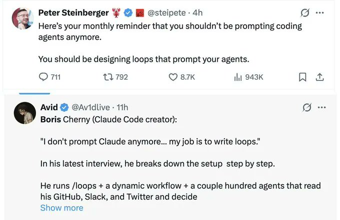
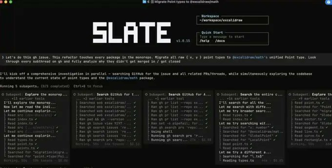
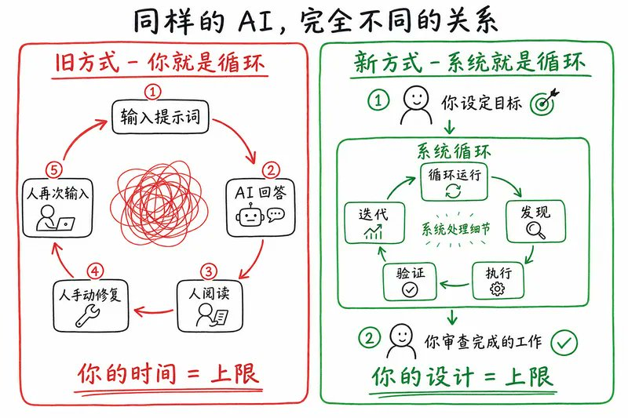
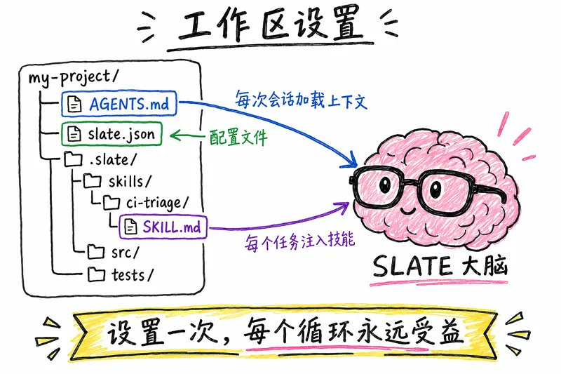
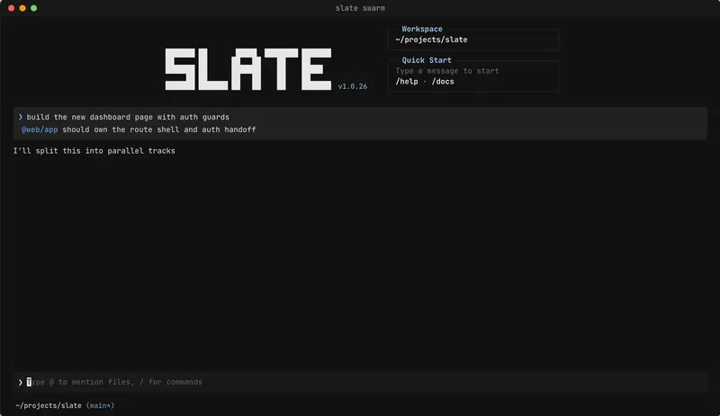
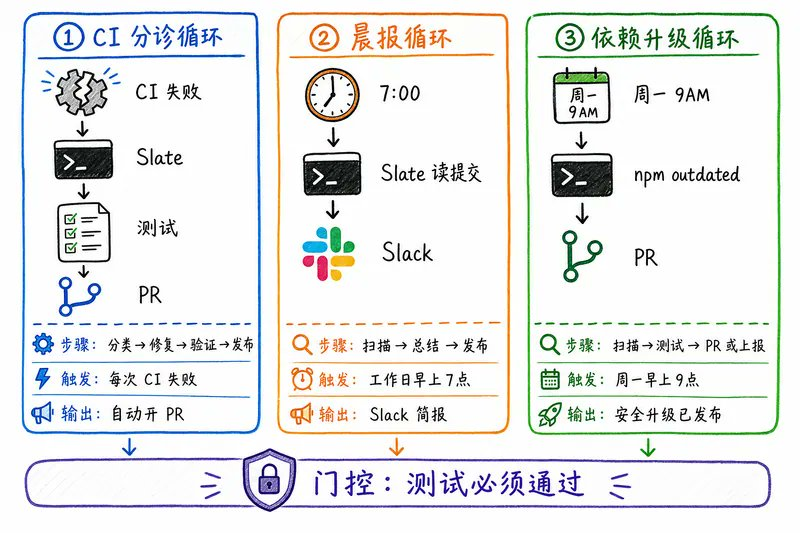

# 如何在 2026 年构建你的第一个 AI 循环



上个月，两位最顶级的 AI 工程师说了同一件事。

Peter Steinberger,OpenClaw 的作者，现在在 OpenAI:

“你不应该再手动给编程代理写提示词了。你应该设计循环，让循环去提示你的代理。”

Boris Cherny,Anthropic 的 Claude Code 负责人：

“我不再手动提示 Claude 了。我有循环在跑，它们提示 Claude，自己搞清楚该做什么。我的工作是写循环。”

大部分人看到这话的第一反应：这到底什么意思？

更重要的是：我该怎么建一个？

这篇文章就是告诉你怎么做的。

不讲空头理论，代码配着上下文一起给。真实步骤，真实命令，复制就能跑。



Slate 正在调度 GPT-5.6、Claude 和专门的子代理，并行处理一个真实的迁移任务。模型变聪明了。但更大的变化是，像 Slate 这样的工具终于能让这些模型持续保持忙碌，而不是等着人来提示。

写提示词。等。看输出。手动修。再写一个提示词。

你就是那个循环。

每一步都要经过你。AI 等着。你决定。AI 再等。

你一停，所有东西都停了。

2026 年跑得最快的那批人，不是在写更好的提示词。

他们在搭系统，让系统替自己写提示词。

杠杆点变了。

从敲提示词，变成了设计循环。



GPT-5.6 没有让循环变得不需要。

它让循环变得更有价值。

模型越强，让它闲在两次提示词之间，代价就越大。

在终端工作流里，GPT-5.6 明显更擅长这些：

→ 理解大型代码库

→ 保持实现的一致性

→ 跟踪多步骤计划

→ 从失败的尝试中恢复

→ 扮演严格的验证者

结果不是“提示词写得更好了”。

而是每个任务需要的人工干预更少了。

简单说：

提示词回答一次就停了。

循环会一直干，直到活儿真的干完。

不是生成一个答案就算完。

是达到一个验证过的结果。

每个正经的 AI 代理，底层都跑着同一个循环：

→ 发现 — 有什么需要做？ → 执行 — 去做 → 验证 — 真的成了吗？ → 迭代 — 没成？修了重来 → 停止 — 条件满足，或撞到硬上限

Claude Code.Cursor.Codex.

底层都是这个循环。

提示词和循环的区别不在于模型。

在于有没有东西检查结果，然后一直干到通过为止。


大多数循环死在这里。

一个循环只有在 4 个条件同时满足时，才对得起搭建成本。

少一个，循环的成本就比收益高。

1. 任务会重复。至少每周一次。一次性任务，一个好的提示词就够了。
2. 验证是自动化的。得有个东西能在你不在的时候判定不合格。测试。Lint。构建。类型检查。没有门槛 = 代理给自己改作业。
3. 你的 token 预算扛得住浪费。循环每次迭代都会重新读全部上下文。它们重试、探索、烧 token，不管最终有没有产出。这是没人提的成本。
4. “完成”是客观的。测试通过或不通过。构建能编译或不能。不是“看起来不错”。如果“完成”需要人的判断，就别自动化。

4 条全过 → 建循环。

任何一条不过 → 用提示词。

说实话：大多数开发者暂时还不需要重型循环。但每个人都能用的是一个简单循环。我们马上就搭一个。

Slate 就是为这个场景设计的 AI 编程代理 — 在你的终端里跑长时间、并行、多步骤的任务。

RandomLabs 开发的。第一个专门为群体调度设计的代理。

跟 Claude Code 或 Cursor 有什么不同：

→ 每一步自动选合适的模型。用 Claude 做规划，用另一个模型搜索，用 Codex 执行 — Slate 自己决定。 → 跨代码库同时跑多个并行子代理 → 跨多小时的长会话自己管理上下文 → 跟你一起工作 — 不只是替你干活

一行装好：

```plaintext
npm i -g @randomlabs/slate
```

进到你的项目里，启动：

```plaintext
cd /path/to/your/project
slate
```

这会打开 Slate 的 TUI — 一个终端界面，你在里面给它任务，看它干活。


在 Slate 能对你的项目跑循环之前，它需要先理解你的代码库。

在项目根目录建一个 AGENTS.md 文件。这是 Slate 每次会话开始时读的上下文。

```plaintext
# AGENTS.md

## What this codebase does
[One paragraph description of the project]

## Architecture
- src/api/ — Express API routes
- src/services/ — Business logic
- src/db/ — Database models (PostgreSQL via Prisma)
- tests/ — Jest test suite

## Key commands
- npm test — run the full test suite
- npm run build — TypeScript compile
- npm run lint — ESLint check
- npm run typecheck — tsc --noEmit

## Rules
- Never modify src/billing/ or src/auth/ without human approval
- Always run tests before marking any task complete
- Use the existing error handling pattern in src/utils/errors.ts

## Environment
- .env.slate contains all env vars Slate needs
```

Slate 启动时自动读这个文件 — 不用每次会话贴一遍。

在 Slate 里添加你的工作区目录：

```plaintext
/workspace add ./src
/workspace add ./tests
/workspace list
```

也可以用 @ 提及直接引用具体文件：

```plaintext
Please review @src/api/routes.ts and suggest improvements
```



在项目根目录建一个 slate.json，控制 Slate 的行为。

```plaintext
{
  "$schema": "https://randomlabs.ai/config.json",
  "permission": {
    "*": "allow",
    "bash": "ask"
  },
  "models": {
    "main": { "default": "anthropic/claude-opus-4.6" },
    "subagent": { "default": "anthropic/claude-sonnet-4.6" },
    "search": { "default": "anthropic/claude-haiku-4.5" },
    "reasoning": { "default": "openai/gpt-5.6" }
  }
}
```

各配置含义： → “*”: “allow” — Slate 可以读写文件，不用每次问你 → “bash”: “ask” — Slate 跑 shell 命令前会先问你（在你信任它之前保持开着） → 模型配置 — 搜索用便宜快速的模型，主推理用贵的大模型

如果你想在 CI 或自动化场景里零交互跑：

```plaintext
slate run "Run the test suite and fix any failures" --dangerously-skip-permissions --output-format stream-json
```

在建循环之前，先确保手动跑一次是靠谱的。

这是最容易被跳过的步骤。也是大多数循环在生产中失败的原因。

给 Slate 一个真实任务：

```plaintext
Please review the architecture of my entire codebase.
Create an ARCH.md with:
- current structure
- dependencies between modules
- 3 things to improve
Look at @src/ first, then @tests/
```

看 Slate 怎么干活。它会：

1. 搜索你的文件
2. 建立对架构的理解
3. 起草 ARCH.md
4. 在停下来之前，对照你的要求检查一遍

这已经是一个迷你循环了 — 它在完成前会检查自己的输出。

再试一个更长的任务：

```plaintext
Hey Slate, research my codebase for the authentication flow,
then make a plan for adding OAuth2 support.
Make sure you look at @src/auth/ and @src/api/routes.ts
```

Slate 给出一个计划。你在此基础上迭代：

```plaintext
No, don't add a new auth provider class.
Make it follow the same pattern as the existing ApiKeyAuth in src/auth/api-key.ts
```

批准计划。Slate 自主执行。


Skill 就是你不用每次会话都重新解释一遍项目的方法。

写一次。Slate 在每次相关运行时读它。

建目录结构：

```plaintext
mkdir -p .slate/skills/ci-triage
touch .slate/skills/ci-triage/SKILL.md
```

写技能：

```plaintext
---
name: "ci-triage"
description: "Classify CI failures by root cause and draft fixes for the easy ones."
---

# CI Triage Skill

## What I do
When a CI run fails, I:
1. Read the test output
2. Classify the failure: env issue / flaky test / real bug / dependency bump / infra
3. Draft fixes for bugs and dependency issues
4. Escalate env and infra issues to humans

## Classification rules
- env: missing secret, wrong env var → flag for human
- flake: passes on retry without code change → retry once, then file issue
- bug: deterministic failure tied to recent commit → draft fix
- dependency: failure tied to version bump → draft rollback PR
- infra: timeout, OOM, runner issue → escalate immediately

## Fix patterns
- Auth test failures → check src/auth/middleware.ts first
- Database test failures → verify migration ran in CI env
- E2E failures → check UI selectors against latest snapshot

## Never do
- Disable failing tests
- Modify CI config without asking
- Touch src/billing/ or src/payments/

## State
Update STATE.md after every run:
- Files checked
- Classifications made
- PRs opened
- Items escalated
```

在 Slate 里列出可用技能：

```plaintext
/skills
```

手动激活一个：

```plaintext
@ci-triage please triage today's failing tests
```

或者 Slate 在判断某个技能跟当前任务相关时，会自动激活。

代理会忘事。

文件不会。

在项目根目录建 STATE.md：

```plaintext
# Loop State — CI Triage

## Last run
2026-06-28 03:30 UTC — 7 failures classified, 3 fixes drafted, 4 escalated

## In progress
- claude/fix-auth-token-refresh — tests passing locally, awaiting CI
- claude/fix-flaky-payment-webhook — retry pattern applied, monitoring

## Completed
- claude/bump-axios-1.7.4 → merged (CI green)
- claude/lint-fix-pass-june-28 → merged

## Escalated to humans
- src/billing/refund.ts — tests failing in 3 ways, root cause unclear
- ci/staging-runner — infra timeouts, not a code issue

## Lessons learned
- 2026-06-27: PowerShell hits TLS 1.2 issue on this Windows runner. Use bash.
- 2026-06-26: tests/e2e/checkout requires Stripe webhook secret in env. Skip if missing.
```

在 AGENTS.md 里加上这段，让 Slate 每次会话开始时都读它：

```plaintext
## Session start
Always read STATE.md first. Pick up where the last run stopped.
Update STATE.md at the end of every run with what was done and what is next.
```

没有状态：每次都从零开始。

有了状态：每次接着上次的继续，持续积累。

现在你有了：

→ 工作区搭好了（AGENTS.md） → 配置设好了（slate.json） → 手动跑通验证过了 → 写了一个技能（ci-triage） → 状态文件建好了（STATE.md）

该把它包成一个真正的循环了。

方案 A：队列文件循环（最简单）

建一个 loop.md：

```plaintext
Read STATE.md to understand what was already tried.

Run the CI triage skill across all failing tests in the last build.

For each failure:
- Classify it using the ci-triage skill rules
- Draft a fix for bugs and dependency issues
- Escalate env and infra issues

Run the fixes. Check if tests pass.
If tests pass → open PR.
If tests still fail → record in STATE.md and stop.

Update STATE.md with everything done this run.

Hard stop: 8 attempts maximum. On limit, report current state.
```

跑起来：

```plaintext
slate --queue loop.md
```

Slate 读队列文件，把每个块当作一条排队的消息来执行。

方案 B：无头/CI 循环（自动化）

在 GitHub Action 或 cron job 里非交互运行：

```plaintext
slate run "$(cat loop.md)" --output-format stream-json --dangerously-skip-permissions
```

在 GitHub Actions 工作流里：

```plaintext
name: CI Triage Loop
on:
  workflow_run:
    workflows: ["CI"]
    types: [completed]

jobs:
  triage:
    if: ${{ github.event.workflow_run.conclusion == 'failure' }}
    runs-on: ubuntu-latest
    steps:
      - uses: actions/checkout@v4

      - name: Install Slate
        run: npm i -g @randomlabs/slate

      - name: Run triage loop
        env:
          SLATE_API_KEY: ${{ secrets.SLATE_API_KEY }}
        run: |
          slate run "$(cat loop.md)" \
            --output-format stream-json \
            --dangerously-skip-permissions \
            --workspace ./src \
            --workspace ./tests
```

现在每次 CI 失败都自动触发分诊循环。

不需要人，除非要上报。


对任何循环来说，最重要的结构性改进。

永远不要让同一个代理给自己改作业。

写修复的模型当裁判太宽容了。

在 Slate 里，你可以给不同角色设不同的模型：

```plaintext
{
  "models": {
    "main": { "default": "anthropic/claude-opus-4.6" },
    "subagent": { "default": "anthropic/claude-sonnet-4.6" },
    "search": { "default": "anthropic/claude-haiku-4.5" }
  }
}
```

然后在任务里让 Slate 自然地用上这个分工：

```plaintext
Please fix the failing auth tests.

Step 1: Have a search agent explore src/auth/ to understand the current implementation.
Step 2: Have a separate agent implement the fix based on what was found.
Step 3: Have a third agent verify the fix against the original test requirements —
        this agent should NOT have seen the implementation.
Step 4: Only open the PR if the verifier approves.
```

Slate 自动调度这些子代理。

搜索代理用快速便宜的模型。实现代理用更强的模型。验证者用一个严格的模型，看不到实现者的推理过程。

这种分工就是 Slate 能在一个任务上跑 5 个并行子代理的原因 — 每个专门化，每个相互隔离。



对于跑几小时甚至几天的任务，在你的任务提示词里用这个模式：

```plaintext
You are running a multi-session loop.

GOAL: Migrate all Express routes to the new ApiError pattern.
Track progress in STATE.md.

START OF EVERY SESSION:
1. Read STATE.md
2. Find the first incomplete item in "Remaining routes"
3. Do that item only

END OF EVERY SESSION:
1. Move completed items to "Done routes" in STATE.md
2. Record any blockers in "Blockers"
3. Update "Last run" timestamp
4. Stop cleanly

STATE.md format:
---
## Done routes
- [x] /api/users (2026-06-27)
- [x] /api/auth/login (2026-06-28)

## Remaining routes
- [ ] /api/payments/checkout
- [ ] /api/payments/refund
- [ ] /api/admin/users

## Blockers
- /api/payments/refund — requires human review (touches billing logic)

## Last run
2026-06-28 14:30 UTC
---

HARD RULES:
- Never touch src/billing/ without human approval
- Always run tests after each route migration
- Stop after completing ONE route per session
```

每天早上跑一次：

```plaintext
slate --continue "$(cat loop.md)"
```

--continue 会接着最近一次会话继续，而不是从头开始。

每天一条路由。STATE.md 记录一切。

循环精准地停在上次停的地方。

在 slate.json 里加自定义斜杠命令，让你的循环一键触发：

```plaintext
{
  "command": {
    "triage": {
      "description": "Run CI triage loop",
      "template": "Read STATE.md. Run the ci-triage skill on all failing tests. Update STATE.md when done.",
      "agent": "build"
    },
    "review": {
      "description": "Review a file for correctness",
      "template": "Review @$ARGUMENTS for correctness, edge cases, and consistency with surrounding code."
    },
    "migrate": {
      "description": "Migrate one route to ApiError pattern",
      "template": "Read STATE.md. Migrate the next incomplete route to ApiError pattern. Run tests. Update STATE.md."
    }
  }
}
```

现在在 Slate 里：

```plaintext
/triage
/review src/api/payments.ts
/migrate
```

每条命令瞬间跑你预先写好的循环提示词。

循环 1：CI 失败分诊（就是上面搭的那个）

什么时候跑：每次 CI 失败 做什么：分类 → 修简单的 → 上报难的 → 开 PR 状态：STATE.md 门槛：测试通过 搭建时间：30 分钟

```plaintext
# trigger
slate run "$(cat loop.md)" --dangerously-skip-permissions --output-format stream-json

# or in GitHub Actions — see Step 6 above
```

循环 2：晨报

什么时候跑：工作日早上 7 点（cron job） 做什么：扫描过去 24 小时的提交、PR 和未关闭的 issue → 写一份 5 条要点简报 → 发到 Slack

```plaintext
# loop.md for morning brief
cat > morning-brief-loop.md << 'EOF'
Read the last 24 hours of:
- git log --since="24 hours ago" --oneline
- Open PRs in draft or review
- GitHub Issues opened or updated in the last 24h

Write a morning brief:
- 3 most important things that happened
- 2 things that need attention today
- 1 thing at risk of blocking someone

Keep it under 120 words. Post to the #engineering Slack channel.
EOF

# run on a schedule with cron
0 7 * * 1-5 slate run "$(cat morning-brief-loop.md)" --dangerously-skip-permissions
```

循环 3：依赖升级循环

什么时候跑：每周一 做什么：扫描过期的包 → 测试兼容性 → 给安全的升级开 PR

```plaintext
cat > deps-loop.md << 'EOF'
Read STATE.md.

Run: npm outdated

For each outdated package:
1. Check if the version bump is major (breaking) or minor/patch (safe)
2. For minor/patch: update the package, run npm test
3. If tests pass: open a PR
4. If tests fail: record in STATE.md as "needs human review"
5. For major bumps: always escalate to humans

Hard rules:
- Never bump more than 5 packages in a single loop
- Never bump packages in the "peer dependencies" section
- Always run the full test suite after each bump, not just related tests

Update STATE.md with what was bumped and what was escalated.
EOF

# run every Monday
0 9 * * 1 slate run "$(cat deps-loop.md)" --dangerously-skip-permissions
```



在排任何定时任务之前，先了解这些。

Ralph Wiggum 循环

代理在活儿只干了一半的时候就宣布完成。

提前退出。循环还在默默地花钱。

修法：用一个新的模型来检查硬停止条件。

```plaintext
STOP CONDITION: All tests in tests/auth/ pass AND lint returns 0.
Verify using a separate check run, not the agent's own judgment.
Hard limit: 8 iterations. On limit: report state and stop.
```

目标漂移

在长会话里，早期的约束会慢慢消失。

第 3 条消息里的“永远别碰 src/billing/”，到第 47 条消息就没了。

修法：加一个 VISION.md，Slate 每次会话开始时重新读。

```plaintext
# VISION.md — Read at start of every session

## Core goal
Migrate all Express routes to ApiError pattern.

## Hard constraints (never violate)
- Never touch src/billing/ without human approval
- Never disable failing tests
- Always run full test suite before opening any PR

## Current priority
Routes in src/api/payments/ — handle with extra care
```

自我偏好

制作者给自己改作业。永远给自己打通过。

修法：验证子代理完全看不到制作者的推理过程。

明确告诉 Slate：

```plaintext
The verifier agent should NOT see the implementation agent's work.
It should only see: the original test requirements and the test output.
If tests pass → approve. If tests fail → reject. No opinion otherwise.
```

代理偷懒

循环在部分完成时就说“差不多了”。

尤其是在成功标准模糊的时候。

修法：只用客观的停止条件。

```plaintext
DONE WHEN: npm test returns exit code 0 AND npm run lint returns exit code 0.
Not when "tests look good." Not when "most tests pass."
Exit code 0 on both commands. That is the only done.
```

几个让 Slate 在实践中跟其他代理不一样的地方。

干活时排队消息

Slate 正在跑一个长任务。你突然想到一件重要的事。

按 Tab 把消息排队 — 它在当前任务跑完后才执行，不打断。

```plaintext
[Slate is working on migration task...]

You: Actually, make sure the new pattern also handles the case where userId is null
[Tab — queued]

[Slate finishes current step, then reads your queued message]
```

中途纠偏

如果 Slate 走错方向了，你不用停掉它：

```plaintext
[Slate is halfway through implementing the fix...]

You: Wait — don't add a new class for this. Use the existing BaseError in src/utils/errors.ts
[Enter — steers immediately]

Slate: Understood, switching approach to use BaseError...
```

用 /enter-mode-next 在 纠偏 / 排队 / 打断 三种模式间切换。直接跑 shell 命令

在 Slate 会话里直接跑命令，不用切到另一个终端：

```plaintext
!npm test # run tests and send output to Slate
!git diff HEAD # check what changed
!git status # see current state
```

Slate 读取输出，用在下一步行动里。

团队场景的服务器模式

把 Slate 跑成服务器，从多个终端连上去：

```plaintext
# Terminal 1 — start server
slate serve --port 7777

# Terminal 2 — attach TUI
slate attach http://localhost:7777 --dir /path/to/project
```

适合跟 Slate 结对编程，或在远程机器上跑。

跑你的第一个真正的循环之前：

```plaintext
□ npm i -g @randomlabs/slate installed
□ AGENTS.md created with project overview, commands, rules
□ slate.json created with permissions and model config
□ One manual run completed and verified reliable
□ SKILL.md written for your first repeated task
□ STATE.md created and referenced in AGENTS.md
□ loop.md written with explicit stop condition
□ Hard limit on iterations (8 max to start)
□ Verifier is NOT the same agent as the maker
□ Human review gate on any irreversible action (PRs, deploys)
```

排任何定时任务之前，每一项都打勾。

漏一项，循环要么静默失败，要么白烧你的钱。

当你理解了这个模式之后，瓶颈就从“怎么搭循环”变成了“下一个该搭什么循环”。

当你在同一个地方看到 20 个跑着的循环，你就不会再想一次性提示词了。

两个 builder 跑完全相同的循环，结果可以完全相反。

一个用它来加速自己已经深入理解的工作。

另一个用它来逃避理解工作本身。

循环不知道两者的区别。

你知道。

设计循环比写提示词更难 — 不是更简单。

重点不是工作变简单了。

是杠杆点变了。

去搭循环。

但要像一个打算继续当工程师的人那样搭。

不是像一个只负责按启动键的人。

新的 GPT-5.6 不会取代这个原则。如果有什么影响的话，反而是强化了它。

前沿不再是谁能写出最聪明的提示词。

而是谁能围绕越来越强的模型，设计出最好的系统。

循环是什么：

→ 提示词 = 问题。循环 = 工作。

→ 发现 → 执行 → 验证 → 迭代 → 停止

4 条件测试：

→ 任务重复 / 验证自动化 / 预算扛得住浪费 / 完成是客观的

5 个搭建步骤：

→ AGENTS.md → slate.json → 一次手动跑通 → SKILL.md → STATE.md

然后包起来：

→ loop.md 队列文件 或 CI 里的无头 slate run

失败模式：

→ Ralph Wiggum（提前退出）/ 目标漂移（忘了约束）/ 自我偏好（制作者 = 检查者）/ 代理偷懒（差不多了）

Slate 的优势：

→ 每步自动选模型 → 并行子代理带隔离 → 长会话管理 → 你的循环，你设计

→ 转发给你认识的每个 builder → 关注 [@sairahul1](https://x.com/@sairahul1) 获取更多这类系统内容 → 收藏这篇 — 光是搭建清单就值得存一份

我写 AI、做产品、以及你睡觉时也在跑的系统。

本文由 [YouMind](https://youmind.com/landing/markdown-to-x-article?utm_source=export-to-x-article) 自动从 Markdown 转换排版。