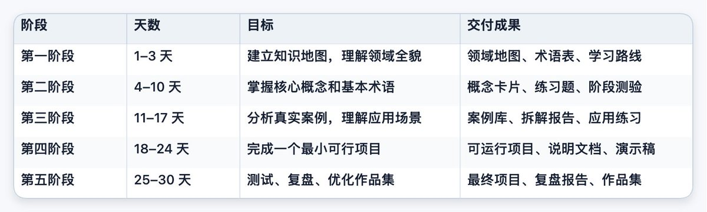

# 如何使用 Codex 快速入门任何一个领域

很多人只把 Codex 当作写代码的工具，但更高效的用法是，把它当成一个可以帮你搭建学习系统、维护知识仓库、生成练习、检查成果、推进项目的「领域学习工程师」。

Codex 的优势不只是回答问题。它可以在项目目录里读写文件、运行命令、修改代码，同时执行测试、linter、type checker 等自动化检查。OpenAI 官方文档也明确指出，Codex 能够在代码库中回答问题、编辑文件并运行相关命令。更重要的是，Codex 支持通过 AGENTS.md 写入项目级长期指令——它在开始工作之前会先读取这个文件，并且支持全局指令与项目级指令叠加。此外，Codex Skills 可以将某一类任务封装成可复用的能力，一个 Skill 通常是一个包含 SKILL.md 的目录，还可以附带脚本和参考资料。

理解了这些能力之后，用 Codex 学一个领域的正确方式就不再是——

> 请给我讲讲 AI Agent。

而是让它帮你创建：

> 一个可运行、可迭代、可测试、可复盘的学习仓库。

## 一句话方法

用 Codex 为某个领域创建一个「学习项目仓库」，里面包含知识地图、核心概念、案例库、练习题、测验、项目、复盘记录和个人进度。然后让 Codex 每天根据你的掌握情况，动态调整学习路径。

这就是 Codex 和普通聊天式学习的分水岭：

ChatGPT 更适合把知识讲明白；Codex 更适合把学习过程工程化、文件化、项目化、自动化。

## 第一步：创建领域学习仓库

以学习「AI Agent」为例。在终端中进入工作目录，启动 Codex：

```bash
mkdir learn-ai-agent && cd learn-ai-agent && codex
```

然后输入：

```plaintext
我要用 Codex 快速掌握一个新领域：AI Agent。

请你在当前目录创建一个领域学习仓库，结构如下：

learn-ai-agent/
├─ AGENTS.md
├─ README.md
├─ 00_domain_map.md
├─ 01_core_concepts/
├─ 02_case_studies/
├─ 03_exercises/
├─ 04_projects/
├─ 05_flashcards/
├─ 06_quizzes/
├─ 07_daily_review/
├─ 08_glossary.md
└─ progress.md

请完成以下任务：

1. 创建上述目录和文件。
2. 在 README.md 中说明这个学习仓库的使用方法。
3. 在 00_domain_map.md 中生成 AI Agent 的知识地图。
4. 把 AI Agent 拆成从入门到进阶的学习模块。
5. 每个模块都要包含：概念解释、生活类比、真实案例、练习题、输出任务、验收标准。
6. 每天学习都必须有一个可交付成果。
7. 不要只生成文章，要生成练习、测验、项目和复盘任务。
8. 创建 AGENTS.md，规定以后必须按照「解释 → 示例 → 练习 → 检查 → 复盘」的流程教学。
9. 创建 progress.md，用于记录学习进度、错题、薄弱点和下一步计划。
10. 最后生成一份 30 天学习路线。
```

整个仓库中最关键的文件是 AGENTS.md。它不是普通笔记，而是这个学习仓库的「长期规则文件」——写给 Codex 的项目说明书。建议让 Codex 写入如下规则：

```plaintext
# AGENTS.md

你是我的领域学习工程师。

本仓库的目标是帮助我在 30 天内掌握 AI Agent，并完成一个可展示的小项目。

你的教学流程必须遵守：

1. 先给全局地图，再讲局部细节。
2. 每个概念必须包含：一句话解释、生活类比、技术解释、真实案例、一个练习。
3. 不允许只讲理论，每天必须安排可交付任务。
4. 每次学习后必须更新 progress.md。
5. 每周必须安排一次阶段测试。
6. 我答错时，不要只给答案，要判断错误类型：不懂概念 / 不会应用 / 表达不清 / 知识混淆。
7. 根据我的薄弱点调整后续学习计划。
8. 最终目标是帮助我完成一个可展示的小项目。
```

有了这个文件，Codex 就不再是一次性问答机器，而是一台按规则运行的教学引擎。

## 第二步：先建立知识地图，不要直接学细节

学习一个新领域，最怕一上来就扎进资料海。正确顺序是：

> 先看地图 → 再学概念 → 再看案例 → 再做练习 → 最后做项目。

给 Codex 输入：

```plaintext
请用费曼学习法帮我建立 AI Agent 的知识地图。

请输出：

1. AI Agent 这个领域到底解决什么问题。
2. 用小学生也能听懂的话解释 AI Agent。
3. 这个领域最重要的 20 个核心概念。
4. 这些概念之间的关系。
5. 初学者最容易混淆的 10 组概念。
6. 从入门到能做项目，需要经历哪 5 个阶段。
7. 每个阶段必须做出的作品。
8. 最小必要知识清单，只保留真正必须学的内容。
9. 暂时不需要学的内容，避免分心。
10. 建议的学习顺序。
```

你要让 Codex 做的不是「堆资料」，而是「压缩领域」。可以让它把知识拆成三类：

- 必须先懂的 20%：决定你能不能入门。
- 暂时跳过的 60%：现在学了也用不上。
- 以后深入的 20%：做项目后再回来补。

这一步的目标不是学完，而是建立清晰的方位感：我现在在哪里，我要学什么，哪些东西先不用管，最后要做出什么作品。

## 第三步：让 Codex 生成「学习 Skill」

当你发现自己会反复学习不同领域时，可以把这套方法封装成一个可复用的 Codex Skill。输入：

```plaintext
请为我创建一个 Codex Skill，名字叫 domain-learning-master。

用途：当我输入「我要学习某个领域」时，自动帮我搭建一个领域学习系统。

请按照 Codex Skills 的目录规范创建：

domain-learning-master/
├─ SKILL.md
├─ references/
├─ scripts/
└─ templates/

这个 Skill 需要支持：

1. 建立领域知识地图。
2. 拆解核心概念。
3. 生成 30 天学习计划。
4. 每天安排一个学习任务。
5. 自动生成练习题和测验。
6. 根据答案指出知识漏洞。
7. 把错题、薄弱点和学习进度写入 progress.md。
8. 每 7 天进行一次阶段测试。
9. 最后引导完成一个小项目。
10. 为不同领域生成对应的项目仓库结构。
```

让 Codex 生成的 SKILL.md 应该包含清晰的工作流程和每日教学格式。这样，Codex 就不再只是临时回答你一次，而是拥有了一套可复用的「学习操作系统」——学一个新领域，一条命令启动一个完整的学习项目。

## 第四步：每天用「输入—输出」方式学习

不要问「请教我机器学习」——这太宽泛，Codex 很容易给你一篇泛泛而谈的说明文。

你应该这样问：

```plaintext
今天是第 3 天。请根据 progress.md 安排今天的学习。

要求：

1. 先复习昨天的 5 个关键点。
2. 检查我昨天的薄弱点。
3. 给我讲今天的 3 个核心概念。
4. 每个概念必须包含：一句话解释、生活类比、技术解释、小案例。
5. 给我 5 道检测题。
6. 给我一个 60 分钟内能完成的小任务。
7. 给出任务验收标准。
8. 等我完成后，请检查我的答案。
9. 根据我的表现更新 progress.md。
10. 生成明天的学习建议。
```

每天结束时再输入一段复盘指令，让 Codex 总结你掌握了什么、没掌握什么、薄弱点属于哪一类错误（概念不清 / 不会应用 / 表达不清 / 知识混淆），把错题写入 progress.md、更新术语表、生成今日知识压缩卡、安排明天的学习任务。

这样一来，学习就不再是一次性聊天，而是一个持续演化的项目。Codex 会负责维护 progress.md、术语表、知识卡片、测验题库、每日复盘和项目成果——你只需要每天完成任务、提交答案、复盘错误。

## 第五步：每个领域都必须做一个小项目

真正掌握一个领域，不是「听懂了」，而是「能做出来」。用下面的模板让 Codex 根据你的基础设计一个最小可行项目：

```plaintext
我不想只学理论。请帮我设计一个最小可行项目，用来验证我是否真正掌握了这个领域。

领域：AI Agent
我的基础：编程初级
时间：7 天
目标：做出一个可以展示的作品

请输出：项目名称、一句话介绍、核心功能、所需知识点、每天任务安排、每天可交付成果、验收标准、最终展示方式。如果我不会代码，请给我低代码方案。如果要继续进阶，请给我升级方向。
```

不同领域可以对应不同的最小项目——AI Agent 可以做一个自动整理资料的 Agent，提示词工程可以搭建个人提示词模板库，数据分析可以做销售看板，写作可以做选题-大纲-初稿-修改工作流。项目越小越好，但必须完整：能运行、能展示、能解释、能迭代、能证明你真的学会了。

## 第六步：让 Codex 扮演「考官」，不要只当老师

学习最快的人，不是听得最多的，而是被检测最多的。学完一个阶段后，输入：

```plaintext
请不要继续讲新知识。现在你是严格考官。

请根据当前学习仓库里的内容，对我进行一次阶段测试。

测试形式：10 道选择题、5 道概念解释题、3 道场景应用题、1 道综合项目题。

要求：先出题不要给答案，我回答后再评分。给出每题得分和总分。指出错误原因并判断错误类型（不懂概念 / 不会应用 / 表达不清 / 知识混淆）。把薄弱点写入 progress.md，重排后续学习计划，并给我 3 个针对性补救练习。
```

这一步至关重要。你真正需要的不是更多知识，而是发现：哪些东西你以为懂了其实没懂？哪些你能听懂但不能用？哪些你知道概念但说不清楚？哪些是你最该补的短板？

## 第七步：用「领域压缩卡」快速复习

每学完一天或一个模块，让 Codex 生成一张压缩卡：

```plaintext
请把我今天学的内容压缩成一张领域知识卡。

格式：一句话解释、5 个关键词、3 个典型应用场景、2 个常见误区、1 个经典案例、1 道自测题、和前面知识的连接关系、我最容易忘的点、下次复习时间建议。

请保存到 05_flashcards/。
```

30 天后，你会拥有一套独属于自己的领域卡片库。这些卡片不是别人给你的资料，而是根据你的学习过程、错题和项目经验生成的个人知识资产。

## 最强通用提示词模板

以后学习任何领域，都可以直接套用下面这段：

```plaintext
我要用 Codex 快速掌握一个新领域。

领域：{填写领域}
我的背景：{填写基础}
每天时间：{填写时间}
目标：{考试 / 工作 / 做项目 / 写文章 / 做产品 / 投资研究}
最终作品：{想做出的作品，不确定也可以让你推荐}

请你作为我的领域学习架构师，完成以下任务：

1. 创建一个学习仓库。
2. 生成该领域的知识地图。
3. 拆出最重要的 20 个核心概念。
4. 制定 30 天学习路线。
5. 每天安排「学习 + 练习 + 输出 + 测验」。
6. 创建术语表、错题本、案例库、项目目录。
7. 用 AGENTS.md 固化学习规则。
8. 每次学习后更新 progress.md。
9. 每 7 天进行一次阶段测试。
10. 最后指导我完成一个可展示的小项目。

学习原则：
- 少讲空话，多做任务。
- 先全局，后细节。
- 先能用，再深入。
- 每天必须有输出。
- 所有知识都要通过练习验证。
- 每个阶段都要有可交付成果。
- 不追求资料多，只追求能理解、能复述、能应用、能做项目。

请先创建仓库结构，然后生成第 1 天任务。
```

## 推荐的 30 天学习节奏



每天开始时问一句「请根据 progress.md 给我安排今天的学习任务」；每天结束时做一次完整复盘——总结掌握了什么、指出没掌握什么、判断薄弱点类型、更新 progress.md 和术语表、生成今日知识卡片、安排明天的任务。

## 最重要的心法

用 Codex 学任何领域，不是让它「喂知识」，而是让它帮你建立五个系统：

知识地图——解决「不知道这个领域有什么」的问题。术语表——解决「听不懂专业词」的问题。练习系统——解决「我以为懂了，其实没懂」的问题。项目系统——解决「学了很多，但不会用」的问题。复盘系统——解决「学完就忘、错了不改」的问题。

真正高效的学习方式是：ChatGPT 负责把知识讲明白，Codex 负责把学习过程工程化，而你负责每天完成任务、提交答案、复盘错误、推进项目。

最终你得到的，不是一堆碎片笔记，而是一个可以持续迭代的个人学习系统。