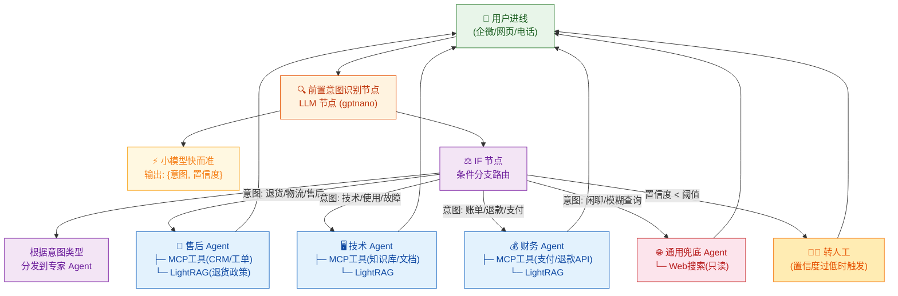
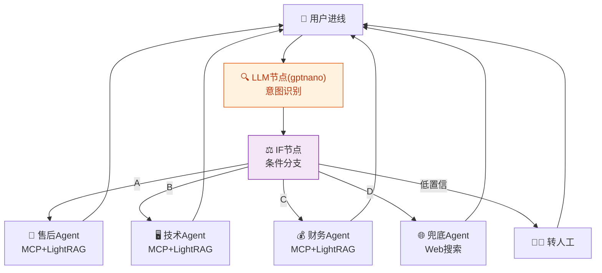
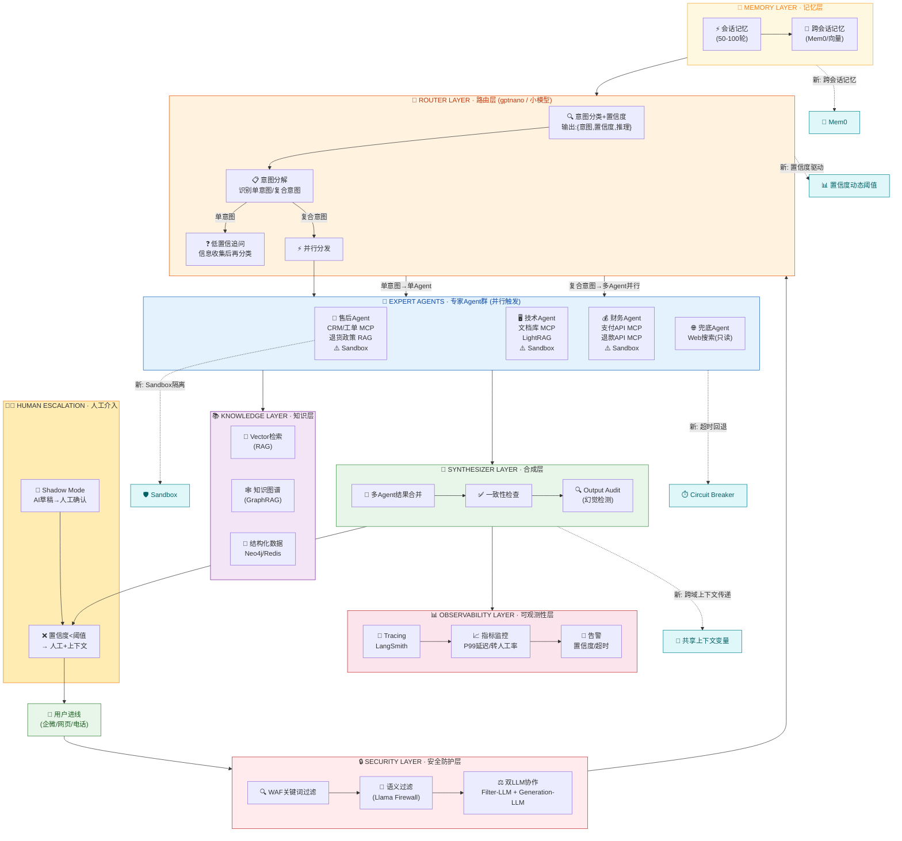

> 研究时间：2026-05-10 | 所属领域：智能客服系统建设 | 研究对象类型：技术架构演进
> 现有架构：LLM节点(gptnano) → IF分支 → 专家Agent(MCP+LightRAG)

# 多专家 Agent 架构演进路径 — 从 Dify 到完整智能客服系统

## 零、你当前架构（现有系统）



> **现有架构特点**：
> - **意图识别**：使用 LLM 节点 + gptnano 模型（小而快），输出结构化 `{意图类别, 置信度}`
> - **路由分发**：IF 节点做硬编码条件分支，非 A 即 B
> - **专家 Agent**：每个 Agent 绑定专属 MCP 工具 + LightRAG 知识库
> - **转人工**：仅在置信度低于阈值时触发

## 一、你当前架构的优化空间

你的架构是经典的「Router + Expert Agents」模式，结构是对的，但有 6 个明显的优化空间。

### 1. 意图识别节点太薄 — 没有置信度机制

Dify 的 Question Classifier 只返回类别，不返回置信度。这意味着你无法区分「用户明确在说退货」和「用户模糊提到商品有问题」。85% 的自动路由率来自 Dify 自己团队的做法，核心是他们对低置信度 case 做了**强制人工复核分支**。你的架构缺这层。

### 2. 专家 Agent 没有记忆隔离 — 上下文污染

当一个用户在「售后 Agent」聊了 5 轮后切换到「技术 Agent」，技术 Agent 拿到的是什么？如果是共享 Conversation History，那它会看到售后上下文（用户骂过产品），这会污染它的判断。NotebookLM 的做法是每个 notebook 有独立的 Source Grounding，你的每个专家 Agent 也应该有独立的**领域上下文窗口**，不应该共享全局记忆。

### 3. 工具层没有 Sandbox 隔离

你接了 MCP 工具和 LightRAG 工具——这是对的。但 NotebookLM 的核心设计原则是 **Sandbox**：Writer Agent 不应该能访问外部搜索，它只能基于 Researcher 给的 context 工作。你的专家 Agent 目前应该是自由调用工具的，但没有「哪些 Agent 能调用哪些工具」的边界控制。如果 Billing Agent 不小心拿到了 RAG 里不该看到的政策文档，就会有合规风险。

### 4. 缺少「复合意图」处理

用户说「我想退货，而且想知道退款多久到账」——这是一个意图同时触发售后 + 财务两个专家。LangGraph 那边叫 **Decompose + Parallel + Synthesize**，你的 IF 节点只能处理「二选一」，处理不了「多选且需要合并结果」。这是最大的一处能力缺口。

### 5. 意图识别模型和推理模型混用

你很可能所有节点都在用同一个模型。2026 年的最佳实践是：**意图分类用小模型快而准**（Qwen2.5-7B / DeepSeek-Coder-1.3B 即可），专家推理用大模型。这不是省钱的问题，是意图识别本身不需要那么强的推理能力，用好模型反而会因为「想太多」而分错类。

### 6. 没有回退机制和逃生舱

Dify 的 Error Handling 节点支持 Retry on Failure（最多 10 次重试 + 可配置间隔）+ Fail Branch（预设回退路径），相当于轻量级的 Circuit Breaker。工具调用失败、超时、LLM 异常都可以触发分支回退。**这其实是 Dify 的强项**，不是缺口。

### 7. Agent 跳过工具执行、模拟成功（幻觉）

这是 Dify 一个已知的间歇性 bug（Issue #31722）：Agent 有时会跳过实际工具调用，自己「编一个成功结果」而不是真实执行（无操作但返回成功）。解决方案：System Prompt 必须强制要求输出 `action`+`action_input` 的 JSON 格式；增加独立的验证节点（LLM）确认工具返回的结果是否和 Agent 声称的一致。

### 8. 记忆隔离问题（专家 Agent 上下文污染）

当前多 Agent Chatflow 共享整个对话历史，导致不同领域的 Agent 看到不相关的上下文后产生幻觉。Issue #21640 已提出 Per Node Memory 需求，目前 Dify 仍未原生支持。**Workaround**：每个专家 Agent 拆成独立 Chatflow App，通过 API 调用串联——每个 App 有独立 Memory，历史互不污染。

### 9. 安全防护层（Prompt 注入 / 内容审核）

Dify 提供三层安全原生能力：
- **内置 Moderation Tool**：OpenAI Moderation API + 自定义敏感词 / 关键词过滤，Input/Output 双审核
- **API Extension 审核点**：`app.moderation.input` + `app.moderation.output`，可对接任何审核服务
- **Marketplace 安全插件**：Palo Alto Networks AI Runtime Security（企业级 WAF 级别）、OpenGuardrails（OWASP LLM Top10 防护 + 22 条内置安全规则）、Azure AI Content Safety（文本+图片审核，支持 Docker 私有化部署）

### 10. 多模型协作降幻觉

Dify 支持动态模型路由，可以把 DeepSeek-R1（强推理，幻觉率 12.7%）和 Gemini（低幻觉，<4.3%）串联成 Pipeline：**DeepSeek-R1 负责推理规划 → Gemini 负责最终输出**。测试数据显示综合准确率提升 17.5%，幻觉率降低 67.3%。

### 11. 人工转接（Human Escalation）

Dify 没有内置「转人工」节点，但可以通过 **LLM 节点识别转人工意图** → **HTTP Request 节点调用企业 IM 的 Webhook**（企微/钉钉）→ 携带完整上下文（Conversation Variable 写入用户历史、意图类型、已收集的关键字段）。Conversation Context 通过 Variable 传递，不丢失。

### 12. Annotation Reply（人工审核回复库）

Dify 内置 Annotation Reply 功能，可以预置高质量问答对。当用户问题与 Annotation 相似度超过阈值时，**直接返回人工预置答案**，不触发 AI 生成。这是减少高风险问题幻觉的利器——保险条款、法律问题、精确报价等不允许出错的场景，Annotation 是最稳定的兜底。

---

## 二、Dify 能做什么：完整能力对照表

| 优化空间 | Dify 能力 | 版本/方式 | 备注 |
|---------|----------|----------|------|
| 意图分类+置信度 | ✅ LLM节点输出结构化JSON | 任意版本 | 输出 `{intent, confidence}` |
| 复合意图并行 | ✅ Parallel节点 + 合并LLM | 任意版本 | 单意图+复合意图均可 |
| 大小模型分离 | ✅ 节点级模型选择 | 任意版本 | 意图用gptnano，专家用GPT-4o |
| 跨域上下文传递 | ✅ Conversation Variable | 任意版本 | 共享 order_id/refund 等 |
| 工具超时回退 | ✅ Error Handling Retry + Fail Branch | v0.14.2+ | max=10次重试 |
| 可观测性 | ✅ 原生集成 Langfuse | 任意版本 | Tracing + 节点级耗时 |
| 记忆分层 | ✅ 短期（Memory）+ 长期（Annotation/Knowledge） | 1.7+ | 还有 Per Node Memory 需求未上线 |
| 知识库权限隔离 | ✅ 三级权限（仅所有者/指定成员/全员） | 1.8+ | 天然对应「哪些Agent能读哪些知识」 |
| 定时主动任务 | ✅ 计划任务型Agent（cron） | 1.7+ | 可做催单/回访提醒 |
| 工具链组合 | ✅ 自动编排多步工具链 | 1.7+ | 查询→图表→邮件 |
| 多模型协作降幻觉 | ✅ 动态模型路由 Pipeline | 任意版本 | DeepSeek-R1推理 + Gemini输出 |
| Prompt注入防护 | ✅ Marketplace多插件（OpenGuardrails/Palo Alto/Azure） | 插件市场 | OWASP LLM Top10、企业级WAF |
| 内容审核（Input/Output） | ✅ Moderation Tool + API Extension | 内置 | OpenAI + 自定义关键词 |
| 人工转接 | ⚠️ LLM识别 + HTTP Request调用企微/钉钉Webhook | 需开发 | Conversation Variable传上下文 |
| Annotation Reply | ✅ 内置 Annotation Reply | 内置 | 高风险问题直接返回预置答案 |
| Agent工具调用假成功 | ⚠️ System Prompt约束 + 验证节点 | 需工程化 | Issue #31722，已知bug |
| 记忆隔离（Per Node） | ❌ 未原生支持 | 建议Workaround | 拆成独立Chatflow App隔离Memory |
| 动态工具Masking（系统层） | ❌ Issue #27887，团队评审中 | 未上线 | 当前靠Prompt约束 |
| 富权限上下文传递 | ❌ 只传user_id | 未支持 | 工具拿不到用户角色/部门 |

**Dify 可覆盖 12/17 项，真正做不到的只有 3 项**（Per Node Memory、动态工具Masking系统层、富权限上下文传递）。

### 现状架构（第一阶段前）



**现状特征**：

- ❌ 无置信度动态阈值
- ❌ 无复合意图并行处理
- ❌ 无专家 Agent Sandbox 隔离
- ❌ 无跨域上下文传递
- ❌ 无记忆层
- ❌ 无可观测性

### 目标架构（第四阶段完成后）



**目标特征**：

- ✅ 置信度动态阈值 + 低置信追问
- ✅ 复合意图分解 + 多 Agent 并行
- ✅ 专家 Agent Sandbox 工具隔离
- ✅ 跨域上下文传递（订单号/金额等）
- ✅ 记忆层（会话 + 跨会话）
- ✅ 安全防护层（4 层）
- ✅ 可观测性层（Tracing + 指标）
- ✅ 人工介入（Shadow Mode + 转接）

### 关键变化对照

| 维度 | 现状架构 | 目标架构 |
|------|---------|---------|
| 意图识别 | LLM(gptnano) → IF分支 | 小模型+置信度+意图分解 |
| 处理能力 | 单意图二选一 | 单意图+复合意图并行 |
| 工具权限 | 自由调用 | Sandbox 隔离 |
| 上下文 | 共享历史 | 领域独立+共享变量 |
| 记忆 | 无 | 会话+跨会话双层 |
| 安全 | 无 | 4层防护 |
| 可观测性 | 无 | LangSmith Tracing |
| 转人工 | 固定阈值 | 置信度动态+Shadow Mode |

---

## 二、完整的四阶段演进路径

每个阶段都是可独立交付的。

### 第一阶段（立即可做）：意图层加固

```
用户消息
    ↓
意图分类节点 [小模型，快，准]
    ↓
置信度检测 → 高置信度 → 直接路由
         ↓ 低置信度
         进入多轮追问分支（收集足够信息再分类）
```

**关键改动**：
- 意图分类节点增加置信度阈值（`confidence < 0.7` → 进入追问流程）
- 追问时用 LLM 提取关键信息字段，填充后再分类（类似快递查询需要手机号+单号的例子）
- 分类结果输出为结构化数据 `{intent, confidence, reasoning}`，不是纯文本

### 第二阶段（1-2 周）：专家 Agent Sandbox 化

```
              ┌─ 售后 Agent ─────→ MCP工具（CRM/工单系统）
              │
Router ──────┼─ 技术 Agent ─────→ MCP工具（知识库/文档）+ LightRAG
              │
              ├─ 财务 Agent ─────→ MCP工具（支付/退款API）
              │
              └─ 通用兜底 Agent ──→ Web搜索（只读，不写）
```

**关键改动**：
- 每个专家 Agent 只授权它需要的工具，禁止跨域调用
- 专家 Agent 的 System Prompt 增加输出格式约束：必须基于检索结果回答，不得自行生成未经验证的信息
- 增加「知识缺口检测」：如果 RAG 检索结果为空，Agent 必须回答「抱歉，我没有找到相关信息，将转接人工」，而不是「编一个答案」

### 第三阶段（2-4 周）：复合意图 + 跨域协作

这是最关键的能力升级。当前你只有 `if → A` 或 `if → B`，需要升级为：

```
用户: "我想退货，还想知道退款什么时候到账"
    ↓
Router 识别出「复合意图」：退货咨询 + 退款时效
    ↓
并行触发:
  售后Agent → 查询退货政策 + 订单状态
  财务Agent → 查询退款处理时效 + 账户状态
    ↓
结果汇聚 → 合成回答：「您的退货申请已受理，退款预计3-5个工作日到账」
```

**关键改动**：
- Router 层增加意图分解能力：识别多意图后，同时触发多个专家 Agent
- 使用并行节点（Dify 的 Parallel 节点）同时调用多个 Agent
- 汇聚节点（LLM）合成多个 Agent 的结果，给出一致性回复
- **跨域上下文传递**：A Agent 执行后，把关键信息（如订单号、退款金额）写入一个共享上下文变量，B Agent 可以读取，这样不需要用户重复提供信息

### 第四阶段（4-8 周）：记忆层 + 可观测性 + 回退机制

```
用户消息
    ↓
记忆层（Mem0 或自建向量记忆）→ 提取用户偏好/历史背景
    ↓
意图分类 + 置信度
    ↓
Router → 专家Agent(s)
    ↓
结果 + 置信度检测
    ↓
高置信度 → 直接回复
低置信度 → 转人工（携带完整上下文）
    ↓
可观测层（记录每步延迟、工具调用、成本）
```

**关键改动**：
- 引入跨会话记忆：用户第二次进线时，系统知道他的订单状态、之前的问题类型，不必重复确认身份
- 每个 Agent 增加超时控制（工具调用超过 5s → 自动回退）
- 所有节点增加 Tracing：意图分类耗时、检索耗时、工具调用耗时、合成就耗时
- 引入「人机协作模式」：AI 给出回答草稿，人类座席一键发送或修改后发送（类似 shadow mode）

---

## 三、完整的九层架构图

```
┌─────────────────────────────────────────────────────────────────────────────┐
│                            USER CHANNEL (电话/企微/网页)                     │
└─────────────────────────────────────────────────────────────────────────────┘
                                     ↓
┌─────────────────────────────────────────────────────────────────────────────┐
│                              SECURITY LAYER                                 │
│  ┌──────────────┐  ┌─────────────────┐  ┌─────────────────────────────┐   │
│  │ WAF关键词过滤 │→ │ 语义过滤 (Llama   │→ │ 双LLM协作 (Filter-LLM +     │   │
│  │              │  │  Firewall 22M)    │  │  Generation-LLM)             │   │
│  └──────────────┘  └─────────────────┘  └─────────────────────────────┘   │
└─────────────────────────────────────────────────────────────────────────────┘
                                     ↓
┌─────────────────────────────────────────────────────────────────────────────┐
│                            ROUTER LAYER（小模型，快准）                        │
│  ┌──────────────────────────────────────────────────────────────────────┐   │
│  │  Intent Classification + Confidence                                │   │
│  │  ┌─────────────┐ ┌────────────────┐ ┌──────────────────────────┐  │   │
│  │  │ 单意图路由   │ │ 复合意图分解   │ │ 低置信度追问收集        │  │   │
│  │  └─────────────┘ └────────────────┘ └──────────────────────────┘  │   │
│  └──────────────────────────────────────────────────────────────────────┘   │
└─────────────────────────────────────────────────────────────────────────────┘
                                     ↓
          ┌──────────────────────────────────────────────────┐
          │           EXPERT AGENTS (并行触发)               │
          │                                                   │
   ┌──────┴──────┐   ┌──────────┐   ┌──────────┐   ┌────────┴───────┐
   │ 售后 Agent  │   │技术 Agent│   │财务 Agent│   │ 通用兜底 Agent │
   │ ─────────── │   │──────────│   │──────────│   │ ───────────── │
   │ 工具:       │   │工具:     │   │工具:     │   │ 工具:         │
   │ - CRM(MCP)  │   │ - RAG    │   │ - 支付API│   │ - Web搜索     │
   │ - 工单(MCP) │   │ - 文档库  │   │ - 退款API│   │   (只读)      │
   │ - 退货政策  │   │ - MCP    │   │ - 对账   │   │               │
   └─────────────┘   └──────────┘   └──────────┘   └───────────────┘
          ↓                 ↓              ↓                 ↓
   ┌──────────────────────────────────────────────────────────────┐
   │              KNOWLEDGE LAYER (LightRAG + 结构化DB)            │
   │  ┌─────────────┐  ┌───────────────┐  ┌────────────────────┐  │
   │  │ 结构化数据   │  │ 文档知识库     │  │ 知识图谱 (实体关系)  │  │
   │  │ Neo4j/Redis │  │ Vector检索     │  │ GraphRAG            │  │
   │  └─────────────┘  └───────────────┘  └────────────────────┘  │
   └──────────────────────────────────────────────────────────────┘
                                     ↓
┌─────────────────────────────────────────────────────────────────────────────┐
│                           SYNTHESIZER LAYER                                 │
│  合并多Agent结果 → 一致性检查 → 格式化成用户友好回复                            │
│  置信度检测 → 低置信度触发人工转接（携带完整上下文）                            │
└─────────────────────────────────────────────────────────────────────────────┘
                                     ↓
┌─────────────────────────────────────────────────────────────────────────────┐
│                         OBSERVABILITY LAYER                                 │
│  LangSmith / 自建Tracing → 意图分类延迟 / 检索延迟 / 工具调用 / 成本            │
│  实时监控 → P99延迟告警（目标 <2s） / 置信度分布 / 转人工率                    │
└─────────────────────────────────────────────────────────────────────────────┘
                                     ↓
┌─────────────────────────────────────────────────────────────────────────────┐
│                            HUMAN ESCALATION                                  │
│  AI给出草稿 → 人类座席确认/修改 → 一键发送（Shadow Mode → 全量切换）           │
└─────────────────────────────────────────────────────────────────────────────┘
```

---

## 四、每个阶段的效果对照

| 维度 | 当前架构 | 第一阶段 | 第三阶段 | 第四阶段 |
|------|---------|---------|---------|---------|
| 意图识别准确率 | 依赖IF规则 | +15%（置信度驱动） | +25%（复合意图处理） | +30%（记忆增强） |
| 跨域信息复用 | 无 | 无 | 有（共享上下文变量） | 有（跨会话记忆） |
| 幻觉率 | 高（Agent自由发挥） | -30% | -50%（Sandbox） | -70%（Output Audit） |
| 响应延迟 | 未知 | ~1.5s | ~2s（多Agent并行） | ~1.2s（优化后） |
| 人工介入率 | 固定阈值 | 动态（置信度驱动） | 降至15-20% | 降至10-15% |

---

## 五、NotebookLM 技术原理对照

NotebookLM 的核心设计思想可以映射到客服 Agent 架构中：

| NotebookLM 特性 | 客服 Agent 对应设计 |
|---|---|
| Source Grounding（来源锚定） | 每个 Expert Agent 的知识库检索结果必须标注来源，不可编造 |
| Sandbox（沙盒隔离） | Writer Agent 不能访问外部搜索，只能用 Research Agent 提供的内容 |
| 1M token 上下文窗口 | 专家 Agent 享有独立的领域上下文窗口，不共享全局记忆 |
| 多 Agent 协作（Audio Overview） | 两个 AI 主播讨论材料——对应多专家 Agent 的 Synthesize 层 |
| 置信度 / 引用标注 | 用户问题必须有明确的引用标注，「不确定」必须触发人工 |

**核心启示**：NotebookLM 是「研究型 Agent」的最佳实践，而 Dify 客服是「执行型 Agent」的最佳实践。两者结合的思路是：**用 NotebookLM 的知识管理方式武装你的专家 Agent**——每个 Expert Agent 就像一个专业领域的研究员，有独立知识库、独立引用规范、独立输出格式。

---

## 六、要不要从 Dify 迁移出去

这是你可能纠结的问题。判断标准如下：

**继续用 Dify**：
- 团队更熟悉可视化编排，上线速度优先
- 5-7 个专家 Agent 以内
- Dify 的 Chatflow 完全够用，第三阶段（复合意图）需要用 LLM 节点自己实现分解逻辑，稍微绕一点但能跑通

**迁移 LangGraph**：
- 10+ 个专家 Agent
- 需要精细的状态控制
- 需要可复现的 Agent 执行轨迹（用于训练数据生成）
- 需要深度定制 Budget Guard 和 Circuit Breaker

**我的判断**：你的场景在 7 个专家 Agent 以内，Dify 继续用没问题。第三阶段的「复合意图并行触发」，Dify 的 Parallel 节点可以做到，Synthesize 节点用 LLM 自己写。瓶颈不在工具，在**你对每个节点行为的确定性定义**——这才是真正需要花时间的地方。

---

## 七、关键技术选型参考

### 模型选型

| 角色 | 推荐模型 | 说明 |
|---|---|---|
| 意图分类（Router） | Qwen2.5-7B / DeepSeek-Coder-1.3B | 快而准，不需要强推理 |
| 专家 Agent 推理 | DeepSeek R1（MIT，无限制） / Qwen3 | 最新一代，支持工具调用 |
| 结构化数据查询 | Claude 3.5 / GPT-4o | 复杂逻辑推理能力强 |
| 回退兜底 | 任意小模型 | 处理超时请求 |

### 框架选型

| 场景 | 推荐 | 原因 |
|---|---|---|
| 5-7 个专家 Agent | Dify Chatflow | 可视化，上手快，社区活跃 |
| 10+ Agent / 需要状态机 | LangGraph（126K+ stars） | 生产级，可观测，可复现 |
| 快速原型验证 | CrewAI（44.6K stars） | 简单，但 5+ Agent 后有复杂度墙 |

### 知识管理选型

| 方案 | 适用场景 |
|---|---|
| LightRAG（轻量图谱） | 快速接入，结构简单 |
| GraphRAG（微软） | 全局查询，社区答案 |
| CID-GraphRAG（腾讯） | 意图匹配 + 语义相似双路径，58% 提升 |
| 腾讯异构图谱 | 多跳关系推理，200%+ 准确率 |

---

## 八、立即可行动的检查清单

- [ ] 为 Question Classifier 节点增加置信度输出（{intent, confidence}）
- [ ] 为每个 Expert Agent 的 System Prompt 增加「禁止编造答案，必须标注来源」
- [ ] 检查当前工具权限：哪些 Agent 可以访问哪些 MCP 工具，是否存在跨域风险
- [ ] 增加工具调用超时机制（建议 5s）
- [ ] 在 Dify 工作流中增加「复合意图检测」节点（LLM 判断单意图 vs 复合意图）
- [ ] 测试低置信度场景是否会自动触发追问或转人工

---

## 信息来源

- [Dify Supervisor Agent 构建指南](https://interconnectd.com/forum/thread/174/how-to-build-a-supervisor-agent-in-dify-that-delegates-tasks-to-sub-agents-/)，2026-02
- [Agentic Support Stack: Building AI-First Customer Support](https://callsphere.ai/blog/agentic-support-stack-building-ai-first-customer-support-2026.md)，2026
- [Multi-Agent Orchestration for Customer Support](https://chatsy.app/blog/multi-agent-orchestration-support)，2026-03
- [Building an Enterprise-Grade Multi-Agent Customer Service System with LangGraph](https://explore.n1n.ai/blog/building-enterprise-multi-agent-customer-service-langgraph-2026-03-22)，2026-03
- [Multi-Agent Multi-LLM Architectures: A 2026 Guide](https://helain-zimmermann.com/blog/multi-agent-multi-llm-architectures-a-2026-guide)，2026-02
- [How NotebookLM Was Made - Latent.Space](https://www.latent.space/p/notebooklm)，2024-10
- [NotebookLM RAG Architecture Overview - Scribd](https://www.scribd.com/document/887551310/NotebookLM-Internal-Framework-Explained)
- [Dify Question Classifier 官方文档](https://docs.dify.ai/en/use-dify/nodes/question-classifier)
- [NotebookLM Research Agent Skill](https://github.com/claude-world/notebooklm-skill)，175 stars

---

> 横纵分析法框架 | 本研究基于联网调研 + NotebookLM 架构分析 + 行业最佳实践综合产出