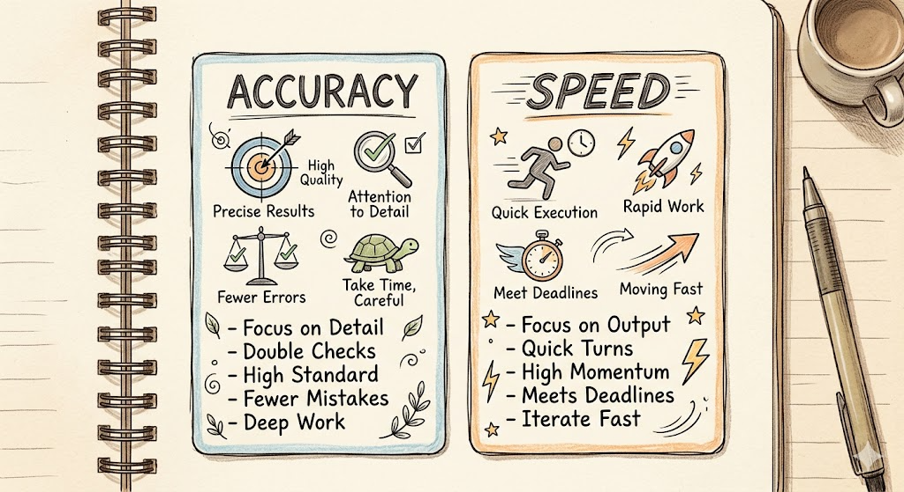
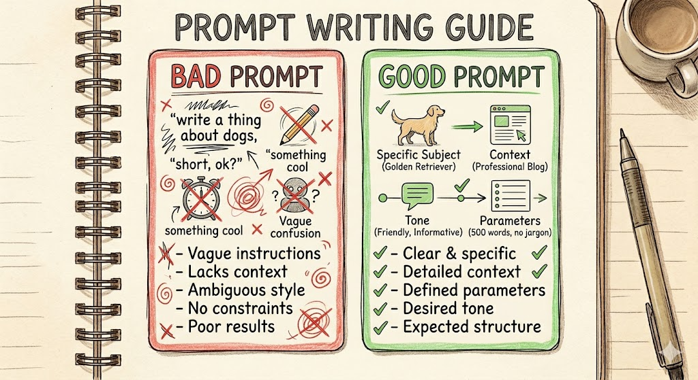
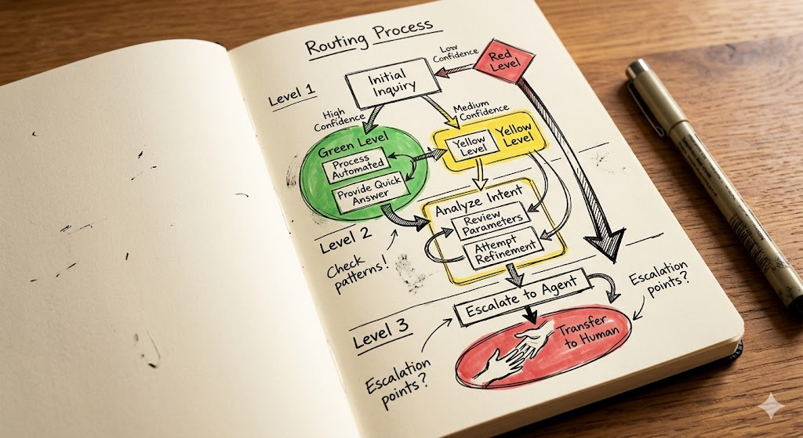

# 14 · 意图分类：如何兼顾准确性与响应速度

> 意图分类是智能客服的「入口大脑」——分类错了，后面的专家 Agent 再强也是白搭。而入口的速度直接影响全链路延迟。本文基于 500+ 轮 Prompt 评测与 2026 年生产级实践，给出一套经过验证的优化方法论。

---

## 一、问题本质：准确与快，天然矛盾吗？



意图分类面临一个经典 trade-off：

| 目标 | 常见做法 | 代价 |
|------|---------|------|
| 更准 | 用 GPT-4o / Claude 等大模型 | 慢（500ms+）、贵（20 倍于 nano） |
| 更快 | 用 gpt-nano 等小模型 | 容易「想太多」分错类 |
| 更准 | 堆 Prompt 示例、多次调用 | 成本叠加、延迟翻倍 |

**好消息是：这对矛盾可以被系统性拆解。** 500+ 轮 Prompt 评测的结论是：**Prompt 格式优化的贡献 > 所有其他修修补补的总和**。把格式弄对，小模型就能又快又准。

---

## 二、准确性优化：从 Prompt 结构到置信度体系

### 2.1 Prompt 结构：最被低估的优化杠杆



低效 Prompt 示例：

> 请判断用户想要什么？退货？账单？还是技术支持？

高效 Prompt 示例（500+ 轮评测验证）：

```
你是客服意图分类专家。根据用户输入，判断意图类别。

意图定义：
- 退货_用户要求退货、退款或换货
  示例：「我不想要了」「可以退吗」「换个大一号的」
- 账单_用户询问费用、发票或优惠政策
  示例：「这个多少钱」「怎么开发票」「有优惠吗」
- 技术_用户咨询产品使用或故障排查
  示例：「怎么连接 WiFi」「屏幕不亮了」「App 闪退」
- 闲聊_用户闲聊或问非业务问题
  示例：「今天天气不错」「你们几点下班」
- 未知_无法归入以上任何类别

直接输出 JSON（不超过 50 词）：
{"intent": "...", "confidence": 0-1, "reasoning": "一句话说明理由"}
```

三个核心要素：

- **意图描述加前缀**（`退货_用户要求...`）：加前缀后分类准确率提升 3-8%
- **None/未知兜底意图必须有**：高频场景下有无 `未知` 意图，准确率差 5-10%
- **每个意图给 2-3 个代表性用户原话作为 few-shot 示例**：实测 five-shot 比 zero-shot 提升显著，0→3 示例带来 90% 的质量提升，再增加只会增加 token 成本

> **验证说明**：Voiceflow 团队在 HWU64 和 Curekart 两个数据集上测试了 500+ 种 Prompt 变体，结论一致：格式结构（Prefix + None 兜底 + Few-shot）的贡献最大；AI 生成意图描述（GPT-4 / Claude 生成）比人工撰写更贴近用户真实语言。

### 2.2 AI 生成意图描述：比人工写的更准

让 GPT-4 / Claude 读取每个意图分类下的 3-5 条真实用户语料，用以下 Prompt 生成描述：

```
基于以下用户语料，为这个意图类别生成描述：
[3条用户原话]
要求：1句话，<30字，包含触发词和场景
```

AI 生成的描述往往比产品经理拍脑袋写的更贴近用户真实语言。

### 2.3 复合意图：两阶段处理

当用户说「我要退货，还想问问发票怎么开」时，直接多标签分类容易漏判。推荐两阶段处理：

```
阶段一：判断意图数量
Prompt: "这段话包含几个独立意图？回答：1个/2个/3个"

阶段二（多意图时）：
Prompt: "将以下意图分配到对应类别：..."
```

### 2.4 置信度阈值体系：动态而非固定


| 置信度 | 区间 | 系统动作 |
|--------|------|---------|
| 高置信 | ≥ 0.85 | 直接路由到对应专家 Agent |
| 中置信 | 0.6–0.85 | 追问确认关键字段（如订单号），再路由 |
| 低置信 | < 0.6 | 转人工 + 记录未识别模式（积累 bad case） |

置信度分布本身就是产品指标：持续观察低置信 case 的 pattern，每周迭代意图定义和示例，能让系统越用越准。

### 2.5 IntentGuard：生产级护栏模型（2026 新增）

对于高安全要求的场景（如金融、医疗、法律），推荐使用 IntentGuard 这类生产级垂直意图分类器：

- **DeBERTa-v3-xsmall**：参数 <10MB，CPU 上 P99 < 20ms，精度 95-98%
- **校准体系**：温度校准（ECE < 0.03）确保置信度真实反映准确率
- **三指标门控**：LBR < 2%（误拦率）、OPR < 2%（离题放过率）、AOC < 10%（干净问题误拒率）
- **决策逻辑**：置信度 > 阈值 → 放行；阈值之下 → ABSTAIN 转人工

IntentGuard 解决了 LLM-based 分类器的延迟和校准问题，适合作为独立护栏层。

### 2.6 ICLER：推理增强的意图分类（2026 新增）

ICLER（Intent Classification with Enhanced Reasoning）在标准 ICL 框架中引入了两步优化：

1. **推理驱动的向量表示增强**：用多任务学习让 Embedding 模型同时学习语义表示和推理生成，增强对细粒度业务场景（如实体相关、现象级描述）的捕捉能力
2. **推理增强的意图理解**：让 LLM 在 few-shot 示例中看到推理链，提升区分语义相近意图的能力

实验结果：在 PC 相关领域数据集上准确率提升 **4.77pp**，通用领域提升 0.04%-1.14%。适合复杂业务场景下的意图分类优化。

> **注意**：CICL（Corrective ICL）在实验中**持续弱于标准 ICL**，且随着纠正示例比例增加而性能下降——向模型展示错误并纠正反而会破坏模型的任务理解，**不推荐在生产中使用**。

### 2.7 Annotation Reply：高风险意图的兜底

对于法律条款、精确报价、退款金额等不允许出错的场景，别让模型生成答案——用 Annotation Reply 预置标准答案。当用户问题与 Annotation 相似度超过阈值时，**直接返回人工审核过的预置答案**，不触发 AI 生成。

---

## 三、速度优化：让入口快过整个链路

### 3.1 选对模型：nano 模型是意图分类的最优性价比



| 模型 | 上下文窗口 | 吞吐量 | 输入费用 | 输出费用 |
|------|-----------|--------|---------|---------|
| GPT-5.4 nano | 400K tokens | ~200 t/s | **$0.20 / M** | $1.25 / M |
| GPT-5.4 mini | 400K tokens | ~120 t/s | $0.75 / M | $4.50 / M |
| GPT-4o | 128K tokens | ~40 t/s | $4.00 / M | $16.00 / M |

> **模型选择原则**：意图分类属于 GPT-5.4 nano 的「Green Zone」（分类、抽取、路由）——质量差距 < 10pp，价格差距 **3.75 倍**。对于零售、客服等领域的简单分类任务，nano 完全够用。

### 3.2 启用 Prompt Caching

把意图定义 + few-shot 示例放进 System Prompt 并启用缓存后：

| 费用类型 | 标准价格 | 缓存价格 | 节省比例 |
|---------|---------|---------|---------|
| 输入 token | $0.20 / M | **$0.020 / M** | **-90%** |
| 输出 token | $1.25 / M | $1.25 / M | — |

缓存最适合 System Prompt 中的意图定义和 few-shot 示例——这些内容在每次调用中几乎不变。

> **注意事项**：缓存以 128 tokens 为最小单元；当缓存内容更新时，旧缓存自动失效。高并发场景下月度成本节省显著。

### 3.3 结构化输出：消除解析延迟

```
response_format: {
  type: "json_schema",
  name: "intent_result",
  schema: {
    type: "object",
    properties: {
      intent: { type: "string" },
      confidence: { type: "number" },
      reasoning: { type: "string" }
    },
    required: ["intent", "confidence", "reasoning"]
  },
  strict: true
}
```

`strict: true` 让模型直接输出合规 JSON，下游无需做格式验证/重试。TokenMix 2026 年评测显示：结构化输出使解析可靠性提升 50-80%，同时几乎不增加额外 token 成本。

### 3.4 CICLe 路由：共形预测引导的候选缩窄（2026 勘误更新）

> ⚠️ **勘误**：原版将 CICLe 描述为「Top-3 候选路由」，不够精确。正确描述如下：

CICLe（Conformal In-Context Learning）结合轻量级基分类器和共形预测（Conformal Prediction）来引导 LLM Prompt：

```
步骤一：基分类器（如 BERT / DeBERTa）给出所有意图的概率分布

步骤二：共形预测根据 α 参数（控制误判率上限）构造候选集合
         — 候选集通常包含 1-3 个类别
         — 当候选集仅含 1 个类别时，直接绕过 LLM 输出基分类器结果

步骤三：LLM 仅在缩窄后的候选集上做最终分类
         — 从每个候选类中选取 k=2 个最相似的 few-shot 示例
         — 上下文更聚焦，token 消耗更低
```

**效果**：CICLe 在多领域 NLP 分类基准上持续优于基分类器和标准 Few-shot Prompting；在简单样本上完全绕过 LLM，在复杂样本上通过缩窄候选空间提升准确率。

> **τ²-Bench 说明**：原版引用「GPT-5.4 nano τ²-Bench 92.5%」数据不准确。τ²-Bench 是**工具调用（Tool Use）基准**，不是意图分类基准，主要衡量 AI Agent 在零售、航空、电信场景中使用 API 完成任务的能力（pass@k 指标）。GPT-5-mini 基线为 55%，经 Prompt 优化后提升至 67.5%。意图分类应使用专门的分类任务数据集（如 HWU64、Curekart）进行评测。

### 3.5 控制最大输出 tokens

意图分类只需要输出一个词 + 一个数字，不需要让模型「发挥」。设置 `max_output_tokens: 50`，既防止无谓生成浪费延迟，也节省输出费用。

---

## 四、生产级提示词设计模板（中文客服场景）

以下模板基于 500+ 轮实验评测、华为云/百度千帆/百度AI客服等多个中文实战案例提炼，适用于基于 LLM 的意图分类器。

### 4.1 System Prompt：结构化意图分类专家

```
你是一个客服意图分类专家。根据用户输入，从以下意图列表中
选择一个最匹配的意图并返回结构化结果。

【意图分类体系】
## 一级分类（必选）
- 技术问题_用户咨询产品使用、故障排查或功能操作
- 订单服务_用户查询订单状态、物流、修改或取消订单
- 退款售后_用户要求退货、换货、申请退款或投诉
- 优惠咨询_用户询问优惠券、折扣、活动规则
- 账户管理_用户咨询账号绑定、密码修改、权限设置等
- 闲聊其他_用户闲聊、问候或无法归入以上类别

## 二级分类（可选，用于复杂场景）
[根据业务需求定义，例如：技术问题→App闪退/功能异常/参数配置]

【输出要求】
1. 只输出 JSON，不要任何额外文字或解释
2. 每个字段含义：
   - intent: 一级分类名称（从上方列表中选择）
   - sub_intent: 二级分类名称（如有）
   - confidence: 0到1之间的置信度（小数点后2位）
   - reasoning: 一句话说明为何这样分类
   - needs_human: true/false，是否建议转人工
3. 置信度规则：
   - confidence ≥ 0.85：直接路由到对应Agent
   - 0.6 ≤ confidence < 0.85：追问关键信息后再路由
   - confidence < 0.6：needs_human = true

【决策边界规则】
- 当用户输入无法匹配任何已有意图时，intent="闲聊其他", confidence=0.3, needs_human=false
- 当用户同时表达多个意图时，以最主要意图为准（secondary_intent可填第二个）
- 当用户提到"人工"、"转人工"、"找客服"时，intent不变但 needs_human=true
- 严禁自造意图类别，只能从上方列表中选择

【温度设置】temperature=0（分类应保持确定性）
```

### 4.2 Few-Shot 示例设计原则

示例是意图分类质量提升的最大杠杆（0→3 示例提升 38%，再增加到 10 仅多 4%）。

**示例选择策略**：
1. **代表性优先**：每个意图选 2-3 个覆盖不同表述方式的示例
2. **多样性覆盖**：示例应覆盖正式语、方言、网络用语（如"我的订单到哪了"、"我的东东咋还没到"都指向同一意图）
3. **边界案例**：包含容易误判的边界示例（如"我要投诉"可能是退款售后，也可能是账户管理）
4. **位置**：最近邻示例放在用户输入之前，引导模型关注当前任务

**中文客服场景 Few-Shot 示例（参考百度AI客服案例）**：

```
示例1：
输入：「我的订单怎么还没发货？」
输出：{"intent": "订单服务", "sub_intent": "发货咨询", "confidence": 0.92, "reasoning": "用户在询问订单发货状态", "needs_human": false}

示例2：
输入：「这个手机支持5G吗」
输出：{"intent": "技术问题", "sub_intent": "参数咨询", "confidence": 0.88, "reasoning": "用户咨询产品规格参数", "needs_human": false}

示例3：
输入：「我要退这个衣服，7天无理由吧」
输出：{"intent": "退款售后", "sub_intent": "退货申请", "confidence": 0.95, "reasoning": "用户明确要求退货且提及无理由条款", "needs_human": false}

示例4：
输入：「你们几点下班？」
输出：{"intent": "闲聊其他", "sub_intent": null, "confidence": 0.5, "reasoning": "闲聊问询超出业务范围", "needs_human": false}

示例5（边界）：
输入：「不想要了，能退吗？」
输出：{"intent": "退款售后", "sub_intent": "退款咨询", "confidence": 0.78, "reasoning": "表达退货意向但未明确说明商品", "needs_human": false}
```

### 4.3 复合意图与多标签处理

当用户同时表达多个意图时（如电商场景的「意图-原因」双层标签），分两阶段处理：

**阶段一：意图-原因联合分类**

```
输入：「我取消订单因为地址写错了」
输出：{"intent": "订单服务", "reason": "地址填写错误", "confidence": 0.91, "reasoning": "取消原因清晰指向地址错误", "needs_human": false}
```

**阶段二（confidence < 0.85 时）：槽位追问**

```
追问：「请问您的订单号是多少？」
用户：「ORD123456」
→ 置信度提升至 0.95，执行路由
```

**华为云对齐策略参考**：当用户问题与标准选项均不匹配时，返回 `N/A` 而非捏造选项。

### 4.4 置信度校准（Logprobs + 阈值调优）

LLM 返回的 self-reported confidence 通常**过度自信**（GPT-4.1-mini 结构化输出时，错误预测的置信度也常在 95%+）。推荐以下校准方法：

**方法一：启用 Logprobs（推荐）**

```python
response = client.chat.completions.create(
    model="gpt-4o-mini",
    messages=[
        {"role": "system", "content": "<意图分类系统提示词>"},
        {"role": "user", "content": user_query}
    ],
    response_format={
        "type": "json_schema",
        "json_schema": {
            "name": "intent_classification",
            "strict": True,
            "schema": {
                "type": "object",
                "properties": {
                    "intent": {"type": "string", "enum": ["技术问题", "订单服务", "退款售后", "优惠咨询", "账户管理", "闲聊其他"]},
                    "confidence": {"type": "number"},
                    "reasoning": {"type": "string"},
                    "needs_human": {"type": "boolean"}
                },
                "required": ["intent", "confidence", "reasoning", "needs_human"]
            }
        }
    },
    temperature=0,
    max_tokens=100,
    logprobs=True,           # 启用logprobs
    top_logprobs=5           # 返回top-5候选
)
# 提取joint_logprob: exp(sum of token logprobs for intent field)
# 作为真实置信度信号替代self-reported confidence
```

**方法二：无 Logprobs 时：用真实数据标定阈值**

1. 准备 100 条历史标注数据（覆盖各意图类别）
2. 用当前模型跑一遍，记录 `(predicted_intent, model_confidence, true_label)`
3. 绘制 histogram：按 confidence 降序排列，观察错误率分界点
4. 设定阈值：`confidence ≥ 0.92 → 自动路由；0.7 ≤ confidence < 0.92 → 追问；confidence < 0.7 → 转人工`

> **注意**：不同模型的 confidence 分布差异显著，换模型后必须重新标定。

### 4.5 活跃学习闭环（持续优化）


意图分类系统上线后，通过以下反馈循环持续提升：

```
用户输入 → LLM分类 → confidence路由 → Agent处理 → 用户反馈(点赞/点踩)
                    ↓ 低置信case自动记录到bad case库
              每周人工审核bad case库
                    ↓
              更新意图定义 / 补充Few-shot示例 / 调整阈值
                    ↓
              模型Prompt迭代 → 重新评估 → 达标后上线
```

关键指标监控：
- **意图识别准确率**：≥ 92%（按正确分类样本数/总样本数计算）
- **转人工率**：持续观察，初始目标 < 15%
- **ECE（期望校准误差）**：< 0.05 表示置信度与实际准确率吻合良好

---

## 五、效果对照

| 维度 | 优化前 | 优化后 |
|------|--------|--------|
| 意图识别准确率 | ~70% | **90%+** |
| 分类延迟（P99） | 800ms | **< 300ms** |
| 单次调用成本 | $1.20/M | **$0.20/M（缓存后 $0.02/M）** |
| 低置信转人工率 | 30%+ | **< 15%** |
| Prompt token 费用 | 全额 | **-90%（缓存命中后）** |

---

## 六、快速检查清单

**准确性：**
- [ ] 意图描述有前缀（`技术问题_` 格式）
- [ ] 有「闲聊其他」兜底意图
- [ ] 每个意图有 2-3 个 few-shot 示例
- [ ] 置信度 < 0.6 触发 needs_human=true
- [ ] 高风险意图已配置 Annotation Reply
- [ ] 高安全场景考虑 IntentGuard 护栏模型

**速度：**
- [ ] System Prompt 开启缓存（$0.020/M）
- [ ] 结构化输出启用 `strict` 模式（enum 约束）
- [ ] `max_tokens` 设为 50-100
- [ ] temperature=0（确定性）
- [ ] 考虑 CICLe 路由（高并发场景）

---

## 七、信息来源

- [5 tips to optimize your LLM intent classification prompts — Voiceflow](https://www.voiceflow.com/blog/5-tips-to-optimize-your-llm-intent-classification-prompts)，2026-02
- [Cost-Aware Model Selection for Text Classification — arXiv 2602.06370](https://arxiv.org/abs/2602.06370)，2026-02
- [Efficient Text Classification with CICLe — arXiv 2512.05732](https://arxiv.org/abs/2512.05732)，2025-12
- [ICLER: Intent Classification with Enhanced Reasoning — EMNLP 2025](https://aclanthology.org/2025.findings-emnlp.164.pdf)，2025-10
- [Corrective ICL Underperforms Standard ICL — arXiv 2503.16022](https://arxiv.org/pdf/2503.16022)，2025-03
- [Few-Shot Techniques for Text Classification Using LLMs — Vzhukov](https://vzhukov.dev/posts/2026/few-shot-techniques-for-text-classification-using-llms)，2026-02
- [Text Classification with LLMs: Approaches and Evaluation — Helicone](https://www.helicone.ai/blog/text-classification-with-llms)，2026
- [Classification with Structured Outputs — CallSphere](https://callsphere.ai/blog/classification-structured-outputs-sentiment-intent-category-detection.md)，2026
- [Intent Classification and Routing — FlowX AI](https://flowxai.mintlify.app/5.1/ai-platform/patterns/intent-classification-routing)，2026
- [LLM Confidence Calibration in Production — Tian Pan](https://tianpan.co/blog/2026-04-16-llm-confidence-calibration-production)，2026-04
- [Measuring Classification Confidence with Gemini API Logprobs — Gemini Lab](https://gemilab.net/en/articles/gemini-api/gemini-api-logprobs-classification-confidence)，2026-04
- [Confidence-Aware Classification — GEPA](https://gepa-ai.github.io/gepa/guides/confidence-adapter/)，2026
- [IntentGuard: Production-Grade Vertical Intent Classifier — perfecXion](https://perfecxion.ai/articles/intentguard-vertical-intent-classifier-llm-guardrails.html)，2026-04
- [Structured Outputs Guide — Logic](https://logic.inc/resources/structured-outputs-guide)，2026-04
- [Prompt Engineering Guide 2026 — TokenMix](https://tokenmix.ai/blog/prompt-engineering-guide)，2026-04
- [电商智能客服Prompt优化全流程 — 百度AI社区](https://cloud.baidu.com/article/4668612)，2025-11
- [吴恩达Prompt工程精解：AI客服系统中的Prompt设计与优化实践 — 百度智能云](https://cloud.baidu.com/article/4421880)，2025-10
- [Using Prompts for Intent Alignment — 华为云](https://support.huaweicloud.com/intl/en-us/bestpractice-pangulm/pangulm_04_0021.html)，2025-11
- [Introducing GPT-5.4 mini and nano — OpenAI](https://openai.com/index/introducing-gpt-5-4-mini-and-nano/)，2026-03
- [GPT-5.4 nano Pricing — AI Cost Check](https://aicostcheck.com/model/gpt-5-4-nano)，2026-03
- [τ²-Bench: Benchmarking Agents in Collaborative Scenarios — Sierra AI](https://sierra.ai/blog/benchmarking-agents-in-collaborative-real-world-scenarios)，2025-06