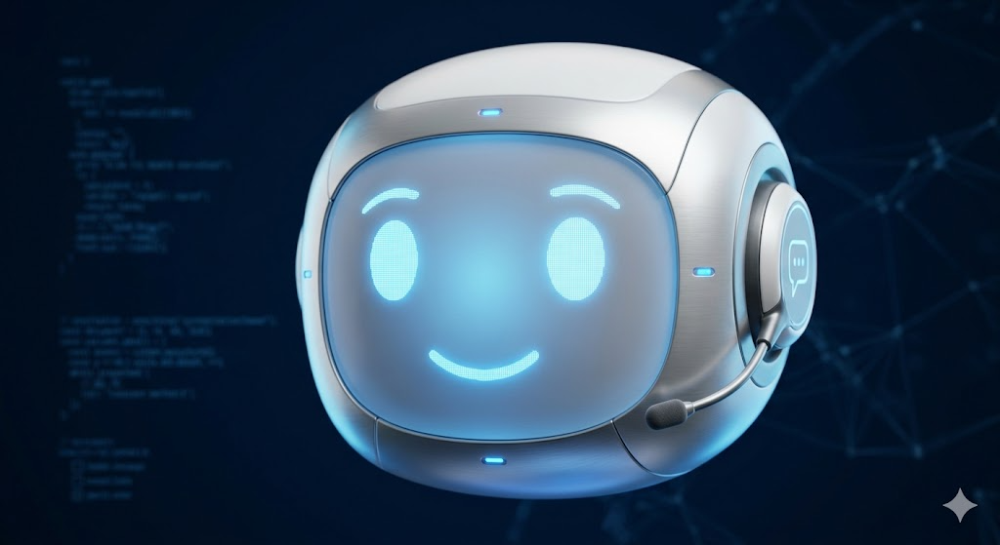
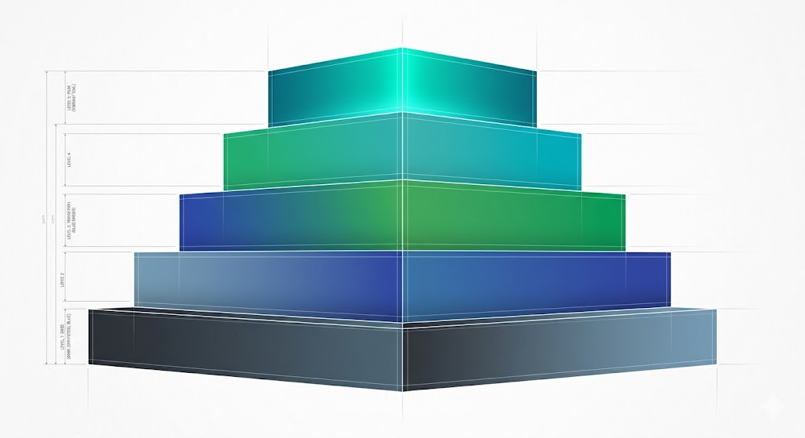
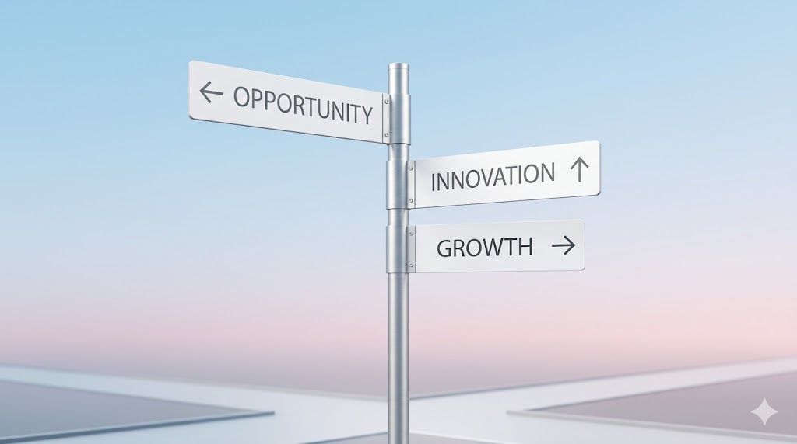
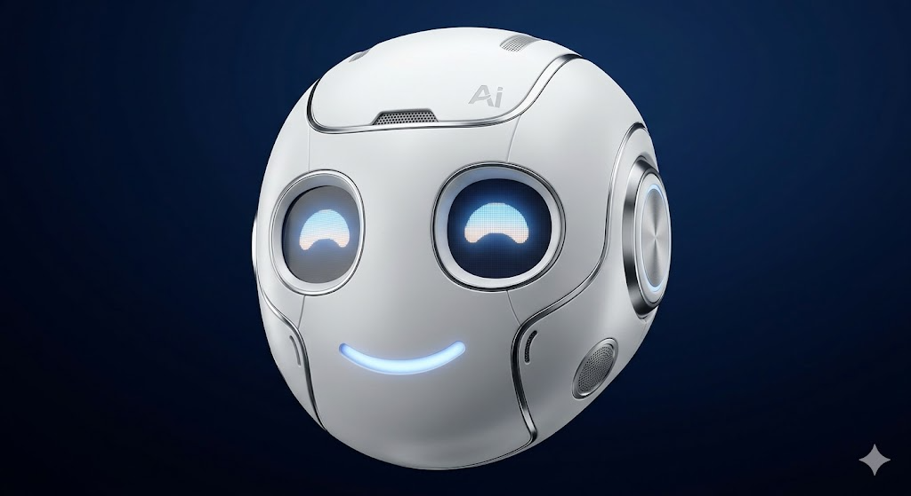

# 智能客服建设指南

> 研究时间：2026年5月 | 所属领域：AI应用/企业服务 | 研究对象类型：技术范式

---

## 一、一句话定义

智能客服不只是「给客服系统接个LLM」。

它是一套完整的系统 —— 知识库管理、检索增强生成（RAG）、意图识别、对话管理、多Agent协作、人机混合、效果评估 —— 七个子系统环环相扣，缺一环就会被用户骂「人工智障」。从1966年MIT的ELIZA到今天估值百亿美金的Sierra，这条路上踩过的坑比走对的路还要多。这份报告要做的事就是把它们踩一遍，看清楚每一次转向背后的逻辑，然后给出今天该怎么建的判断。

---

## 二、纵向分析：从关键词匹配到AI Agent，一条走了60年的路

### 群星闪耀时：ELIZA和那个相信机器能对话的疯子

1966年，MIT教授Joseph Weizenbaum坐在机房，敲出了ELIZA —— 世界上第一个聊天机器人。

原理极其粗糙。ELIZA完全不理解自然语言，它只做一件事：识别关键词，套用预定义模板回话。你输入「I'm feeling sad today」，它匹配到「sad」这个关键词，然后从规则库里挑一句「Tell me more about your feelings」。

就这么简单的机制，却让当时的MIT学生们排队体验，甚至有人要求Weizenbaum离开房间，因为他们想跟ELIZA「私聊」。Weizenbaum本人被这个反应吓坏了 —— 他后来成了AI最激烈的批评者之一。

这个悖论 —— 极简技术 + 极强幻觉 —— 在60年后的今天惊人地重复着。用户天然倾向于把对话对象当作有思想的个体，无论底层技术是什么。

1972年，斯坦福的Kenneth Colby又做了一个叫PARRY的机器人，模拟偏执型精神分裂症患者。它比ELIZA复杂得多，通过了改良版图灵测试 —— 精神科医生区分真患者和PARRY的准确率只有52%。「纯靠规则匹配就能骗过专家」这件事，让研究者们在那个年代产生了过度乐观的判断 —— 后来你会发现，这种乐观在每隔十年就会重新上演一次。

但真正让客服这个概念能够落地成产业的，不是机器人，是电话。

### 呼叫中心时代：用「排队」解决「并发」

1956年，美国泛美航空建了世界上第一个呼叫中心。就是这个东西，敲下了客服产业的第一根桩。

彼时的架构再简单不过：PBX（企业电话交换机）+ 人工坐席 + 排队系统。客户打电话进来，系统按顺序分配空闲接线员。

你可能会觉得这不就是打电话排队吗，怎么也算「技术」？但把视角拉到当时的背景下，「排队」这个机制本身就是一个架构决策 —— 它承认了一个残酷的事实：服务的供给永远跟不上服务的需求，你的选择不是在「排队」和「不排队」之间，而是在「有序排队」和「随机崩溃」之间。这个认知一直延续到今天，只不过「排队」从电话线变成了消息队列，「接线员」从人变成了AI Agent。

1990年代末，呼叫中心被引入中国，第一批用户是民航系统（机票预订）和电信运营商。到2004年底，全国呼叫中心达到13.99万个坐席，产业投入204.9亿元。2006年，云计算概念兴起，云呼叫中心服务商（如容联云）出现，通过CTI+云计算技术把客服系统SaaS化交付 —— 「上云」这件事，在客服行业比在大多数其它行业早了将近十年。

一个容易被忽略的转折点是2010年iPhone 4的发布。不是苹果在客服技术上做了什么，而是智能手机改变了用户跟企业打交道的方式。以前客户就是打电话，客服只需要处理语音。现在微信、App内聊天、邮件、社交媒体私信全涌进来了，客服从一个渠道变成了全渠道。多渠道路由、统一坐席工作台、跨渠道上下文保持 —— 这些今天看起来理所当然的能力，是在2010-2015年之间被行业硬生生卷出来的。

### 2015-2020：AI真正进入客服，但不是你想的那种方式

2015年，阿里巴巴上线了「阿里小蜜」。这才是中国智能客服真正的元年。

那一年的阿里小蜜做了什么？它其实不是一开始就什么都能回答的AI，而是做了大量「人机协作」的工作：辅助人工客服快速找到标准答案、自动生成回应草稿、在转人工前预填用户信息。这个路径后来被同行反复验证 —— AI不是直接拿来替代人的，是拿来辅助人的，等辅助效果够好了，再逐步接管更复杂的场景。

2017年双11那天，阿里小蜜接待了近千万消费者请求，相当于6.3万名客服小二连续工作24小时。但更重要的一个数字是另一个：2014年到2017年，双11成交额增长了1.5倍，热线服务请求却只有2014年的三分之一。不是客户不打电话了，是AI在真正的规模化场景下把流量拦住了。

这个阶段出现了一大批创业公司：智齿科技、Udesk、追一科技、来也科技、环信。它们在同一个时间窗口涌出来，背后踩的是同一个技术浪潮 —— 深度学习（尤其是2018年Google BERT的发布）让意图识别终于从「勉强能用」变成了「实际可用」。

BERT之前的意图识别是什么样的？靠人工标注大量语料，训练一个分类器，准确率到85%就是顶尖水平了。BERT发布后，准确率直接跳到了95%以上，根本不需要那么多标注数据。这才是智能客服能商用的那个「临门一脚」：不是对话能力变强了，是「你到底想问什么」这件事终于解决得足够好了。

但2016年到2020年间，还有一个被低估的信号：Zendesk在2014年上市，估值17亿美金。这不只是「一家公司IPO」，而是证明了「客服SaaS可以成为一家百亿美金公司」。这个信号在全球范围内启动了客服SaaS的投资狂潮，中国的创业公司们在这个窗口里拿到了大量的风投资金。2015-2017年间，仅是中国的客服AI创业公司，累计融资就超过10亿人民币。

2020年疫情爆发，又是一个分水岭。线下转线上不是趋势，是灾害，是一场所有企业被强行拉到同一个起跑线上的数字化考试。几个月之内，客服上云、智能化改造的需求暴涨。如果你去看那一年智能客服公司的营收增长曲线，几乎全部在2020Q2有一个陡峭的上升拐点。

### 2022年11月：ChatGPT炸了，智能客服的「存在感危机」

ChatGPT发布的那一天，整个客服行业都在恐慌。

不是恐慌被取代，是恐慌「自己过去几年的积累突然变得像个笑话」。你花了几百万训练的意图识别模型、花了半年搭建的知识图谱、调了一整年的对话策略，在LLM面前一夜之间变成了可选配件。

但真正的冲击不是技术上的，是心智上的。在ChatGPT之前，客户跟智能客服对话时的心态是「我知道你是个机器人，但我只能忍」。在ChatGPT之后，所有用户—— 是的，所有用户 —— 的期望值被拉到了「你最好能像ChatGPT一样聪明」。

这个心智偏移的后果是灾难性的：以前用户遇到智能客服答不上来，他想的是「果然是人工智障」。现在遇到同样的情况，他想的是「ChatGPT都能做到，你们为什么做不到？」当用户的benchmark从「以前的客服」变成「我用过的ChatGPT」之后，所有不达标的客服系统都被集体判了死刑。

但对于从业者来说，这个冲击来得恰到好处。2022年到2024年这18个月里，智能客服经历了一次从底层到顶层的全面重写：

**RAG（检索增强生成）从可选项变成了必选项。** 因为LLM的「幻觉」问题对于客服场景是致命的 —— 你可以写错一首诗，但你不能给用户一个错误的退款金额。RAG（Retrieval-Augmented Generation）的解决方案很简单：先从一个经过验证的知识库中检索相关内容，再让LLM基于检索结果来生成回答。这样LLM不是在「回忆」，是在「朗读」。虽然不是完全不犯错，但犯错的方向从「编造的随机错误」变成了「理解的偏差错误」—— 后者的检测和容错要安全得多。

**Agent架构开始成型。** 以前的智能客服只能做一件事：回答问题。但2024年起，Agent架构让AI客服可以自主规划、调用工具、执行多步骤任务。你说一句「帮我把上个订单退了」，Agent自己去做：查订单 → 验证退款条件 → 执行退款操作 → 生成退款确认。这个链条里每一步都需要与不同的后端系统交互，传统客服机器人根本做不到。

**多模态和多渠道融合。** 用户用截图来问问题（「这个订单为什么被取消了」），Agent需要理解图片内容然后去查数据库。用户从微信切到App，上下文不能丢。这些不是天方夜谭，都是2024年已经在商业产品中落地的东西。

这个阶段最具标志性的事件是Intercom的Fin和Zendesk的AI Agents。

### 2023-2026：AI代理接管客服，但败局也不少

Intercom在2023年推出了Fin AI chatbot，基于GPT-4。这是一个重要的产品决策：不是在自己的旧架构上打补丁，而是直接基于最先进的LLM重建整个智能客服。一年后，Fin 2发布时切换到了Anthropic的Claude模型 —— 这意味着Intercom已经在做多模型路由。

更有意思的是定价模式。Intercom对Fin的收费方式是$0.99 per outcome —— 按「实际解决了问题」收费，而不是按坐席收费。这让AI从「帮你省人力成本」变成了「我替你干活」，这是一个商业模式维度的创新，它意味着AI客服不再被视为一个feature，而是一个可以独立拆开卖的产品。

Zendesk的路更有戏剧性。2022年被Hellman & Friedman以102亿美金私有化退市后，Zendesk在2024年收购了Ultimate.ai来重建AI代理能力，2026年3月又收购了Forethought（一家agentic AI客服公司，自称月均处理10亿+交互）。从一家工单系统公司到「全面AI化」，Zendesk花了两年的时间，从一个被市场质疑「是不是要被LLM颠覆」的对象，变成了一家all in AI Agent的标杆。

但乐观之余，战场并不干净。Salesforce在2025-2026年间大张旗鼓推Agentforce，然后2026年初裁员4000人，被媒体称作「科技宿醉」。PitchBook的数据显示2025年全球AI投资中35%流向基础模型公司，只有3%流向了「AI治理与运维」方向 —— 也就是说，巨额热钱砸向造枪（模型），没人在乎怎么把枪用好。

还有一个被严重低估的数据：Reddit上一个获得了612 upvotes的帖子描述了AI项目在3家公司内完全一样的失败模式 —— 高管看ChatGPT demo → 强制AI集成 → PoC在demo中工作完美 → 真实用户测试时现实打脸 → 项目悄悄死亡。48%的从业者报告AI项目被用户不信任问题拖垮。

76%的chatbot用户报告过挫折感（TeamDynamix数据），70%的消费者表示一次糟糕的AI体验就会离开（AgilityPR数据），50%的客户经常对chatbot互动感到沮丧，40%的对话以失败告终。

这些数字告诉你什么？技术的车轮已经碾过去了，但落地的鸿沟比所有人想象的要深得多。

### 技术演进的五层结构：不是线性的，但每一层都踩在前一层的尸体上

如果你回头从技术栈的角度看这60年，能看到一个清晰的五层递进：

**第一层（1960s-1990s）：关键词匹配。** 代表ELIZA、IVR电话按键。底层逻辑是if-else，特点是零智能但可控性100%。死因：用户不喜欢被当成傻瓜。

**第二层（2000s-2015）：规则引擎 + NLP浅层处理。** 代表传统FAQ机器人、分词匹配。这一层做了大量人工定义规则的脏活，但「规则维护」的边际成本随业务复杂度指数增长。死因：写规则的人永远追不上用户的问题变体。

**第三层（2015-2020）：深度学习——意图分类 + 实体识别。** BERT系模型登场，第一次让机器真正「理解」用户的话（而不是关键词匹配）。这一层的本质是把问题从「写规则」变成了「标注数据」—— 标注数据依然很贵，但至少是可扩展的。活到了今天，但定位从主角降级为了配角。

**第四层（2020-2022）：检索式问答 + 知识图谱。** 在第三层的基础上，开始系统性地组织企业知识。但知识图谱本身是一个无底洞 —— 构建和维护一套企业的全部结构化知识，比训练模型还累。这一层的贡献不是技术上的，是认知上的：它证明了「把知识组织好」这件事比「把模型训好」更重要。

**第五层（2022-至今）：LLM + RAG + Agent。** LLM提供了泛化理解能力，RAG解决了幻觉问题，Agent赋予了执行能力。三者合在一起，第一次让智能客服在三个维度上同时达到了可用水平：理解能力、准确度、行动力。

但请注意：这五层不是替代关系。今天的生产级智能客服系统，底层还在用if-else做兜底和风控，第二层还在做FAQ快速召回，第三层的意图识别仍然在帮路由分发，第四层的知识图谱在特定场景下依然必要。好的系统是「五层叠在一起」的，不是「全部押注LLM搞定一切」的。

如果你只建一个「接了个LLM的问答机器人」，你会死在两个地方：第一，LLM会在你没想到的地方给你编答案；第二，当用户真的需要操作时（退款、改地址、查订单），你的机器人只能回答「我帮您记录，客服稍后联系您」—— 而这恰恰是用户最不想听到的话。

---

## 三、横向分析：当前的竞争图谱，你需要知道的六张面孔

### 先回答一个前置问题：你要自建还是购买？

这是所有想做智能客服的团队遇到的第一个问题。答案取决于你要的是什么：

- 你需要一个**能直接用的AI客服产品**，你的团队没有技术能力也不想养 → 买商业SaaS
- 你有研发团队，需要**高度定制化的客服能力**，客服场景是你的核心业务差异化点 → 自建
- 你介于两者之间 → 用开源平台做二次开发

这三条路的代表玩家，分别构成了当前市场的三层结构。

### 第一层：商业SaaS ——「给你一个能用的东西」

**Zendesk** 是全球标杆。2007年成立，2014年上市（估值17亿美金），2022年被102亿美金私有化，2024年起全面转向AI。现在的Zendesk已经不是一家工单系统公司了 —— AI Agents、Copilot（辅助人工）、QA（质量检测）、WFM（劳动力管理）一环套一环。定价在$55-$169/坐席/月。

Zendesk做对的一件事：它不是凭空造AI，而是把AI夹在已有的产品体系里。一个客服用Zendesk，工单、知识库、聊天、通话全部在一个工作台里，AI帮你在这个工作台里提效。这种「不改用户习惯」的融合方式，是大厂SaaS在面对LLM冲击时最有效的防御策略。

**Intercom** 是另一种思路。2011年成立，四位爱尔兰创始人。它不按坐席收费（虽然也提供这个选项），而是把Fin AI Agent作为一个独立产品按结果收费：$0.99 per outcome。这个定价的背后是一个激进的判断：AI客服的价值不是「帮人」，是「替代人」。Fin 2目前用的是Anthropic Claude模型，Intercom甚至不讳言这一点 —— 他们不是在隐藏AI，是在推销AI。

**Sierra**（估值100亿+美金）又是一个新物种。创始人Bret Taylor之前是Salesforce联席CEO。Sierra代表了一种新的可能性：不是给现有客服系统做AI增强，而是从零开始建一个「AI原生」的客服平台。它的所有设计都围绕AI的能力边界做减法 —— 只做AI能做好的部分，AI做不好的不碰。

**Salesforce Einstein / Agentforce** 是一个警示故事。它证明了一个规律：把AI硬塞进一个庞大而僵化的CRM体系里，不叫转型，叫粉饰。Salesforce 2026年初裁员4000人，外界普遍解读为AI替代。但从产品视角看，更像是一个信号：大厂喊AI喊得最大声，不代表他们的产品做得最好。

**国内SaaS**这边的状况更复杂。网易七鱼、智齿科技、Udesk这批2015-2017年崛起的公司，经历过融资高峰，也经历了2022年后的大模型冲击。它们目前的状态是「带着历史包袱转型」—— 旧的规则引擎系统不能推倒重来，但新的LLM能力又不能不接。结果是：技术栈里既有五年前的Jieba分词和BERT分类器，也有最新的GPT-4 API调用，中间用各种胶水代码粘在一起。这不是技术问题，是商业问题：你没办法跟老客户说「之前那一套已经不灵了，请升级到我们全新的AI方案」，因为客户的系统改造成本和流程重建成本根本不是「升级」两个字能概括的。

### 第二层：开源平台 ——「给你一套积木自己搭」

这才是当前对自建团队最重要的赛道。

**Dify** 是当之无愧的头号玩家。GitHub 141k stars，TypeScript 53.5% + Python 41.7%。它的定位是一个LLM应用开发平台：可视化工作流编排、RAG Pipeline、Prompt IDE、Agent（50+内置工具）、LLMOps。这不是一个客服产品，是一个让你能搭出客服产品的乐高。Dify Cloud的定价是$59-$159/workspace/月。

Dify最大的优点是「低门槛」—— 一个没有ML背景的全栈工程师，能在半天之内搭出一个可运行的RAG客服demo。这也是它141k stars的原因。但Dify的弱点同样明显：它是一个通用平台，不是为客服优化的。你会遇到非常多「在Demo上工作完美但生产环境中完全不够用」的情况：意图路由太粗糙、人机混合模式需要你自己写workaround、多租户凭据隔离不够。Dify社区里最火的几个Issues暴露了这些真实问题：生产服务中断（no space left on device）、插件凭据默认共享缺乏隐私保护、缺少人机混合对话注入API。

Dify的问题不是产品做得不好，是通用平台的定位和客服场景的特殊需求之间的张力：客服需要的不是「一个更灵活的LLM应用平台」，是「一个在特定场景下绝对不会出错的系统」。而通用平台的使命是「在任何场景下都能灵活」—— 这两个目标是天然冲突的。

**FastGPT** 是一个有趣的对比样本。GitHub 28k stars，TypeScript 85.5%。它的定位非常聚焦：以知识库为核心，专注RAG检索和可视化工作流。它不做Dify那样的全能平台，所以反倒把知识库管理、混合检索（语义+关键词）、重排序这几个客服场景最关键的环节做得更细。FastGPT商业版的定价是¥10,000/月（单节点Sealos全托管），跟Dify的云版本价格不在一档。

但FastGPT有一个令自建团队纠结的点：它的License禁止将FastGPT本身以SaaS形式提供。也就是说，你可以用FastGPT搭建你的内部客服系统，但不能把它打包成一个客服SaaS卖给别人。这个限制让你在做技术选型时多了一个非技术维度的考量：你的商业路径是什么？

**LangChain**（136k stars）是另一个极端。它是一个纯Python框架，MIT协议，没有任何可视化界面。如果你只有后端工程师、需要完全掌控每一行代码、对未来有无限扩展需求 —— LangChain是你的选择。代价是：搭出一个生产级的RAG客服需要的工程工作量，比用Dify多5-10倍。你需要自己搞定向量存储、检索策略、重排序、记忆管理、流式输出、多用户会话隔离、速率限制……所有这些Dify免费提供的东西。

**Rasa**（21.2k stars）是一面镜子。它在2023年前是开源对话AI框架的王者，NLU训练+对话管理器这套架构支撑了无数银行、保险、政府的大型客服项目。但2025年Rasa宣布转向 —— 开源版进入维护模式，正式放弃传统NLU训练路线，转向LLM+native架构（Hello Rasa）。一个做了十年NLU训练的公司告诉你「对不起，NLU训练这套不用练了，直接用LLM」，这就是整个行业的判词。

**Flowise**（52.7k stars）和**Botpress**（14.7k stars）是可视化Agent构建的代表。前者基于LangChain做低代码拖拽，后者走的是LLM+Integrations生态路线。它们的存在证明了一个事实：可视化编排是刚需。不是每个公司都能养一个ML团队手写代码搭Agent。

### 第三层：云厂商方案 ——「买我全家桶就送你」

阿里云、腾讯云、百度智能云、华为云、AWS Lex、Google DialogFlow、Azure Bot Service —— 这一层的特点是：功能全但定制弱，价格不透明但捆绑销售，适合「已经在用该云全家桶」的企业。

Token成本是最大的隐形成本。一个日均1万次对话的中型客服系统，如果每条对话平均消耗2000 tokens（含RAG检索上下文），按GPT-4o-mini的价格算一天也就几块钱，好像不值一提。但如果你要做语义检索、要做多轮对话的上下文保持、要每次对话都跑意图分类和实体识别 —— token消耗翻5倍、10倍都是正常的。等你切换到满血的GPT-4或Claude Sonnet的推理质量和响应速度，成本又可以再翻一个数量级。

更关键的是延迟。云厂商的API调用延迟在200-500ms量级，加上RAG检索（50-200ms）和重排序（100-300ms），一个回答的端到端延迟很容易突破1.5秒。而用户对客服回答的等待容忍度是多少？大约是3秒。一旦你加了多模型路由和输出验证，你就踩在了红线上。

### 开源方案关键指标对比

| 项目 | Stars | 语言 | License | 定位 | 适合谁 |
|------|-------|------|---------|------|--------|
| Dify | 141k | TS+Py | Apache 2.0改 | LLM应用全能平台 | 中小团队快速启动 |
| LangChain | 136k | Python | MIT | LLM开发框架 | 定制需求强的后端团队 |
| Flowise | 52.7k | TS+JS | Apache 2.0 | 低代码Agent构建 | 非技术人员/快速原型 |
| FastGPT | 28k | TS | 自定义 | 知识库+RAG专精 | 客服场景自建 |
| Rasa | 21.2k | Python | Apache 2.0 | 传统对话AI（维护） | 历史项目维护 |
| Botpress | 14.7k | TS | MIT | LLM Agent+集成 | 需多平台集成的团队 |

### 定价模式上的裂变

这个市场正在经历一次定价模式的碎片化：

传统的「按坐席/月」收费（Zendesk、Intercom基础版）是建立在「人类客服」这个假想上的。当AI接管了90%的对话后，「按坐席」就变成了一个需要强行自洽的概念。

于是出现了Intercom的$0.99/outcome按结果收费 —— 这个定价真正对齐了AI客服的价值：你解决一个问题，付一次钱。简单，透明，没有争议空间。

又出现了Dify的按Workspace收费（$59-$159/月）和Botpress的AI Spend模式（LLM成本+平台月费），都是基于「AI客服的边际成本在token上而不是在座席上」这个逻辑。

FastGPT的按部署许可收费（¥10,000-22,000/月）又在另一个方向上延续了传统企业级软件的商业模式：大企业的真正需求是私有化部署和可控性，他们愿意为此付出不成比例的溢价。

同一个市场里「按坐席」「按结果」「按Workspace」「按部署」四种定价模式同时存在 —— 这是「行业范式尚在形成中」的最明显信号。

### 用户真正在抱怨什么

Reddit上一个被反复引用的帖子列举了智能客服的三大原罪：假装AI是人（假名字假头像）、隐藏转人工按钮、过时知识库。

GitHub上Dify的Issues则暴露了更底层的问题：多租户凭据不安全、生产环境不稳定、人机混合消息注入没有API支持。

学术圈也在用更严谨的方式验证同样的痛点。一篇2025年发表在Serbian期刊上的论文测试了呼叫中心RAG系统，结论是：「RAG相似度分数不够可靠，需要额外重排序机制」。另一篇2024年AAAI的论文提出了用知识图谱做语义验证，本质上也是在说：别信LLM，也别信向量相似度，必须要有独立的答案验证层。

社区讨论中另一个高频词是「维护成本被严重低估」。Dify Cloud依赖PostgreSQL向量扩展（pgvector/myscale），用户报告过严重的磁盘空间溢出导致生产服务中断。这不是个例。知识库里的文档需要持续同步更新，向量索引需要重建，模型的prompt需要随着产品迭代调整 —— 这些都是前期规划时很少被考虑但后期一定能让你头疼的问题。

---

## 四、横纵交汇洞察：这些碎片拼出来一张什么图

### 第一条判断：智能客服的核心矛盾变了 —— 从「能理解吗」变成了「能信任吗」

在BERT时代之前，智能客服的主线矛盾是「技术能力够不够」。意图识别准确率够高吗？实体抽取够精准吗？答案够相关吗？

大模型把这些问题全解了。但解掉之后，一个更深的矛盾反而被照亮了：用户不相信AI给出的答案。

76%的chatbot用户报告过挫折感，70%的消费者表示一次糟糕AI体验就离开。这两个数字不是技术问题，是信任问题。你想想一个典型的用户旅程：他已经做好了「跟AI对话就是浪费时间」的心理准备，带上全套防卫心态来跟你聊。你给他一个回答，他默认就是不信的 —— 因为这个回答来自「AI」这个标签，而这个标签在他脑子里跟「不可信」划等号已经划了十几年了。这不是技术能解决的，是品牌要解决的。

历史的帮助在于：那些AI做得好的产品，从来不强调「我是AI」。阿里小蜜不叫「AI小蜜」，叫「小蜜」。Intercom的Fin也不强调AI，它就是一个叫Fin的聊天窗口。品牌上消解了AI标签，反而是降低用户防御成本的最有效手段。

### 第二条判断：自建还是购买 —— 这个问题在2026年的答案是「看你的核心是什么」

过去五年，所有给初创团队的建议都是「不要重复造轮子，买就好」。但如果把历史拉长，这个建议越来越值得质疑。

看Zendesk。它用了两年时间从工单系统变成AI Agent平台，收购Ultimate.ai和Forethought花了有几亿到十几亿美金。钱不是问题，问题是时间 —— 大SaaS平台的AI转型是以「年」为单位的，因为它们的代码库、客户合同、品牌承诺都是基于旧范式的。转型意味着破坏式创新，而SaaS公司的商业模式恰恰最怕的就是断崖式重构。

如果你的客服系统是你的核心差异化能力（比如金融服务、医疗健康、电商核心业务），你很可能不应该买SaaS。不是因为SaaS不好，是因为你的竞争对手也在用同一套SaaS，而SaaS的功能迭代速度是按季度来算的。你的差异化速度会被拉平。

所以「自建」的决策其实从来不是要不要建一个更好的技术栈的问题，而是要不要掌握自己业务的AI能力的迭代节奏的问题。

### 第三条判断：Dify vs FastGPT vs LangChain的选择，取决于你想「从哪儿开始」

如果你有一个全栈团队，现在就要搭一个能跑的智能客服，**从Dify开始**。141k stars和每月数个版本更新的速度，让它在功能覆盖度和社区支持上都是最强的。把Dify当成你的MVP加速器，用它的可视化工作流先把用户反馈跑出来，验证哪些功能真正需要自建。

如果客服是你最核心的场景 —— 不是50个场景之一，是唯一或最主要的场景 —— **用FastGPT或基于LangChain自建**。FastGPT的知识库搜得更准（混合检索+重排），但这种聚焦也意味着它不做Dify那样的通用Agent生态。如果你还需要其他Agent场景（数据分析、代码助手），FastGPT不覆盖。

如果你有ML工程师并且你的产品路径里包含「我们最终要做一个自研的AI引擎」—— **用LangChain作为框架层开始写**。从LangChain就是从头开始，每一个检索策略、每一层缓存、每一次重排序都在你的代码里。慢，但属于你。

这个选择树的决策逻辑很简单：

「初期」决定你选哪个平台跑MVP，「中期」决定你从哪个层次切出来自建，「长期」决定你是否有能力维护自己的技术栈。

### 第四条判断：三个剧本

**大概率剧本：AI Agent客服成为标配，但人类的角色从「接线员」升维到「专家和守门员」**

Gartner预测2026年30%+的客服交互将由生成式AI代理完全接管。这个趋势是不可逆的 —— LLM + RAG + Agent的技术栈成熟度已经达到了「新项目直接用，旧项目逐步改造」的水平。人工客服不会消失，但会从初级问题的回滚器变成复杂问题的主理人和AI决策的审核者。

**最危险剧本：大规模AI客服上线→用户集体反弹→行业信任危机**

这已经不是纯粹的理论推演了。Reddit社区的数据，70%消费者一次糟糕体验就离开，这是整个行业的达摩克利斯之剑。如果几家大公司在没有充分测试和优化的情况下仓促上线AI客服，然后出现大规模的「AI给用户错误退款金额」「AI承诺不存在的服务」这类事故，整个行业的信任地基都会被炸塌。

**最乐观剧本：「按结果付费」的定价创新 → AI客服从成本中心变成收入中心**

Intercom的$0.99/outcome模式只是开始。如果AI客服能持续证明它的解决率（而不仅仅是对话量），如果企业愿意为「一个实际被解决的问题」付钱（而不是为一个座席的月费付钱），那么智能客服的商业价值会从「省了多少人工成本」变成「创造了多少客户满意度」—— 后者的天花板是前者的十倍以上。

而这也将终结那个让整个行业不舒服了很久的局面：你给客户看的是一个「AI可以帮你省多少人力」的ROI，但客户听到的是「你要来裁掉我的人」。按结果收费让这个叙事彻底翻转：我不是来取代你的团队的，我是你的团队不用花钱养的编外成员，只有在真的帮你解决了问题的时候，我才收你钱。

### 第五条：最后的话 —— 那些没人想在建设指南里写但你必须知道的东西

**别在用户面前说谎。** 标注你的AI是AI。用一个真人的头像和一个假名字来掩盖AI身份，不是聪明的设计，是给用户被欺骗感埋的雷。等有一天用户发现「那个说自己是客服小王的人是个机器人」，你修复不了那个信号。

**转人工是宪法级需求，不是功能。** 无论你的AI多强，你必须有一个醒目的、在0.5秒内能找到的转人工按钮。这是60年客服历史的铁律：用户对客服的终极信任锚点从来不在机器身上。

**别只做语义检索。** 学术论文和社区经验反复验证了一个结论：只用语义检索的RAG客服，在真实生产环境中会被关键词缺失问题吊打。混合检索（BM25关键词 + 语义向量）不是高级需求，是必备需求。

**维护成本不是上线就结束的。** 知识库不是上传一次就再也不动。产品文档会更新、政策会变、FAQ要调整。把知识库的持续同步和向量重建设计成一键操作而不是每次都要工程师进数据库写SQL，是区分「真实的建设指南」和「仅供PPT演示的方案」的那条线。

**效果评估在Day 1就要开始建。** 你需要三个指标：解决率（问题是否真的被解决，而不是AI自认为已解决）、满意度（用户是否满意）、转人工率（哪些场景用户不想跟AI聊）。一个没有这三个指标的系统，上线后的每一次迭代都是在盲飞。

---

## 五、信息来源

1. https://www.woshipm.com/it/5374691.html — 中国客服三十年史（访问时间：2026-05）
2. https://www.csundec.com/information/IndustryNews/5336.html — 智能客服的发展历史（访问时间：2026-05）
3. https://www.53ai.com/news/zhinengkefu/2024082490378.html — 浅谈AI智能客服的历程、落地和应用（访问时间：2026-05）
4. https://www.53ai.com/news/zhinengkefu/2024062773598.html — Kore.ai与LLM客服洗牌（访问时间：2026-05）
5. https://www.53ai.com/news/zhinengkefu/2025112226845.html — Sierra估值100亿美金（访问时间：2026-05）
6. https://www.53ai.com/news/zhinengkefu/2025122991478.html — 京东AI购上线（访问时间：2026-05）
7. https://www.53ai.com/news/zhinengkefu/2026010727048.html — Salesforce裁员4000人（访问时间：2026-05）
8. https://en.wikipedia.org/wiki/Zendesk — Zendesk维基百科（访问时间：2026-05）
9. https://en.wikipedia.org/wiki/Intercom,_Inc. — Intercom维基百科（访问时间：2026-05）
10. https://www.yellowfinbi.com/history-of-chatbots-timeline-of-conversational-ai — 聊天机器人历史时间线（访问时间：2026-05）
11. https://www.fxbaogao.com/detail/4534647 — 2024年中国智能客服市场研究报告（访问时间：2026-05）
12. https://www.hollycrm.com/doc/LLMChat-White-Paper-2025.pdf — 2025年AI大模型智能客服选型白皮书（访问时间：2026-05）
13. https://www.hollycrm.com/innews/8961.html — 大模型时代的客服中心（访问时间：2026-05）
14. https://github.com/langgenius/dify — Dify GitHub仓库（访问时间：2026-05）
15. https://github.com/labring/FastGPT — FastGPT GitHub仓库（访问时间：2026-05）
16. https://github.com/langchain-ai/langchain — LangChain GitHub仓库（访问时间：2026-05）
17. https://github.com/FlowiseAI/Flowise — Flowise GitHub仓库（访问时间：2026-05）
18. https://github.com/RasaHQ/rasa — Rasa GitHub仓库（访问时间：2026-05）
19. https://github.com/botpress/botpress — Botpress GitHub仓库（访问时间：2026-05）
20. https://zendesk.com/pricing/ — Zendesk定价页（访问时间：2026-05）
21. https://www.intercom.com/pricing — Intercom定价页（访问时间：2026-05）
22. https://doc.fastgpt.io/guide/version/commercial — FastGPT商业版定价（访问时间：2026-05）
23. LexRAG: Benchmarking RAG in Multi-Turn Legal Consultation Conversation (arXiv, 2025-02)
24. UniMS-RAG: A Unified Multi-source RAG for Personalized Dialogue Systems (arXiv, 2024-01)
25. Enhancing Call Center Support with RAG in Serbian (arXiv, 2025-11)
26. Semantic Verification in LLM-RAG Systems (AAAI 2024)
27. Reddit r/MachineLearning 社区讨论帖（访问时间：2026-05）
28. Dify GitHub Issues (#34349, #34925, #27945)（访问时间：2026-05）

-

> **方法论说明**：本报告采用横纵分析法（Horizontal-Vertical Analysis），由数字生命卡兹克提出，融合了语言学中的历时-共时分析（Saussure）、社会科学中的纵向-横截面研究设计以及竞争战略分析的核心思想。纵轴追踪研究对象从诞生到当下的完整发展历程，横轴在当下时间截面上进行系统性竞品对比，最终在横纵交汇处产出独到洞察。
