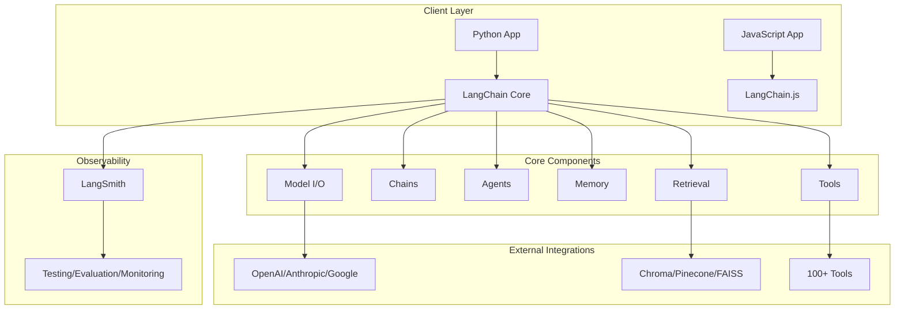
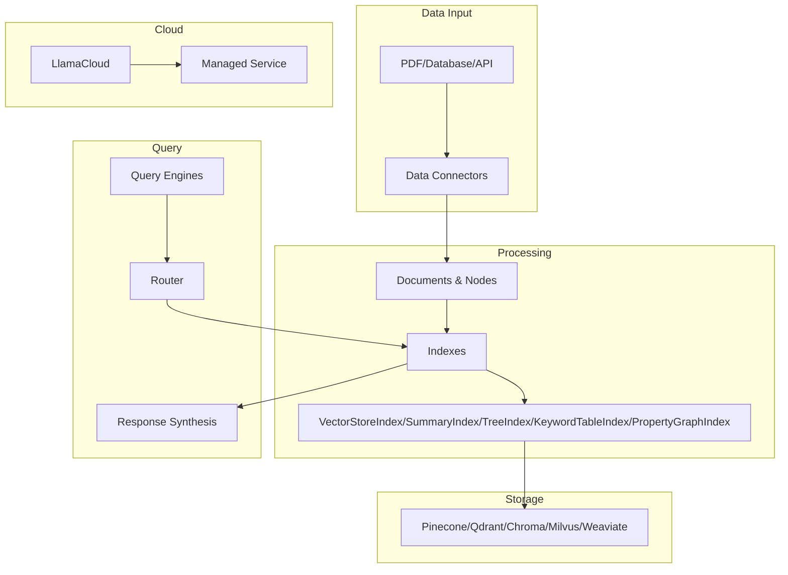
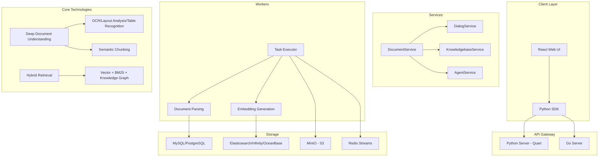
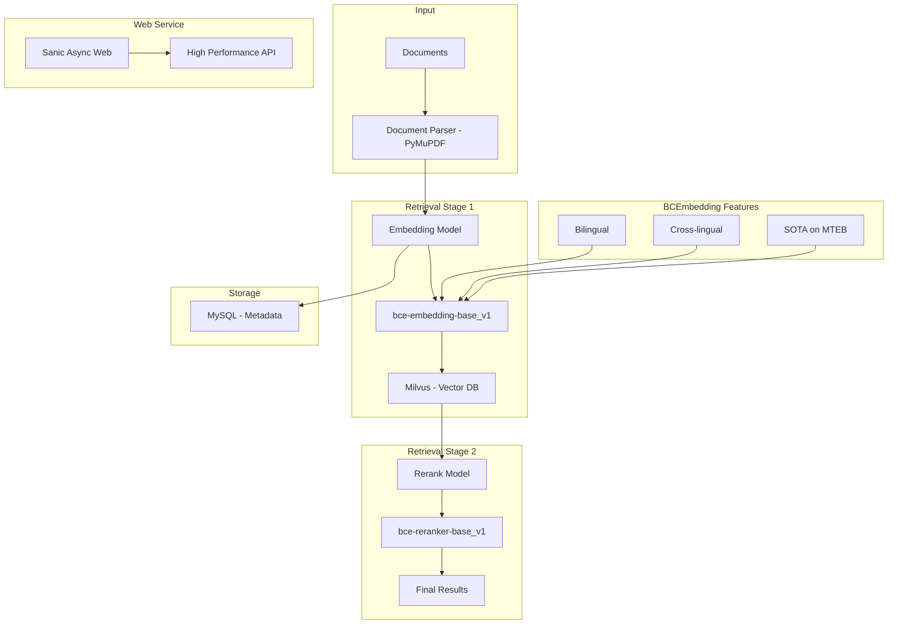
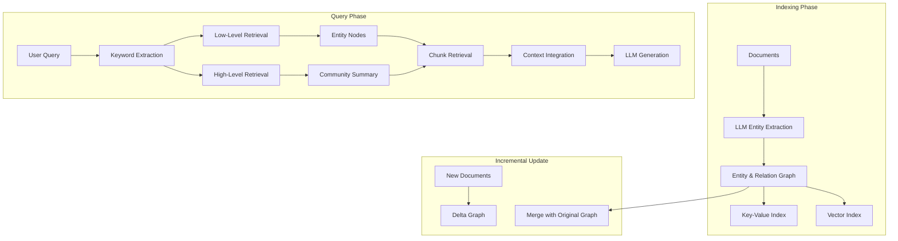
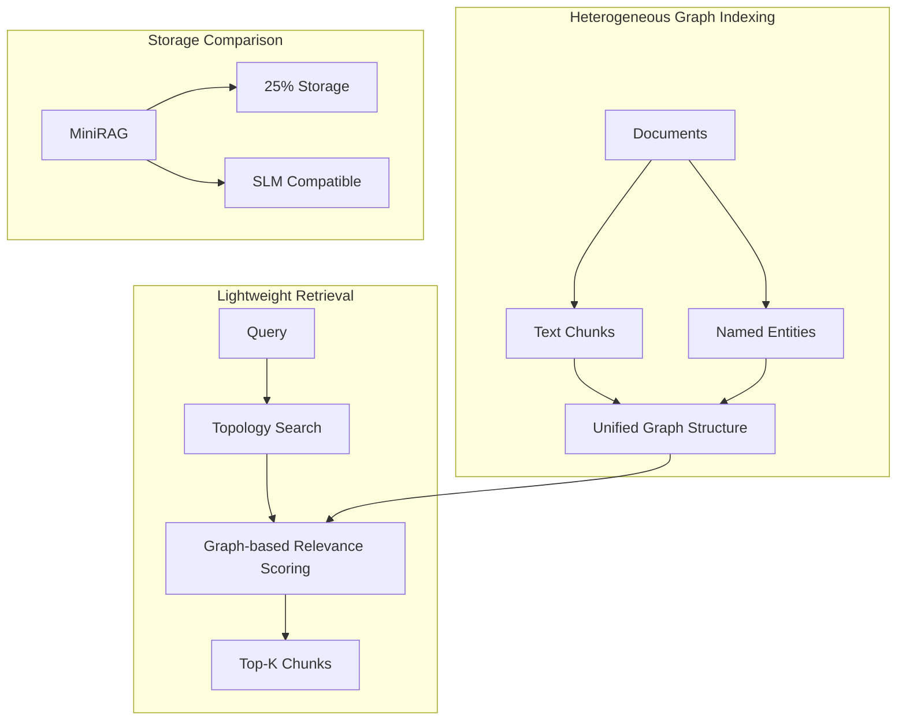

# RAG 建设方案横纵分析报告

> 研究时间：2026-05-14 | 所属领域：AI 应用架构 | 研究对象类型：技术方案

## 一句话定义

RAG（Retrieval-Augmented Generation，检索增强生成）是一种将外部知识检索与大语言模型生成能力结合的技术架构，它解决了纯参数化模型在知识时效性、事实准确性和成本可控性方面的固有缺陷，已成为企业构建智能应用的核心基础设施。

---

## 二、纵向分析：从诞生到当下

### 2.1 技术起源与学术奠基（2020年）

RAG 概念的系统性提出始于2020年。Meta AI（原Facebook AI Research）的Patrick Lewis团队发表了开创性论文《Retrieval-Augmented Generation for Knowledge-Intensive NLP Tasks》，首次将预训练的参数化语言模型与非参数化的外部记忆存储相结合。这一时期的RAG架构包含三个核心步骤：首先通过DPR（Dense Passage Retriever）从Wikipedia等大规模文档集合中检索相关段落；然后将检索结果与原始查询拼接后输入序列到序列生成模型（BART）；最终由生成器产出融合了外部知识的回答。

这一阶段的RAG还存在明显的局限性——它采用的是"检索—拼接—生成"的流水线式架构，检索和生成是两个相对独立的模块，缺乏对检索质量的反馈机制。尽管如此，这种"以检索补知识"的思路，为后续RAG技术的发展奠定了基本范式。

### 2.2 框架层的崛起与竞争（2022-2023年）

2022年是RAG框架层产品爆发的一年。这一年，LangChain和LlamaIndex两个最具影响力的开源框架几乎同时诞生，它们从不同的角度切入RAG应用开发市场。

LangChain的创始人Harrison Chase当时在Robust Intelligence担任机器学习工程师。在一次公司hackathon中，他与同事开发了一个能够基于Notion和Slack数据进行问答的聊天机器人——这正是RAG的典型应用场景。在参加多个AI meetup的过程中，Chase发现许多开发者都在重复构建相似的抽象层来连接语言模型与外部工具。他敏锐地意识到需要一个标准化的框架来简化这些常见模式的实现。2022年10月16日，Chase在GitHub上发布了LangChain的首个commit，最初版本仅包含约800行Python代码。

LlamaIndex（原名GPT Index）则由Jerry Liu于2022年11月创建。Liu毕业于普林斯顿大学计算机科学专业，曾在Quora担任机器学习工程师，随后在Uber从事AI研究工作。在使用GPT-3构建应用的过程中，Liu发现现有工具难以有效解决将私有数据与语言模型连接的挑战——GPT-3的上下文窗口有限，无法一次性加载大量私有文档数据，而传统的微调方案又过于昂贵且不够灵活。他的初始方案是创建一个"索引"系统，能够将大量文档组织成可高效检索的结构，从而在有限的上下文窗口内为模型提供最相关的知识片段。

这两个框架的诞生代表了RAG开发范式的根本转变：从"从零构建"到"框架组装"。LangChain以"链式编排"为核心抽象，强调工作流的灵活性；LlamaIndex以"索引和检索"为核心优化，追求在RAG场景下的极致效果。这种分工——LangChain偏向通用应用开发，LlamaIndex偏向RAG效果优化——一直延续至今。

### 2.3 开源RAG产品的涌现（2024年）

2024年，开源RAG产品进入爆发期，多个面向端到端场景的产品相继问世。

RAGFlow由Infiniflow团队开发，于2024年4月1日正式开源。该项目的设计理念强调"质量进，质量出"——通过深度文档理解模型确保数据入口的质量。其核心创新包括：引入针对非结构化数据的语义分块（Semantic Chunking）步骤，避免简易文本切分对文档布局信息的破坏；采用企业级搜索引擎提供混合搜索能力，结合BM25全文检索与向量语义检索。RAGFlow的发展节奏极为紧凑，开源后不到三个月即获得1万GitHub星标。

QAnything是网易有道团队开发的开源RAG引擎，于2024年1月正式发布。与其他RAG产品不同，QAnything的研发并非始于明确的商业目标，而是源于团队在文档翻译领域的长期积累。2022年，有道团队启动了一个文档翻译升级项目；2023年3月项目上线后效果显著，此时正值ChatGPT技术兴起，团队敏锐地意识到可以将现有技术扩展至文档问答领域。QAnything的技术特色包括自研的BCEmbedding中英双语语义嵌入模型，在MTEB语义表征评测和LlamaIndex RAG评测中均达到SOTA水平。

### 2.4 HKUDS 团队崛起：LightRAG 家族（2024-2025年）

2024年，一个来自香港大学（HKU）的研究团队——HKUDS（HKU Data Science Lab）——在RAG领域异军突起，推出了多个具有影响力的开源项目，形成了"LightRAG 家族"。

**LightRAG 的诞生**：2024年10月，香港大学黄超团队发表了LightRAG论文（EMNLP 2025），提出将知识图谱结构融入文本索引的双层检索系统。LightRAG的核心创新包括：1）图结构增强的实体和关系提取；2）低层级（实体节点）和高层级（社区摘要）的双层检索；3）增量更新算法支持动态知识库的高效扩展。相比微软GraphRAG，LightRAG在增量更新时无需重新生成整个社区摘要，显著降低了计算开销。

LightRAG在GitHub上获得了惊人的增长：从2024年10月发布到2025年中期，已积累超过34,000颗星标，成为GraphRAG之后最受关注的开源RAG项目。其性能在多个基准测试中超越NaiveRAG、RQ-RAG、HyDE和GraphRAG，特别是在法律领域（83.6%对比16.4%）和农业领域（67.6%对比32.4%）的优势尤为明显。

**MiniRAG（2025年1月）**：针对小型语言模型（SLMs）的轻量级RAG框架。MiniRAG的核心理念是"让RAG在小模型上也能工作"，它通过语义感知的异构图索引机制，将文本块和命名实体统一到一个结构中，减少对复杂语义理解的依赖。实验表明，MiniRAG使用SLMs时能达到接近LLM-based方法的性能，同时仅需25%的存储空间。该项目还发布了LiHua-World数据集，专门用于评估端侧设备上的RAG能力。

**RAG-Anything（2025年6月）**：面向多模态文档的All-in-One RAG框架。现代文档越来越包含文本、图像、表格、公式、图表等多模态内容，传统纯文本RAG难以有效处理。RAG-Anything在LightRAG基础上扩展，支持PDF、Office文档、图片等格式的统一处理，通过VLM（视觉语言模型）增强查询理解，实现跨模态的知识图谱构建和检索。该项目在GitHub上迅速获得关注，发布仅数月即突破10,000颗星标。

**VideoRAG（2025年2月）**：面向极长上下文视频的RAG系统，支持视频内容的语义检索和理解。

HKUDS团队的战略布局清晰：从单模态文本RAG（LightRAG）出发，逐步扩展到多模态（RAG-Anything）、轻量化（MiniRAG）、长视频（VideoRAG），形成了一个完整的RAG技术栈。这种"平台+垂直"的扩展策略，使他们在短时间内建立了强大的社区影响力。

### 2.5 技术范式的演进（2023-2025年）

从技术演进的角度看，RAG经历了几个重要的范式升级：

**Self-RAG（2023年）**：由斯坦福大学和IBM研究院联合提出，训练语言模型自主判断何时需要检索、检索结果是否相关以及生成内容是否得到证据支持。这种自适应检索机制解决了传统RAG中"无差别检索"带来的效率问题。

**GraphRAG（2024年）**：微软研究院于2024年2月发布，将知识图谱与RAG深度融合。通过从非结构化文档中自动提取实体和关系，构建结构化的知识图谱索引。GraphRAG能够处理涉及复杂实体关系、语义推理和多步逻辑关联的查询，这是传统向量检索难以胜任的。

**LightRAG（2024年）**：香港大学黄超团队推出（EMNLP 2025），在GraphRAG基础上引入双层检索（低层级实体+高层级社区）和增量更新算法，解决了GraphRAG在全量重建时的高计算开销问题。

**CID-GraphRAG（2025年）**：意图驱动的图检索增强，专门解决多轮客服对话中上下文连贯性问题。通过双层意图图谱和"意图匹配+语义相似度"双路径检索，在73次评估中大幅领先传统方案。

**Agentic RAG（2024-2025年）**：将RAG能力与智能体框架深度结合，使系统能够规划、执行多步检索、使用外部工具并反思检索结果。这种范式的核心特征包括动态决策能力、多轮交互能力、工具集成能力和错误恢复能力。

**多模态RAG（2025年）**：RAG-Anything等技术方案将RAG扩展到图像、表格、公式、视频等多模态内容处理，标志着RAG从纯文本向全模态演进。

### 2.6 云平台RAG服务的成熟（2024-2025年）

国内云平台在2024-2025年相继推出企业级RAG服务：

百度千帆大模型平台通过知识库模块提供完整RAG能力，差异化优势在于与百度搜索的深度整合，能够直接调用百度搜索的实时索引，在时效性要求高的场景具有明显优势。

阿里百炼（Model Studio）将RAG能力集成在平台中，支持多种向量模型和排序模型，其特色在于与阿里云OpenSearch和淘宝、1688等业务沉淀的商品知识图谱的协同。

腾讯云通过智能体开发平台和知识引擎原子能力提供RAG服务，强调组件化服务设计，将RAG链路中的各个能力解耦为独立API，企业开发者可根据需求灵活组装定制化的RAG链路。

---

## 三、横向分析：竞争图谱

### 3.1 框架层产品对比

#### LangChain：通用编排的集大成者

LangChain采用以"链式编排"为核心的系统架构，其技术栈如下：

**核心优势**：
- 编排灵活性：以Chain为核心抽象，适合复杂的多步骤工作流
- 工具生态丰富：支持100+工具集成，涵盖搜索、数据库、API等
- 企业级特性：LangSmith提供完整的可观测性和调试能力
- 多模态支持：支持文本、图像、视频等多种数据类型的处理

**局限性**：
- 学习曲线较陡，调试复杂工作流具有挑战性
- 在纯RAG场景下可能存在过度设计的问题
- 文档更新有时滞后于代码变更

#### LlamaIndex：检索效果的极致追求

LlamaIndex采用Index-centric架构设计，专门针对RAG场景优化：

**核心优势**：
- 检索优化：提供多种高级索引策略，如层次索引、知识图谱索引、混合检索等
- 数据处理能力：强大的文档解析和节点解析功能，支持元数据过滤
- Router模块：支持自动选择最优检索策略
- 性能优化：在基准测试中，检索速度比原生LangChain快约40%

**局限性**：
- 工具集成和复杂工作流编排方面相对LangChain较弱
- 在需要复杂agent编排时可能需要结合LangChain使用

#### RAGFlow：企业级深度文档理解

RAGFlow采用五层微服务架构，强调深度文档理解能力：

**核心优势**：
- 深度文档理解：支持复杂格式（扫描件、表格、公式）的精细解析
- 混合检索：融合向量、关键词、知识图谱多种检索方式
- Infinity集成：原生支持Infiniflow自研的Infinity向量数据库
- 可视化工作流：提供Agent Canvas，支持拖拽式编排

**局限性**：
- 部署复杂度较高
- GPU资源消耗大
- 解析速度相对较慢

#### QAnything：中文场景的务实选择

QAnything采用"两阶段检索"架构，强调Embedding + Rerank的组合优化：

**核心优势**：
- 两阶段检索：强调Rerank环节的重要性，默认检索100个文档后进行精排过滤
- 中文优化：针对中英双语和跨语种场景优化
- 一键部署：Docker Compose一键启动

**局限性**：
- 项目自2024年5月后未再有重大功能更新
- 前端无法二次开发
- 扩展性有限

#### LightRAG：图增强的轻量级RAG

LightRAG采用图结构增强的双层检索架构：

**核心优势**：
- 双层检索：低层级（实体节点）和高层级（社区摘要）协同
- 增量更新：无需重新生成整个知识图谱，显著降低计算开销
- 性能领先：在多个基准测试中超越GraphRAG、NaiveRAG等
- 灵活的存储后端：支持JSON文件、PostgreSQL、MongoDB、Neo4j等

**局限性**：
- 对LLM能力要求较高，需要LLM执行实体-关系提取
- 不建议使用推理模型进行文档处理
- 大规模数据处理时存在性能瓶颈（50K+文档场景）

#### MiniRAG：面向小模型的轻量级RAG

MiniRAG专为资源受限场景设计，使用小型语言模型也能实现良好性能：

**核心优势**：
- 存储效率：仅需传统方案25%的存储空间
- SLM兼容：使用小型语言模型也能达到接近LLM的性能
- 鲁棒性：从LLM切换到SLM时，准确率下降仅0.8%-20%
- 异构图索引：统一文本块和命名实体的索引结构

**局限性**：
- 性能仍略低于基于LLM的方案
- 社区规模和生态相对较小
- 主要面向端侧/边缘设备场景

### 3.2 云平台RAG服务对比

| 维度 | 百度千帆 | 阿里百炼 | 腾讯云 |
|------|---------|---------|--------|
| **核心能力** | 知识库+RAG+AppBuilder | 知识库+排序+向量模型 | ES向量检索+混元大模型 |
| **向量存储** | VDB百亿级 | ADB-PG分析型 | ES内置KNN |
| **检索策略** | 混合检索+知识图谱 | 混合检索+重排序 | RRF融合 |
| **差异化** | 百度搜索实时索引 | 通义系列模型集成 | 一站式+Serverless |
| **优势场景** | 需要搜索能力的场景 | 阿里云生态企业 | 已有腾讯技术栈的企业 |

### 3.3 选型决策矩阵

| 应用场景 | 推荐方案 | 核心理由 |
|---------|---------|---------|
| 构建复杂AI应用 | LangChain | 编排能力强，工具生态丰富 |
| 专注RAG效果 | LlamaIndex | 检索优化好，API设计清晰 |
| 处理复杂文档 | RAGFlow | 文档理解深，支持多种格式 |
| 中文场景快速部署 | QAnything | 中文优化好，一键启动 |
| 企业级云端方案 | 百度/阿里 | 完整工具链，运维省心 |
| 已有搜索架构 | 腾讯云ES | 平滑过渡，成本低 |
| 图增强+高性能 | LightRAG | 双层检索，增量更新，支持多存储后端 |
| 多模态文档 | RAG-Anything | 统一处理PDF/图片/表格/公式 |
| 端侧/轻量化部署 | MiniRAG | 25%存储，兼容小模型 |

---

## 四、横纵交汇洞察

### 4.1 历史如何塑造了当下的竞争位置

回顾RAG技术的发展历程，几个关键的历史节点塑造了今天的竞争格局：

**2022年的框架之争**决定了今天的市场分层。LangChain和LlamaIndex的同时诞生并非巧合——它们分别代表了两种互补的思路：LangChain从"应用编排"切入，强调通用性；LlamaIndex从"检索效果"切入，强调专业化。这种分工在今天依然有效：需要复杂工作流的企业选择LangChain，需要极致RAG效果的企业选择LlamaIndex。

**2024年的产品分化**标志着RAG从工具向平台的演进。RAGFlow、QAnything等端到端产品的出现，代表RAG从"框架+自行组装"的开发模式向"开箱即用"的产品模式转变。这种转变的背景是企业级需求的增长——越来越多的企业需要的是解决方案而非开发框架。

**2024-2025年的云平台入场**改变了竞争维度。百度、阿里、腾讯的RAG服务不再是简单的功能提供，而是与各自生态深度绑定。百度搜索+千帆、阿里云+百炼、腾讯ES+混元——这种生态协同能力是开源产品难以匹敌的。

### 4.2 竞品的纵向对比与路径差异

不同产品的今天，根源在于它们走过了不同的历史路径：

**LangChain的路径**：从个人side project到行业标准平台。创始人Harrison Chase在Robust Intelligence的hackathon项目是起点，2023年ChatGPT的发布是催化剂，Sequoia的投资是加速器。LangChain的成功在于它始终保持了"通用性"这个核心定位，即使后来推出LangGraph也是为了更好地服务复杂应用场景，而非偏离到某个垂直领域。

**LlamaIndex的路径**：从索引工具到RAG专业平台。Jerry Liu在Uber的工作经历让他深刻理解"数据与模型连接"的痛点，这个痛点驱动了LlamaIndex的核心设计——一切围绕索引和检索展开。这种"专业化"路径让LlamaIndex在RAG效果上领先，但也限制了它在非RAG场景的渗透。

**RAGFlow的路径**：从深度文档理解到企业级RAG平台。Infiniflow团队的核心竞争力在于文档解析能力，这是他们在做搜索时代积累的技术。正是这种技术积淀，让RAGFlow在处理复杂文档（如扫描件、表格、公式）时具有明显优势。

### 4.3 未来推演

基于纵向趋势和横向竞争格局，给出三个剧本：

**最可能的剧本（60%概率）**：RAG市场走向分化与整合。开源框架层产品（LangChain、LlamaIndex）持续迭代但增速放缓；垂直领域的端到端产品（如RAGFlow）获得企业市场；云平台RAG服务成为中小企业首选。市场将呈现"开源做底层、云端做上层、垂直做场景"的格局。

**最危险的剧本（20%概率）**：RAG被新的技术范式颠覆。如果长上下文窗口技术继续发展，理论上可以"一次性加载整个知识库"，那么RAG的"分块检索"模式将受到根本性挑战。不过，这种替代更多会在特定场景发生，而非完全取代。

**最乐观的剧本（20%概率）**：RAG成为AI Agent的核心基础设施。随着Agentic RAG的成熟，RAG不再只是"问答"的底层技术，而是Agent的"记忆系统"和"知识大脑"。每个Agent都需要RAG能力来访问企业知识库，这将催生一个远超当前规模的市场。

### 4.4 给智能客服建设的启示

回到智能客服这个具体场景，RAG建设应该如何选择？

**短期（1-6个月）**：如果目标是快速上线、验证PMF，选择端到端产品。RAGFlow适合对文档处理质量要求高的场景（如法律、金融）；QAnything适合中文场景下的快速部署。

**中期（6-12个月）**：如果需要构建差异化竞争力，选择开源框架+自研。LangChain/LlamaIndex提供了足够的灵活性，可以根据业务特点定制检索策略、对话流程、效果评估。

**长期（12个月以上）**：如果要构建完整的企业智能化平台，需要考虑与云平台的生态协同。百度千帆、阿里百炼的一站式能力更适合这个阶段。

无论选择哪条路径，有一个趋势是确定的：RAG不是一次性的"配置"，而是持续迭代的"能力"。从索引优化到检索调优，从效果评估到用户体验——这是一场没有终点的持续改进。

---

## 五、信息来源

1. Lewis, P., et al. (2020). "Retrieval-Augmented Generation for Knowledge-Intensive NLP Tasks". arXiv:2005.11401
2. LangChain Official Documentation. https://python.langchain.com/
3. LlamaIndex Official Documentation. https://docs.llamaindex.ai/
4. RAGFlow GitHub Repository. https://github.com/infiniflow/ragflow
5. QAnything GitHub Repository. https://github.com/netease-youdao/qanything
6. 百度千帆大模型平台文档. https://cloud.baidu.com/product/wenxinworkshop
7. 阿里百炼平台文档. https://www.alibabacloud.com/product/model-studio
8. Self-RAG Paper. https://arxiv.org/abs:2310.11511
9. GraphRAG Microsoft Research. https://github.com/microsoft/graphrag
10. 斯坦福RAG综述论文. https://arxiv.org/abs:2407.00619
11. LightRAG GitHub Repository. https://github.com/HKUDS/LightRAG
12. LightRAG Paper (EMNLP 2025). https://arxiv.org/abs/2410.05779
13. MiniRAG GitHub Repository. https://github.com/HKUDS/MiniRAG
14. MiniRAG Paper. https://arxiv.org/abs/2501.06713
15. RAG-Anything GitHub Repository. https://github.com/HKUDS/RAG-Anything
16. RAG-Anything Technical Report. https://arxiv.org/abs/2510.12323
17. 腾讯优图 RAG 技术架构与创新实践. https://www.53ai.com/news/RAG/2025090859432
18. CID-GraphRAG 意图驱动图检索. https://www.53ai.com/news/RAG/2025092492875.html

---

## 方法论说明

本报告采用横纵分析法（Horizontal-Vertical Analysis）进行深度研究。该方法由数字生命卡兹克（Khazix）提出，融合了语言学中的历时-共时分析（Saussure）、社会科学中的纵向-横截面研究设计、商学院案例研究法、以及竞争战略分析的核心思想。核心原则：纵向追时间深度，横向追同期广度，最终交汇出判断。