本文深入探讨构建高质量 RAG 知识库的垂直技术原理与工程实践。文章首先界定知识库作为外部记忆系统的角色，并引入 RAGAS 框架从检索相关性、生成忠实度及答案相关性维度建立评估标准。随后详细拆解离线索引与在线查询流程，重点分析文档切分策略如 Late Chunking 和意图驱动切分，对比稀疏、稠密及混合检索范式，并阐述HyDE等查询增强技术。此外，文章探讨 Cross-Encoder 重排序机制以优化精度，介绍 AutoRAG 自动化优化、 QuIM-RAG 问题倒排索引及 OpenViking 文件系统范式等前沿架构，旨在通过系统性技术选型解决幻觉、召回不准等问题，实现知识库性能的端到端优化。什么是 Agent 构建中的知识库？什么时候应该用它？▐考古一下，RAG 的起源RAG（Retrieval-Augmented Generation，检索增强生成）由 Facebook AI Research（现 Meta AI）于 2020 年首次提出。项目内容论文Retrieval-Augmented Generation for Knowledge-Intensive NLP Tasks作者Patrick Lewis, Ethan Perez, Aleksandra Piktus, Fabio Petroni, Vladimir Karpukhin 等发表NeurIPS 2020链接https://arxiv.org/abs/2005.11401论文的核心贡献在于提出了一种将参数化记忆（Parametric Memory）与非参数化记忆（Non-Parametric Memory）相结合的架构：参数化记忆：预训练 seq2seq 模型（如 BART）的模型权重非参数化记忆：Wikipedia 语料的密集向量索引，通过 DPR（Dense Passage Retriever）构建这一架构在开放域问答（Open-Domain QA）任务上显著超越了纯参数化模型，奠定了后续 RAG 研究的基础。▐知识库的定义在 Agent 构建的语境下，知识库（Knowledge Base）是一个外部记忆系统，用于存储和检索不在模型参数中的信息。它作为 RAG 架构的核心组件，承担非参数化记忆的角色。RAG 的基本工作流程：Query → Retriever（检索器） → Top-K Documents → Context Augmentation → Generator（生成器） → Response其中，知识库的核心接口，就是上传和召回。不同版本和理论，就是召回的内容和排序的区别。▐使用知识库可以解决什么问题？这个问题应该回到 LLM 的固有局限上，知识库是一种对应的解决方案：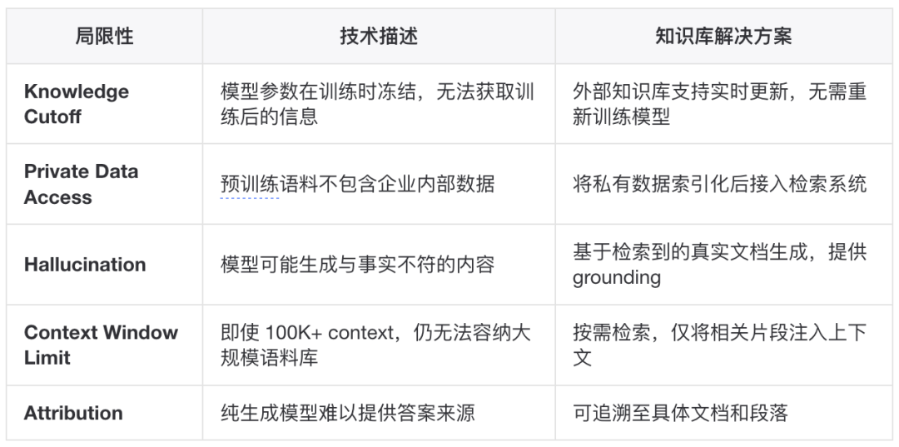▐适用场景分析结合前面几点，使用场景也比较清晰了。适合构建知识库的场景：不需要知识库的场景：▐RAG vs Long Context随着上下文窗口的扩展（Claude 200K, Gemini 1M+），需要重新审视 RAG 的适用边界：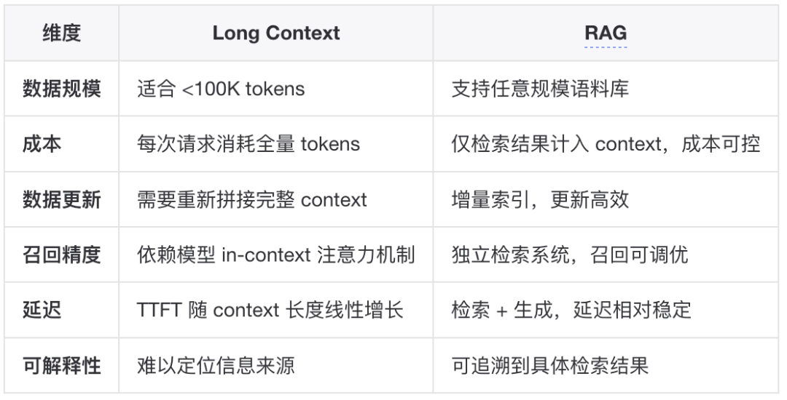选型建议：数据量 < 50K tokens 且更新频率低 → Long Context数据量大、更新频繁、需要精确召回 → RAG混合方案：RAG 粗筛 + Long Context 精读如何评判一个知识库的好坏？如题，我们想要构建更好的知识库，那么首先需要定义"好"的标准。▐评估框架：RAGASRAGAS（Retrieval Augmented Generation Assessment）是目前最广泛采用的 RAG 评估框架，其核心价值在于无参考评估（Reference-Free）——无需人工标注 ground truth 即可进行自动化评估。项目内容论文RAGAS: Automated Evaluation of Retrieval Augmented Generation链接https://arxiv.org/abs/2309.15217发表2023RAGAS 将 RAG 系统的评估分解为三个核心维度：这三个维度相互独立但互补，共同覆盖 RAG 系统的端到端性能。RAGAS 的关键洞察：RAG 系统的失败往往是检索和生成环节共同造成的，因此必须分别评估，才能定位问题根因。下面来看下这几个环节可以对应的指标有些什么。▐检索质量指标检索环节的目标是：召回与 query 相关的文档片段，并将相关内容排在前面。Context Precision（上下文精确率）定义：评估检索器将相关文档排在不相关文档之上的能力。计算方法：其中：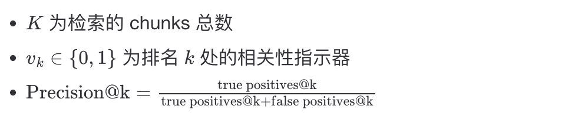直观理解：如果检索了 5 个 chunks，相关的 2 个排在第 1、2 位，比排在第 4、5 位的 precision 更高。Context Recall（上下文召回率）定义：评估回答问题所需的信息有多少被成功检索到。计算方法：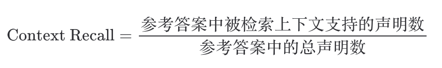具体步骤：将参考答案分解为多个 claims（声明）判断每个 claim 是否可归因于检索到的上下文计算被支持的 claims 占比注意：Context Recall 需要参考答案（reference），因此不是完全的 reference-free 指标。传统 IR 指标：（除 RAGAS 定义的指标外，传统 IR（Information Retrieval）指标仍然适用）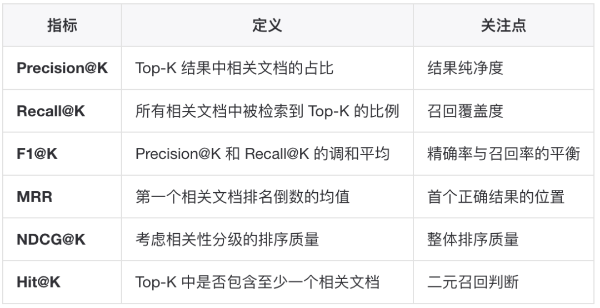Precision、Recall 与 F1 的关系：F1 是 Precision 和 Recall 的调和平均数，用于在两者之间取得平衡。当 Precision 和 Recall 差异较大时，F1 会偏向较小的那个值，因此 F1 高意味着两者都不能太低。▐生成质量指标生成环节的目标是：基于检索到的上下文，生成准确、相关的答案。Faithfulness（忠实度）定义：生成的答案在事实上是否与检索到的上下文一致。取值范围 [0, 1]，值越高表示答案越忠实于上下文。计算方法：具体步骤：使用 LLM 从答案中提取所有声明（claims）对每个声明，验证是否能从检索上下文中推断计算被支持的声明占比示例：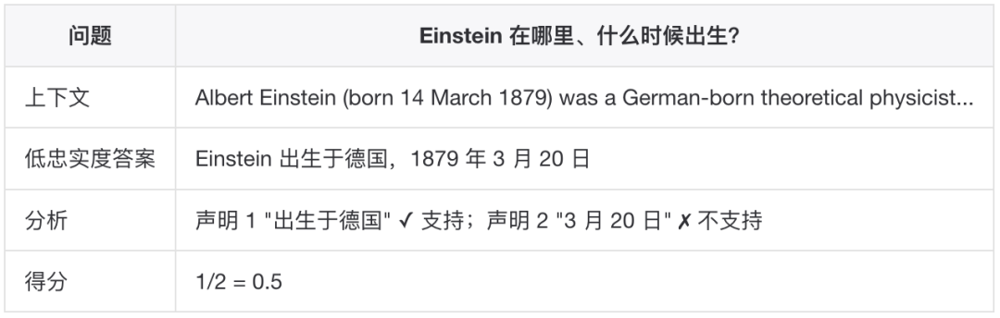Answer Relevance（答案相关性）定义：答案是否直接且恰当地回应了问题。该指标不考虑事实准确性，而是惩罚不完整或包含冗余信息的答案。计算方法：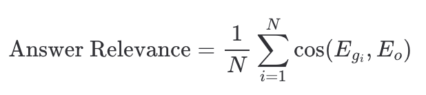其中：核心思想：如果答案正确回应了问题，那么从答案反向生成的问题应该与原问题高度相似。▐幻觉问题的深入分析Faithfulness 指标的本质是检测幻觉。RAG 系统的幻觉可进一步细分为三类：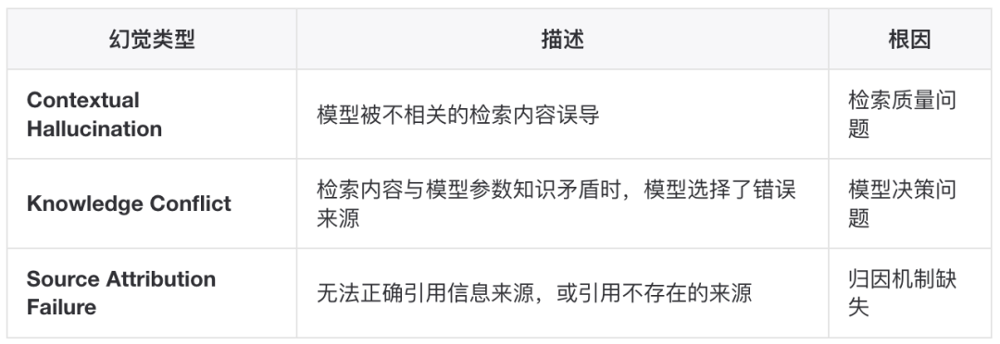参考论文：https://arxiv.org/abs/2601.19927幻觉检测方法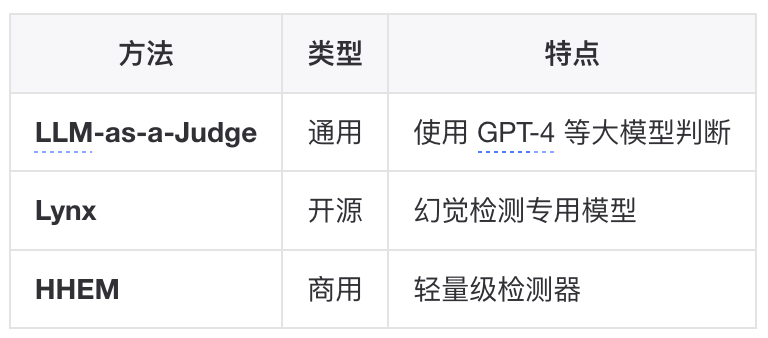参考论文：https://arxiv.org/abs/2503.21157不同 RAG 应用场景（医疗、法律、通用 QA）对检测器的要求不同，需根据具体场景选择。▐RAG 场景的特殊考量传统 IR 指标基于语义相似度评估检索质量，但在 RAG 场景下存在一个核心问题：语义相似 ≠ 对 LLM 有用。ICLERB（In-Context Learning Embedding and Reranker Benchmark）提出了端到端评估思路，这意味着：一个"好"的检索结果，不仅要语义相关，还要能有效支撑 LLM 生成正确答案。检索候选文档 → 注入 LLM 生成答案 → 评估答案准确性 → 反推检索器效果参考论文：https://arxiv.org/abs/2411.18947以上，在理解了评估标准后，接下来拆解知识库构建的完整流程，分析每个环节的优化空间。构建知识库分为几步？知识库的构建可以分为两个阶段：离线索引阶段（Indexing）和在线查询阶段（Querying）。本章节结合idealab平台（https://idealab.alibaba-inc.com/#/aistudio）的操作进行讲解。离线索引阶段：Load → Split → Embed → Store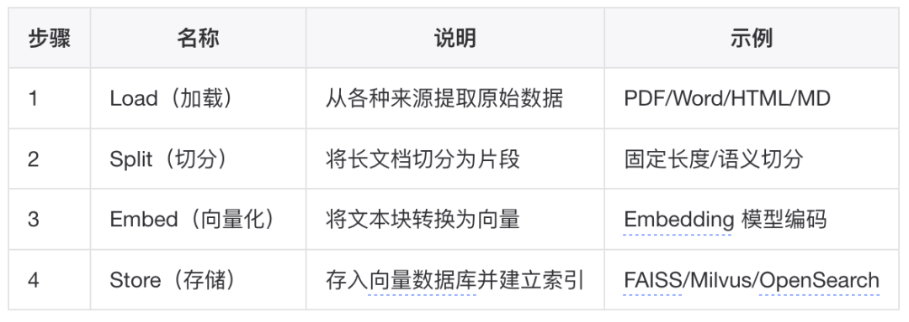在线查询阶段：Query → Retrieve → Rerank → Generate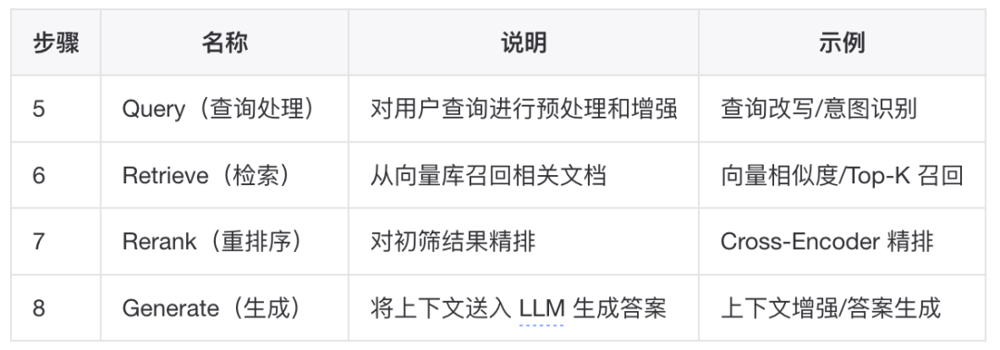▐离线索引阶段Step 1: Load（文档加载）这一步很好理解，就是将原始数据从各种来源和格式中提取出来。 目前idealab提供的知识库支持的有odps、语雀、钉钉文档、本地文件。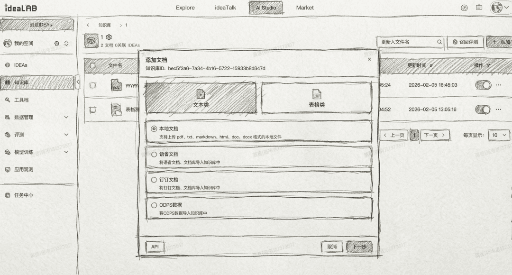Step 2: Split（文档切分）将长文档切分为适合检索和上下文注入的片段（chunks）。这是影响检索质量的关键环节。目前idealab提供的知识库支持的有默认智能切分（使用Opensearch切分方案），自定义切分（固定长度，符号切分），自定义工具切分。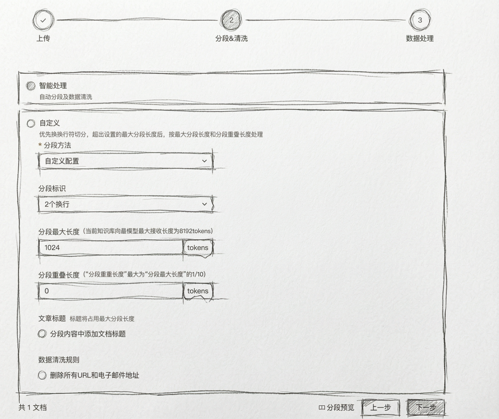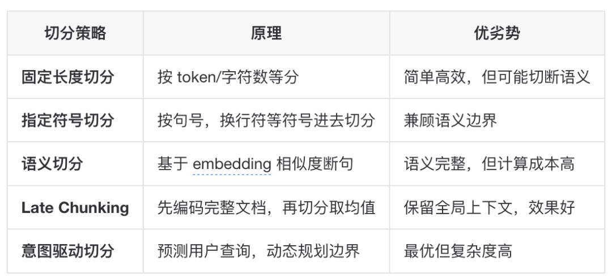关键参数：chunk_size：块大小，通常 256-1024 tokenschunk_overlap：重叠区域，通常 10%-20%，防止切断关键信息Step 3: Embed（向量化）使用 Embedding 模型将文本块转换为稠密向量。本环节idealab提供了多种模型可供选择。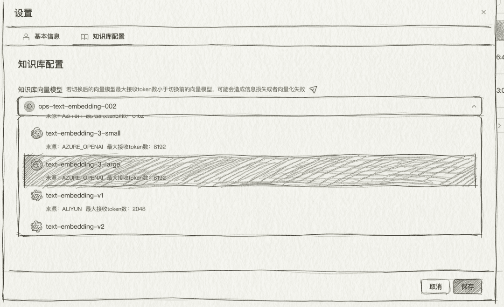Step 4: Store（存储与索引）将向量及其元数据存入向量数据库，建立高效检索索引。▐在线查询阶段Step 5: Query（查询处理）

本文深入探讨构建高质量 RAG 知识库的垂直技术原理与工程实践。文章首先界定知识库作为外部记忆系统的角色，并引入 RAGAS 框架从检索相关性、生成忠实度及答案相关性维度建立评估标准。随后详细拆解离线索引与在线查询流程，重点分析文档切分策略如 Late Chunking 和意图驱动切分，对比稀疏、稠密及混合检索范式，并阐述HyDE等查询增强技术。此外，文章探讨 Cross-Encoder 重排序机制以优化精度，介绍 AutoRAG 自动化优化、 QuIM-RAG 问题倒排索引及 OpenViking 文件系统范式等前沿架构，旨在通过系统性技术选型解决幻觉、召回不准等问题，实现知识库性能的端到端优化。

本文深入探讨构建高质量 RAG 知识库的垂直技术原理与工程实践。文章首先界定知识库作为外部记忆系统的角色，并引入 RAGAS 框架从检索相关性、生成忠实度及答案相关性维度建立评估标准。随后详细拆解离线索引与在线查询流程，重点分析文档切分策略如 Late Chunking 和意图驱动切分，对比稀疏、稠密及混合检索范式，并阐述HyDE等查询增强技术。此外，文章探讨 Cross-Encoder 重排序机制以优化精度，介绍 AutoRAG 自动化优化、 QuIM-RAG 问题倒排索引及 OpenViking 文件系统范式等前沿架构，旨在通过系统性技术选型解决幻觉、召回不准等问题，实现知识库性能的端到端优化。

本文深入探讨构建高质量 RAG 知识库的垂直技术原理与工程实践。文章首先界定知识库作为外部记忆系统的角色，并引入 RAGAS 框架从检索相关性、生成忠实度及答案相关性维度建立评估标准。随后详细拆解离线索引与在线查询流程，重点分析文档切分策略如 Late Chunking 和意图驱动切分，对比稀疏、稠密及混合检索范式，并阐述HyDE等查询增强技术。此外，文章探讨 Cross-Encoder 重排序机制以优化精度，介绍 AutoRAG 自动化优化、 QuIM-RAG 问题倒排索引及 OpenViking 文件系统范式等前沿架构，旨在通过系统性技术选型解决幻觉、召回不准等问题，实现知识库性能的端到端优化。

本文深入探讨构建高质量 RAG 知识库的垂直技术原理与工程实践。文章首先界定知识库作为外部记忆系统的角色，并引入 RAGAS 框架从检索相关性、生成忠实度及答案相关性维度建立评估标准。随后详细拆解离线索引与在线查询流程，重点分析文档切分策略如 Late Chunking 和意图驱动切分，对比稀疏、稠密及混合检索范式，并阐述HyDE等查询增强技术。此外，文章探讨 Cross-Encoder 重排序机制以优化精度，介绍 AutoRAG 自动化优化、 QuIM-RAG 问题倒排索引及 OpenViking 文件系统范式等前沿架构，旨在通过系统性技术选型解决幻觉、召回不准等问题，实现知识库性能的端到端优化。

本文深入探讨构建高质量 RAG 知识库的垂直技术原理与工程实践。文章首先界定知识库作为外部记忆系统的角色，并引入 RAGAS 框架从检索相关性、生成忠实度及答案相关性维度建立评估标准。随后详细拆解离线索引与在线查询流程，重点分析文档切分策略如 Late Chunking 和意图驱动切分，对比稀疏、稠密及混合检索范式，并阐述HyDE等查询增强技术。此外，文章探讨 Cross-Encoder 重排序机制以优化精度，介绍 AutoRAG 自动化优化、 QuIM-RAG 问题倒排索引及 OpenViking 文件系统范式等前沿架构，旨在通过系统性技术选型解决幻觉、召回不准等问题，实现知识库性能的端到端优化。

什么是 Agent 构建中的知识库？

## 什么是 Agent 构建中的知识库？

什么时候应该用它？

## 什么时候应该用它？

▐考古一下，RAG 的起源RAG（Retrieval-Augmented Generation，检索增强生成）由 Facebook AI Research（现 Meta AI）于 2020 年首次提出。项目内容论文Retrieval-Augmented Generation for Knowledge-Intensive NLP Tasks作者Patrick Lewis, Ethan Perez, Aleksandra Piktus, Fabio Petroni, Vladimir Karpukhin 等发表NeurIPS 2020链接https://arxiv.org/abs/2005.11401论文的核心贡献在于提出了一种将参数化记忆（Parametric Memory）与非参数化记忆（Non-Parametric Memory）相结合的架构：参数化记忆：预训练 seq2seq 模型（如 BART）的模型权重非参数化记忆：Wikipedia 语料的密集向量索引，通过 DPR（Dense Passage Retriever）构建这一架构在开放域问答（Open-Domain QA）任务上显著超越了纯参数化模型，奠定了后续 RAG 研究的基础。▐知识库的定义在 Agent 构建的语境下，知识库（Knowledge Base）是一个外部记忆系统，用于存储和检索不在模型参数中的信息。它作为 RAG 架构的核心组件，承担非参数化记忆的角色。RAG 的基本工作流程：Query → Retriever（检索器） → Top-K Documents → Context Augmentation → Generator（生成器） → Response其中，知识库的核心接口，就是上传和召回。不同版本和理论，就是召回的内容和排序的区别。▐使用知识库可以解决什么问题？这个问题应该回到 LLM 的固有局限上，知识库是一种对应的解决方案：▐适用场景分析结合前面几点，使用场景也比较清晰了。适合构建知识库的场景：不需要知识库的场景：▐RAG vs Long Context随着上下文窗口的扩展（Claude 200K, Gemini 1M+），需要重新审视 RAG 的适用边界：选型建议：数据量 < 50K tokens 且更新频率低 → Long Context数据量大、更新频繁、需要精确召回 → RAG混合方案：RAG 粗筛 + Long Context 精读如何评判一个知识库的好坏？如题，我们想要构建更好的知识库，那么首先需要定义"好"的标准。▐评估框架：RAGASRAGAS（Retrieval Augmented Generation Assessment）是目前最广泛采用的 RAG 评估框架，其核心价值在于无参考评估（Reference-Free）——无需人工标注 ground truth 即可进行自动化评估。项目内容论文RAGAS: Automated Evaluation of Retrieval Augmented Generation链接https://arxiv.org/abs/2309.15217发表2023RAGAS 将 RAG 系统的评估分解为三个核心维度：这三个维度相互独立但互补，共同覆盖 RAG 系统的端到端性能。RAGAS 的关键洞察：RAG 系统的失败往往是检索和生成环节共同造成的，因此必须分别评估，才能定位问题根因。下面来看下这几个环节可以对应的指标有些什么。▐检索质量指标检索环节的目标是：召回与 query 相关的文档片段，并将相关内容排在前面。Context Precision（上下文精确率）定义：评估检索器将相关文档排在不相关文档之上的能力。计算方法：其中：直观理解：如果检索了 5 个 chunks，相关的 2 个排在第 1、2 位，比排在第 4、5 位的 precision 更高。Context Recall（上下文召回率）定义：评估回答问题所需的信息有多少被成功检索到。计算方法：具体步骤：将参考答案分解为多个 claims（声明）判断每个 claim 是否可归因于检索到的上下文计算被支持的 claims 占比注意：Context Recall 需要参考答案（reference），因此不是完全的 reference-free 指标。传统 IR 指标：（除 RAGAS 定义的指标外，传统 IR（Information Retrieval）指标仍然适用）

## ▐考古一下，RAG 的起源RAG（Retrieval-Augmented Generation，检索增强生成）由 Facebook AI Research（现 Meta AI）于 2020 年首次提出。项目内容论文Retrieval-Augmented Generation for Knowledge-Intensive NLP Tasks作者Patrick Lewis, Ethan Perez, Aleksandra Piktus, Fabio Petroni, Vladimir Karpukhin 等发表NeurIPS 2020链接https://arxiv.org/abs/2005.11401论文的核心贡献在于提出了一种将参数化记忆（Parametric Memory）与非参数化记忆（Non-Parametric Memory）相结合的架构：参数化记忆：预训练 seq2seq 模型（如 BART）的模型权重非参数化记忆：Wikipedia 语料的密集向量索引，通过 DPR（Dense Passage Retriever）构建这一架构在开放域问答（Open-Domain QA）任务上显著超越了纯参数化模型，奠定了后续 RAG 研究的基础。▐知识库的定义在 Agent 构建的语境下，知识库（Knowledge Base）是一个外部记忆系统，用于存储和检索不在模型参数中的信息。它作为 RAG 架构的核心组件，承担非参数化记忆的角色。RAG 的基本工作流程：Query → Retriever（检索器） → Top-K Documents → Context Augmentation → Generator（生成器） → Response其中，知识库的核心接口，就是上传和召回。不同版本和理论，就是召回的内容和排序的区别。▐使用知识库可以解决什么问题？这个问题应该回到 LLM 的固有局限上，知识库是一种对应的解决方案：▐适用场景分析结合前面几点，使用场景也比较清晰了。适合构建知识库的场景：不需要知识库的场景：▐RAG vs Long Context随着上下文窗口的扩展（Claude 200K, Gemini 1M+），需要重新审视 RAG 的适用边界：选型建议：数据量 < 50K tokens 且更新频率低 → Long Context数据量大、更新频繁、需要精确召回 → RAG混合方案：RAG 粗筛 + Long Context 精读如何评判一个知识库的好坏？如题，我们想要构建更好的知识库，那么首先需要定义"好"的标准。▐评估框架：RAGASRAGAS（Retrieval Augmented Generation Assessment）是目前最广泛采用的 RAG 评估框架，其核心价值在于无参考评估（Reference-Free）——无需人工标注 ground truth 即可进行自动化评估。项目内容论文RAGAS: Automated Evaluation of Retrieval Augmented Generation链接https://arxiv.org/abs/2309.15217发表2023RAGAS 将 RAG 系统的评估分解为三个核心维度：这三个维度相互独立但互补，共同覆盖 RAG 系统的端到端性能。RAGAS 的关键洞察：RAG 系统的失败往往是检索和生成环节共同造成的，因此必须分别评估，才能定位问题根因。下面来看下这几个环节可以对应的指标有些什么。▐检索质量指标检索环节的目标是：召回与 query 相关的文档片段，并将相关内容排在前面。Context Precision（上下文精确率）定义：评估检索器将相关文档排在不相关文档之上的能力。计算方法：其中：直观理解：如果检索了 5 个 chunks，相关的 2 个排在第 1、2 位，比排在第 4、5 位的 precision 更高。Context Recall（上下文召回率）定义：评估回答问题所需的信息有多少被成功检索到。计算方法：具体步骤：将参考答案分解为多个 claims（声明）判断每个 claim 是否可归因于检索到的上下文计算被支持的 claims 占比注意：Context Recall 需要参考答案（reference），因此不是完全的 reference-free 指标。传统 IR 指标：（除 RAGAS 定义的指标外，传统 IR（Information Retrieval）指标仍然适用）

▐考古一下，RAG 的起源

## ▐考古一下，RAG 的起源

▐考古一下，RAG 的起源

▐考古一下，RAG 的起源

## ▐考古一下，RAG 的起源

▐考古一下，RAG 的起源

### ▐考古一下，RAG 的起源

RAG（Retrieval-Augmented Generation，检索增强生成）由 Facebook AI Research（现 Meta AI）于 2020 年首次提出。

项目内容论文Retrieval-Augmented Generation for Knowledge-Intensive NLP Tasks作者Patrick Lewis, Ethan Perez, Aleksandra Piktus, Fabio Petroni, Vladimir Karpukhin 等发表NeurIPS 2020链接https://arxiv.org/abs/2005.11401

项目内容论文Retrieval-Augmented Generation for Knowledge-Intensive NLP Tasks作者Patrick Lewis, Ethan Perez, Aleksandra Piktus, Fabio Petroni, Vladimir Karpukhin 等发表NeurIPS 2020链接https://arxiv.org/abs/2005.11401

项目内容论文Retrieval-Augmented Generation for Knowledge-Intensive NLP Tasks作者Patrick Lewis, Ethan Perez, Aleksandra Piktus, Fabio Petroni, Vladimir Karpukhin 等发表NeurIPS 2020链接https://arxiv.org/abs/2005.11401

项目

内容

论文

Retrieval-Augmented Generation for Knowledge-Intensive NLP Tasks

作者

Patrick Lewis, Ethan Perez, Aleksandra Piktus, Fabio Petroni, Vladimir Karpukhin 等

发表

NeurIPS 2020

链接

https://arxiv.org/abs/2005.11401

论文的核心贡献在于提出了一种将参数化记忆（Parametric Memory）与非参数化记忆（Non-Parametric Memory）相结合的架构：

这一架构在开放域问答（Open-Domain QA）任务上显著超越了纯参数化模型，奠定了后续 RAG 研究的基础。

▐知识库的定义

## ▐知识库的定义

▐知识库的定义

## ▐知识库的定义

## ▐知识库的定义

▐知识库的定义

### ▐知识库的定义

在 Agent 构建的语境下，知识库（Knowledge Base）是一个外部记忆系统，用于存储和检索不在模型参数中的信息。它作为 RAG 架构的核心组件，承担非参数化记忆的角色。

RAG 的基本工作流程：

Query → Retriever（检索器） → Top-K Documents → Context Augmentation → Generator（生成器） → Response

其中，知识库的核心接口，就是上传和召回。不同版本和理论，就是召回的内容和排序的区别。

▐使用知识库可以解决什么问题？

## ▐使用知识库可以解决什么问题？

▐使用知识库可以解决什么问题？

## ▐使用知识库可以解决什么问题？

## ▐使用知识库可以解决什么问题？

▐使用知识库可以解决什么问题？

### ▐使用知识库可以解决什么问题？

这个问题应该回到 LLM 的固有局限上，知识库是一种对应的解决方案：

▐适用场景分析

## ▐适用场景分析

▐适用场景分析

## ▐适用场景分析

## ▐适用场景分析

▐适用场景分析

### ▐适用场景分析

结合前面几点，使用场景也比较清晰了。

适合构建知识库的场景：

不需要知识库的场景：

▐RAG vs Long Context

## ▐RAG vs Long Context

▐RAG vs Long Context

## ▐RAG vs Long Context

## ▐RAG vs Long Context

▐RAG vs Long Context

### ▐RAG vs Long Context

随着上下文窗口的扩展（Claude 200K, Gemini 1M+），需要重新审视 RAG 的适用边界：

选型建议：

数据量 < 50K tokens 且更新频率低 → Long Context

数据量大、更新频繁、需要精确召回 → RAG

混合方案：RAG 粗筛 + Long Context 精读

如何评判一个知识库的好坏？

如何评判一个知识库的好坏？

## 如何评判一个知识库的好坏？

如何评判一个知识库的好坏？

如何评判一个知识库的好坏？

## 如何评判一个知识库的好坏？

如题，我们想要构建更好的知识库，那么首先需要定义"好"的标准。

▐评估框架：RAGAS

## ▐评估框架：RAGAS

▐评估框架：RAGAS

## ▐评估框架：RAGAS

## ▐评估框架：RAGAS

▐评估框架：RAGAS

### ▐评估框架：RAGAS

RAGAS（Retrieval Augmented Generation Assessment）是目前最广泛采用的 RAG 评估框架，其核心价值在于无参考评估（Reference-Free）——无需人工标注 ground truth 即可进行自动化评估。

项目内容论文RAGAS: Automated Evaluation of Retrieval Augmented Generation链接https://arxiv.org/abs/2309.15217发表2023

项目内容论文RAGAS: Automated Evaluation of Retrieval Augmented Generation链接https://arxiv.org/abs/2309.15217发表2023

项目内容论文RAGAS: Automated Evaluation of Retrieval Augmented Generation链接https://arxiv.org/abs/2309.15217发表2023

项目

内容

论文

RAGAS: Automated Evaluation of Retrieval Augmented Generation

链接

https://arxiv.org/abs/2309.15217

发表

2023

RAGAS 将 RAG 系统的评估分解为三个核心维度：

这三个维度相互独立但互补，共同覆盖 RAG 系统的端到端性能。RAGAS 的关键洞察：RAG 系统的失败往往是检索和生成环节共同造成的，因此必须分别评估，才能定位问题根因。下面来看下这几个环节可以对应的指标有些什么。

▐检索质量指标

## ▐检索质量指标

▐检索质量指标

## ▐检索质量指标

## ▐检索质量指标

▐检索质量指标

### ▐检索质量指标

检索环节的目标是：召回与 query 相关的文档片段，并将相关内容排在前面。

### Context Precision（上下文精确率）

定义：评估检索器将相关文档排在不相关文档之上的能力。

计算方法：

其中：

直观理解：如果检索了 5 个 chunks，相关的 2 个排在第 1、2 位，比排在第 4、5 位的 precision 更高。

### Context Recall（上下文召回率）

定义：评估回答问题所需的信息有多少被成功检索到。

计算方法：

具体步骤：

将参考答案分解为多个 claims（声明）

判断每个 claim 是否可归因于检索到的上下文

计算被支持的 claims 占比

注意：Context Recall 需要参考答案（reference），因此不是完全的 reference-free 指标。

### 传统 IR 指标：（除 RAGAS 定义的指标外，传统 IR（Information Retrieval）指标仍然适用）

Precision、Recall 与 F1 的关系：F1 是 Precision 和 Recall 的调和平均数，用于在两者之间取得平衡。当 Precision 和 Recall 差异较大时，F1 会偏向较小的那个值，因此 F1 高意味着两者都不能太低。▐生成质量指标生成环节的目标是：基于检索到的上下文，生成准确、相关的答案。Faithfulness（忠实度）

## Precision、Recall 与 F1 的关系：F1 是 Precision 和 Recall 的调和平均数，用于在两者之间取得平衡。当 Precision 和 Recall 差异较大时，F1 会偏向较小的那个值，因此 F1 高意味着两者都不能太低。▐生成质量指标生成环节的目标是：基于检索到的上下文，生成准确、相关的答案。Faithfulness（忠实度）

Precision、Recall 与 F1 的关系：

F1 是 Precision 和 Recall 的调和平均数，用于在两者之间取得平衡。当 Precision 和 Recall 差异较大时，F1 会偏向较小的那个值，因此 F1 高意味着两者都不能太低。

▐生成质量指标

## ▐生成质量指标

▐生成质量指标

## ▐生成质量指标

## ▐生成质量指标

▐生成质量指标

### ▐生成质量指标

生成环节的目标是：基于检索到的上下文，生成准确、相关的答案。

### Faithfulness（忠实度）

定义：生成的答案在事实上是否与检索到的上下文一致。取值范围 [0, 1]，值越高表示答案越忠实于上下文。计算方法：具体步骤：使用 LLM 从答案中提取所有声明（claims）对每个声明，验证是否能从检索上下文中推断计算被支持的声明占比示例：

## 定义：生成的答案在事实上是否与检索到的上下文一致。取值范围 [0, 1]，值越高表示答案越忠实于上下文。计算方法：具体步骤：使用 LLM 从答案中提取所有声明（claims）对每个声明，验证是否能从检索上下文中推断计算被支持的声明占比示例：

定义：生成的答案在事实上是否与检索到的上下文一致。取值范围 [0, 1]，值越高表示答案越忠实于上下文。

计算方法：

具体步骤：

使用 LLM 从答案中提取所有声明（claims）

对每个声明，验证是否能从检索上下文中推断

计算被支持的声明占比

### 示例：

Answer Relevance（答案相关性）定义：答案是否直接且恰当地回应了问题。该指标不考虑事实准确性，而是惩罚不完整或包含冗余信息的答案。计算方法：其中：核心思想：如果答案正确回应了问题，那么从答案反向生成的问题应该与原问题高度相似。▐幻觉问题的深入分析Faithfulness 指标的本质是检测幻觉。RAG 系统的幻觉可进一步细分为三类：参考论文：https://arxiv.org/abs/2601.19927幻觉检测方法

## Answer Relevance（答案相关性）定义：答案是否直接且恰当地回应了问题。该指标不考虑事实准确性，而是惩罚不完整或包含冗余信息的答案。计算方法：其中：核心思想：如果答案正确回应了问题，那么从答案反向生成的问题应该与原问题高度相似。▐幻觉问题的深入分析Faithfulness 指标的本质是检测幻觉。RAG 系统的幻觉可进一步细分为三类：参考论文：https://arxiv.org/abs/2601.19927幻觉检测方法

### Answer Relevance（答案相关性）

定义：答案是否直接且恰当地回应了问题。该指标不考虑事实准确性，而是惩罚不完整或包含冗余信息的答案。

计算方法：

其中：

核心思想：如果答案正确回应了问题，那么从答案反向生成的问题应该与原问题高度相似。

▐幻觉问题的深入分析

## ▐幻觉问题的深入分析

▐幻觉问题的深入分析

## ▐幻觉问题的深入分析

## ▐幻觉问题的深入分析

▐幻觉问题的深入分析

### ▐幻觉问题的深入分析

Faithfulness 指标的本质是检测幻觉。RAG 系统的幻觉可进一步细分为三类：

### 幻觉检测方法

参考论文：https://arxiv.org/abs/2503.21157不同 RAG 应用场景（医疗、法律、通用 QA）对检测器的要求不同，需根据具体场景选择。▐RAG 场景的特殊考量传统 IR 指标基于语义相似度评估检索质量，但在 RAG 场景下存在一个核心问题：语义相似 ≠ 对 LLM 有用。ICLERB（In-Context Learning Embedding and Reranker Benchmark）提出了端到端评估思路，这意味着：一个"好"的检索结果，不仅要语义相关，还要能有效支撑 LLM 生成正确答案。检索候选文档 → 注入 LLM 生成答案 → 评估答案准确性 → 反推检索器效果参考论文：https://arxiv.org/abs/2411.18947以上，在理解了评估标准后，接下来拆解知识库构建的完整流程，分析每个环节的优化空间。构建知识库分为几步？知识库的构建可以分为两个阶段：离线索引阶段（Indexing）和在线查询阶段（Querying）。本章节结合idealab平台（https://idealab.alibaba-inc.com/#/aistudio）的操作进行讲解。离线索引阶段：Load → Split → Embed → Store在线查询阶段：Query → Retrieve → Rerank → Generate▐离线索引阶段Step 1: Load（文档加载）这一步很好理解，就是将原始数据从各种来源和格式中提取出来。 目前idealab提供的知识库支持的有odps、语雀、钉钉文档、本地文件。Step 2: Split（文档切分）将长文档切分为适合检索和上下文注入的片段（chunks）。这是影响检索质量的关键环节。目前idealab提供的知识库支持的有默认智能切分（使用Opensearch切分方案），自定义切分（固定长度，符号切分），自定义工具切分。关键参数：chunk_size：块大小，通常 256-1024 tokenschunk_overlap：重叠区域，通常 10%-20%，防止切断关键信息Step 3: Embed（向量化）使用 Embedding 模型将文本块转换为稠密向量。本环节idealab提供了多种模型可供选择。Step 4: Store（存储与索引）

## 参考论文：https://arxiv.org/abs/2503.21157不同 RAG 应用场景（医疗、法律、通用 QA）对检测器的要求不同，需根据具体场景选择。▐RAG 场景的特殊考量传统 IR 指标基于语义相似度评估检索质量，但在 RAG 场景下存在一个核心问题：语义相似 ≠ 对 LLM 有用。ICLERB（In-Context Learning Embedding and Reranker Benchmark）提出了端到端评估思路，这意味着：一个"好"的检索结果，不仅要语义相关，还要能有效支撑 LLM 生成正确答案。检索候选文档 → 注入 LLM 生成答案 → 评估答案准确性 → 反推检索器效果参考论文：https://arxiv.org/abs/2411.18947以上，在理解了评估标准后，接下来拆解知识库构建的完整流程，分析每个环节的优化空间。构建知识库分为几步？知识库的构建可以分为两个阶段：离线索引阶段（Indexing）和在线查询阶段（Querying）。本章节结合idealab平台（https://idealab.alibaba-inc.com/#/aistudio）的操作进行讲解。离线索引阶段：Load → Split → Embed → Store在线查询阶段：Query → Retrieve → Rerank → Generate▐离线索引阶段Step 1: Load（文档加载）这一步很好理解，就是将原始数据从各种来源和格式中提取出来。 目前idealab提供的知识库支持的有odps、语雀、钉钉文档、本地文件。Step 2: Split（文档切分）将长文档切分为适合检索和上下文注入的片段（chunks）。这是影响检索质量的关键环节。目前idealab提供的知识库支持的有默认智能切分（使用Opensearch切分方案），自定义切分（固定长度，符号切分），自定义工具切分。关键参数：chunk_size：块大小，通常 256-1024 tokenschunk_overlap：重叠区域，通常 10%-20%，防止切断关键信息Step 3: Embed（向量化）使用 Embedding 模型将文本块转换为稠密向量。本环节idealab提供了多种模型可供选择。Step 4: Store（存储与索引）

不同 RAG 应用场景（医疗、法律、通用 QA）对检测器的要求不同，需根据具体场景选择。

▐RAG 场景的特殊考量

## ▐RAG 场景的特殊考量

▐RAG 场景的特殊考量

## ▐RAG 场景的特殊考量

## ▐RAG 场景的特殊考量

▐RAG 场景的特殊考量

### ▐RAG 场景的特殊考量

传统 IR 指标基于语义相似度评估检索质量，但在 RAG 场景下存在一个核心问题：语义相似 ≠ 对 LLM 有用。

ICLERB（In-Context Learning Embedding and Reranker Benchmark）提出了端到端评估思路，这意味着：一个"好"的检索结果，不仅要语义相关，还要能有效支撑 LLM 生成正确答案。

检索候选文档 → 注入 LLM 生成答案 → 评估答案准确性 → 反推检索器效果

参考论文：https://arxiv.org/abs/2411.18947

以上，在理解了评估标准后，接下来拆解知识库构建的完整流程，分析每个环节的优化空间。

构建知识库分为几步？

构建知识库分为几步？

## 构建知识库分为几步？

构建知识库分为几步？

构建知识库分为几步？

## 构建知识库分为几步？

构建知识库分为几步？

构建知识库分为几步？

## 构建知识库分为几步？

知识库的构建可以分为两个阶段：离线索引阶段（Indexing）和在线查询阶段（Querying）。本章节结合idealab平台（https://idealab.alibaba-inc.com/#/aistudio）的操作进行讲解。

离线索引阶段：Load → Split → Embed → Store

在线查询阶段：Query → Retrieve → Rerank → Generate

▐离线索引阶段

## ▐离线索引阶段

▐离线索引阶段

## ▐离线索引阶段

## ▐离线索引阶段

▐离线索引阶段

### ▐离线索引阶段

Step 1: Load（文档加载）

## Step 1: Load（文档加载）

Step 1: Load（文档加载）

Step 1: Load（文档加载）

## Step 1: Load（文档加载）

Step 1: Load（文档加载）

#### Step 1: Load（文档加载）

这一步很好理解，就是将原始数据从各种来源和格式中提取出来。 目前idealab提供的知识库支持的有odps、语雀、钉钉文档、本地文件。

Step 2: Split（文档切分）

## Step 2: Split（文档切分）

Step 2: Split（文档切分）

## Step 2: Split（文档切分）

## Step 2: Split（文档切分）

Step 2: Split（文档切分）

#### Step 2: Split（文档切分）

将长文档切分为适合检索和上下文注入的片段（chunks）。这是影响检索质量的关键环节。目前idealab提供的知识库支持的有默认智能切分（使用Opensearch切分方案），自定义切分（固定长度，符号切分），自定义工具切分。

关键参数：

Step 3: Embed（向量化）

## Step 3: Embed（向量化）

Step 3: Embed（向量化）

## Step 3: Embed（向量化）

## Step 3: Embed（向量化）

Step 3: Embed（向量化）

#### Step 3: Embed（向量化）

使用 Embedding 模型将文本块转换为稠密向量。本环节idealab提供了多种模型可供选择。

Step 4: Store（存储与索引）

## Step 4: Store（存储与索引）

Step 4: Store（存储与索引）

## Step 4: Store（存储与索引）

Step 4: Store（存储与索引）

#### Step 4: Store（存储与索引）

将向量及其元数据存入向量数据库，建立高效检索索引。

▐在线查询阶段

## ▐在线查询阶段

▐在线查询阶段

## ▐在线查询阶段

▐在线查询阶段

### ▐在线查询阶段

Step 5: Query（查询处理）

## Step 5: Query（查询处理）

Step 5: Query（查询处理）

## Step 5: Query（查询处理）

Step 5: Query（查询处理）

#### Step 5: Query（查询处理）

对用户原始查询进行预处理和增强。这一步需要Agent的搭建者进行处理，最为简单的方式就是交给大模型自己来。充分信任基模的能力。 以下是一些常见的手段。

Step 6: Retrieve（向量检索）

## Step 6: Retrieve（向量检索）

Step 6: Retrieve（向量检索）

## Step 6: Retrieve（向量检索）

Step 6: Retrieve（向量检索）

#### Step 6: Retrieve（向量检索）

从向量数据库中召回与查询最相关的文档片段。

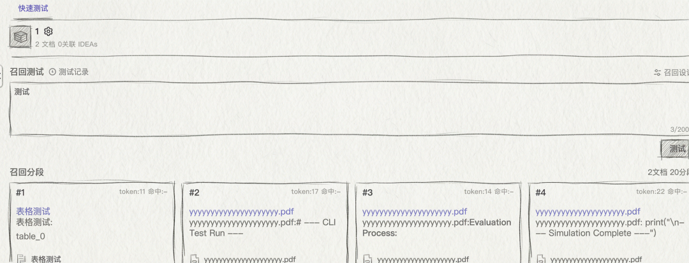

Query Embedding → ANN Search → Top-K Chunks

检索模式：

同样的，idealab支持多种配置项；

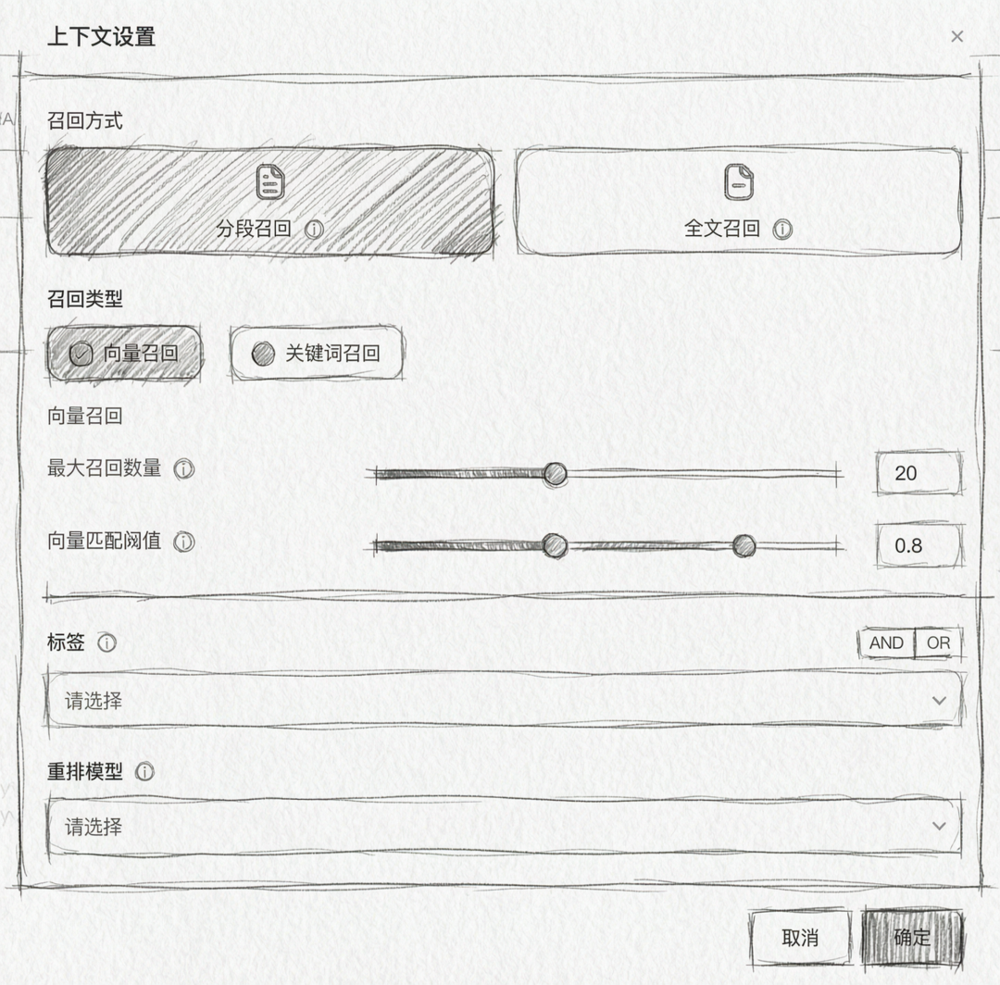

Step 7: Rerank（重排序，可选）

## Step 7: Rerank（重排序，可选）

Step 7: Rerank（重排序，可选）

## Step 7: Rerank（重排序，可选）

Step 7: Rerank（重排序，可选）

#### Step 7: Rerank（重排序，可选）

对初筛结果进行精排，解决初步召回不够准确的问题,尤其是混合召回后的排序。提升最终送入 LLM 的内容质量。

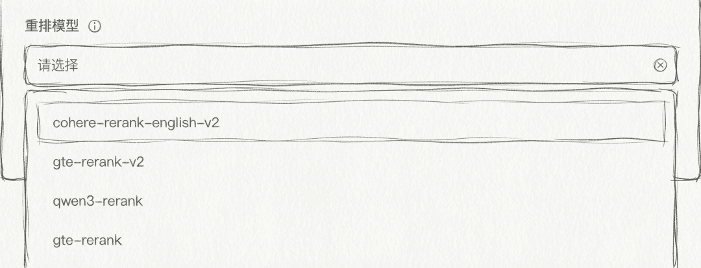

Step 8: Generate（答案生成）

## Step 8: Generate（答案生成）

Step 8: Generate（答案生成）

## Step 8: Generate（答案生成）

Step 8: Generate（答案生成）

#### Step 8: Generate（答案生成）

将检索到的上下文与用户问题一起送入 LLM 生成最终答案。

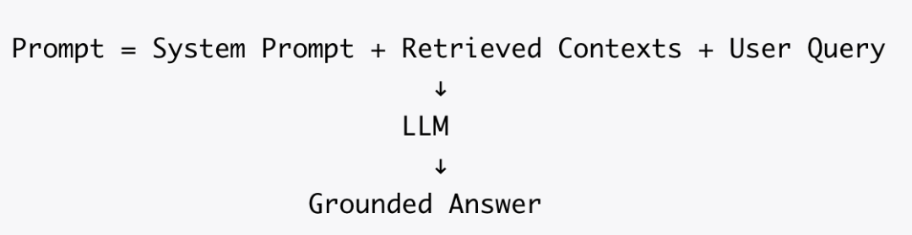

▐知识库的开源项目和案例

## ▐知识库的开源项目和案例

▐知识库的开源项目和案例

▐知识库的开源项目和案例

### ▐知识库的开源项目和案例

上述是 RAG 的常用实践路径，以及 idealab 提供了搭建 Agent 知识库的能力。但作为扩展 LLM 能力的一个方案，其选型和能做的还有很多想象空间。不妨站的更高一点看看别人搞了些啥。

案例一：AutoRAG - 自动化 RAG 模块优化框架

## 案例一：AutoRAG - 自动化 RAG 模块优化框架

案例一：AutoRAG - 自动化 RAG 模块优化框架

案例一：AutoRAG - 自动化 RAG 模块优化框架

#### 案例一：AutoRAG - 自动化 RAG 模块优化框架

项目信息内容论文AutoRAG: Automated Framework for optimization of Retrieval Augmented Generation Pipeline链接https://arxiv.org/abs/2410.20878GitHubhttps://github.com/Marker-Inc-Korea/AutoRAG

项目信息内容论文AutoRAG: Automated Framework for optimization of Retrieval Augmented Generation Pipeline链接https://arxiv.org/abs/2410.20878GitHubhttps://github.com/Marker-Inc-Korea/AutoRAG

项目信息内容论文AutoRAG: Automated Framework for optimization of Retrieval Augmented Generation Pipeline链接https://arxiv.org/abs/2410.20878GitHubhttps://github.com/Marker-Inc-Korea/AutoRAG

项目信息

内容

论文

AutoRAG: Automated Framework for optimization of Retrieval Augmented Generation Pipeline

链接

https://arxiv.org/abs/2410.20878

GitHub

https://github.com/Marker-Inc-Korea/AutoRAG

解决的问题：

RAG 系统涉及众多模块（分块策略、Embedding 模型、检索方式、Reranker 等），不同模块组合在不同数据集上表现差异很大。手动调优耗时且难以找到最优解。

核心方法：

AutoRAG 提供自动化的 RAG Pipeline 优化框架：

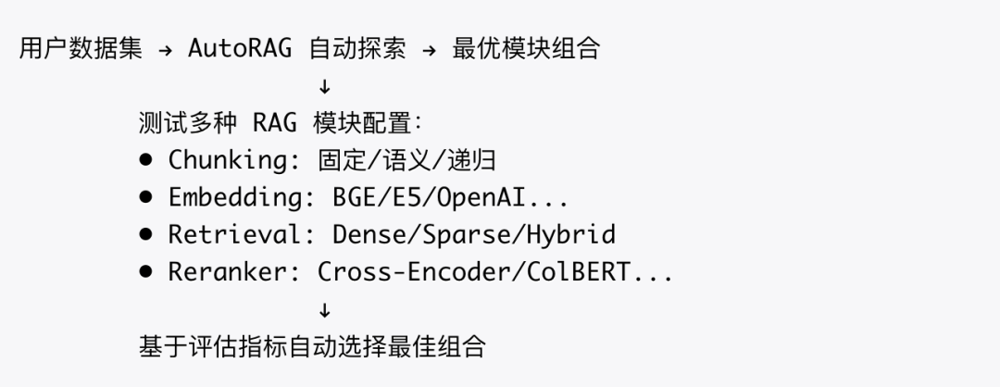

适用场景：

需要为特定领域数据集优化 RAG 配置

缺乏调优经验或资源

希望系统化比较不同方案

案例二：QuIM-RAG - 问题倒排索引匹配

## 案例二：QuIM-RAG - 问题倒排索引匹配

案例二：QuIM-RAG - 问题倒排索引匹配

案例二：QuIM-RAG - 问题倒排索引匹配

#### 案例二：QuIM-RAG - 问题倒排索引匹配

项目信息内容论文QuIM-RAG: Advancing Retrieval-Augmented Generation with Inverted Question Matching for Enhanced QA Performance发表IEEE Access, vol. 12, pp. 185401-185410, 2024链接https://arxiv.org/abs/2501.02702

项目信息内容论文QuIM-RAG: Advancing Retrieval-Augmented Generation with Inverted Question Matching for Enhanced QA Performance发表IEEE Access, vol. 12, pp. 185401-185410, 2024链接https://arxiv.org/abs/2501.02702

项目信息内容论文QuIM-RAG: Advancing Retrieval-Augmented Generation with Inverted Question Matching for Enhanced QA Performance发表IEEE Access, vol. 12, pp. 185401-185410, 2024链接https://arxiv.org/abs/2501.02702

项目信息

内容

论文

发表

链接

https://arxiv.org/abs/2501.02702

应用背景：

部署在一个日访问量数千次的高流量网站，用于回答复杂问题。语料库包含 500+ 页的领域文档。

解决的问题：

传统 RAG 在处理大量数据时存在信息稀释和幻觉问题——直接用 query 检索文档片段，语义匹配不够精准。

核心创新 - 问题倒排索引：

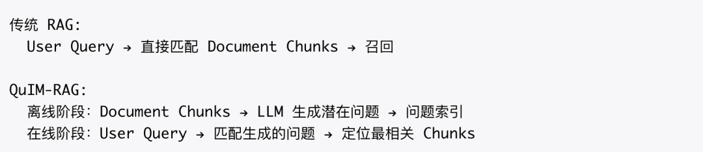

将"Query-Document 匹配"转化为"Query-Query 匹配"，提升检索精度。

评测结果：

使用 BERT-Score 和 RAGAS 指标评估

在两项指标上均优于传统 RAG 架构

案例三：OpenViking - 文件系统范式的上下文数据库

## 案例三：OpenViking - 文件系统范式的上下文数据库

案例三：OpenViking - 文件系统范式的上下文数据库

案例三：OpenViking - 文件系统范式的上下文数据库

#### 案例三：OpenViking - 文件系统范式的上下文数据库

项目信息内容GitHubhttps://github.com/volcengine/OpenViking作者字节跳动火山引擎

项目信息内容GitHubhttps://github.com/volcengine/OpenViking作者字节跳动火山引擎

项目信息内容GitHubhttps://github.com/volcengine/OpenViking作者字节跳动火山引擎

项目信息

内容

GitHub

https://github.com/volcengine/OpenViking

作者

解决的问题：

传统 RAG 存在以下痛点：

核心创新 - 文件系统范式（Filesystem Paradigm）：

技术特点：

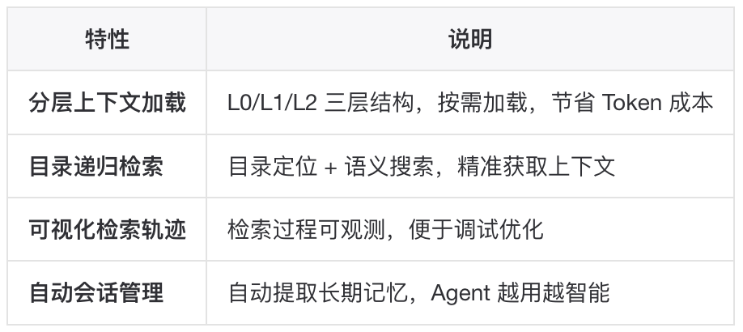

与传统 RAG 的对比：

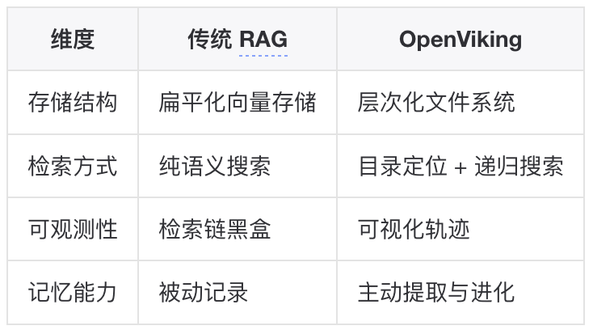

适用场景：长时运行的 Agent、需要复杂上下文管理的场景、对检索可解释性要求高的应用。

小结：知识库构建没有标准答案，需要根据数据特点和业务场景选择合适的架构模式。核心原则：

## 如何获得更好的切分（Chunking）？

如何获得更好的切分（Chunking）？

如何获得更好的切分（Chunking）？

如何获得更好的切分（Chunking）？

切分（Chunking）是知识库构建中影响最大但最容易被忽视的环节。切分质量直接决定了：

检索能否召回完整的答案信息

上下文是否包含足够的语义

是否会引入无关噪声

▐切分的核心挑战

## ▐切分的核心挑战

▐切分的核心挑战

▐切分的核心挑战

### ▐切分的核心挑战

切分存在一个两难困境：

核心目标：在粒度和完整性之间找到平衡点。

▐常见切分策略对比

## ▐常见切分策略对比

▐常见切分策略对比

▐常见切分策略对比

### ▐常见切分策略对比

固定长度切分（Fixed-size Chunking）

## 固定长度切分（Fixed-size Chunking）

固定长度切分（Fixed-size Chunking）

固定长度切分（Fixed-size Chunking）

#### 固定长度切分（Fixed-size Chunking）

最简单的方法：按固定 token 数切分，通常加上重叠区域。

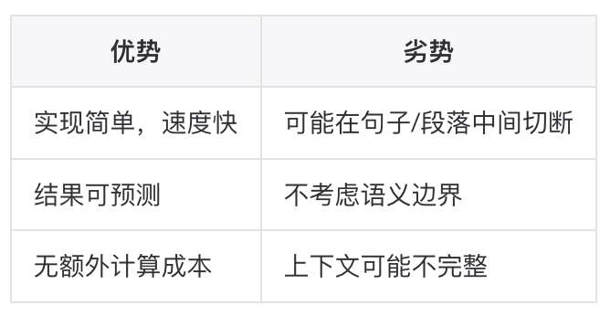

适用场景：快速原型、对切分质量要求不高的场景

## 递归切分（Recursive Chunking）

递归切分（Recursive Chunking）

递归切分（Recursive Chunking）

#### 递归切分（Recursive Chunking）

按层次结构递归切分：先尝试按段落分，段落太长则按句子分，句子太长则按字符分。

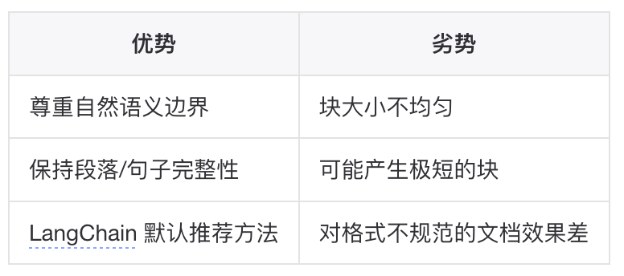

适用场景：通用文档处理，结构化文本

## 语义切分（Semantic Chunking）

语义切分（Semantic Chunking）

语义切分（Semantic Chunking）

#### 语义切分（Semantic Chunking）

基于语义相似度判断切分边界：相邻句子语义差异大时切分。

计算方法：

对每个句子计算 embedding

计算相邻句子的余弦相似度

相似度低于阈值处切分

关于成本效益的研究：

论文 *"Is Semantic Chunking Worth the Computational Cost?"*（https://arxiv.org/abs/2410.13070）的研究发现：

> 语义切分的计算成本与性能提升不成正比

语义切分的计算成本与性能提升不成正比

在文档检索、证据检索、答案生成三个任务上的实验表明，语义切分相比固定长度切分，性能提升有限，但计算成本显著增加。

结论：简单分块 + 合理重叠可能是更实用的选择。

▐进阶切分策略

## ▐进阶切分策略

▐进阶切分策略

▐进阶切分策略

### ▐进阶切分策略

## Late Chunking（延迟切分）

Late Chunking（延迟切分）

Late Chunking（延迟切分）

#### Late Chunking（延迟切分）

项目内容论文Late Chunking: Contextual Chunk Embeddings Using Long-Context Embedding Models链接https://arxiv.org/abs/2409.04701作者Jina AI, 2024

项目内容论文Late Chunking: Contextual Chunk Embeddings Using Long-Context Embedding Models链接https://arxiv.org/abs/2409.04701作者Jina AI, 2024

项目内容论文Late Chunking: Contextual Chunk Embeddings Using Long-Context Embedding Models链接https://arxiv.org/abs/2409.04701作者Jina AI, 2024

项目

内容

论文

Late Chunking: Contextual Chunk Embeddings Using Long-Context Embedding Models

链接

https://arxiv.org/abs/2409.04701

作者

Jina AI, 2024

核心问题：

传统方法"先切分，再编码"会导致每个 chunk 丢失来自其他 chunks 的上下文信息。

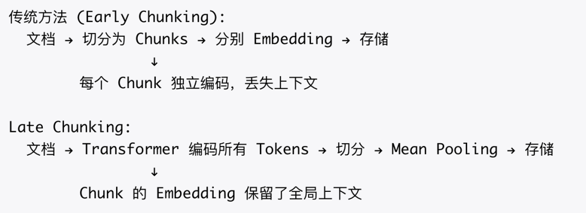

为什么有效：

Transformer 的注意力机制使每个 token 都"看到"了整个文档。先编码再切分，每个 chunk 的表示中已经融入了全局上下文。

使用条件：

需要支持长上下文的 Embedding 模型（如 Jina Embeddings v2 8K）

文档长度不超过模型的上下文窗口

效果：在各类检索任务上优于传统切分方法，无需额外训练。

## 意图驱动动态切分（Intent-Driven Dynamic Chunking）

意图驱动动态切分（Intent-Driven Dynamic Chunking）

意图驱动动态切分（Intent-Driven Dynamic Chunking）

#### 意图驱动动态切分（Intent-Driven Dynamic Chunking）

项目内容论文Intent-Driven Dynamic Chunking: Segmenting Documents to Reflect Predicted Information Needs链接https://arxiv.org/abs/2602.14784

项目内容论文Intent-Driven Dynamic Chunking: Segmenting Documents to Reflect Predicted Information Needs链接https://arxiv.org/abs/2602.14784

项目内容论文Intent-Driven Dynamic Chunking: Segmenting Documents to Reflect Predicted Information Needs链接https://arxiv.org/abs/2602.14784

项目

内容

论文

Intent-Driven Dynamic Chunking: Segmenting Documents to Reflect Predicted Information Needs

链接

https://arxiv.org/abs/2602.14784

核心思想：

切分边界应该由"用户可能问什么问题"来决定，而非文档本身的结构。

效果：

检索准确率提升 5%-67%

分块数量减少 40%-60%

答案覆盖率保持 93%-100%

适用场景：对检索质量要求高的场景，特别是长文档和异构文档。

## Small-to-Big 策略

Small-to-Big 策略

Small-to-Big 策略

#### Small-to-Big 策略

检索时使用小粒度 chunk，生成时扩展为大粒度上下文。

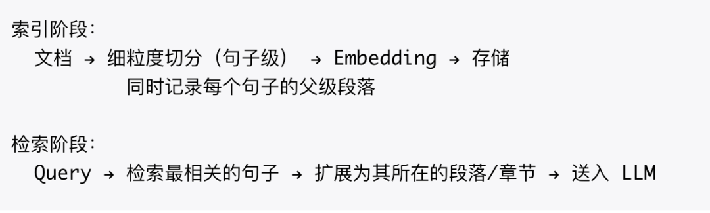

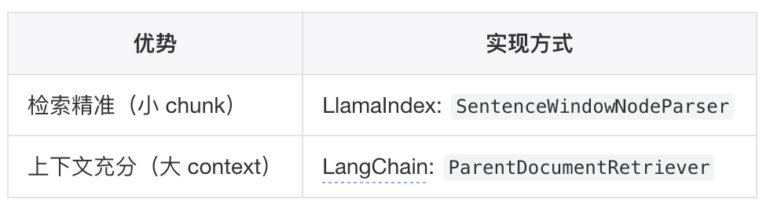

▐切分参数选择

Chunk Size

## Chunk Size

Chunk Size

Chunk Size

#### Chunk Size

## Chunk Overlap

Chunk Overlap

Chunk Overlap

#### Chunk Overlap

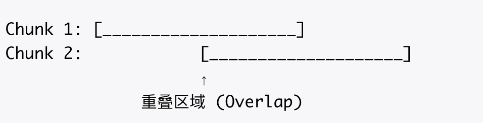

## ▐切分策略选型建议

▐切分策略选型建议

▐切分策略选型建议

### ▐切分策略选型建议

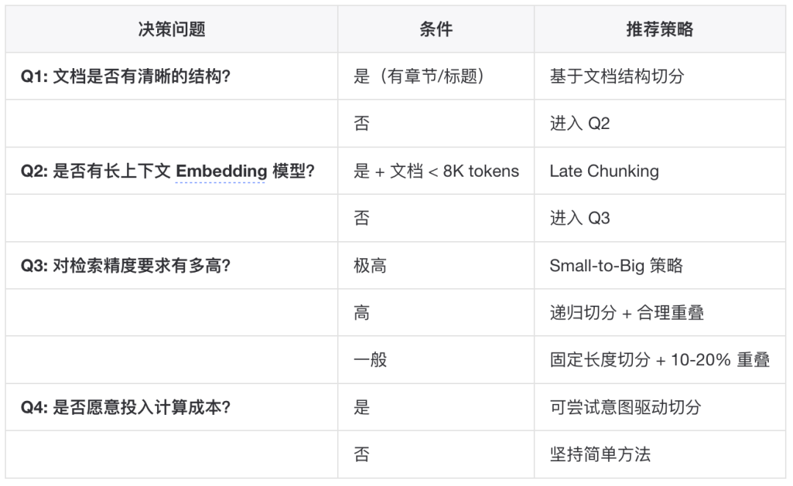

## ▐实践建议

▐实践建议

▐实践建议

### ▐实践建议

## 如何获得更好的召回（Retrieval）？

如何获得更好的召回（Retrieval）？

如何获得更好的召回（Retrieval）？

如何获得更好的召回（Retrieval）？

## 如何获得更好的召回（Retrieval）？

召回（Retrieval）是 RAG 系统的核心环节。检索质量直接决定了 LLM 能否获得正确的上下文信息——如果召回阶段就漏掉了相关文档，后续的 Rerank 和生成都无法弥补。

▐检索范式概述

当前主流的检索方法可分为三类：

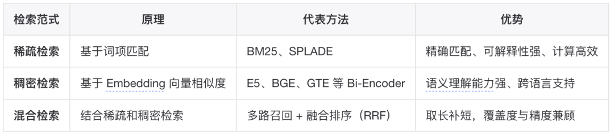

▐稀疏检索（Sparse Retrieval）

## BM25

BM25

#### BM25

BM25（Best Matching 25）是经典的稀疏检索算法，基于词频统计进行相关性打分：

其中：

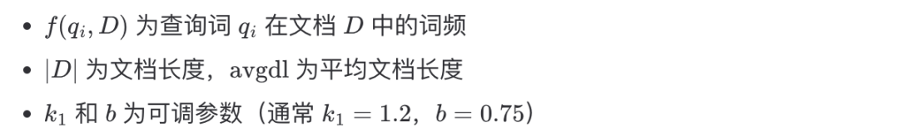

▐稠密检索（Dense Retrieval）

稠密检索使用 Embedding 模型将文本映射为稠密向量，通过向量相似度（余弦、内积）进行检索。

## Embedding 模型选型

Embedding 模型选型

#### Embedding 模型选型

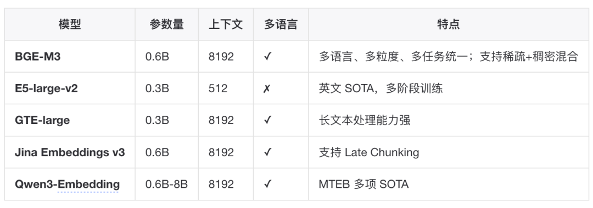

▐混合检索（Hybrid Retrieval）

混合检索结合稀疏和稠密方法的优势：

混合检索架构流程：

## 融合策略

融合策略

融合策略

#### 融合策略

1. Reciprocal Rank Fusion (RRF)

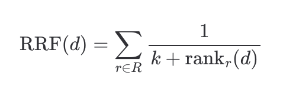

其中是文档在第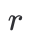路召回中的排名，通常取 60。

2. 加权线性组合

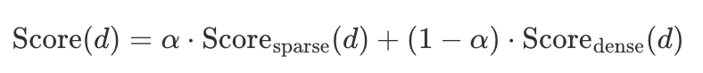

可通过验证集调优，通常在 0.3-0.7 之间。

## 混合检索的优势

混合检索的优势

混合检索的优势

#### 混合检索的优势

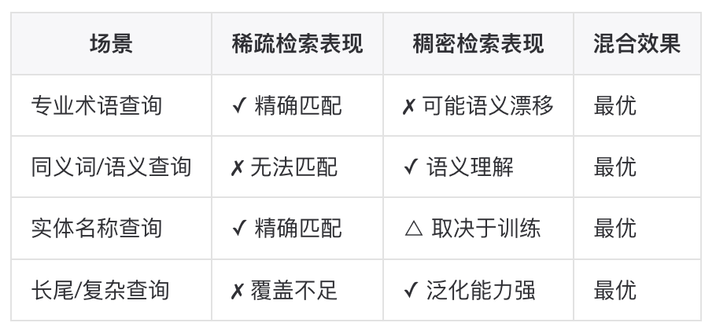

▐进阶检索策略

## 层次化检索（Hierarchical Retrieval）

层次化检索（Hierarchical Retrieval）

层次化检索（Hierarchical Retrieval）

#### 层次化检索（Hierarchical Retrieval）

项目内容论文Dense Hierarchical Retrieval for Open-Domain Question Answering链接https://arxiv.org/abs/2110.15439

项目内容论文Dense Hierarchical Retrieval for Open-Domain Question Answering链接https://arxiv.org/abs/2110.15439

项目内容论文Dense Hierarchical Retrieval for Open-Domain Question Answering链接https://arxiv.org/abs/2110.15439

项目

内容

论文

Dense Hierarchical Retrieval for Open-Domain Question Answering

链接

https://arxiv.org/abs/2110.15439

当语料库规模庞大时，直接段落级检索可能导致上下文丢失。层次化检索采用两阶段策略：

优势：

避免短段落丢失全局上下文

利用文档标题、章节结构等层次信息

In-Doc 和 In-Sec 负采样策略提升训练效果

查询增强（Query Enhancement）

查询增强（Query Enhancement）

## 查询增强（Query Enhancement）

查询增强（Query Enhancement）

查询增强（Query Enhancement）

## 查询增强（Query Enhancement）

查询增强（Query Enhancement）

#### 查询增强（Query Enhancement）

用户的原始查询往往不够清晰或完整，查询增强技术可以显著提升召回效果。

1. 查询改写（Query Rewriting）

使用 LLM 将用户查询改写为更适合检索的形式：

2. HyDE（Hypothetical Document Embeddings）

项目内容论文Precise Zero-Shot Dense Retrieval without Relevance Labels链接https://arxiv.org/abs/2212.10496

项目内容论文Precise Zero-Shot Dense Retrieval without Relevance Labels链接https://arxiv.org/abs/2212.10496

项目内容论文Precise Zero-Shot Dense Retrieval without Relevance Labels链接https://arxiv.org/abs/2212.10496

项目

内容

论文

链接

https://arxiv.org/abs/2212.10496

核心思想：先用 LLM 生成假设性答案，再用答案的 Embedding 进行检索。

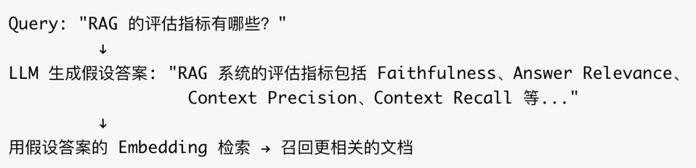

原理：答案与答案的语义空间比问题与答案的语义空间更近，从而提升召回精度。

3. Multi-Query（多查询检索）

生成多个查询变体，分别检索后合并去重：

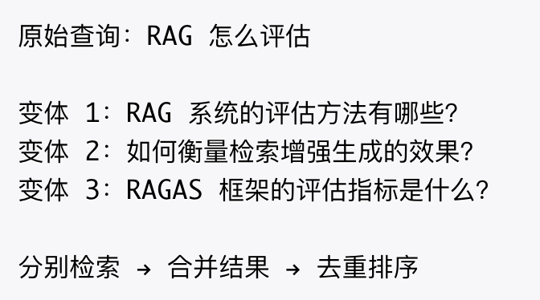

4. EAR（Expand, Rerank, and Retrieve）

项目内容论文Expand, Rerank, and Retrieve: Query Reranking for Open-Domain Question Answering链接https://arxiv.org/abs/2305.17080

项目内容论文Expand, Rerank, and Retrieve: Query Reranking for Open-Domain Question Answering链接https://arxiv.org/abs/2305.17080

项目内容论文Expand, Rerank, and Retrieve: Query Reranking for Open-Domain Question Answering链接https://arxiv.org/abs/2305.17080

项目

内容

论文

链接

https://arxiv.org/abs/2305.17080

核心发现：贪婪解码往往选不到最佳查询扩展。EAR 框架：

效果：

领域内 Top-5/20 准确率提升 3-8 个点

领域外 Top-5/20 准确率提升 5-10 个点

▐检索策略选型建议

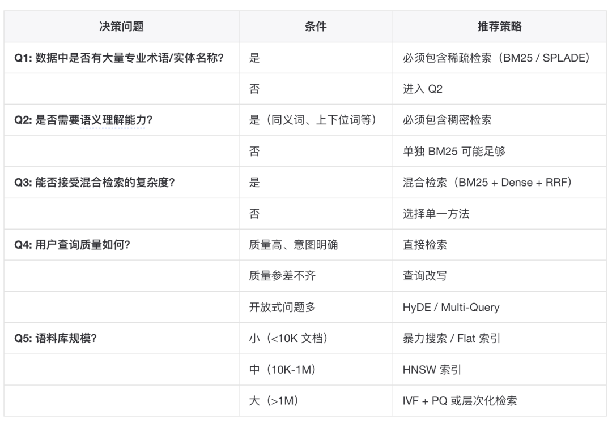

▐实践建议

从混合检索开始：BM25 + Dense 的组合通常优于任何单一方法

选择合适的 Embedding 模型：根据语言、文档长度、资源限制选型

调优融合权重：在验证集上调整 RRF 的或加权系数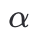

引入查询增强：HyDE 和 Multi-Query 对开放式问题效果显著

关注端到端效果：使用 ICLERB 思路评估，而非仅关注 NDCG@K

索引类型选择：HNSW 在精度和性能间取得良好平衡

## 如何获得更好的 Rerank？

如何获得更好的 Rerank？

如何获得更好的 Rerank？

如何获得更好的 Rerank？

## 如何获得更好的 Rerank？

## ▐为什么需要 Rerank？

▐为什么需要 Rerank？

▐为什么需要 Rerank？

### ▐为什么需要 Rerank？

向量检索（Embedding + ANN Search）是一种双编码器（Bi-Encoder）架构：Query 和 Document 分别独立编码，通过向量相似度匹配。这种方式速度快，但精度有限——因为 Query 和 Document 之间没有直接交互。

Reranker采用交叉编码器（Cross-Encoder）架构：将 Query 和 Document 拼接后联合编码，能够捕捉更细粒度的语义交互，显著提升排序质量。

典型流程：向量检索召回 Top-100 → Reranker 精排 → 取 Top-5 送入 LLM▐Rerank 模型选型对比主流 Reranker 模型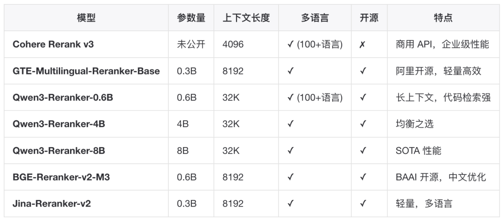选型建议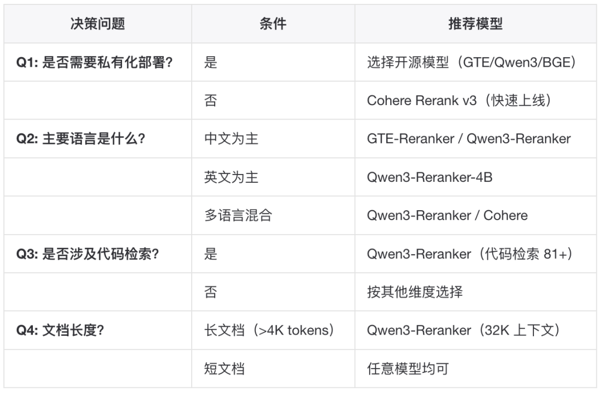▐Rerank 实践要点

典型流程：向量检索召回 Top-100 → Reranker 精排 → 取 Top-5 送入 LLM

▐Rerank 模型选型对比

## ▐Rerank 模型选型对比

▐Rerank 模型选型对比

▐Rerank 模型选型对比

## ▐Rerank 模型选型对比

▐Rerank 模型选型对比

### ▐Rerank 模型选型对比

主流 Reranker 模型

## 主流 Reranker 模型

主流 Reranker 模型

主流 Reranker 模型

## 主流 Reranker 模型

主流 Reranker 模型

#### 主流 Reranker 模型

选型建议

选型建议

## 选型建议

选型建议

选型建议

## 选型建议

选型建议

#### 选型建议

▐Rerank 实践要点

▐Rerank 实践要点

## ▐Rerank 实践要点

▐Rerank 实践要点

▐Rerank 实践要点

## ▐Rerank 实践要点

▐Rerank 实践要点

### ▐Rerank 实践要点

召回数量与精排数量的权衡

## 召回数量与精排数量的权衡

召回数量与精排数量的权衡

召回数量与精排数量的权衡

#### 召回数量与精排数量的权衡

典型流程：向量检索 Top-K (K=50200) → Reranker → Top-N (N=310) → LLM

K 太小：可能漏掉相关文档

K 太大：Rerank 延迟增加，Cross-Encoder 是 O(K) 复杂度

经验值：K=50~100 是常见选择，根据延迟要求调整。

截断阈值

## 截断阈值

## 截断阈值

截断阈值

截断阈值

#### 截断阈值

Reranker 输出的是相关性分数，可以设置阈值过滤低质量结果：

多路召回 + RRF 融合

## 多路召回 + RRF 融合

## 多路召回 + RRF 融合

多路召回 + RRF 融合

多路召回 + RRF 融合

#### 多路召回 + RRF 融合

当使用混合检索（BM25 + Dense）时，可以用Reciprocal Rank Fusion (RRF)融合排名，再送入 Reranker：

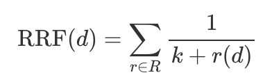

其中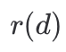是文档在各路召回中的排名，通常取 60。

总结

## 总结

总结

总结

总结

## 总结

构建一个"好"的知识库，需要在多个环节进行系统性优化：

核心原则：

评估先行：先建立评估体系，再迭代优化

从简单开始：递归切分 + 混合检索 + 轻量 Reranker 是稳健的起点

数据驱动：根据 bad case 分析定位瓶颈环节

端到端思维：关注最终生成质量，而非单一环节指标

知识库构建没有标准答案，需要根据数据特点、业务场景和资源约束进行权衡取舍。

¤拓展阅读¤3DXR技术|终端技术|音视频技术服务端技术|技术质量|数据算法

¤拓展阅读¤3DXR技术|终端技术|音视频技术服务端技术|技术质量|数据算法

## ¤拓展阅读¤3DXR技术|终端技术|音视频技术

¤拓展阅读¤

3DXR技术|终端技术|音视频技术

服务端技术|技术质量|数据算法