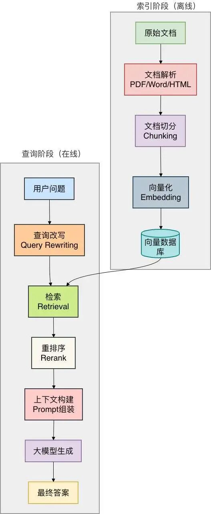

# RAG 准确率翻倍的优化实践

> 从文档解析到生成的全链路优化，每个环节都有明确的优先级。

<!-- more -->

## 核心观点

很多人以为 RAG 就是"文档切一切→向量化→丢给大模型"，结果效果拉跨。RAG 的完整流程是：**文档解析 → 文档切分 → 向量化 → 检索与重排序 → 上下文构建 → 生成**，任何一个环节出问题，整个效果都会崩。

**不要只在一个环节上死磕，整条链路都得优化。**



---

## 优化优先级

按照实践，建议按这个顺序迭代：

1. **先做文档清洗**：OCR、表格提取、元数据附加。投入产出比最高，能解决 50% 以上基础问题
2. **再优化切分策略**：从固定长度切分换成递归切分，加 chunk_overlap
3. **引入混合检索**：向量 + BM25，解决专有名词问题，召回率提升 10-15%
4. **加 Rerank**：在召回结果上做精排，答案准确率提升 10%
5. **最后打磨 Prompt**：加来源标识、Few-shot、拒答规则

---

## 一、文档解析

你喂给 RAG 的是"干净数据"还是"垃圾"？

### 问题

真实世界文档啥样都有：
- 扫描版 PDF：就是图片，不做 OCR 一个字都捞不到
- Word 表格：转成纯文本后行列关系全乱
- PPT 课件：每页只有几个 bullet point，切分后碎片化严重
- 带页眉页脚的技术文档：切出来的 chunk 里全是无效信息

### 解决方案

**方案一：PDF 先做 OCR 再提取**
- 扫描件 PDF 必须跑 OCR
- 推荐 PaddleOCR（中文效果更好）或 Tesseract

**方案二：表格单独处理**
- Word/PDF 表格提取成 Markdown 格式
- 大模型能理解表格结构

**方案三：元数据附加**
- 每个 chunk 附带来源文档名称、章节标题、创建时间
- 便于检索时按文档来源过滤
- 避坑：元数据不要塞太多，2-3 个关键字段就够了

---

## 二、文档切分

切分是 RAG 的"命门"。切太小上下文丢失，切太大检索不精准。

### 常见切分方式对比

| 切分方式 | 优点 | 缺点 |
|----------|------|------|
| 固定长度 | 简单、可控 | 把一句话拦腰切断，语义全毁 |
| 按句子切 | 保证句子完整性 | 单个句子信息量太少 |
| 按段落切 | 保证语义单元 | 段落太长时检索不精准 |
| 递归切分 | 灵活、兼顾语义 | 实现稍微复杂 |
| 语义切分 | 保证主题一致性 | 成本高、慢 |

### 推荐方案

**方案一：递归切分（RecursiveCharacterTextSplitter）**

LangChain 最佳实践。逻辑：优先按段落切，段落太长按句子切，句子太长按固定长度硬切。

```python
from langchain.text_splitter import RecursiveCharacterTextSplitter

splitter = RecursiveCharacterTextSplitter(
    chunk_size=800,      # 每个 chunk 目标大小
    chunk_overlap=200,   # 重叠长度，防止上下文丢失
    separators=["\n\n", "\n", "。", "！", "？", "；", "，", " ", ""]
)
chunks = splitter.split_text(long_document)
```

**经验值**：chunk_size 在 500-1000 之间，overlap 取 20%-30%。

**方案二：带结构的切分（MarkdownHeaderTextSplitter）**

适合有明确章节结构的技术文档、产品手册。每个 chunk 带上完整标题路径作为上下文。

---

## 三、向量化（Embedding）

很多人花大量时间换 embedding 模型，折腾一圈提升有限。因为 embedding 模型是"通用的"，不可能懂你业务的专有名词。

### 真正有效的方案

**方案一：微调 embedding 模型**
- 用自己业务数据微调，让模型学会议"PO单"和"采购订单"是同一回事
- 几百到一千条标注数据就能看到明显效果
- 实测：300 条标注微调 bge-large-zh，域内检索准确率从 68% 提到 82%

**方案二：关键词 + 向量混合检索**
- 纯向量检索对专有名词命中效果不好
- 混合检索：先用 BM25 捞候选，再用向量检索精排
- 效果通常比纯向量检索好 15-20 个百分点

**方案三：Query 改写**
- 用户原始问题太口语化，直接检索效果不好
- 用大模型改写成更"文档友好"的查询语句
- 例："上个月那个退货单咋还没处理啊" → "2025年5月退货单处理状态"

---

## 四、检索与重排序（Rerank）

召回再多不如排得准。很多 RAG 系统的瓶颈不在"找不到"，而在"把不相关的排在前面"。

### 为什么要做重排序

向量检索按向量距离排序，是"语义相似度排序"，不是"对用户问题的相关性排序"。Rerank 模型用更精炼的 cross-encoder 架构对召回结果重新打分。

### 主流 Rerank 模型

| 模型 | 特点 | 适用场景 |
|------|------|----------|
| Cohere Rerank | 效果最好，有免费额度 | 追求极致效果 |
| BGE-Reranker | 开源，可本地部署 | 数据敏感、无网环境 |
| Cross-Encoder | 精度高但速度慢 | 小数据量 |
| ColBERT | 延迟和精度的折中 | 大规模检索场景 |

**避坑**：不要对全库做 Rerank，先用向量检索捞 top-20~50，只对这几十条做 Rerank。

---

## 五、上下文构建

你喂给大模型的 Prompt 质量决定一切。

### 基础优化

**1. 给每个 chunk 加来源标识**
```
参考资料：
[1] 来自《MySQL性能优化指南》第3章：索引设计原则...
[2] 来自公司内部Wiki《订单系统设计文档》...
```

**2. 使用 Few-shot 示例**
- 给大模型几个"问答示例"，它能更好理解期望的回答格式

**3. 增加拒答约束**
```
重要规则：如果参考资料中没有明确信息，请直接说"根据现有资料无法回答该问题"，不要编造答案。
```

### 上下文窗口溢出处理

**方案一：按相关性截断**
- Rerank 后的 chunk 已按分数排序，取前 N 个直到 token 数超限

**方案二：摘要压缩**
- 对特别长的 chunk，让大模型先做摘要
- 注意：摘要会丢失细节，不适合精确数值类问题

### 多轮对话上下文管理

- 不能每次都只把"当前问题"拿去检索
- 要把对话历史也纳入考量
- 检索时用查询重写把历史信息融合进去

---

## 六、进阶技巧

基础方案跑通后，效果应该能到 70% 左右。要突破到 85% 以上，试试这些进阶技巧。

### 1. 自查询检索器（Self-Query Retriever）

用户常问带条件的问题，如"查一下 2025 年 6 月华东区的销售数据"。Self-Query 让大模型先解析问题，提取查询语句和过滤条件，然后用元数据过滤检索。

### 2. 多路召回与融合

不要只依赖一种检索方式。向量检索、关键词检索、SQL 查询、API 调用都可以作为不同"召回源"，结果融合后去重重排。

### 3. 假设性文档嵌入（HyDE）

当用户问题非常抽象时：
1. 先让大模型生成一个假设性答案（虚拟文档）
2. 用虚拟文档去向量库检索

适合查询很短、信息量很少的场景（查询长度 < 5 个词时启用）。

### 4. 窗口检索

命中一个 chunk 时，把前后 N 个 chunk 也一起带上。适合长文档、需要上下文连贯的场景。

### 5. 小型专用索引 vs 万能大索引

不要把所有文档放一个索引里。按领域拆分索引，查询时先识别用户意图，只在对应索引里检索。

---

## 七、效果评估

没量化就别说提升了。

### 评估指标

| 指标 | 怎么算 | 说明 |
|------|--------|------|
| 召回率 | 检索到的相关文档数 / 总相关文档数 | 越高说明检索越全面 |
| 精准率 | 检索到的相关文档数 / 总检索文档数 | 越高说明噪音越少 |
| MRR | 第一个正确答案排名的倒数，取平均 | 衡量排序质量 |
| 答案准确率 | 人工判断答案是否正确 | 最终业务指标 |

### 构建测试集

准备一套标注好的测试集，至少 100-200 条（问题，正确答案，对应文档片段）。每次改完代码跑一遍测试集，对比前后指标。

### 持续迭代

- **记录 bad case**：用户问什么系统没答对，人工标注
- **补充知识库**：bad case 往往是因为知识库里没有相关信息
- **调整切分策略**：某个 chunk 内容不全导致的，调整切分方式
- **重写查询模板**：Prompt 问题，微调 Prompt

---

## 总结

RAG 优化的核心是**全链路优化**，不要只在一个环节死磕。按优先级迭代：

1. 文档清洗（解决 50% 基础问题）
2. 切分策略（递归切分 + overlap）
3. 混合检索（向量 + BM25，+15% 召回率）
4. Rerank（+10% 准确率）
5. Prompt 打磨（最终用户体验）

另外几个容易被忽略的点：
- 别把所有文档放一个索引里，按领域拆分
- 重视多轮对话的上下文管理
- 建立测试集，量化评估

---

## 相关文章

- [22-企业智能助手实践](22-enterprise-ai-assistant-practice)
- [21-构建更好的知识库](21-building-better-knowledge-base)
- [20-LightRAG 体验](20-lightrag-experience)
