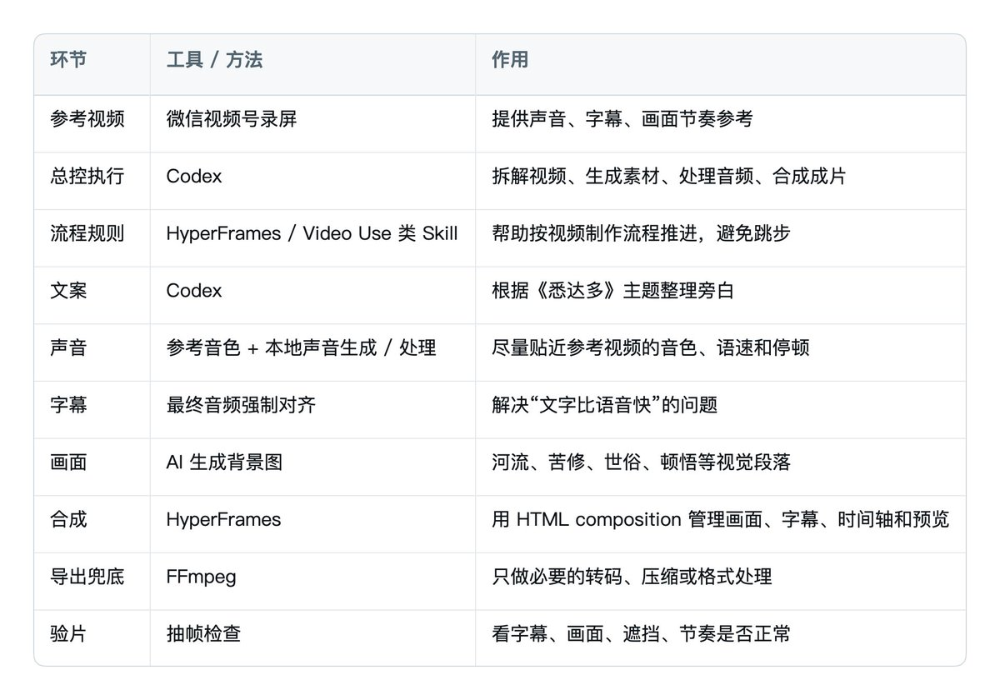

# 别再研究一堆 AI 工具了：我用 Codex 做完一条图书号视频后，发现关键其实是流程

很多人一听到「AI 做短视频」，第一反应往往是：要剪辑、要写代码、要调音，还要同时掌握一堆复杂工具。

我这次真正跑完一遍之后，发现门槛没有想象中那么高。

真正拉开差距的地方，是能不能把一条视频拆成清楚的制作流程。

> 引用推文：Kimberly (@king1818888)
> 5.6sol 做读书视频第一版 5.6真的好用，除了比较费token🤣 @369Serena  我来交视频作业了 https://t.co/Uw9XT7ebX3
> https://x.com/king1818888/status/2076132688268841214

只要流程顺了，很多事情都可以交给 AI 做。人真正需要参与的地方其实不多，主要就是做几个关键判断：

1. 参考视频要模仿什么？
2. 旁白文案能不能打动人？
3. 声音是不是对味？
4. 字幕和语音有没有对齐？
5. 成片是否像一个真实账号会发的东西？

这篇文章我就用我这次做《悉达多》图书号视频的过程，整理一套小白也能照着走的工作流。

你不一定要会代码。你可以用剪映、手机录音、ElevenLabs、GPT-SoVITS，也可以让 Codex 这种 Agent 帮你自动处理画面、配音、字幕和合成。工具可以换，但流程最好别乱。

# 1. 开始前：需要准备哪些工具？

先把工具讲清楚。

这套流程需要把不同工具串成一条生产线。

你可以按自己的阶段选择：

- 小白先用最低配置跑通一条
- 熟练后再加 Codex、Skills、HyperFrames、声音克隆这些自动化工具
- 真正批量做账号时，再把固定流程沉淀成模板

## 最低配置：今天就能开始

如果你只是想先做出第一条图书号视频，最低只需要这些：

1. 一条参考视频

用来拆风格、声音、字幕和节奏。视频号、抖音、小红书都可以，拿不到原文件就录屏。

1. 一个 AI 对话工具

用来写旁白、拆参考视频、整理分镜和提示词。Codex、ChatGPT、Claude 都可以。

1. 一个配音方案

可以用 ElevenLabs，也可以自己手机录音。先别卡在声音工具上，能出清楚的人声最重要。

1. 一个画图工具

用来生成 3-4 张统一风格的无字背景图。

1. 一个剪辑工具

剪映、必剪、CapCut 都可以。导入音频、图片、字幕，最后导出竖屏视频。

这套最低配置不需要写代码。

你只要能复制文案、导入素材、调整字幕，就能做出第一条。

## 进阶配置：让 Codex 帮你跑流程

如果你想像我这次一样，把很多重复动作交给 AI 自动处理，就可以用 Codex。

在这个流程里，Codex 更像一个「视频制作 Agent」。它可以协助完成一整条链路：

- 分析参考视频
- 抽取参考音频
- 判断语速、字幕节奏和画面风格
- 根据书籍主题写旁白
- 生成或整理背景图提示词
- 处理音频速度、响度、降噪和压缩
- 根据最终音频重新对齐字幕
- 合成竖屏视频
- 抽帧检查字幕和画面
- 根据反馈返工

我这次做《悉达多》视频，最有价值的地方就在这里：让 Codex 像一个执行导演一样，把文案、声音、字幕、画面、合成、验片串起来。

## Skill 框架：把经验变成可复用流程

如果你后面想长期做图书号，我建议一定要理解 Skill 框架。

简单说，Skill 就是一套写给 Agent 的固定工作说明。

你可以把某一类任务的流程、规则、审美要求、避坑点，写成一个 Skill。下次再做同类视频时，Codex 就不用从零理解你的偏好。

比如图书号视频就很适合做成 Skill：

- 先拆参考视频，不直接生成
- 旁白先定稿，画面后做
- 字幕必须根据最终音频对齐
- 图片不能有文字、水印和 AI 乱码
- 声音优先慢速、沉稳、有故事感
- 每次导出前必须做预览检查

这就是 Skill 的价值。

它的核心价值，是把你的经验沉淀成一份「可重复调用的制作规范」。

等你做完 3-5 条图书号视频，就可以把这套流程固定成自己的图书号 Skill。以后换一本书，本质上只是换文案、换声音、换画面素材，而不是重新摸索一遍。

## 我这次实际用到的工具组合

这次《悉达多》视频，我的实际工具链大概是：



如果你是小白，不需要一开始就全上。

可以这样分阶段：

1. 第一条：AI 写文案 + 手机录音 / ElevenLabs + 剪映
2. 第三条：加入 Codex，让它帮你拆参考视频和写分镜
3. 第五条：引入 Skill，把图书号流程固定下来
4. 第十条：用 HyperFrames 承接画面、字幕、预览和批量合成

先出片，再自动化。

这是普通人做 AI 自媒体最稳的路线。

# 2. 先说结果：我们到底要做什么视频？

我这次做的是一条竖屏图书介绍视频。

主题是黑塞的《悉达多》。

视频方向不是「讲完这本书」，而是做一种偏沉浸、偏文学感、偏情绪价值的图书号内容。

它的核心感觉是：

- 画面克制，有文学感
- 旁白偏慢，不急着讲道理
- 声音要低一点、稳一点、有故事感
- 字幕要跟语音严丝合缝
- 整体像一个成熟图书号，而不是 PPT 式讲书

我用的旁白大概是这一类：

> 每次重读黑塞的《悉达多》，都会陷入久久沉默。
> 有时候忍不住感慨，这大概是我这辈子，都难以抵达的文学高度。
> 悉达多出身高贵的婆罗门，一生都在追寻自我……

这类视频的重点不是信息密度，而是氛围和情绪。

所以它不是知识科普号的节奏，也不是口播带货的节奏。它更像一个人慢慢讲一段读书后的感受。

这决定了后面所有制作选择：声音要慢，画面要安静，字幕不能乱飞，BGM 不能抢人声。

# 3. 第一步：先找参考视频，不要急着生成

我一开始没有直接让 AI 生成《悉达多》视频，而是先给它一个参考视频。

这一步非常重要。

因为你只跟 AI 说「做得高级一点」「做得像抖音爆款一点」，它很难理解你的审美。每个人理解的高级感都不一样。

但你给它一个参考视频，事情就具体了。

参考视频可以让 AI 分析：

- 画面比例
- 视频时长
- 字幕位置
- 字幕大小
- 字幕出现节奏
- 旁白语速
- 停顿方式
- 声音质感
- 镜头推进感
- 背景图风格
- 整体情绪

我这次就是先把微信视频号里的参考内容录屏下来，然后把录屏文件交给 Codex 分析。

为什么是录屏？

因为很多平台的视频不方便直接下载。对小白来说，录屏反而是最稳的办法。

只要你能拿到参考视频，就可以开始拆。

这里要注意：参考视频不是让你去搬运别人的内容，而是学习它的结构和风格。文案、画面、书籍主题、最终成片都要重新做。

# 4. 第二步：拆参考视频，重点拆声音和节奏

很多人拆视频只看画面，但我这次发现，真正决定视频像不像的，其实是声音。

同样一段文案，如果声音太快、太亮、太机械，就会立刻变成「AI 味」。

而图书号这种内容，声音尤其重要。

我让 Codex 重点拆了参考视频的几个部分：

- 旁白是男声还是女声
- 音色偏低沉还是明亮
- 语速是快还是慢
- 句子之间有没有自然停顿
- 有没有轻微压缩、降噪、均衡处理
- 字幕是按句出现，还是按语义块出现
- 画面切换是不是跟旁白段落一致

这一步拆完之后，后面就不是凭感觉做了，而是有一个明确目标：

我要做的《悉达多》视频，也要是慢一点、沉一点、自然停顿明显、偏故事感的声音。

这也是我后面返工的核心原因。

第一版出来之后，我发现音色不对，语速也太快。字幕虽然有了，但文字跑在声音前面，看起来就会很出戏。

所以我重新调整了声音和字幕同步。

# 5. 第三步：先定旁白，不要先做画面

做图书号视频，最容易犯的错是先做画面。

但真正应该先定的是旁白。

因为这类视频是声音驱动的，画面只是承托情绪。

我这次给《悉达多》写的旁白，不是从「介绍作者」开始，也不是从「这本书讲了什么」开始，而是先抓一种读完书后的感受：

> 每次重读黑塞的《悉达多》，都会陷入久久沉默。

这个开头的好处是，它不是硬讲知识，而是先给观众一个情绪入口。

然后再进入人物经历：

- 悉达多出身婆罗门
- 他追随沙门苦修
- 他拜见佛陀
- 他进入世俗生活
- 他沉迷金钱、情欲、赌博
- 最后来到河边听见流水
- 最终领悟每个人都只能走自己的路

这类文案有一个关键：不要试图在几十秒里讲完整本书。

你只要讲清楚一个核心感受就够了：

《悉达多》不是教你立刻得到答案，而是告诉你，真正的领悟只能自己走过一遍。

如果要让 AI 帮你写，可以这样提示：

```text
我要做一条图书号短视频，书名是《悉达多》。

请先不要做视频，只写旁白。

要求：
1. 中文，适合竖屏图书号
2. 语气克制、文学感、不要鸡汤
3. 不要写成书评腔
4. 不要频繁使用“不是……而是……”
5. 先用一句读后感做钩子，再讲悉达多的人生路径，最后落到“每个人的路只能自己走”
6. 旁白适合慢速朗读，有自然停顿
```

文案定下来之后，再进入声音。

# 6. 第四步：声音是成败关键，建议准备三条路线

这次制作里，我最明显的感受是：声音一旦不对，画面再好也不像。

所以我建议把声音方案拆成三条路线。

## 路线 A：ElevenLabs，最快出片

如果你今天就想跑通第一条视频，ElevenLabs 是最快的。

你只需要：

1. 选一个适合中文的音色
2. 把旁白粘进去
3. 设置偏慢的语速
4. 生成整段音频
5. 下载 wav 或 mp3

适合图书号的声音，不要太播音腔，也不要太情绪化。

我会优先找这类关键词：

- calm
- deep
- warm
- narrative
- documentary
- soft
- mature

中文可以理解为：沉稳、温和、低一点、有叙事感。

不要选那种太激昂、太广告、太像课程宣传片的音色。

可以给 AI 这样说：

```text
我准备在 ElevenLabs 里生成《悉达多》图书号旁白。
请帮我写一段 voice direction。

要求：
1. 语速偏慢
2. 声音低沉、自然、有故事感
3. 不要播音腔
4. 句子之间有自然停顿
5. 适合文学类短视频
```

ElevenLabs 的优点是快，缺点是中文音色不一定每个都稳定。你要多试几个。

## 路线 B：GPT-SoVITS，自己做声音

如果你想长期做账号，或者想拥有更固定的账号声音，可以研究 GPT-SoVITS。

它是一个开源的声音克隆项目，地址是：

https://github.com/RVC-Boss/GPT-SoVITS

小白可以先这样理解：

你准备一段干净的人声样本，然后让模型用这个声音去朗读你的新文案。

它适合两类人：

- 想用自己的声音，但不想每次都录完整旁白
- 想做一个长期稳定的账号音色

准备参考音频时，最好做到：

- 没有背景音乐
- 没有环境噪音
- 人声清楚
- 不要多人说话
- 语气和你想要的视频风格接近

如果是图书号，就录一段慢一点、稳一点、像讲故事一样的声音。

不过这里有一个边界一定要注意：

声音克隆只建议用于你自己有权使用的声音。不要拿别人的声音去做商用发布，更不要克隆明星、博主或普通人的声音来冒充本人。

我这次在制作时，就是围绕参考视频的音色、语速和停顿去做相似风格调整，但真正长期做账号，最好还是建立自己的声音资产。

## 路线 C：手机自录，最稳的兜底方案

如果你不想折腾工具，手机自录完全可以。

很多新手会误以为：声音一定要 AI 生成才高级。

其实不是。

图书号最重要的是清楚、自然、可信。

手机自录只要注意几点：

1. 找一个安静房间
2. 手机离嘴 15 到 25 厘米
3. 不要贴太近，避免喷麦
4. 语速放慢
5. 每句话之间留一点停顿
6. 读错就停一下，从上一句重新念

录完之后丢给 Codex 或剪映处理：

- 降噪
- 压缩
- 音量标准化
- 去掉明显空白
- 加轻微混响或 EQ

这条路线最笨，但也最稳。

而且用自己的声音，长期看更容易形成账号辨识度。

# 7. 第五步：声音生成之后，一定要先验，不要急着合成

我这次踩的坑就是：第一版声音出来之后，感觉不够像参考视频。

主要问题有两个：

1. 音色不够接近参考视频
2. 语速偏快，字幕显得比语音跑得更快

这类问题不能靠画面补救。

所以我重新做了两件事：

- 把声音整体放慢
- 用最终声音重新做字幕对齐

这里有一个很重要的原则：

字幕必须根据最终音频来做，不要根据文案猜时间。

如果你先按文案大概切字幕，后面又把语音变慢，字幕一定会错。

正确顺序应该是：

```text
旁白定稿
↓
生成最终声音
↓
确认语速和音色
↓
用最终声音做转写 / 对齐
↓
生成字幕时间轴
↓
合成视频
```

这一步看起来麻烦，但它决定成片质感。

字幕早 0.5 秒，观众都会觉得怪。

# 8. 第六步：画面不要抢戏，重点是统一气质

《悉达多》这种书，不适合花里胡哨的画面。

我这次给画面定的关键词是：

- 河流
- 修行
- 东方气息
- 暗色背景
- 静默
- 时间感
- 轻微镜头推进
- 文学感

最后用的是几类背景：

- 河边行走
- 苦修与孤独
- 世俗沉沦
- 河边顿悟

做图书号画面时，有一个硬规则：

背景图不要带任何文字。

尤其是 AI 生成图，很容易生成假字、乱码、奇怪标牌。图书号最怕这种，因为观众会立刻看出来是 AI 乱字。

可以这样提示 AI 生成背景图：

```text
请为《悉达多》图书号短视频生成 4 张竖屏背景图。

风格：
安静、克制、文学感、东方气息、暗色调、电影感。

画面方向：
1. 河边独行
2. 苦修与孤独
3. 世俗欲望与迷失
4. 河边顿悟

硬性要求：
不要任何文字、字母、水印、书名、标语。
不要海报排版。
不要夸张宗教符号。
不要卡通。
画面要适合叠加中文字幕。
```

然后再把背景图做成短视频背景，可以加很轻微的推近、移动、模糊、颗粒感。

记住：这类视频画面不是主角，声音和文字才是主角。

# 9. 第七步：字幕要最后做，而且要按声音对齐

这是我这次返工后最想强调的一点。

字幕不是把文案复制上去就完了。

尤其是图书号这种慢节奏旁白，字幕要跟着停顿走。

我这次最后是用最终慢速语音做对齐，再生成字幕。

实际做的时候，字幕可以按语义拆成短句，比如：

- 每次重读黑塞的《悉达多》
- 都会陷入久久沉默
- 悉达多出身高贵的婆罗门
- 一生都在追寻自我
- 他追随沙门苦修
- 以为禁欲就能找到真理

不要一屏塞太多字。

字幕的作用是帮助观看，不是让人读 PPT。

如果你用剪映，也可以这样做：

1. 导入最终旁白
2. 自动识别字幕
3. 人工改错字
4. 按语义断句
5. 调整字幕出现时间
6. 导出前完整看一遍

一定要人工检查这些词：

- 悉达多
- 黑塞
- 婆罗门
- 沙门
- 佛陀
- 禁欲
- 顿悟

自动字幕很容易把这些词识别错。

# 10. 第八步：合成时，先预览，不要直接导出最终版

成片合成可以用剪映，也可以走 HyperFrames。

小白建议先用剪映跑通。

如果想批量做，后面建议尽量走 HyperFrames。

原因很简单：HyperFrames 用 HTML composition 来管理画面、字幕、时间轴和动画，预览和返工都更直观。FFmpeg 更适合做底层转码、压缩、抽帧检查，不太适合作为新手理解的主制作流程。

还有一个实际体验：如果把声音处理过度依赖 FFmpeg 参数，很容易出现一点「电音感」或不自然的机械感。图书号尤其怕这个，因为观众主要是在听人声。

所以更稳的路线是：

```text
声音：用 ElevenLabs / GPT-SoVITS / 手机自录先做好
音频：只做轻度降噪、音量统一、必要降速
画面和字幕：交给 HyperFrames 组织时间轴
导出：最后再做必要转码
```

我这次的流程更偏自动化：

- 准备旁白文本
- 生成声音
- 声音只做轻度处理，避免过度修出电音感
- 用最终声音生成字幕时间
- 生成背景图
- 在 HyperFrames 里组织背景、封面、叠字、字幕、音频
- 先 preview，看字幕和语音是否同步
- 输出竖屏 MP4
- 抽帧检查字幕和画面

但逻辑跟剪映是一样的。

剪映里的顺序就是：

1. 导入最终旁白
2. 导入背景图或背景视频
3. 让每段画面对应一段旁白
4. 加字幕
5. 加书名、作者、轻微装饰
6. 加低音量 BGM
7. 导出前预览

这里有一个小经验：

BGM 一定要小。

图书号不是靠音乐炸场，而是靠旁白把人带进去。

如果背景音乐抢人声，再好的文案都会被毁掉。

# 11. 第九步：返工检查，比一次生成更重要

这次视频不是一次就完美的。

中间至少返工过几个地方：

- 声音不像参考视频
- 语速偏快
- 字幕比语音快
- 需要重新按最终音频对齐字幕
- 需要检查画面是否挡字幕
- 需要确认整体节奏是否偏急

这其实很正常。

AI 做视频不是按一下按钮就结束，而是把每个环节拆开，然后一个个调。

我建议每次出片都按这份清单检查：

1. 前 3 秒有没有让人停住？
2. 旁白是不是自然？
3. 声音是不是太快？
4. 字幕有没有比声音快？
5. 字幕有没有错字？
6. 画面有没有 AI 乱字？
7. BGM 有没有压过人声？
8. 整体气质是否统一？
9. 结尾有没有余味？
10. 这条视频像不像一个真实账号会发的内容？

如果其中一项很明显不对，就先别发。

尤其是声音和字幕。

短视频观众可能说不出哪里不对，但只要音画不同步，就会马上划走。

# 12. 一张图记住完整流程

这次《悉达多》视频的完整流程，可以压缩成这条线：

```text
找参考视频
↓
拆声音、画面、字幕、节奏
↓
确定书和切口
↓
写旁白
↓
确认文案
↓
选择声音路线
  - ElevenLabs
  - GPT-SoVITS
  - 手机自录
↓
生成最终旁白音频
↓
处理语速、音色、音量
↓
用最终音频做字幕对齐
↓
生成 3-4 张统一风格背景图
↓
合成竖屏视频
↓
抽帧 / 预览检查
↓
返工声音、字幕或画面
↓
导出最终 MP4
```

这套流程跑通之后，你就不是只会做一条《悉达多》。

你可以继续做：

- 《瓦尔登湖》
- 《月亮与六便士》
- 《局外人》
- 《百年孤独》
- 《活着》
- 《悉达多》系列第二条

因为工作流已经固定了。

以后换书，本质上只是换旁白、换金句、换背景图。

# 13. 小白最短路径：今天就能照着做

如果你是第一次做，不要一上来就追求全自动。

最短路径是：

1. 找一条你喜欢的图书号视频，录屏当参考
2. 让 AI 拆它的风格
3. 选一本书，比如《悉达多》
4. 让 AI 写 30-60 秒旁白
5. 自己审核文案，改到自然
6. 用 ElevenLabs 生成声音，或手机自录
7. 用 AI 生成 3-4 张无字背景图
8. 用剪映合成
9. 自动字幕后人工校对
10. 导出前完整看一遍

这就够了。

先做出第一条，比研究十个工具更重要。

# 14. 给 Codex 的完整提示词

如果你想让 Codex 直接按这个流程帮你做，可以把下面这段发给它：

```text
我要做一条图书号竖屏短视频，参考视频我会上传。

请按这个流程协助我：

1. 先分析参考视频：
   - 时长
   - 画面风格
   - 字幕位置
   - 字幕节奏
   - 旁白语速
   - 声音质感
   - 情绪氛围

2. 再基于书名写旁白：
   - 书名：《悉达多》
   - 中文
   - 克制、有文学感、自然口语
   - 不要鸡汤
   - 不要明显 AI 味
   - 适合慢速朗读

3. 声音方案给我三条：
   - ElevenLabs：最快出片
   - GPT-SoVITS：自己做声音
   - 手机自录：兜底

4. 如果我提供参考声音：
   - 请分析参考声音的音色、语速、停顿
   - 新旁白尽量靠近这种节奏
   - 字幕必须用最终音频对齐

5. 生成画面：
   - 3-4 张竖屏背景图
   - 风格统一
   - 不要任何文字、水印、乱码
   - 适合叠加字幕

6. 合成视频：
   - 竖屏 9:16
   - 旁白驱动
   - 字幕清晰
   - BGM 不抢人声
   - 先预览，再导出

7. 导出前检查：
   - 声音是否太快
   - 字幕是否同步
   - 画面是否遮挡字幕
   - 是否有错字
   - 整体是否像参考视频的节奏

不要跳步。
每一步完成后告诉我现在需要确认什么。
```

# 15. 最后：AI 做视频，本质是把审美变成流程

这次做《悉达多》给我最大的启发是：

AI 不是替你拥有审美。

AI 是把你的审美拆成步骤，然后稳定执行。

你喜欢什么样的声音，就拿参考视频让它拆。

你喜欢什么样的文案，就不断告诉它哪里太 AI、哪里太快、哪里太满。

你觉得字幕不对，就让它重新按最终音频对齐。

你觉得语速太快，就让它降速再渲染。

最后留下来的，不只是一条视频，而是一套以后可以复用的生产线。

图书号尤其适合这样做。

因为它的结构很稳定：

```text
一本书
一个切口
一段旁白
一个声音
几张画面
一次合成
```

当你把这条链路跑通，后面就可以批量做。

先做《悉达多》，再做第二本、第三本。

真正的自由不是一次生成爆款，而是你终于有了一套可以反复启动的工作流。


关于作者

Kimberly｜

[@king1818888](https://x.com/@king1818888)

Australia AI Engineer，每天用 AI 建系统、做内容，也是 X 创作者。