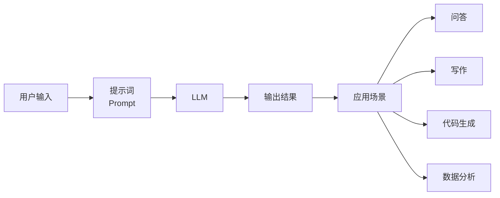

> **摘要** — 提示词工程（Prompt Engineering）是通过设计、优化输入提示词来引导大语言模型产生预期输出的实践学科。核心本质是对 LLM 的控制指令，将输入转化为期望的输出。掌握提示词工程能显著提升 LLM 应用的效果和稳定性。



```markmap height=280
# 提示词工程入门
## 定义
- 设计、优化输入提示词
- 引导 LLM 产生预期输出
## 核心本质
- 对 LLM 的控制指令
- 将输入转化为期望输出
## 为什么重要
- 提升输出质量
- 减少幻觉
- 精准控制输出格式
## 常见技巧
- Few-shot 示例
- 思维链 CoT
- 结构化提示词
- 角色设定
## 应用场景
- 问答系统
- 写作辅助
- 代码生成
- 数据分析
```

---

# 什么是提示词工程

提示词工程（Prompt Engineering）是 AI 时代的新兴学科，通过精心设计输入给大语言模型（LLM）的提示词（Prompt），来引导模型产生更准确、更有价值的输出。

## 为什么提示词工程重要

1. **控制不确定性** — LLM 输出具有随机性，好的提示词可以大幅提升输出稳定性
2. **挖掘模型潜力** — 同一模型，不同提示词效果差异巨大
3. **降低成本** — 精准的提示词减少 Token 消耗和调用次数
4. **实现复杂任务** — 简单提示词无法完成的复杂推理和输出控制

## 提示词工程的历史演进

| 阶段 | 时间 | 特点 |
|------|------|------|
| 萌芽期 | 2019-2022 | Few-shot、CoT 等基础技巧 |
| 框架期 | 2023 | LangGPT、CO-STAR 等结构化框架 |
| 系统期 | 2024+ | Agent、多模态、系统化提示词工程 |

## 与传统编程的区别

| 维度 | 传统编程 | 提示词工程 |
|------|---------|-----------|
| 控制方式 | 代码指令 | 自然语言描述 |
| 精确度 | 高确定性 | 概率性输出 |
| 调试方式 | print/断点 | 迭代优化 |
| 学习曲线 | 陡峭 | 平缓但深度无限 |

## 开始学习

提示词工程是一门实践学科，建议从以下路径开始：

1. **理解模型特性** — 了解 LLM 的能力和局限
2. **掌握基础技巧** — Few-shot、CoT、角色设定
3. **学习结构化方法** — LangGPT、CO-STAR 等框架
4. **大量实践迭代** — 在实际任务中不断优化
