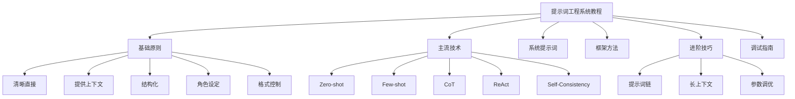

> **摘要** — 一份面向中级用户的提示词工程系统教程，覆盖基础原则、主流技术（Zero-shot / Few-shot / CoT / ReAct / Self-Consistency）、系统提示词设计、框架（CO-STAR / RISEN）、进阶技巧（提示词链 / 长上下文 / 参数调优）和调试方法。内容基于 Anthropic、Google、OpenAI 官方文档及学术论文。



```markmap height=320
# 提示词工程系统教程
## 基础原则
- 清晰直接
- 提供上下文
- 结构化提示词
- 角色设定
- 格式控制
## 主流技术
- Zero-shot 零样本
- Few-shot 少样本
- Chain-of-Thought 思维链
- ReAct 推理+行动
- Self-Consistency 自洽采样
## 框架
- CO-STAR
- RISEN
## 进阶
- 提示词链
- 长上下文处理
- 参数调优
- 自动提示优化
## 调试
- 常见问题排查
- 迭代优化流程
```

---

# 提示词工程系统教程：从原理到实战

## 1. 提示词工程的本质

> "提示词工程是一种不更新模型权重来引导 LLM 行为的方法，本质上是一门经验科学。" — Lilian Weng, OpenAI

**关键洞察**：提示词工程不是"写咒语"，而是**用清晰的沟通让 AI 理解你的意图**。

**心理模型**：把 AI 想象成一个聪明但没有上下文的新同事。你给的背景越清晰、指令越具体，结果越好。

---

## 2. 基础原则

> 来源：Anthropic、Google、OpenAI 官方文档综合

### 原则一：清晰直接

**黄金测试**：把你的提示词给一个不了解任务的同事看，如果他会困惑，AI 也会。

| 差的提示词 | 好的提示词 |
|-----------|-----------|
| 写个分析报告 | 写一份 500 字的季度销售分析报告，包含：① 三个关键趋势 ② 每个趋势的数据支撑 ③ 一条行动建议 |
| 帮我改代码 | 将这个 Python 函数的执行时间优化到 O(n log n) 以内，保持输入输出接口不变 |

### 原则二：提供上下文

告诉 AI **为什么**要这样做，而不仅仅是**做什么**。

```
❌ 不要用省略号
✅ 你的回复会被语音引擎朗读，所以不要用省略号，因为语音引擎不知道怎么发音
```

AI 足够聪明，能从解释中泛化出规则。

### 原则三：结构化你的提示词

使用 XML 标签或 Markdown 分隔不同内容块：

```xml
<instructions>
分析以下客户反馈，提取关键问题
</instructions>

<context>
我们是一家 SaaS 公司，产品是项目管理工具
</context>

<input>
{{客户反馈内容}}
</input>

<output_format>
输出 JSON 格式：{"issues": [...], "sentiment": "..."}
</output_format>
```

### 原则四：给 AI 一个角色

角色设定能聚焦 AI 的行为和语调：

```
你是一位资深的数据分析师，擅长用简单的语言解释复杂的数据发现。
你的受众是非技术背景的管理层。
```

### 原则五：控制输出格式

**告诉 AI 做什么，而不是不做什么**：

```
❌ 不要用 Markdown
✅ 用流畅的段落散文写，不要用列表
```

---

## 3. 主流技术详解

### 3.1 Zero-shot Prompting（零样本提示）

**定义**：不提供任何示例，直接给指令。

**适用场景**：简单任务、通用问答、文本改写。

**示例**：
```
将以下英文翻译成中文，保持专业术语准确：
"The neural network architecture uses attention mechanisms
to process sequential data."
```

**要点**：
- 依赖模型的预训练知识
- 对简单任务效果好
- 复杂任务需要更多引导

### 3.2 Few-shot Prompting（少样本提示）

**定义**：提供 3-5 个输入-输出示例，让模型学习模式。

**适用场景**：格式化输出、分类任务、风格模仿。

**示例**：
```
将客户反馈分类为正面、负面或中性。

反馈：你们的产品太好用了！
分类：正面

反馈：退货流程太复杂了
分类：负面

反馈：产品还行，没什么特别的
分类：中性

反馈：客服响应很快，但问题没解决
分类：
```

**关键技巧**（来自 Google 和 Anthropic 官方）：
- 用 `<example>` 标签包裹示例，让 AI 区分示例和指令
- 示例要**相关**（贴近实际用例）、**多样**（覆盖边界情况）、**结构一致**
- 3-5 个示例效果最佳
- 示例的排列顺序会影响结果，保持随机或多样化

**高级技巧**：用嵌入向量（embedding）选择语义最相似的示例，而不是随机选。

### 3.3 Chain-of-Thought（思维链，CoT）

**定义**：让 AI 展示推理过程，而不是直接给答案。

**为什么有效**：复杂任务需要多步推理，直接给答案容易出错。CoT 让 AI "想清楚再说"。

**两种变体**：

**1. Few-shot CoT**：提供含推理链的示例
```
问题：小明有 5 个苹果，给了小红 2 个，又买了 3 个，他现在有几个？

推理过程：
- 开始有 5 个苹果
- 给了小红 2 个：5 - 2 = 3 个
- 又买了 3 个：3 + 3 = 6 个

答案：6 个
```

**2. Zero-shot CoT**：只需加一句提示
```
请一步一步思考这个问题：[你的问题]
```

或者更简单的版本（来自 Google 研究）：
```
Let's think step by step
```

**进阶变体**：

| 变体 | 描述 | 适用场景 |
|------|------|---------|
| **Self-Consistency** | 多次采样 + 多数投票 | 需要高准确率的推理任务 |
| **Tree of Thoughts** | 每步探索多条推理路径 | 复杂规划和创意任务 |
| **Self-Ask** | 迭代生成子问题 | 需要多步信息检索的任务 |

### 3.4 ReAct（Reasoning + Acting）

**定义**：让 AI 交替进行推理和行动（如搜索、计算、调用工具）。

**示例框架**：
```
思考：我需要查找 2024 年的 GDP 数据来回答这个问题
行动：搜索"2024年中国GDP"
观察：2024年中国GDP为 134.9 万亿元
思考：现在我有了数据，可以给出答案了
答案：...
```

**适用场景**：需要外部信息的任务、多步骤工作流、智能体（Agent）系统。

### 3.5 Self-Consistency（自洽采样）

**定义**：对同一个问题生成多个回答，通过多数投票选出最佳答案。

**原理**：如果一个问题有明确答案，多次推理应该收敛到同一个结果。

**操作方法**：
1. 设置 temperature > 0（如 0.7）
2. 生成 5-10 个回答
3. 选择出现次数最多的答案

**适用场景**：数学推理、逻辑判断、有明确正确答案的任务。

### 3.6 技术对比一览

| 技术 | 适用场景 | 复杂度 | 核心价值 |
|------|---------|--------|---------|
| Zero-shot | 简单任务、通用问答 | 低 | 快速、省 token |
| Few-shot | 格式化、分类、风格模仿 | 低-中 | 控制输出格式 |
| Chain-of-Thought | 复杂推理、数学、逻辑 | 中 | 提升推理准确率 |
| Self-Consistency | 需要高准确率的推理 | 中 | 通过投票消除偶然错误 |
| ReAct | 需要外部信息的任务 | 高 | 结合推理与工具调用 |
| Tree of Thoughts | 复杂规划和创意任务 | 高 | 探索多条推理路径 |

---

## 4. 系统提示词设计

系统提示词（System Prompt）是 AI 的"操作系统"，定义了它的基础行为。

**结构模板**（综合 Anthropic 和 Google 最佳实践）：

```markdown
## 角色定义
你是一位 [具体角色]，擅长 [核心能力]。

## 行为规则
1. 始终用 [语言] 回复
2. 回复长度控制在 [范围]
3. 当不确定时，[处理方式]

## 输出格式
- 使用 [格式要求]
- 包含 [必要元素]

## 边界约束
- 不要 [禁止行为]
- 遇到 [情况] 时，[处理方式]
```

**实际案例 — 客服 AI 的系统提示词**：

```
你是一家电商平台的客服助手。

## 核心职责
- 回答用户关于订单、物流、退换货的问题
- 用友好但专业的语气沟通
- 每次回复不超过 150 字

## 规则
1. 只回答与平台相关的问题
2. 涉及退款超过 500 元的，引导用户联系人工客服
3. 不要透露内部系统信息或公司策略细节
4. 如果用户情绪激动，先表达理解，再提供解决方案

## 输出格式
- 先确认用户问题
- 给出解决方案或下一步指引
- 结尾询问是否还有其他问题
```

---

## 5. 提示词框架

### 5.1 CO-STAR 框架

| 组件 | 含义 | 示例 |
|------|------|------|
| **C** - Context（背景） | 任务的上下文 | "我们是一家电商公司" |
| **O** - Objective（目标） | 你想要什么 | "分析客户流失原因" |
| **S** - Style（风格） | 输出风格 | "用数据驱动的分析风格" |
| **T** - Tone（语调） | 语气 | "专业但易懂" |
| **A** - Audience（受众） | 给谁看 | "给非技术背景的管理层" |
| **R** - Response（格式） | 输出格式 | "用 Markdown 表格和要点" |

**完整示例**：
```
背景：我们是一家在线教育平台，最近三个月用户流失率上升了 15%。
目标：分析可能的流失原因，给出 3 条可执行的改进建议。
风格：数据驱动，引用行业基准。
语调：专业但易懂，避免技术术语。
受众：CEO 和产品总监，非技术背景。
格式：用 Markdown，包含一个原因表格和对应的建议列表。
```

### 5.2 RISEN 框架

| 组件 | 含义 |
|------|------|
| **R** - Role（角色） | AI 扮演什么角色 |
| **I** - Instructions（指令） | 具体要做什么 |
| **S** - Steps（步骤） | 分步执行 |
| **E** - End goal（终态） | 最终期望的结果 |
| **N** - Narrowing（约束） | 限制条件 |

---

## 6. 进阶技巧

### 6.1 提示词链（Prompt Chaining）

**定义**：将复杂任务拆分为多个子任务，前一步的输出作为后一步的输入。

**为什么用**：
- 每步更简单，准确率更高
- 可以在中间步骤检查和修正
- 降低单次提示词的复杂度

**示例 — 生成产品分析报告**：

```
步骤 1：数据提取
"从以下原始数据中提取关键指标：[数据]"

步骤 2：趋势分析
"基于以下指标，识别三个主要趋势：[步骤1输出]"

步骤 3：建议生成
"基于以下趋势分析，给出三条可执行建议：[步骤2输出]"

步骤 4：报告整合
"将以下分析和建议整合为一份 500 字的报告：[步骤2+3输出]"
```

### 6.2 长上下文处理技巧

当输入内容超过 20,000 tokens 时（如长文档分析），需要特别注意：

**1. 把长数据放在顶部，问题放在底部**

Anthropic 官方测试表明，查询放在末尾可以提升响应质量高达 30%。

**2. 用 XML 标签组织多文档**

```xml
<documents>
  <document index="1">
    <source>年度报告2024.pdf</source>
    <document_content>{{报告内容}}</document_content>
  </document>
  <document index="2">
    <source>竞品分析.xlsx</source>
    <document_content>{{竞品数据}}</document_content>
  </document>
</documents>

基于以上文档，分析我们的竞争优势，给出 Q3 战略建议。
```

**3. 先引用再分析**

```
先从文档中找出与问题相关的原文引用，放在 <quotes> 标签中。
然后基于这些引用给出分析。
```

这能帮助 AI 在大量文本中"锚定"关键信息。

### 6.3 参数调优

| 参数 | 作用 | 建议值 |
|------|------|--------|
| **temperature** | 控制随机性。0 = 确定性，1 = 创造性 | 事实任务：0-0.3；创意任务：0.7-1.0 |
| **max_tokens** | 最大输出长度 | 根据预期输出长度设置 |
| **top_p** | 核采样概率 | 一般保持默认（1.0） |
| **stop_sequences** | 停止生成的标记 | 用于控制输出边界 |

**Google Gemini 特别建议**：Gemini 3 建议 temperature 保持默认 1.0，不要随意调低。

### 6.4 前沿技术（2024-2025）

#### 自动提示优化（APE / DSPy）

- **APE（Automatic Prompt Engineer）**：让 LLM 自己生成提示词候选，用评分函数选最优
- **DSPy**：将提示词视为可编程模块，用代码定义优化目标

#### 多模态提示

- 图像 + 文本组合提示
- 视频理解提示
- 音频转录 + 分析提示

#### Agentic 提示设计

智能体系统中的提示词需要额外考虑：
- **推理深度**：何时深入思考，何时快速响应
- **工具使用**：何时调用外部工具
- **状态管理**：如何跟踪多步任务的进度
- **错误恢复**：遇到失败时如何调整策略

---

## 7. 调试指南

### 7.1 常见问题与解决方案

| 问题 | 可能原因 | 解决方案 |
|------|---------|---------|
| AI 不按格式输出 | 指令不够具体 | 提供格式示例，用结构化输出功能 |
| AI 输出太长/太短 | 没有长度约束 | 明确指定字数或段落数 |
| AI 编造信息 | 没有约束幻觉 | 要求引用来源，加"如果不确定请说明" |
| AI 忽略部分指令 | 提示词太长或有冲突 | 简化指令，用编号列表，把关键要求放前面 |
| AI 回答过于泛化 | 缺少上下文 | 提供具体背景和约束条件 |
| AI 拒绝回答 | 安全过滤误触发 | 调整措辞，提供合法使用场景说明 |

### 7.2 调试流程

1. **明确问题**：是格式、内容还是行为不对？
2. **简化测试**：用最简单的提示词复现问题
3. **逐步添加**：每次只加一个约束，定位哪个指令导致问题
4. **对比实验**：A/B 测试不同版本的提示词
5. **记录结果**：建立提示词版本日志

---

## 8. 常见错误

### 错误 1：过度依赖"魔法词"
以为加上"请一步一步思考"就能解决所有问题。实际上，CoT 对简单任务帮助不大，对复杂推理任务才有效。

### 错误 2：提示词过长
塞了太多指令，导致 AI 遵循不到一半。保持提示词简洁，每条指令明确。

### 错误 3：忽略示例的力量
很多人只写指令不给示例。3-5 个好示例比 10 条规则更有效。

### 错误 4：不做测试
同一个提示词对不同模型效果不同。必须针对你的目标模型测试。

### 错误 5：否定式指令
"不要做 X"不如"请做 Y"。AI 对正面指令的遵循率更高。

### 错误 6：忽略模型差异
- Claude 擅长长文本分析和结构化输出
- GPT-4 擅长创意写作和代码生成
- Gemini 擅长多模态任务

针对不同模型调整提示词策略。

---

## 9. 实战练习

### 练习 1：改写提示词

将以下差的提示词改写为好的版本：

```
帮我写个邮件
```

<details>
<summary>参考答案</summary>

```
写一封商务邮件，收件人是我们的供应商张经理。

背景：上个月订购的 500 件办公椅，有 30 件存在扶手松动的质量问题。
目标：要求对方在 5 个工作日内给出解决方案（换货或退款）。
语调：专业但坚定，不要对抗性。
格式：200 字以内，包含明确的行动要求和截止日期。
```

</details>

### 练习 2：设计系统提示词

为一个"代码审查助手"设计系统提示词，要求：
- 能发现常见代码问题
- 用建设性的语气
- 输出结构化的审查意见

### 练习 3：应用 CoT

用思维链技术解决以下问题：
```
一个水池有两个进水管和一个出水管。
进水管 A 每小时注入 30 升，进水管 B 每小时注入 20 升。
出水管每小时排出 10 升。
水池容量 200 升。从空池开始，多久能注满？
```

### 练习 4：设计提示词链

将"分析用户评论并生成产品改进建议"这个任务拆分为 3-4 步的提示词链。

---

## 10. 来源附录

| 来源 | URL | 类型 | 可信度 |
|------|-----|------|--------|
| Anthropic Claude 提示词最佳实践 | [platform.claude.com/docs](https://platform.claude.com/docs/en/docs/build-with-claude/prompt-engineering/claude-prompting-best-practices) | 官方文档 | ⭐⭐⭐⭐⭐ |
| Google Gemini 提示词指南 | [ai.google.dev](https://ai.google.dev/gemini-api/docs/prompting-intro) | 官方文档 | ⭐⭐⭐⭐⭐ |
| OpenAI 提示词工程指南 | [platform.openai.com](https://platform.openai.com/docs/guides/prompt-engineering) | 官方文档 | ⭐⭐⭐⭐⭐ |
| The Prompt Report (Schulhoff et al., 2024) | [arxiv.org](https://arxiv.org/abs/2406.06608) | 学术论文 | ⭐⭐⭐⭐⭐ |
| Lilian Weng: Prompt Engineering | [lilianweng.github.io](https://lilianweng.github.io/posts/2023-03-15-prompt-engineering/) | 技术博客 | ⭐⭐⭐⭐ |

**来源选择理由**：
- **官方文档**（Anthropic、Google、OpenAI）：直接来自模型开发者，反映最新支持的行为
- **The Prompt Report**：2024 年最全面的提示词工程综述，涵盖 58 种 LLM 提示技术
- **Lilian Weng 博客**：OpenAI 研究员撰写，将学术研究转化为实用指南
