# 提示工程、RAG 和微调：如何让 LLM 应用性能登峰造极

## **LLM 的问题**

                LLM（大语言模型）的通用性很高，用大模型搞个演示用的 demo 应用很容易，但是遇到在生产环境中部署使用时，需要不断迭代和改进 LLM 应用的性能，许多问题就暴露出来了，包括：

* 使用成本较高

* 垂直能力不足

* 性能表现不稳定

* 难以优化

                大部分 LLM 应用优化实际上在做的事情就是在提升 LLM 在特定场景下的表现。说专业点是提升大模型的专用能力，商业上喜欢用的词儿叫垂直领域，提升大模型在垂直领域的表现。

> 大模型之战下半场：从通用到行业垂直，「向下」扎根: <https://36kr.com/p/2565884745588867>

                为了解决这些问题，就需要进行 LLM 应用的优化。我们这里谈的 LLM 应用的优化主要是指让大模型工作的更好。

                实践中发现优化 LLM 的性能很难，主要有下面的几个原因：

1. 从通用信息中稳定的萃取出专用信息很难。也可以理解为从噪声中稳定的获取有用信息很难。

2. 性能难以评估。大模型生成的内容的质量难以准确的进行定量和定性的评估。

3. 问题分析不准和优化策略针对性不足。在大模型表现未达到预期时，不知道问题出现在哪，更不知如何着手优化，有哪些技术工具可以帮助解决问题。

本文主要就这几点问题探讨解决思路和框架。虽然说是优化 LLM 性能，但也不失为当下构建生产级 LLM 应用的最佳路径。

## **三种技术**

总的来说，优化 LLM 的性能主要用到三种技术：

* prompt engineering  提示工程，说人话：调提示词

* RAG (Retrieval-Augmented Generation) 基于检索增强的生成，说人话：外挂知识库，检索+生成

* fine-tuning 微调，说人话：浅浅的训练一下模型

## **Prompt 工程**

Prompt engineering 这个事儿大家应该都比较熟悉了，现在相关的教程铺天盖地，我们所提出的结构化提示词也是在构建生产级应用起步阶段的一个好的抓手，在此不再赘述。

推荐阅读：

> OpenAI 官方提示工程文档：<https://platform.openai.com/docs/guides/prompt-engineering/prompt-engineering>
>
> Claude 官方提示工程文档：<https://docs.anthropic.com/claude/docs/introduction-to-prompt-design>
>
> LangGPT 结构化提示词: <https://www.langgpt.ai/>

## **RAG **

**RAG 概括起来就是知识检索+内容生成。**这么说太抽象，可以理解为大模型的开卷考试，既然是开卷考试，那么谁带的书和资料内容更全，**谁翻书翻的更快更准，谁开卷考试的结果就往往更好。**

下面 RAG的主要组成，依次是数据提取——embedding（向量化）——创建索引——检索——自动排序（Rerank）——LLM归纳生成。当然这里少了使用环节，我们暂时先忽略。

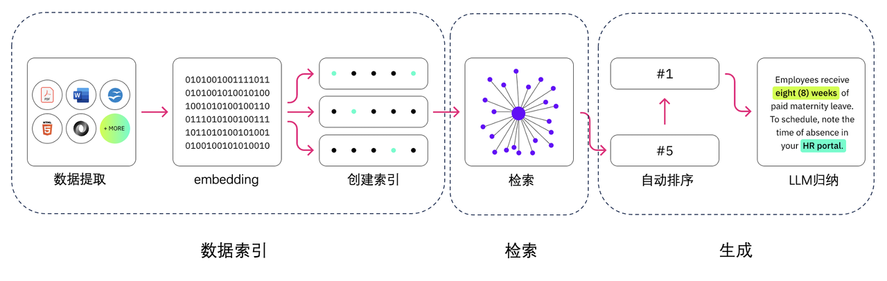

                大家知道，开卷考试时，往往大家的参考资料都差不多，在有限的考试时间内如何又快又准的锁定问题在书上的相关内容更为重要。RAG 做的好不好也是如此，核心就看能不能将内容检索的又快又准。如果抄错了书上（知识库）内容，往往大模型给出的答案也南辕北辙。

                推荐阅读：

> 大模型主流应用RAG的介绍——从架构到技术细节: <https://luxiangdong.com/2023/09/25/ragone/>
>
> 高级 RAG 技术：图解概览 \[译]: <https://baoyu.io/translations/rag/advanced-rag-techniques-an-illustrated-overview>

## **Fine-tuning 微调**

微调(Fine-tuning) 是指在已经训练好的模型基础上，进一步调整，让你模型的输出能够更符合你的预期。 

Finetune, Fine-tuning 是两种常用的英文写法，请大家注意（看到太多人写错读错了，作为强迫症实在忍不了）。

微调是我们在一个较小的、针对特定任务的标注数据集上进一步训练已经预训练过的 LLM 的过程。通过这种方式，我们可以调整部分模型参数，以优化其在特定任务或任务集上的性能。在全面微调过程中，所有模型参数都会更新，这与预训练过程类似，只不过是在标注的、小得多的数据集上进行的。

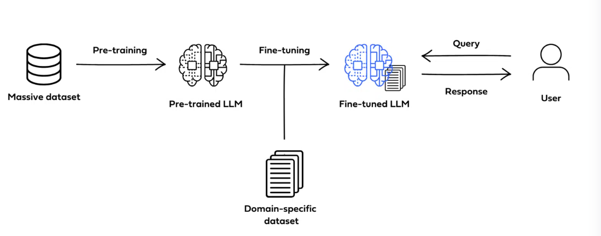

想象你有一个大学生朋友，经过了一学期轻松愉快的大学生活之后，2天后他即将迎来一次考试，幸好和蔼可亲的老师为同学们划了考试重点，因此他在剩下的两天时间内要尽力把这些考试重点学进脑子里去，提高他在该科的考试成绩。

借助上面这个例子，可以简单理解为，微调就是一种让大模型（脑子）在特定任务（考试重点）上进一步训练（学习记忆），以加强性能（考试表现）的方式。

这种方法和前面两种都不一样，涉及到对模型参数的调整，难度最大，成本最高。

推荐阅读：

> OpenAI 官方文档 fine-tuning：<https://platform.openai.com/docs/guides/fine-tuning>
>
> Full Fine-Tuning, PEFT, Prompt Engineering, and RAG: Which One Is Right for You? <https://deci.ai/blog/fine-tuning-peft-prompt-engineering-and-rag-which-one-is-right-for-you/>

## **优化路径**

在对上面三种技术有了初步了解之后，我们谈谈 LLM 应用的优化路径——即这三种技术如何综合运用？推荐的技术应用路径是什么？

Prompt 工程是上手难度最低的，一切 LLM 应用推荐先从 prompt 工程着手建立原型，在原型建立后，进一步优化 prompt，若 prompt 工程无法满足实际需求，再分析性能瓶颈原因，采取进一步策略。

那么如何分析造成性能瓶颈的原因呢？

### **分析问题的两个维度**

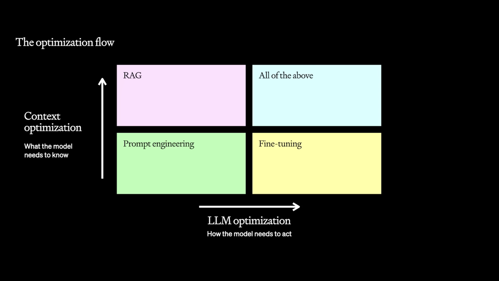

如图所示，主要从下面两个维度考虑问题：

* **Context optimization(上下文优化)** ：模型是否缺失必知信息？如内部业务数据，流程等。

* **LLM optimization(大模型优化)** ：模型是否准确率不足，输出内容未能很好的遵循特定风格或格式？

*

1. **Context optimization (上下文优化)**

                所创建的 LLM 应用如果需要了解特定的数据、系统和流程，而这是预训练 LLM 中不存在（或者有缺失）的知识和信息，则需要进行所谓上下文优化，将依赖的这部分信息提供给模型。

                如企业内部智能问答机器人，针对企业内部员工提供内部知识服务，需要了解企业知识库、规章制度、系统流程、甚至部分业务数据。而这些信息正是大模型所不知道的知识，无法通过单纯的 prompt 工程解决，应该考虑将相关知识提供给大模型。

                RAG 就是很好的解决该问题的技术，首先在知识库检索相关内容，然后将内容和提示词组装起来一起提供给大模型作为输入，得到理想的输出。

1. **LLM optimization(大模型优化)**

        在进行了足够的 prompt 工程后，如果所创建的 LLM 应用如果在垂直领域的表现仍然不足，或者我们希望其输出内容保持特定的格式风格等的稳定性依然不及预期，可以考虑进行大模型优化。

                这里所说的大模型优化通常是指微调。需要注意的是，即使用微调，也要和良好的 prompt 工程结合起来才能更有效的发挥作用，所以前期基于 prompt 工程打好地基很重要。下文中我们还会进一步说明。

                广义上的大模型优化还包括完整训练一个大模型，相信搞一个行业大模型出来是诸多老板梦寐以求的事情，虽然在战略上是势在必行，策略上还是建议先从提示词工程 -> 微调开始，毕竟只要涉及大模型训练，太太烧钱了，没有足够的钱（至少几个亿？）和高质量的行业数据，建议慎重考虑。

在分析出了问题所在后，我们可以考虑使用相应的技术进行性能优化，缺失知识可以考虑用 RAG，准确度不足或模式遵循度不足可以考虑微调。**实际应用中这些技术并不是非此即彼的关系，也不是递进关系，他们都只是解决特定问题的手段，按需选用即可，也可以综合运用以最大化性能。** 

### **优化路径最佳实践**

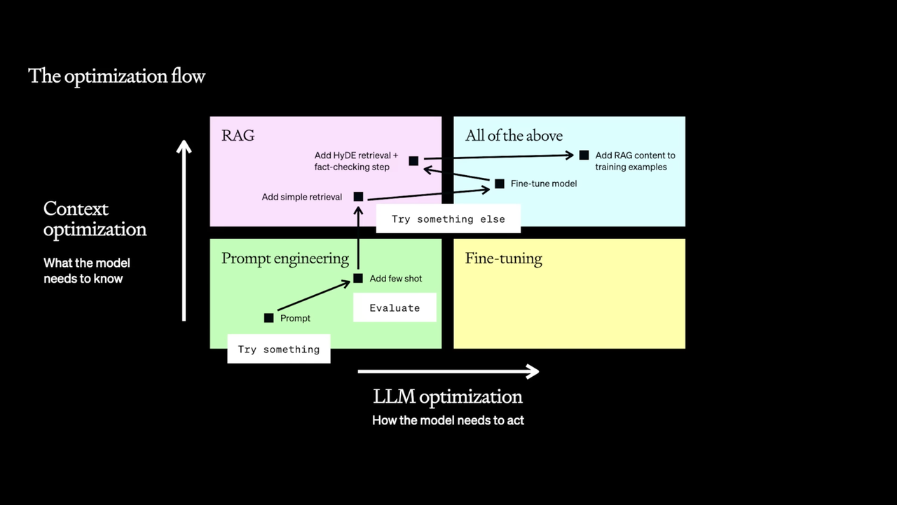

如图给出了 LLM 应用性能优化的推荐路径。

图中英文版

prompt -> Add few shot -> Add simple retrieval -> Fine-tune model -> Add HyDE retrieval + fact-checking step -> Add RAG content to training examples.

翻译翻译：

prompt 工程 -> 进阶 prompt 工程 -> 简单 RAG -> 微调模型 -> 进阶 RAG -> 带着 RAG 样本微调模型

再翻译翻译，说人话：

先从 prompt 工程开始把 LLM 应用快速跑起来。

如果遇到各种问题，如表现性能不足，试着使用思维链，添加参考示例等进一步的 prompt 工程提升性能，如果 prompt 过长，试着精简 prompt 长度，把  prompt 工程做扎实。比如有许多朋友基于 LangGPT 结构化提示词快速的搭建了 LLM 应用，但是发现结构化提示词占用的上下文过长，这时可以尝试将提示词中不必要的部分删除，将提示词缩短，如果发现指令遵循度不足，则加强指令约束。

如果提示工程能够满足要求，则到此为止即可。若不能，则按上面的两个维度分析问题。

如果缺失知识，则先简单的做知识库 RAG , RAG 之后如果想让模型表现更收敛更稳定，尝试一下 finetune 模型。finetune 模型后，模型表现变好，使用更多高级 RAG 技术，构造输入输出样本，进一步用于 finetune 模型，让模型表现进一步变好，构建正向迭代循环。

需要注意的几个点：

（1）这个路径有个隐藏的前提：该 LLM 应用依赖外部知识，需要 RAG。如果不需要外部知识，则不需要使用 RAG，可以直接进入 prompt 工程 <—> 微调的正向迭代循环。

（2）从简单到复杂做起，每步做扎实。良好的 prompt 工程是后续性能优化的基石，先从简单的 prompt 工程做起，基于实际需要和条件按需进行优化迭代，循序渐进，积累大模型经验。

（3）构建正向迭代循环。LLM 应用优化是个迭代过程，应该不断尝试：尝试-> 验证-> 再尝试 -> 再迭代。通过 prompt 工程（或结合 RAG ）先获取第一批高质量输入输出数据，然后微调模型，模型性能提升后，数据质量进一步提升，将更优质的数据用于模型训练，然后更好的模型产出更好的数据，如此循环，构建正向迭代循环（也称数据飞轮）。

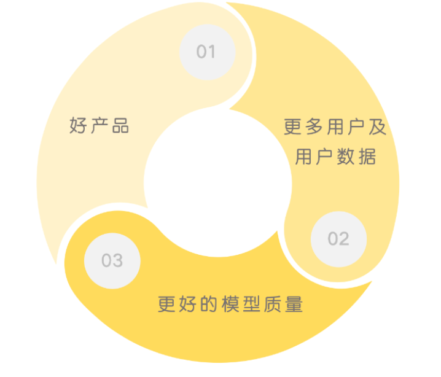

（4） Prompt 工程贯穿始终。Prompt 是调用大模型能力的接口，所以在各个阶段，调整提示词获取更好的数据，即进行 prompt 工程都是必要且必须的。Prompt 工程将为前期建立性能优化的基石，RAG 阶段需要考虑如何更好的将知识组装为 prompt，微调模型后可以进一步精简优化 prompt，构建微调数据集也要用到 prompt 工程的知识， prompt 工程贯穿始终。

后话：

说是优化路径的最佳实践，但其实也是最坏的情况下的最好情况。

最坏的情况是指——你刚好遇到了一个 LLM 的性能边界问题：LLM 刚好能解决，但是很费劲儿，问题再难一点，就解决不了了，问题再简单一点，你不用费这么大劲儿就搞定了。（当然比这更坏的情况是遇到了超出 LLM 能力的问题，然后硬搞）

最好的情况是指——不论你是否遇到了最坏的情况，按这么走踩的坑最少，解决问题最快。自己懵头乱撞的话，可能折腾了一圈问题还没解决。

## **Prompt 工程**

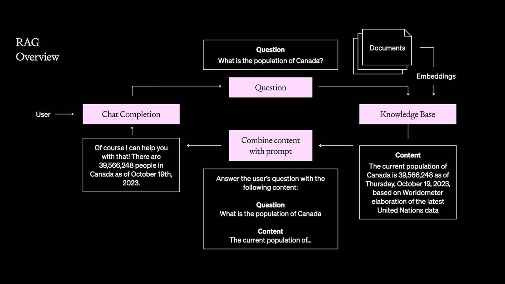

> 提示工程: 一种通过输入文本指令让模型按照要求输出期望结果的技术。

### **快速构建应用和性能基准**

                提示词是调用大模型能力的接口，精心设计的提示词可以大大提高模型的准确性和相关性。相比其他技术，通过提示工程优化 LLM 性能门槛更低、成本也更低。在优化 LLM 性能的过程中，提示工程往往是要做的第一件事情（若能始于提示工程，终于提示工程则最好啦hh）。基于提示工程快速建立应用原型，并且以此为性能参考基准，用于后续优化性能对比。

                使用提示工程构建好应用之后，要进一步提高性能则可以考虑添加外部辅助工具、添加参考内容等手段，这就涉及到 RAG、Agents 等相关技术。

                鉴于提示词对 LLM 的核心作用，在实际中，进行 RAG、微调或其他高级技术之后也应该再次进行提示工程优化提示词，如前面所说，提示工程贯穿 LLM 性能优化过程的始终。

                提示工程的几项核心原则就是：

* 编写清晰的指令

* 将复杂任务分解为简单任务

* 给 LLM 一定的时间空间思考

* 系统的测试性能变化

                几项原则看着简单，实践却是不易，要提高提示技巧应多学多练。关于如何写好 prompt 网上的资料有很多了，推荐阅读几家大模型厂商的提示工程指南，LangGPT 结构化提示词知识库中也有很多高质量资料和提示词，在此不再赘述。

> LangGPT 结构化提示词知识库: <http://feishu.langgpt.ai/>

在提示工程进行过程中和后续进一步的性能优化过程中，如何知道性能是否变好呢？如何系统的测试性能变化？下面讲讲如何做好性能评估

### **做好评估**

                只有清晰的了解了模型性能，才能判断各项改进操作是否有效。因此在优化 LLM 性能过程中，最关键的一步是建立一套可信的性能评估框架。除了确定改进的有效性，评估目前的性能不足之处外，性能评估在另一方面也能为后续采用什么优化策略提供方向性指导。无论是调整提示词、调整 RAG 还是进一步微调模型，都依赖于评估反馈。

                那么如何评估 LLM 的性能呢？

                以下是一些方法：

* 外包人工注释：也就是花钱请人来告诉你某样东西是好是坏。这种方法通常成本高、速度慢，而且难以确保质量的一致性。

* 内部人工审核：让您的团队在内部对模型结果进行审核，可确保质量，但速度较慢，且需要大量资源。

* 基于模型的评估：使用另一个 LLM （通常是更好的模型，如 GPT-4） 来评估系统的性能。有了强大的通用模型，这种方法变得越来越有效。

* 基于代码的评估：编写一套评估自定义的规则，以评估模型输出的特定方面。

* 准确度指标：如果目标明确，F1、精确度、召回率和 BLEU 等数据集指标可以客观地衡量模型的准确性。

* 终端用户反馈和 A/B 测试：通常是最重要的反馈！一般包括用户的直接反应以及表明用户偏好的隐式操作（比如用户对结果不满意则会要求重新生成，或者重复提问）。

这些评估方法各有优缺点，通常最好的方法是将几种方法结合起来，以全面了解模型的性能和需要改进的地方，构建适合自身业务的可信性能评估框架。

### **提示工程的局限性**

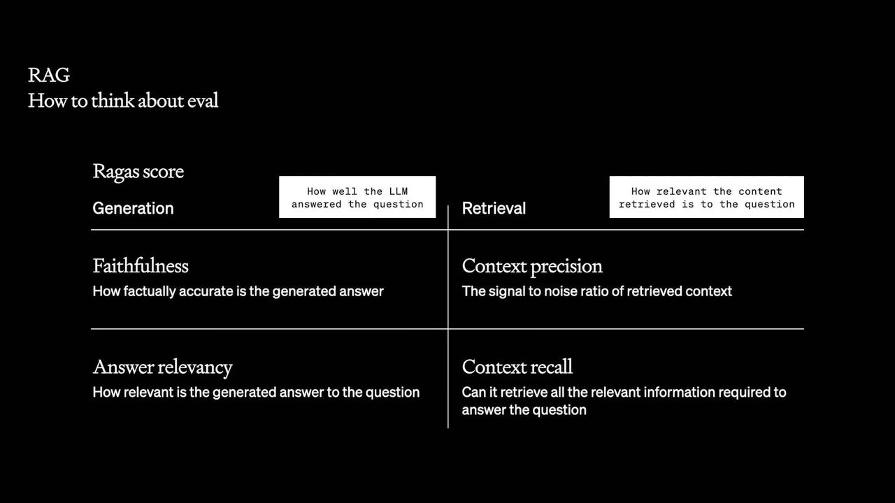

使用提示工程优点很明显：

* 门槛低，方便快速试错和经验积累

* 成本低，实施快，能够方便快捷的构建早期应用

* 结合评估系统，能够为性能优化建立性能基准

局限性也很明显：

* 引入新知识困难。这里的新知识是指模型不知道的知识，具体则是指模型训练阶段未见过的内容。当然可以手动的把一些新知识放到 prompt 里，但这样做不具备拓展性。

* 复杂任务很难让模型保持稳定的风格或结构输出。比如让其尝试学习一门新的编程语言，很难稳定的保持语法。不说复杂的编程语言，让其使用 Markdown 语法稳定输出有时候也会失灵。

* 难以降低 token 消耗。为了保持稳定的结构，需要添加大量结构描述信息，为了保持内容的稳定，则要添加大量细致的描述，这都会导致提示词变长。提示词变长一是会导致过多上下文窗口（GPT的输入长度有限）的占用，二是会让 API 调用成本过高。精简提示词，拆分任务也可以缓解该问题，但若还没达到需求，则需要考虑其他方法。

若你没有遇到这类问题，恭喜你！可以不用继续折腾了。

如果不幸遇到了，要可靠的解决这些问题，提示工程无能为力，只能依赖其他技术。

要实现稳定可靠的引入新知识，我们可以使用 RAG (知识检索增强) 技术。要实现更稳定的风格和结构，降低 token 消耗，则可以对模型进行微调，如下图所示。

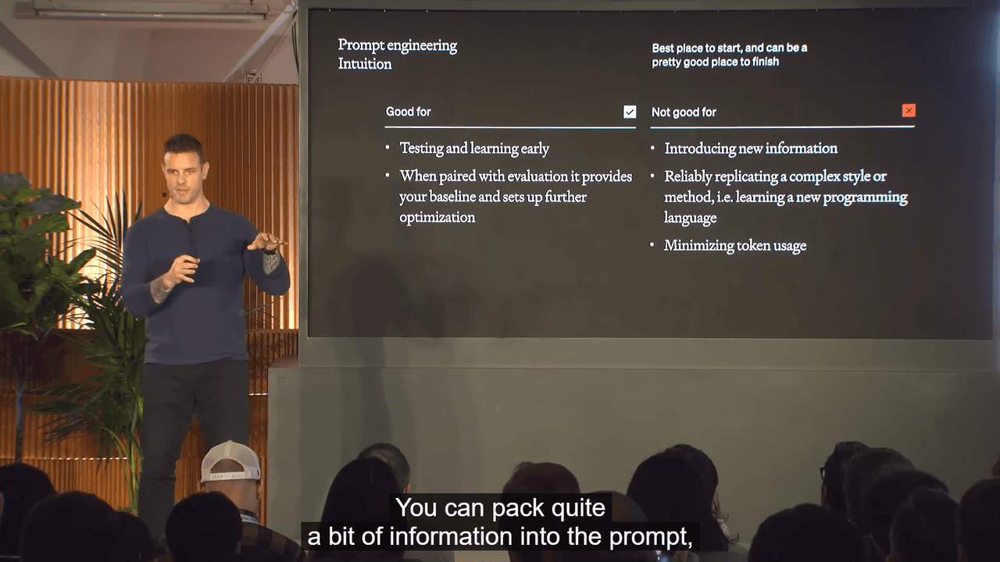

## **RAG**

我们先谈谈 RAG，前文对 RAG 建立了一个简单的印象，这里我们具体谈谈 RAG 是如何做的。

### **RAG 过程**

一个典型的知识问答的 RAG 的流程为：

> 1. 建立一个领域知识库：例如将人口数据文档 Embedding 后得到知识库。
>
> 2. 用户输入问题： 加拿大人口多少？（Question)
>
> 3. 基于用户问题检索人口数据知识库（Knowledge Base）。
>
> 4. 从知识库中检索得到答案
>
> 5. 将答案与提示词组装起来：“基于提供的知识回答用户问题： \[用户问题：加拿大人口多少？], \[知识：xxxx]”
>
> 6. 将组装好的提示词输入大模型
>
> 7. 大模型做出回答

总结一下：依据用户输入检索知识，然后构造 prompt，prompt 输入模型得到结果。当然，更进阶更复杂的 RAG 不仅仅调整输入 prompt，甚至也会使用模型输出等组合信息，感兴趣可以查看下面的文章

> Advanced RAG Techniques: an Illustrated Overview: <https://pub.towardsai.net/advanced-rag-techniques-an-illustrated-overview-04d193d8fec6>

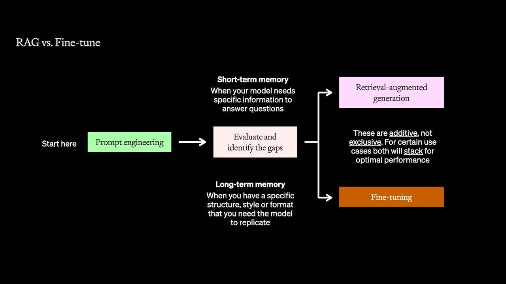

                高性能的 RAG 系统类似传统的信息检索系统，可以结合大模型特性使用 reranking, classification, and [finetuning your embeddings](https://blog.llamaindex.ai/fine-tuning-embeddings-for-rag-with-synthetic-data-e534409a3971) 等多种技巧。**不过不论使用的 RAG 技术有多复杂，RAG 的核心都是如何将知识检索的又快又准**。还记得我们开卷考试那个例子吗？时间有限，如何在多本书之间（知识库间检索），如何在一本书里（知识库内部检索）把目标知识检索的又快又准确，是 RAG 效果好坏的关键。

引入 RAG 为大模型应用带来了新的可能性，但其作为一个独立系统也增加了独立出错的可能性，因此需对 RAG 进行评估。

### **RAG 评估**

如果检索到的知识是无效的，会严重影响 LLM 应用的表现，因此将检索过程的精确度和召回率与整个 LLM 应用程序分开进行研究尤为重要。如下图所示，需要建立一个评估框架，将检索性能与整个 LLM 应用程序隔离开来。所以这里需要既需要从模型角度出发评估生成结果的质量，也需要从检索的角度出发，用精确度和召回率评估检索，并评估整个系统。

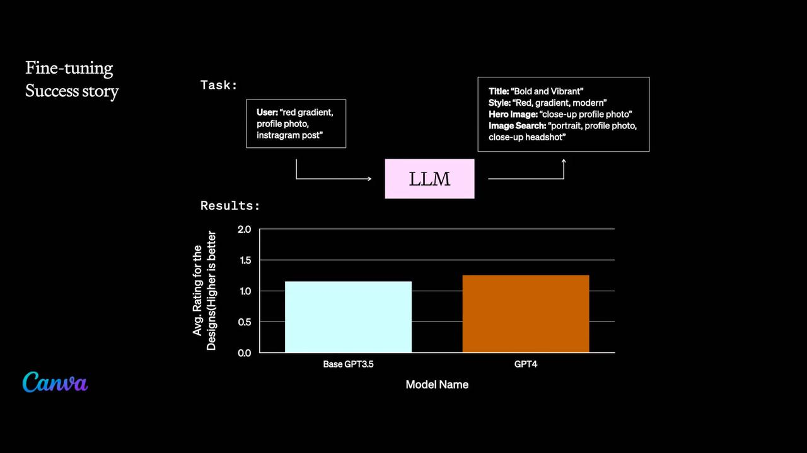

* 模型角度（generation）

  * 回答真实性：模型结果真实性多高（少一些模型幻觉）

  * 回答相关度：结果和问题有多相关，不能南辕北辙

* 检索角度（retrieval)

  * 召回率（recall)：相关信息有多少包含在返回的检索内容里，越全越好

  * 准确率（precision）：返回的检索内容中有用信息占比多少，越多越好

RAGAS 是一个用于 RAG 评估的知名开源库，推荐使用：

> <https://github.com/explodinggradients/ragas>

### **RAG 局限性**

如果 LLM 应用面临的问题与上下文有关，那么 RAG 就是一个强大的工具。它使模型能够访问外部数据源，提供模型训练数据中不存在的必要上下文。这种方法可以显著提高模型的性能，尤其是在最新信息或特定领域信息至关重要的情况下。为模型提供参考文本的情况下，也能大大降低模型幻觉。

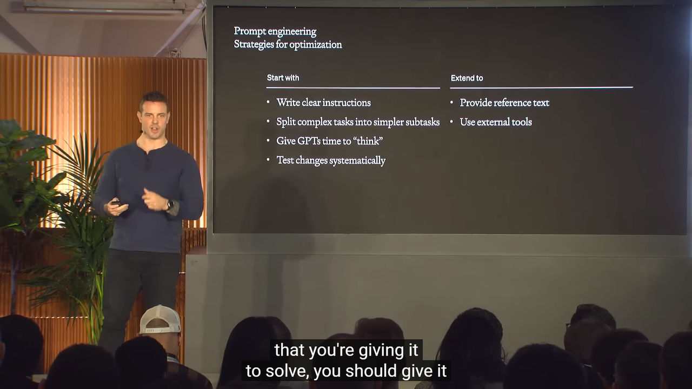

需要注意的是 RAG 的局限性如下：

* 适合打造专才，不适合打造通才。虽然能够为模型提供新的信息、专有领域知识等，但并不适合为模型提供通用领域知识。

* 让模型保持稳定的风格或结构输出，降低 token 消耗等。也就是我们在 prompt 工程局限性的后两点，而这两点需要使用微调技术解决。

## **Fine-tuning**

参数规模的角度，大模型的微调分成两条技术路线：

* 全量微调FFT(Full Fine Tuning)：对全量的模型参数，进行全量的训练。

* PEFT (Parameter-Efficient Fine Tuning)：只对部分模型参数进行训练 。

从成本和效果的角度综合考虑，PEFT是目前业界比较流行的微调方案。

OpenAI 官方微调教程：

> <https://github.com/openai/openai-cookbook/blob/main/examples/How_to_finetune_chat_models.ipynb>

微调是在较小的、特定领域的数据集上继续 LLM 的训练过程。这可以通过调整模型本身的参数，而不是像提示工程和 RAG 那样仅仅更改提示，来大幅提高模型在特定任务中的性能。

把微调想象成把通用工具打磨成精密仪器。

微调有两大好处：

* 提高模型在特定任务中的性能。微调意味着你可以输入更多的示例。您可以在数以百万计的代币上进行微调，而根据上下文的大小，少量学习提示仅限于数以万计的代币。经过微调的模型可能会失去一些通用性，但对于其特定任务而言，您应该期待它有更好的表现。

* 提高模型效率。LLM 应用程序的效率意味着更低的延迟和更低的成本。实现这一优势有两种方法。通过专门化模型，您可以使用更小的模型。此外，由于只对输入输出对进行训练，而不是对完整的提示及其任何提示工程技巧和提示进行训练，因此可以舍弃示例或指令。这可以进一步改善延迟和成本。

### **微调如何做**

为了使微调达到最佳效果，应该从明确的目标和相关的高质量数据集开始。应该使用能体现所需输出类型的数据进行微调，此外，迭代测试也至关重要--从小的、渐进的变化开始，并在进一步进行之前对结果进行评估。

对于 OpenAI 的模型，微调包括使用其提供的 API 在我们的数据集上进一步训练模型。进行微调训练时需要调整各种超参数并监控模型的性能，以找到适合特定用例的最佳设置。对于开源 LLM，微调可能需要更多的实践工作，包括设置训练环境、管理数据流，还可能需要直接调整模型架构。

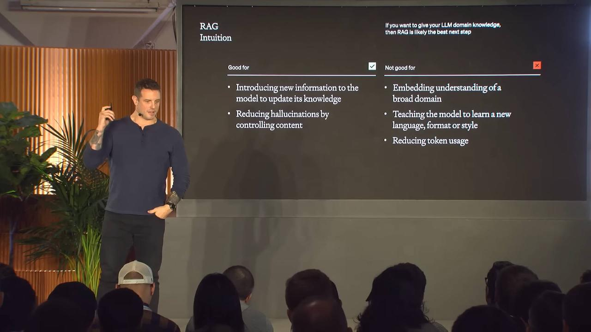

### **Fine-tuning 局限性**

对于需要快速迭代新用例的场景，微调所起的作用较小。

要实现微调功能，需要创建一个大型训练数据集，其中至少包含数百个优质示例。然后，按照格式要求将数据集整理成适当的格式，并启动微调自定义 LLM 的训练任务，评估微调性能。

为了实现良好的微调，我们需要建立一个模型改进工作流程，在流程中不断监控模型性能变化，获得反馈，依据反馈不断改进模型。

通过记录所有生成的模型，以及评分指标（隐性和显性用户的反馈，以及人类和人工智能的评估），从而为下一版本创建的训练数据集进行调整。另外，许多 LLMOps 平台也能自动收集和显示最佳数据，让我们只需点击几下就能对模型进行微调。

## **总结**

上面提到的提示工程、RAG 和微调都是可以叠加使用的。

提示工程始终是优化过程的第一步。从精心设计的提示词开始，我们就能了解模型对于任务的固有能力，有时候许多任务通过提示工程可能就能达到理想效果！

微调可以完善模型对任务的理解，使其提供正确的输出。微调与 RAG 搭配使用的情况下，模型不仅知道该说什么，而且还能从知识库中获取正确适当的信息。RAG+微调的这种双重方法充分利用了微调（针对特定任务的性能）和 RAG（动态、上下文丰富的信息检索）的优势，使 LLM 应用程序性能更强。

根据微调数据的情况或模型的性能变化，在 RAG 和微调后需要重新进行提示工程，优化提示词以获得真正的最佳性能。

了解并有效应用提示工程、RAG 和微调是将LLM 应用从原型阶段过渡到稳健的生产就绪模型阶段的关键。
