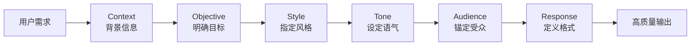

> **摘要** — CO-STAR 是新加坡政府科技局提出的结构化提示词构建方法，通过 Context（背景）、Objective（目标）、Style（风格）、Tone（语气）、Audience（受众）、Response（响应格式）六个组件，系统化地提升 Prompt 质量。核心价值在于消除歧义、双维度约束输出、从内容形式和情感两个维度控制质量、减少后续解析成本。



```markmap height=280
# CO-STAR 框架
## C — Context 背景
- 提供任务相关上下文
- 帮助模型理解场景
## O — Objective 目标
- 明确告知模型任务
- 清晰可衡量
## S — Style 风格
- 指定写作/表达风格
- 如专业报告、简洁摘要
## T — Tone 语气
- 设定情感基调
- 如正式、友好、严谨
## A — Audience 受众
- 明确目标读者
- 调整专业术语深浅
## R — Response 格式
- 指定输出格式要求
- 减少后续解析成本
```

---

# CO-STAR 框架

> CO-STAR 是新加坡政府科技局（GovTech）提出的一种结构化提示词构建方法，被广泛认为是 Prompt Engineering 最实用的框架之一。

---

## 框架结构

| 组件 | 含义 | 作用 |
|------|------|------|
| **C** Context | 背景信息 | 提供任务相关的上下文，让模型理解场景 |
| **O** Objective | 目标 | 明确告知模型需要完成什么 |
| **S** Style | 风格 | 指定输出的写作/表达风格 |
| **T** Tone | 语气 | 指定输出的情感基调 |
| **A** Audience | 受众 | 明确目标读者群体 |
| **R** Response | 响应格式 | 指定输出的格式要求 |

---

## 模板

```
# Context（背景）
[描述任务的背景信息]

# Objective（目标）
[明确你要完成的任务]

# Style（风格）
[例如：专业报告、简洁摘要、技术文档]

# Tone（语气）
[例如：正式、友好、严谨]

# Audience（受众）
[例如：技术团队、CEO、非技术人员]

# Response（响应格式）
[例如：Markdown、JSON、表格、列表]
```

---

## 实际案例

### 原始 Prompt

```
写一篇关于 AI 的文章
```

### CO-STAR 优化后

```
# Context
我们公司正在开发一款面向中小企业的 AI 客服产品，需要向投资人演示技术能力。

# Objective
撰写一篇 800 字的技术博客，介绍我们产品中使用的 RAG 检索增强生成技术。

# Style
专业技术博客风格，参考《Stripe》的技术文章水准。

# Tone
自信、权威，但避免过度吹嘘。

# Audience
技术背景的投资人（了解机器学习基本概念）。

# Response
Markdown 格式，包含小标题，必要时使用表格辅助说明。控制在 800 字以内。
```

---

## 为什么 CO-STAR 有效

1. **Context 消除歧义** — 模型不再需要猜测任务场景
2. **Style + Tone 双维度约束** — 从内容形式和情感两个维度控制输出质量
3. **Audience 锚定** — 模型据此调整专业术语的深浅和举例的易懂程度
4. **Response 格式化** — 减少后续 JSON 解析或格式调整的成本
