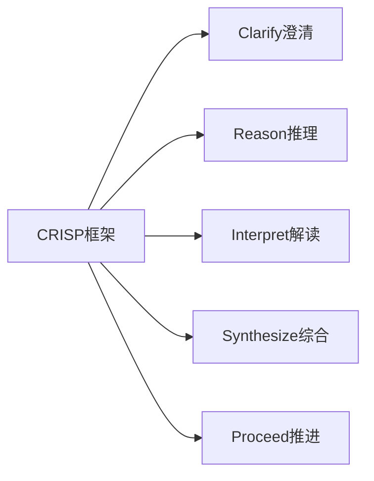

> **摘要** — CRISP 框架是一种批判性思维提示词框架，通过系统性提问引导 LLM 进行深度推理和分析。适用于复杂决策、问题诊断、方案评估等场景。



```markmap height=280
# CRISP 框架
## 适用场景
- 复杂决策分析
- 问题诊断
- 方案评估
## 框架步骤
- Clarify：澄清问题
- Reason：推理分析
- Interpret：解读数据
- Synthesize：综合结论
- Proceed：推进行动
```

---

# CRISP 框架
