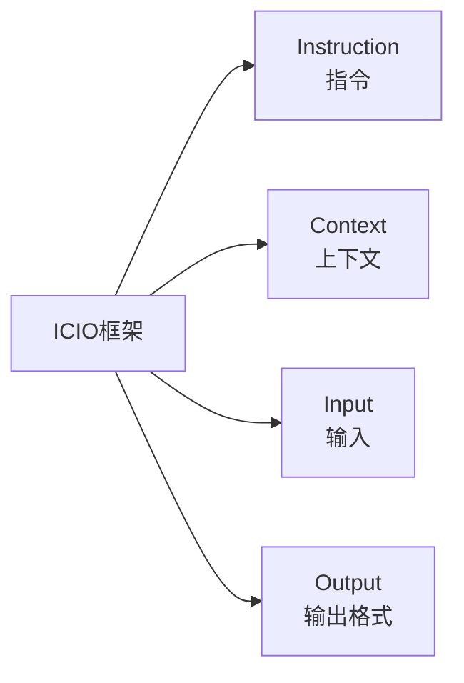

> **摘要** — ICIO 框架是一种结构化提示词框架，包含 Instruction（指令）、Context（上下文）、Input（输入）、Output（输出格式）四个组件。简洁实用，适合快速构建结构化 Prompt。



```markmap height=280
# ICIO 框架
## 四组件
- Instruction：明确指令
- Context：提供背景
- Input：指定输入
- Output：定义格式
## 适用场景
- 快速构建 Prompt
- 简单任务
- 结构化输出
```

---

# ICIO 框架
