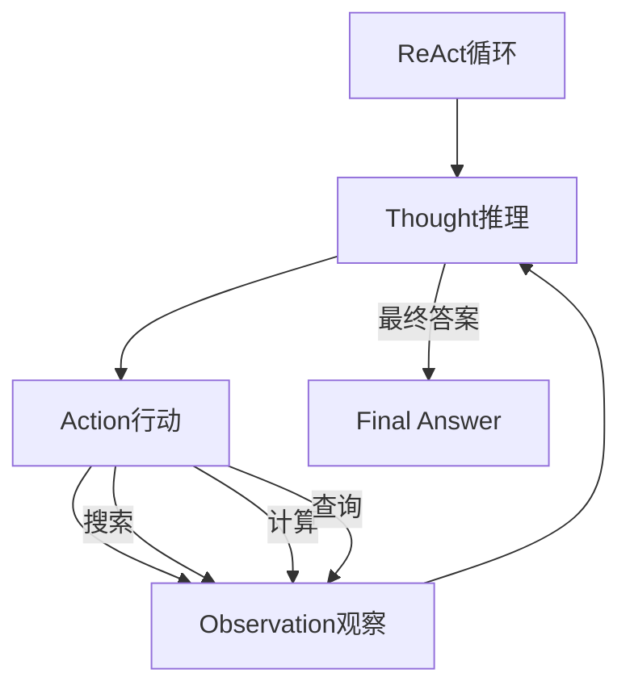

> **摘要** — ReAct = **Re**asoning + **Act**ing，由普林斯顿大学和 Google DeepMind 在 2023 年提出。核心思想是将推理（Thought）和行动（Action）交替进行，让模型在推理过程中主动调用外部工具。相比 CoT，ReAct 具备工具调用能力、可实时查询外部知识、幻觉风险更低。适用于研究、分析、数据查询等场景。



```markmap height=280
# ReAct 模式
## 核心循环
- Thought → Action → Observation → ...
## 三个步骤
- Thought：推理分析，决定行动
- Action：执行搜索/计算/查询
- Observation：接收结果，继续推理
## 与 CoT 区别
- CoT：无工具调用，纯推理
- ReAct：可调用外部工具
- ReAct：实时查询外部知识
- ReAct：幻觉风险更低
## 适用场景
- 研究任务
- 数据查询
- 分析任务
## 实践建议
- 动作集小而精
- Observation 强制化
- 限制循环次数
- 定义错误兜底策略
```

---

# ReAct 模式

> ReAct = **Re**asoning + **Act**ing，由普林斯顿大学和 Google DeepMind 在 2023 年提出。核心思想是将推理（Thought）和行动（Action）交替进行，让模型在推理过程中主动调用外部工具。

---

## 核心循环

```
Thought → Action → Observation → Thought → Action → Observation → ...
```

| 步骤 | 含义 |
|------|------|
| **Thought** | 推理分析，决定下一步行动 |
| **Action** | 执行具体动作（搜索、查询、计算） |
| **Observation** | 接收行动结果，进入下一轮推理 |

---

## 模板

```
你是一个智能助手，可以执行以下动作：
- search(query): 搜索互联网
- calculator(expr): 数学计算
- lookup(key): 查询知识库

请用以下格式回答：
Thought: [你的推理过程]
Action: [选择的动作及参数]
---
Observation: [动作执行结果]
---
（重复以上循环直到得到最终答案）
Final Answer: [最终结论]
```

---

## 案例：研究任务

```
Question: 特斯拉 2024 年的营收中，中国市场的占比是多少？

Thought: 我需要先搜索特斯拉 2024 年财报的相关数据。
Action: search("特斯拉 2024 年财报 中国市场营收占比")
---
Observation: 特斯拉 2024 年全球营收约 970 亿美元，中国市场营收约 170 亿美元。
---
Thought: 数据已获取，计算占比：170 / 970 ≈ 17.5%
Action: calculator("170 / 970 * 100")
---
Observation: 17.525773...
Final Answer: 特斯拉 2024 年中国市场营收约占 17.5%。
```

---

## 与 CoT 的区别

| 维度 | CoT | ReAct |
|------|-----|-------|
| 工具调用 | ❌ 无 | ✅ 有 |
| 外部知识 | 仅依赖训练数据 | 可实时查询外部来源 |
| 幻觉风险 | 较高（纯推理） | 较低（基于观察结果） |
| 适用场景 | 数学、逻辑 | 研究、分析、数据查询 |

---

## 实践建议

1. **动作集要小而精** — 只暴露必要的工具，避免模型"工具幻觉"
2. **Observation 强制化** — 确保模型在行动后必须处理结果再继续
3. **限制循环次数** — 防止模型陷入无限循环，建议 5-10 轮后强制输出
4. **错误处理** — 定义动作失败时的兜底策略
