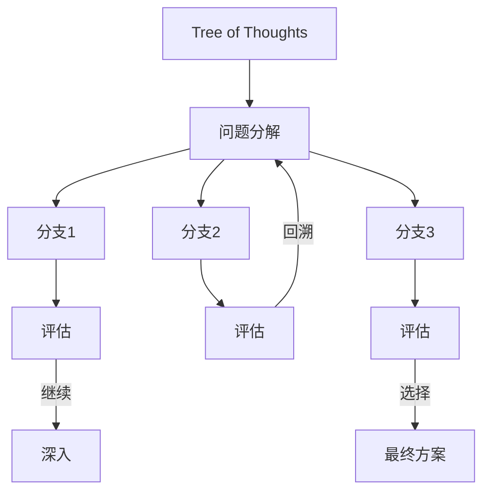

> **摘要** — Tree of Thoughts (ToT) 是 CoT 的树状扩展，由普林斯顿大学和 Google DeepMind 在 2023 年提出。核心思想是在每一步推理时探索多个可能的分支，支持多路径并行探索和系统性回溯。适用于复杂问题求解、创意探索、战略规划等场景。



```markmap height=280
# Tree of Thoughts 思维树
## 核心思想
- CoT 的树状扩展
- 多路径并行探索
- 系统性回溯
## 适用场景
- 复杂问题求解
- 创意探索
- 战略规划
## 框架步骤
- 问题分解
- 生成多个思维分支
- 评估每个分支
- 回溯或继续
- 选择最佳方案
## 与 CoT 区别
- CoT：单一路径
- ToT：多路径并行
- ToT：系统性探索
```

---

# Tree of Thoughts (ToT) 思维树

Tree of Thoughts（ToT）框架是对 Chain of Thought 的扩展，由普林斯顿大学和 Google DeepMind 的研究人员于 2023 年提出。

## 核心思想

传统的 CoT 是线性推理，而 ToT 允许在每一步探索多个可能的"思维分支"，形成树状结构。

## 工作流程

1. **问题分解** — 将问题分解为多个子目标
2. **生成分支** — 为每个子目标生成多个解决方案
3. **评估分支** — 评估每个分支的可行性和价值
4. **回溯或继续** — 根据评估结果决定是否回溯或深入
5. **选择方案** — 最终选择最佳解决方案

## 与 CoT 的对比

| 维度 | CoT | ToT |
|------|-----|-----|
| 路径 | 单一路径 | 多路径并行 |
| 探索 | 线性探索 | 树状探索 |
| 回溯 | 不支持 | 支持 |
| 适用 | 简单推理 | 复杂问题 |

## 实践建议

1. **分支数量要适中** — 一般 2-4 个分支
2. **评估标准要明确** — 定义清晰的评估维度
3. **设置深度限制** — 防止无限递归
4. **结合评分机制** — 给每个分支打分辅助决策
