> **摘要** — 2024 年是多模态大模型发展之年，GPT-4o、Gemini、ChatTTS、Sora、Kling 等多模态模型相继爆发。多模态提示词需要综合考虑文本、图像、音频、视频等多种模态的联合输入输出。本文整理自江树在第三届中国 AIGC 开发者大会上的演讲，探讨多模态 AI 应用现状与提示词方法实践。

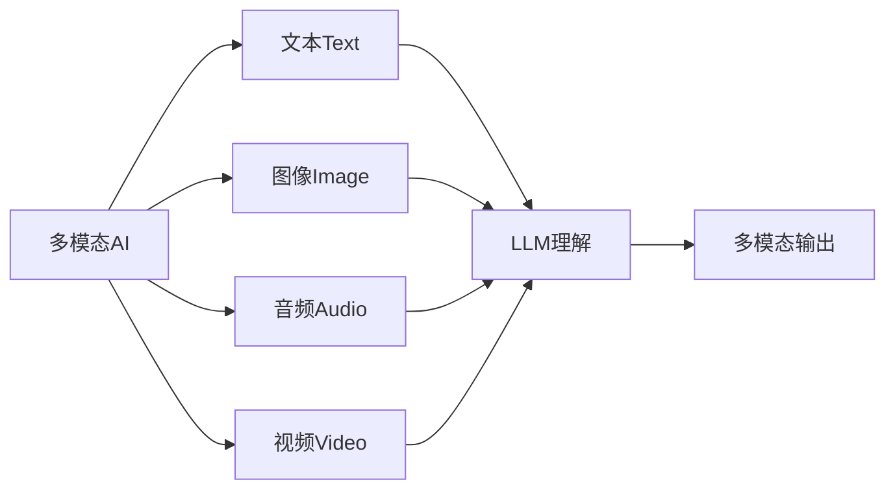
```mermaid
graph LR
    A[多模态AI] --> B[文本Text]
    A --> C[图像Image]
    A --> D[音频Audio]
    A --> E[视频Video]
    B --> F[LLM理解]
    C --> F
    D --> F
    E --> F
    F --> G[多模态输出]
```

```markmap height=280
# 多模态提示词
## 2024 多模态大爆发
- GPT-4o 多模态融合
- Gemini 系列更新
- ChatTTS / Seed-TTS 语音 AI
- Sora / OpenSora / Vidu / Kling 视频生成
## 多模态概念
- 单模态：仅文字（如 ChatGPT）
- 多模态：文字 + 图像 + 语音 + 视频
- 能力更丰富强大
## LangGPT 提示词方法
- 三年提示工程经验
- 结构化提示词方法论
- 被 Kimi 官方采用
## 提示词实践
- 多模态输入输出协调
- 各模态特性理解
- 跨模态推理能力
```

---

# 如何写好多模态提示词


## 多模态AI大爆发

2024 年是多模态大模型发展之年，继 OpenAI 发布 GPT-4o 以来，谷歌的 Gemini 系列同样有了比较大的更新，同时国内通义千问系列，智谱 AI 的 CogVLM，商汤的多模态模型等也纷纷发布。


另一方面，语音情感 AI 方面，除了国外的 Hume AI 之外，火爆的 ChatTTS，字节跳动出品的 Seed-TTS 等语音 AI 的效果目前也十分惊艳，令人真假难辨。同时，OpenAI 发布 Sora 吊足大家胃口之后，国内迅速跟进，开源社区推出 OpenSora，清华推出 Vidu，快手推出的 Kling 模型最近更是风靡一时，也是当前公众能体验到的最接近 Sora 级视频生成模型。


多模态 AI 的大爆发，如期而至，与之相伴的是相关的提示词、智能体等技术的进一步更新升级。


于此同时，继幻方 deepseek 系列模型发布之后，大模型的使用成本下降了一个数量级。国内大模型降价潮也由此掀开帷幕，字节跳动云雀、智谱 AI、阿里通义千问、百度文心一言等等大模型纷纷宣布降价，其中某些参数较小的模型甚至直接提供给开发者免费使用。OpenAI 也宣布 GPT-4o 这一最强的模型将逐步开放给用户免费使用。


大模型技术的进步和使用成本的迅速下降正在为 AI 的大众化普及扫清障碍！


本文整理了江树近期在第三届中国AIGC开发者大会和清华读书会上的演讲内容，与诸君共享。


## 多模态提示词

这是江树在第三届中国 AIGC 开发者大会上的分享内容，让各位朋友久等了，以下是 PPT 和发言。

我今天的分享内容聚焦在多模态提示词。主要的内容划分下面四个部分。先简单自我介绍一下，然后介绍一下相关概念。后面主要来讲我们现在的多模态应用，还有实践的一些探索，还有看到他的一些局限性，以及最后的话我们发现的一些提示词方法，以及我们的一些思考。


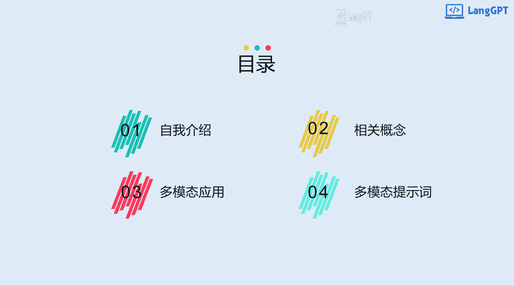


我简单介绍一下我自己。我是一名有着三年提示工程经验的提示词工程师。在 21年我们就在做关于AI 落地的应用探索。在 ChatGPT 爆火之后，我们发现国内外对于怎么样去驾驭大模型，怎么样去写好提示词，有着旺盛的需求。我们把自己的提示工程经验和 ChatGPT 的特性结合起来，提出了 LangGPT 这种比较系统和完整的的结构化提示词方法论。一经发布便在国内外受到了一定的关注和应用。


最近的话我们的这套方法论也被应用到了kimi官方提示词专家上，大家感兴趣的话可以去实际使用体验一下。


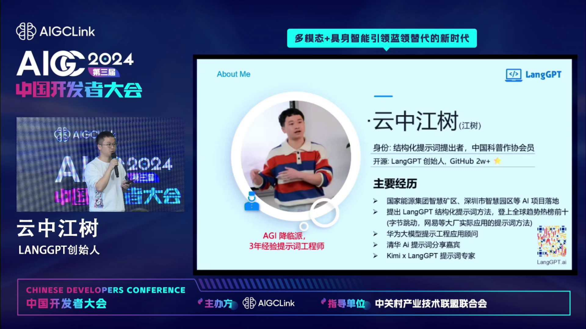

 

好的，废话不多说，我们进入今天的主题，多模态提示词。

在正式分享之前，我们先来了解清楚一些前置的概念。什么是多模态AI？什么是多模态提示词？

在了解了这些概念之后，相信大家对后面分享的内容会有一个更清晰的理解。

 

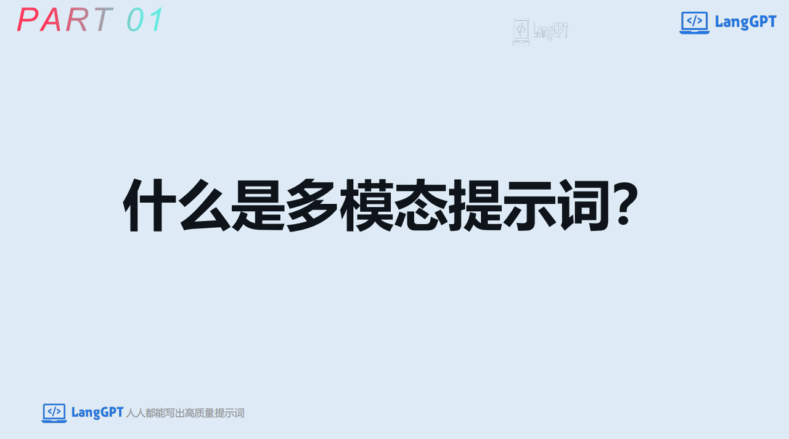

那么什么是多模态呢？

跟它对应的其实是单模态。像我们之前用的 ChatGPT 大模型系列，大家应该用的最多的就是文字，对吧？文字这就是一种模态，这个就是一种单模态的AI 。

我们可以把它类比成人的五感。想象一下，相当于一个人他只能够看到，他不能够听到，或者闻到、有触觉等等其他的感觉。

而现在的话我们的AI它不仅能够去认识我们的这个文字，还能听懂我们的语音，看到我们的图片，理解我们的视频。

这个时候就像一个人，他有了完整的五感以后，能力会更加的丰富与强大。

 

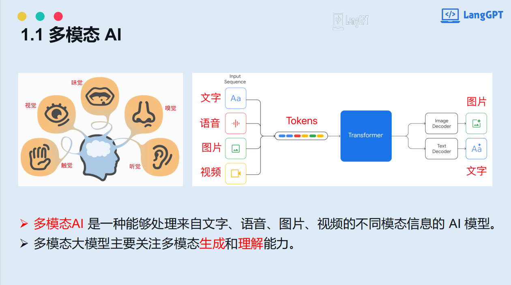


所以什么是多模态AI呢？

它就是一种能够同时处理来自文字、语音、图片、视频这样一种不同模态信息的这样的一个AI模型。

当然这个概念也不是完完全全就是这样。只要是他不是在处理单一的一种模态，它附加了其他的模态，我们就会叫它是一个多模态 AI。

对于多模态AI的大模型，主要会关注它两方面的能力。一方面是它的生成能力，另一方面是理解能力。从这两个维度出发，多模态AI也会分为下面的生成与理解模型。


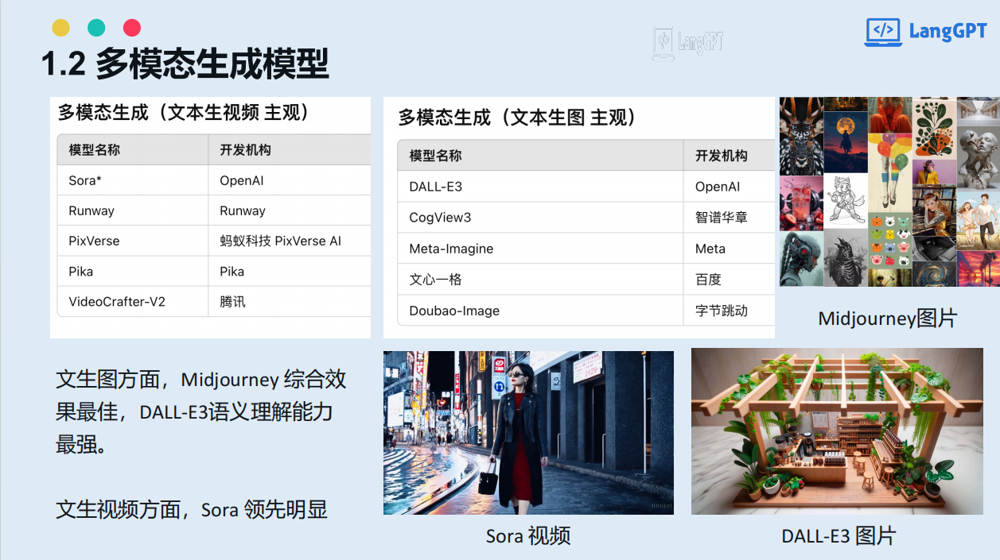


多模态生成模型的话，从它生成的内容来看，我们可以进一步细分为图片的生成模型和视频的生成模型。图片生成的话，相信大家都已经比较了解了。像 Midjourney, DALL-E 和 stable diffusion 这些模型，都具有较好图片生成效果。


然后视频这一块的话，像OpenAI的 Sora，还有国内的Vidu，还有最近爆火的快手的 Kling，发展的也非常快。但生成模型不是我们今天的重点，我们重点放在多模态理解模型方面。


什么是多模态理解模型？


和多模态生成的模型相比，理解模型它更侧重于理解能力，也就是问答能力。这一块的发展其实也比较久了，然后有非常多的模型。大家如果感兴趣可以看右边的多模态大模型发展时间线图，大家自己去搜索相应的模型。


在当前阶段，我们用下来比较好的多模态模型在左边的这个表格里面。


像 OpenAI 的GPT-4o这个模型我们就不用多说了，然后还有谷歌的Gemini 模型，它的多模态的能力非常的完整。然后国内比较好的，像阿里的通义，然后商汤的书生，还有智谱的CogVLM 等模型。


我们接下来也会以这些模型为主来去讲所谓的多模态提示词，分享它的一些系列的应用。

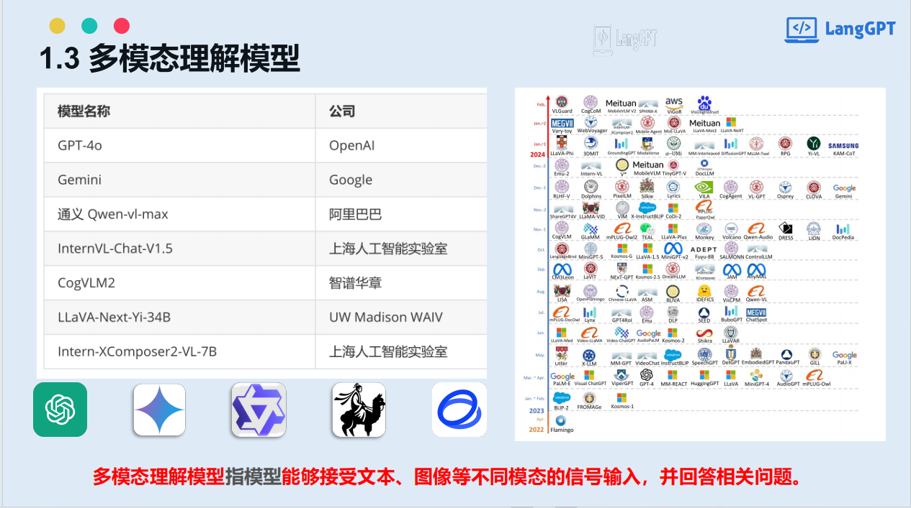


好了，我们了解了什么是多模态，什么是多模态AI以后，我们再来明确一下我们今天讲的这个多模态提示词的概念。其实它本质也是提示词，也是用来引导AI去产生符合我们期望的输出。


那么加了多模态这个定语之后，强调的是什么呢？


强调的是附加的其他的这样的一个模态，超越了我们的单一的文字模态。它可能还包含语音、图片、视频等等其他模态信息作为输入，去引导我们当前的AI产生好的结果。


最理想的情况下，我们希望 AI 能够理解我们上面提到的所有的模态信息，但目前来说多模态AI 还处在发展的早期阶段，用下来最好的还是说文字+图片的这种形式，如右边的这张图所示。


所以今天我们讲的这个所谓的多模态提示词，也会主要分享的是文字加图片的这种形式。

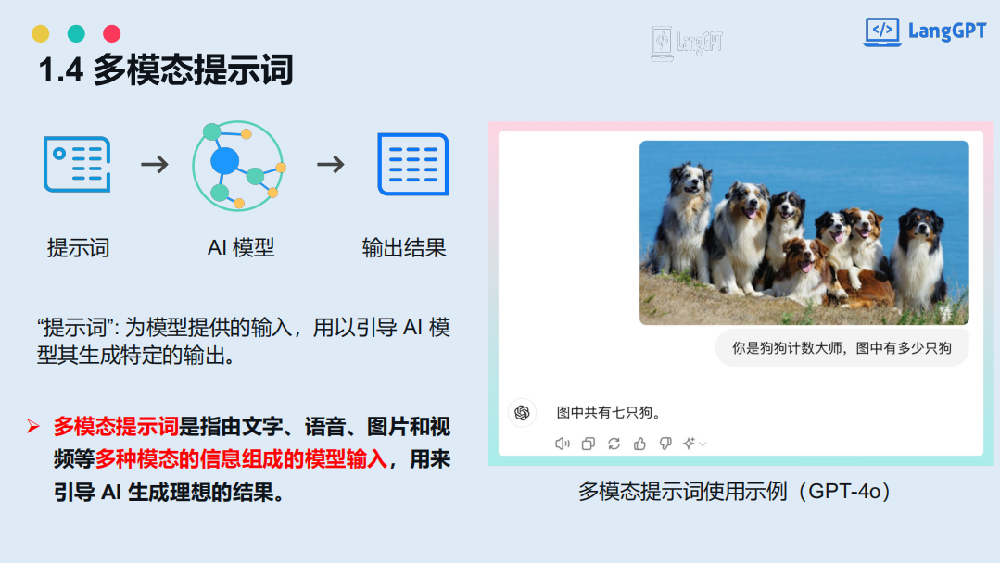


这些多模态AI和提示词，能有哪些应用？

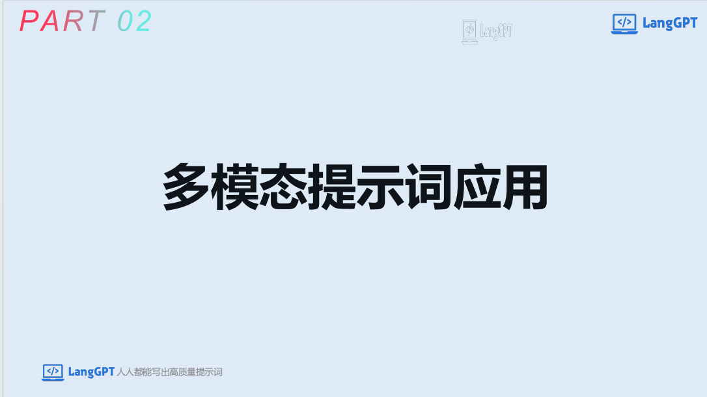


大家看一些大模型宣发稿的时候也能够看到。

比较简单的是做一些图文搭配。比如撰写朋友圈的一些文案，旅游文案。

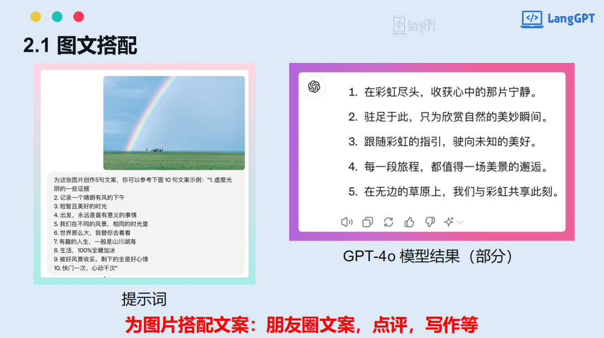


然后更进一步的话，我们可以用它来对人去做一个察言观色。如我这里面我们给他输入一些人脸的这样一些照片，让他去识别情绪。从右边的这个结果来看，你可以看识别效果非常准确。

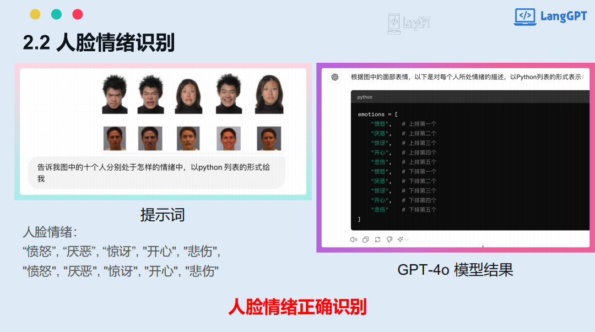


然后我们也可以用它去做一些传统的场景。比如说身份证证件的识别与信息抽取，当前来看它的效果也是比较不错的。

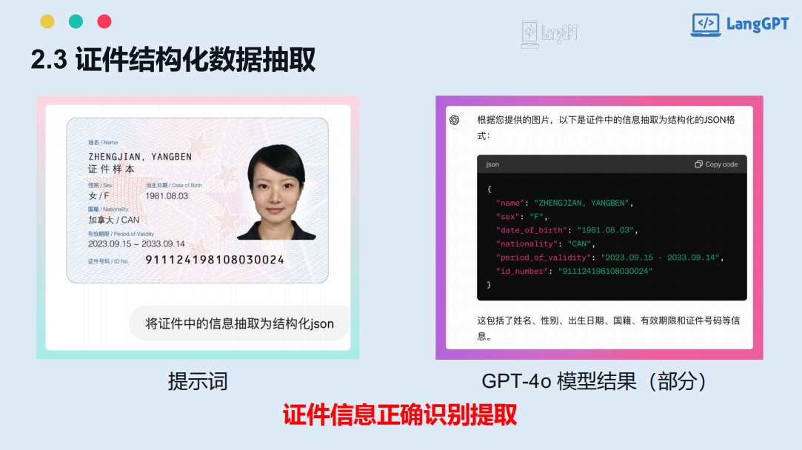


更复杂一点的场景，像发票票据识别，它的识别效果也还比较ok。

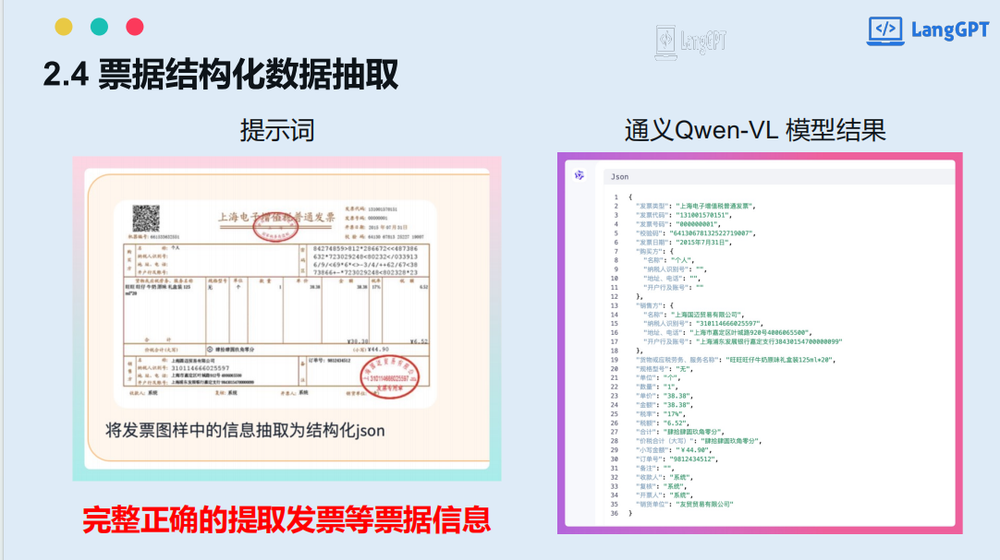


然后像谷歌的 Gemini 模型，支持视频作为输入，对输入的视频的整体的内容结构和它的一个关键的一个信息的识别都是效果都是非常好的。这就非常有利于我们对视频进行智能分析和剪辑，相信国内现在大家也能看到这样一些视频剪辑方面比较好的这种产品了。

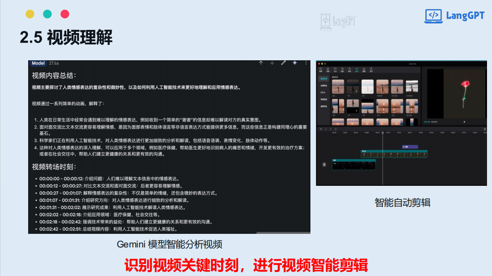


更具想象力的是，包括前面占总也分享过的，如果把现在的这些多模态能力，应用到一个机器人上面去做具身智能会怎样？

这是 Figure1 展示出来的能力。相信经过今年多模态能力的发展和爆发，我们能够看到的效果会更加的惊艳，也让我们一起期待。

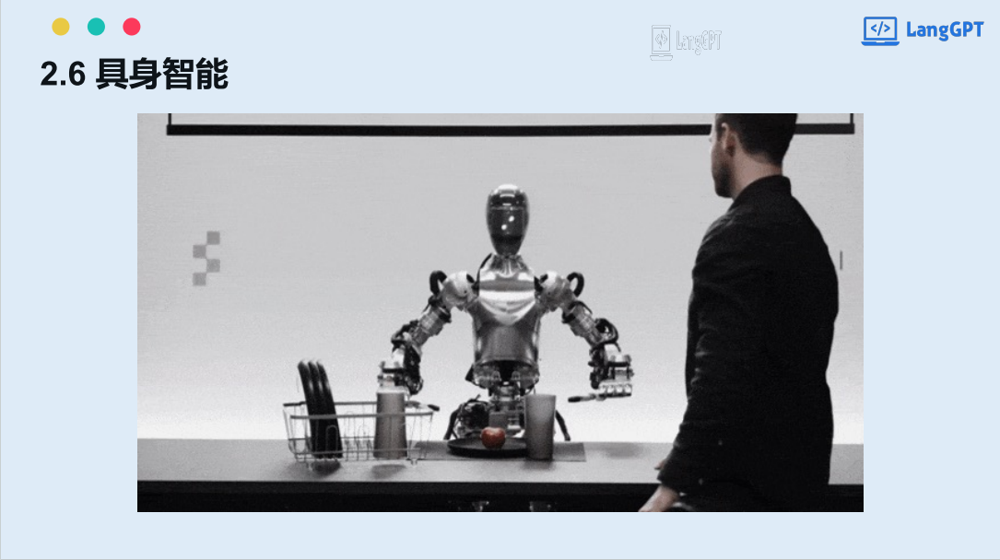


实际的用例还很多，大家感兴趣可以去多去探索和了解。我们在实际使用过程中，也发现多模态AI还在早期阶段，有着能力上的局限性。

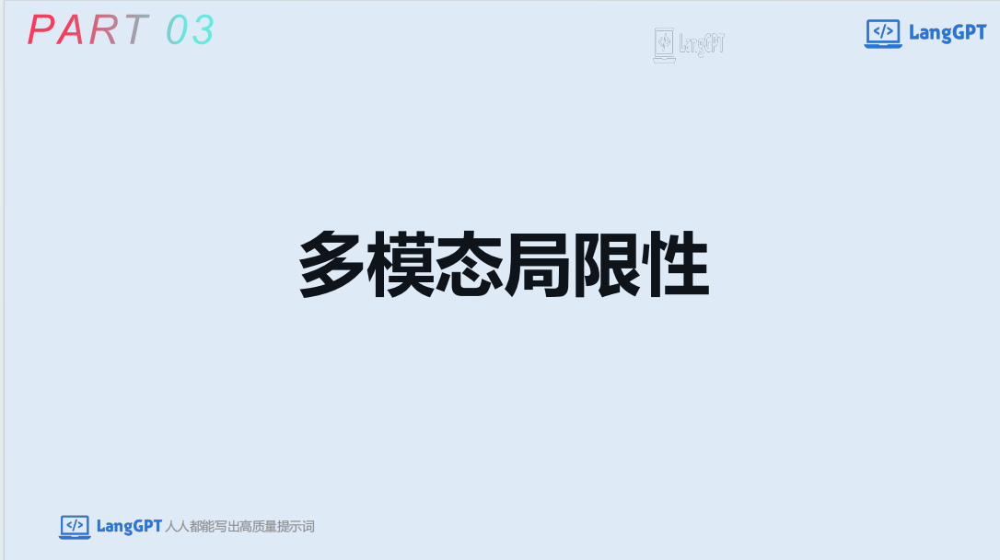


包含场景理解能力的不足，还有包含了幻觉问题。像这里面我们给了他一个场景，就是让他去识别图中有多少个人。我们可以看到实际上来说比较明显的是有四个人。对这四个人他虽然准确识别了，但是他有一个幻觉生成了第五个人（蓝色箭头指向的地方）。我们蓝色箭头所指的这个地方实际上是没有人的。


它还存在着非常隐蔽的信息遗漏问题。

像我们刚刚举到的身份证抽取的这样的一个场景里面看上去他好像抽取的这个结果挺不错的。但是某些数字它会产生遗漏或者错误，或者说顺序的颠倒。

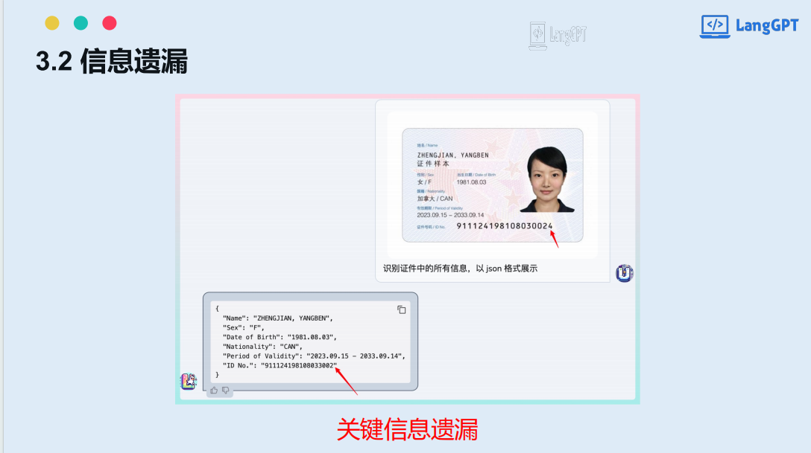


同时的话，即使它能够正确的识别图中的所有的数据和各种实体信息。也容易发生数据跟实体信息的匹配错误，导致最终对整体分析结果的错误。

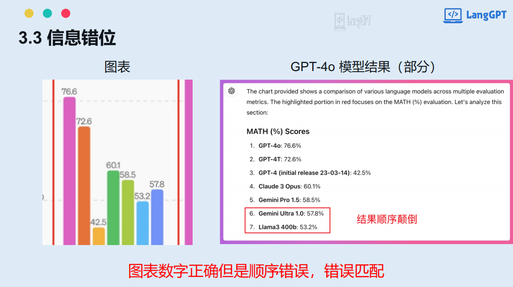


同时它还存在着胡编乱造的情况。

像这里面我们给他一个图表，让他去进行分析。我们可以看到左边的这个图表里面空白的地方明明没有数据，但是经过他的分析以后，自作主张胡编乱造填充进去数据，最终导致分析的结果是不对的。

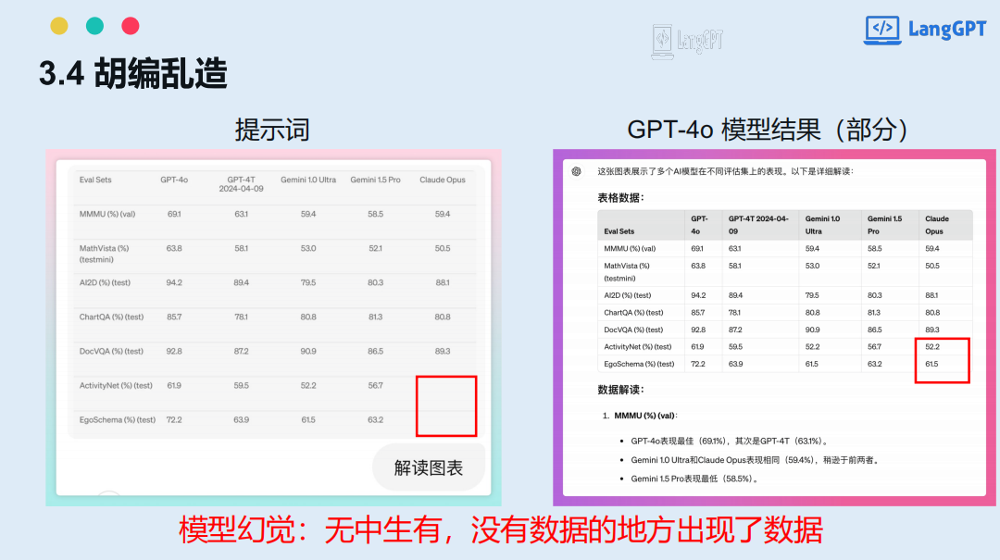


当前的 AI 还存在着陷入模式崩溃的问题。

一旦出现了某些模式重复，它就非常容易陷入这个死循环。你看它在后面不断的重复着最后的这样的一句话，直到达到它最大的输出窗口。对我们实际应用造成了非常不好的体验。

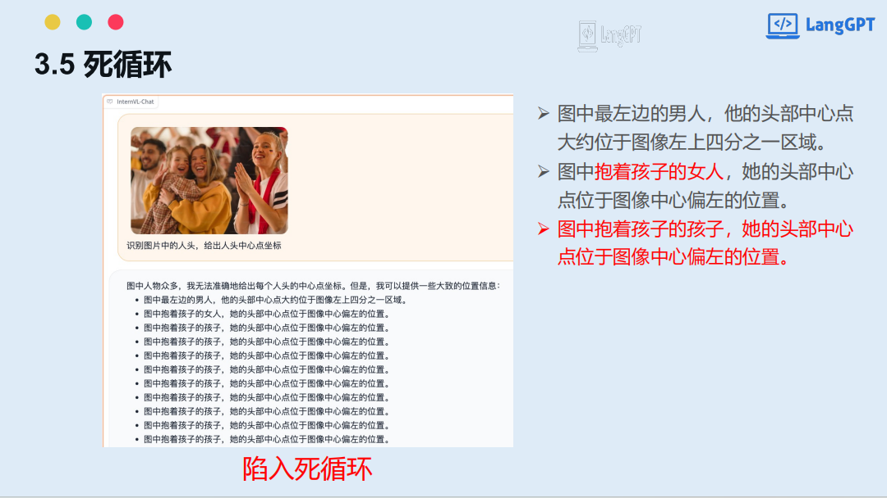


多模态确实还有非常多的问题要去解决，需要多方面多种技术综合运用。

那我们今天从提示词的角度来说，怎么样从提示工程这种角度来去缓解这些问题？我们怎么样去写好我们的多模态提示词呢？它跟我们之前了解到的提示词技巧有什么共性和什么特性呢？


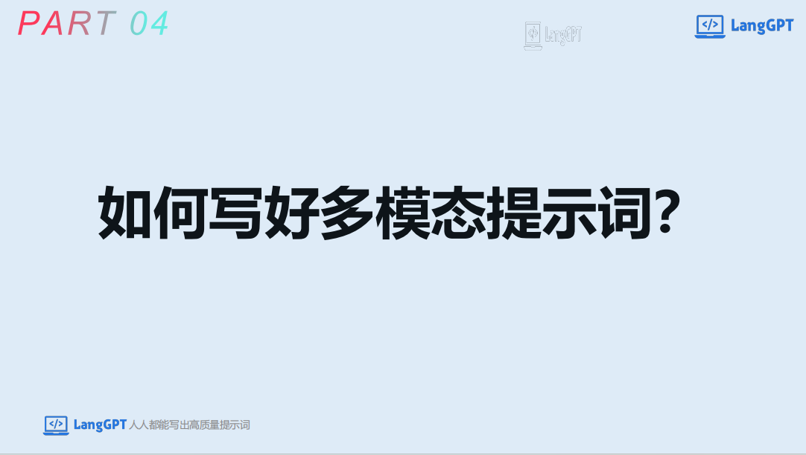


值得庆幸的一点是，我们之前的大语言模型所了解的到那些提示工程的技巧和方法，基本上都是适用的。因为它的技术栈基本上一脉相承，同时因为它多了一种模态的特性，它也会有一些特性的方法。这里简单的列了几种，接下来我们也将会一种一种的给大家过一下，也给大家提供实际使用的效果。

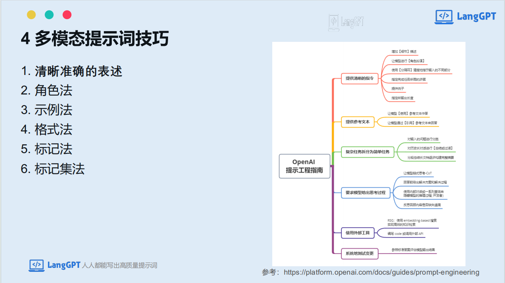


首先第一点是清晰准确的表述，就以刚刚发票内容识别的为例，让大模型抽取出图片中的数据。

我们发现如果没有说明清楚要它获取全部的信息的话，AI 会自作主张的从中挑选一些信息获取。最终导致你的信息获取的结果不稳定，一方面是这个变量是不稳定的，另一方面是变量值是不稳定的。

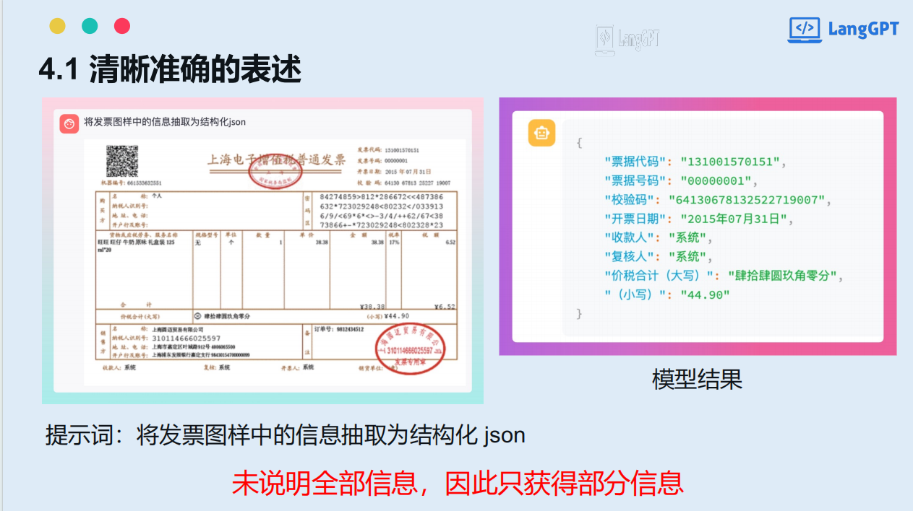

但我们加上这样的一个关键词，我们强调让他要获**<span style="color: rgb(100,37,208); background-color: inherit">全部</span>**的信息的时候，可以看到他最终给出来的信息从丰富度和完整度上都有了比较大的提升。


然后第二点是我们常常用的角色法，扮演专家角色。

你看左边，我们直接让他去数图片中有多少条狗，他数错了。对，地上那一只趴着的黑色的狗被遗漏。

如果我们给他赋予一个专家角色，告诉他是一个计数大师的话，也能够说提升它计数的表现。

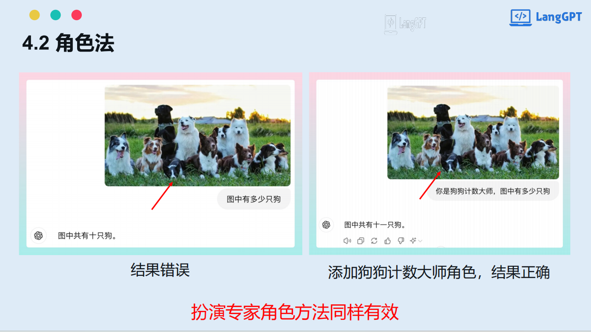


第三点是示例法，就是所谓的few shot 方法。

当我们直接给他一个表盘的数据，让他去识别这里面的速度是多少的时候，它的结果是错的。正确答案应该是160千米每小时，它这里面识别错了。

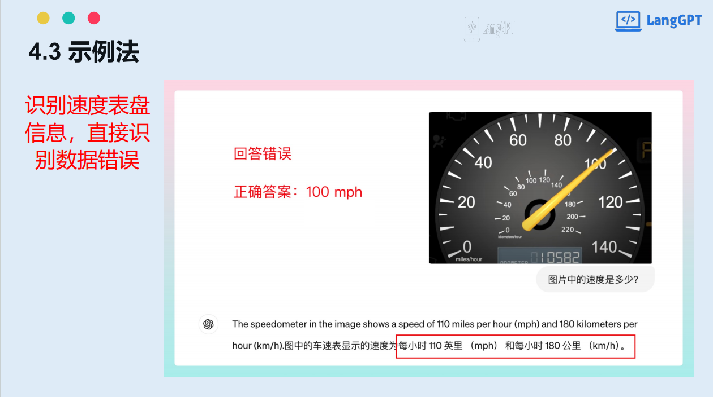


如果我们给他提供一些示例，像这里面先给他提供两个图片，然后告诉他前面两个图片的结果是怎么样的。最终让他去识别第三张图片的结果时，可以看到 AI 结果有了比较大的改善，可以正确的识别。

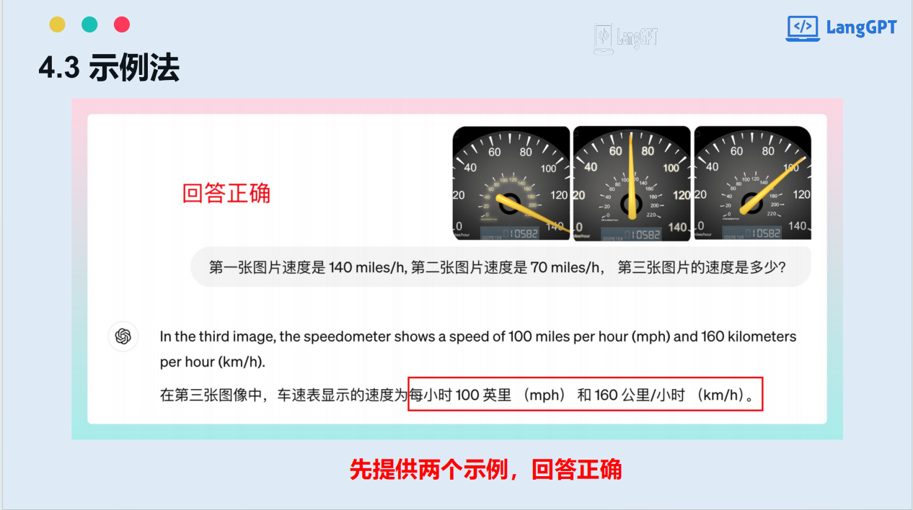


第四个，指定输出格式的这种方法也非常有效。

当进行发票表格识别任务时，我们可以指定期望输出格式为Json。然后指定其中的某些具体类别。这样的话它可就可以准确的从发票中去抽取出我们想要的这个信息。


我们从这个例子中可以看出，它的这个符合度匹配度还是非常好，非常高的。能够大大提高我们大模型表现结果它的一个稳定性和精准度。

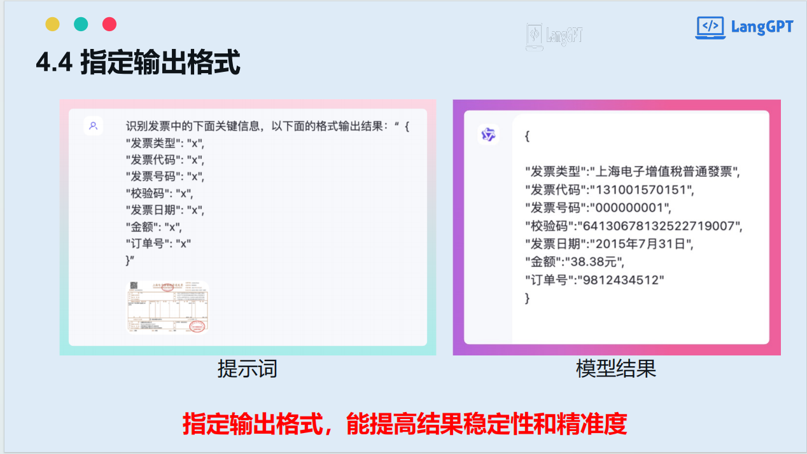


刚刚分享了一些多模态提示词跟之前提示词的一种共性的这种方法。

针对多模态，有没有它的一些独特的方法呢？

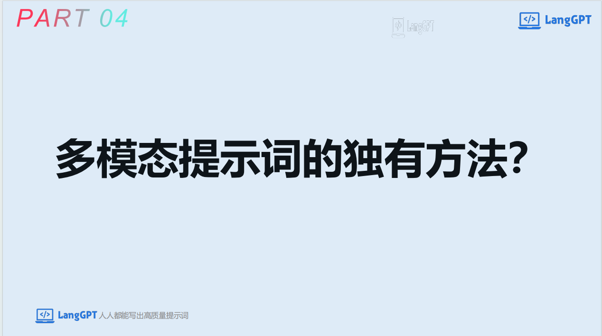


这里面主要介绍一点，大家记住这一点就行了，就是标记提示法。


什么叫标记提示法？


像我们前面讲过的，AI 会出现幻觉问题，会无中生有。

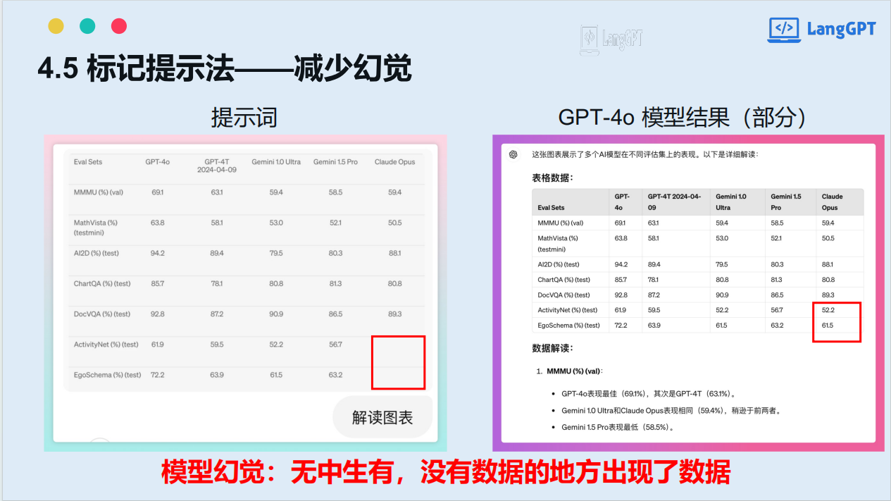


那么我们怎么样去避免他这种幻觉呢？


给空白的地方加上一个标记就好了，这个地方给它打上两个红叉，用两个红叉来去做标记。这个时候你可以看到大模型对于这一部分的结果就能够准确的识别。它就知道那个地方没有数据了。通过这种方式来规避了幻觉的发生。

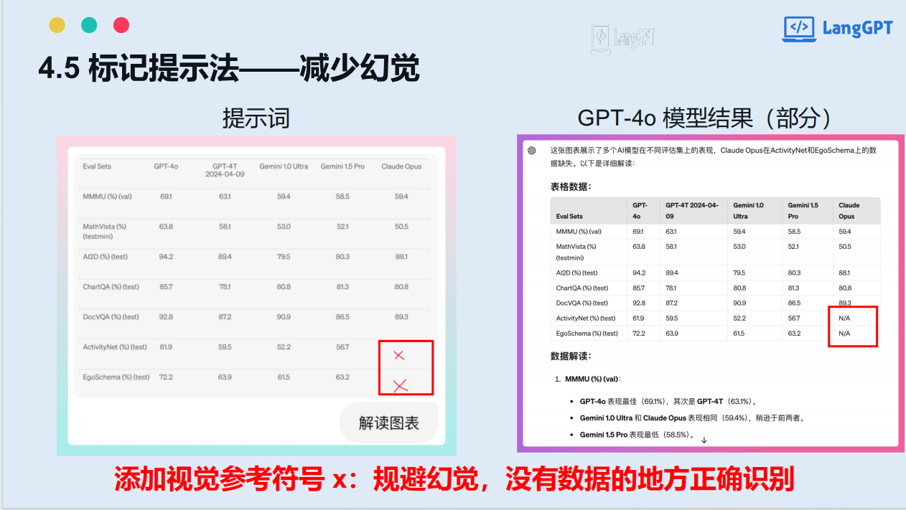

同时的话，我们还可以使用其他的我们所熟知的标记。不管是红框也好，箭头也好，红星也好等等的这些标记你都可以去使用，来去提高你答案的这样的一个准确度。


像我们这里面是给了一个表格分析的这样的一个例子。我们希望他去解读 GPT-4O 的表现，所以我们把 GPT-4O这一列用红框给它框起来了。


这时候你可以看到我们给了他这样一个标记的这样的一个引导之后，把他的视觉聚焦在GPT-4O上面，给我们更加聚焦，更加精准的答案。

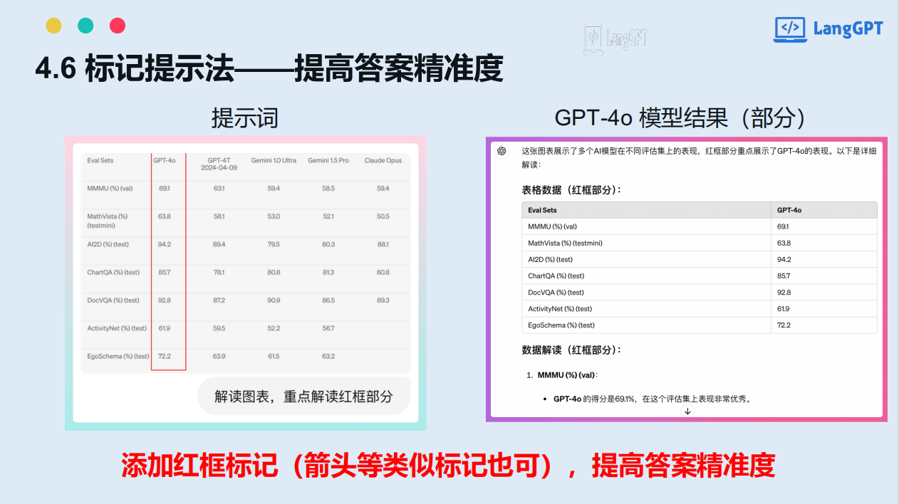

刚刚我们只是标记了图片的部分，标记了图片的一点点，而且还是人工标记的，这种方法不具备一个拓展性。


我们把这个方法的话给他推广一下，推广到极致，我们可以怎么做？

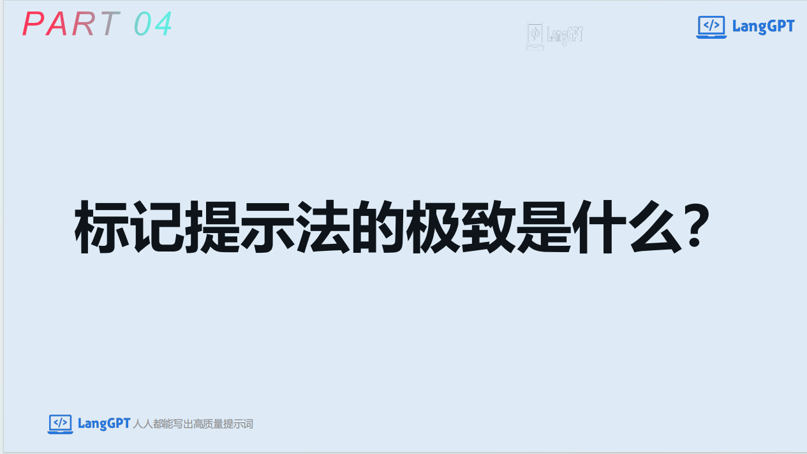


我们可以给图片中所有的物品都打上标记，这样就它拓展为了标记集提示法。


这个方法怎么做呢？


左边是原图，右边我们是应用了标记解法之后的结果。我们标记每一个苹果，对每一个苹果在中心给它一个标号，同时用不同的颜色去画出苹果的边缘，来实现对图片中所有内容的结构化拆解。

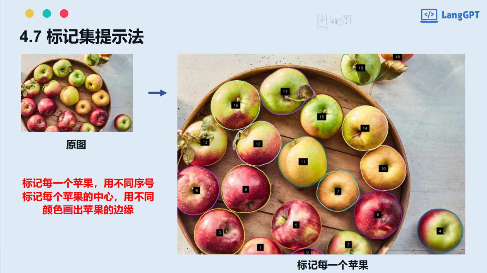


这样的拆解有什么好处？


可以看到在我们标记之前，它对整个图片的这样理解能力是很弱的，数数都会数错。


在我们进行了标记之后，它不仅能够准确的数出来，而且有一个非常好的性质——还能够告诉你红色苹果的编号是哪些。因为我们前面对苹果已经进行了编号，能够大大提高场景理解的能力。

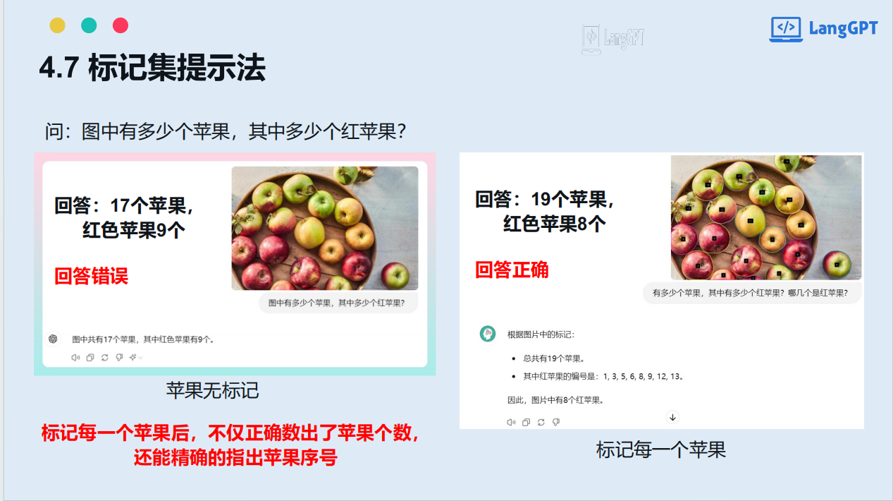


但是对所有的物品进行标记的话，要人去做这个事情好像确实挺复杂的，而且也不具有拓展性。

我们有没有可能自动化的标准化的来做这个事儿呢？


其实非常的简单，我们用一个标记模型来去做这个事情就好了。


这个标记模型怎么选？

就用传统的那些目标检测也好，语义分割的模型也好。包括说最近比较火的像 SAM 的这样的模型也好，去做这些图片的这样的一个标记信息提取。


提取出来的信息可以是一些方框，可以是像素，可以是它的类别，可以是它语义。然后具体的标记规则是怎样的，你可以自己去决定。


这样的话我们就通过AI实现了整体图片视觉内容的结构化抽取和分析。

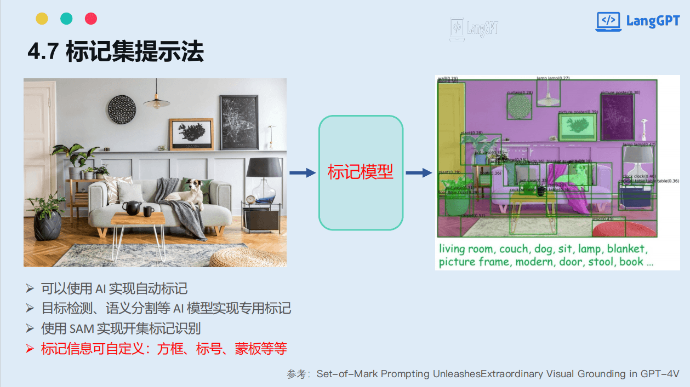


当我们完成了标记之后，可以看到大模型对于这个复杂的场景中，尤其是一些小目标的理解能力有了大大提升。

在标记之前的话，它大概只能识别 9 类物品。

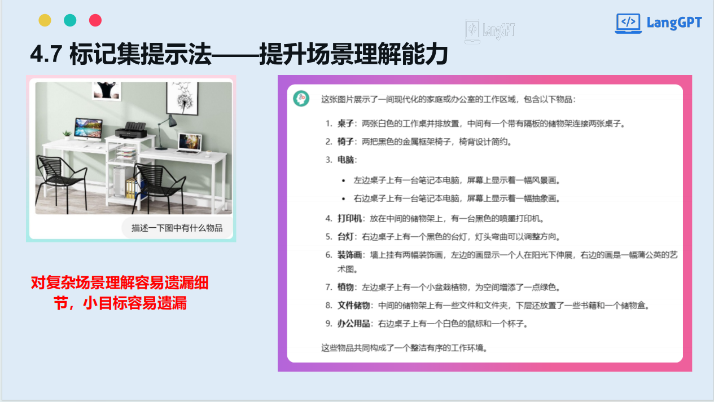

在我们进行了这样的标记之后，它能够把我们标记的所有的这些物品都能够识别到。


而且有一个好的性质，它按照我们的标号的顺序来去进行操作的。


这就意味着什么？这就意味如果你在用多模态AI去做一些应用的开发的时候，可以准确的知道哪一环有了问题，出了问题，对吧？非常方便我们进行调试，而且也比较好的缓解了多模态大模型的幻觉问题。

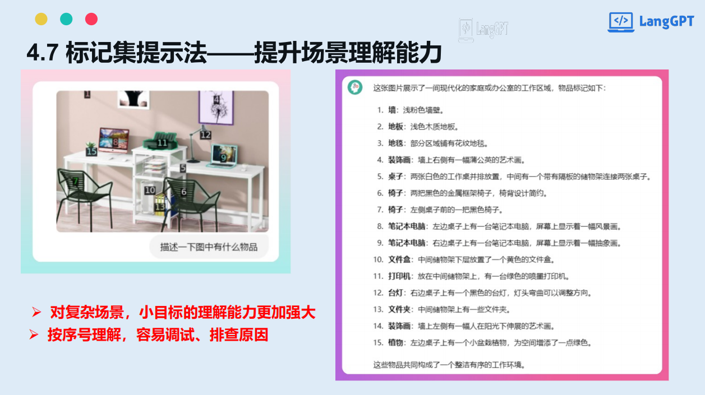


好了，以上就是我们要分享的这个所谓多模态提示词它的一些技巧和技法。


最后的话本来想讲一讲多模态提示词它的这样的一个未来，但是前面的嘉宾分享的是非常精彩，我就不多说，我就只提一点。


当前的多模态提示词发展还非常的基础，未来想象空间很大。我们刚刚也看到，我们只是讲了提示词文本+图片的结合。实际上，包括语音，还有视频等等这些模态也能被充分纳入之后，其他的AI 模型也被纳入进来，AI 的生态整体更加完善之后，其实通过提示词，通过自然语言就可以驱动整个AI的生态，实现非常多姿多彩的事情。


文字的呈现形式还是太弱了，未来的智能体必然是多模态的。随着当前的智能体生态越来越好，实现的门槛也越来越低。人人打造、拥有个人智能体的未来值得期待！


以下是我的联系方式，欢迎关注我们微信公众号：云中江树，欢迎添加微信交流。


## 多模态标记集提示法的实现

LangGPT 的代码库中使用当前最好的目标检测模型 YOLOv10 和最好的语义分割模型 SAM 实现了标记集提示法。

LangGPT 中的工程实现相比原版还进行了一些调整优化。相比单纯的目标检测，增加了序号标记。相比无序的序号标记，LangGPT 的实现进行了从左到右、从上到下的顺序标记。

有代码能力的朋友可参考相应的代码实现，没有的朋友也不用着急，当前的标记模型也存在着非常多漏标错标的问题，对于简单的需求可以采用手标的方式。


### <u>使用当前最佳的目标检测模型 YOLOv10 标记图片</u>


使用 YOLO 模型标记的优势是标记速度很快，对人的检测效果比较好。缺点是只能检测预定义的 80 种类别的物体，对于80种类别之外的物体检测效果不佳。


**代码**

> <https://github.com/langgptai/LangGPT/blob/main/src/ImagePromptingWithYOLOv10.ipynb>


**效果**

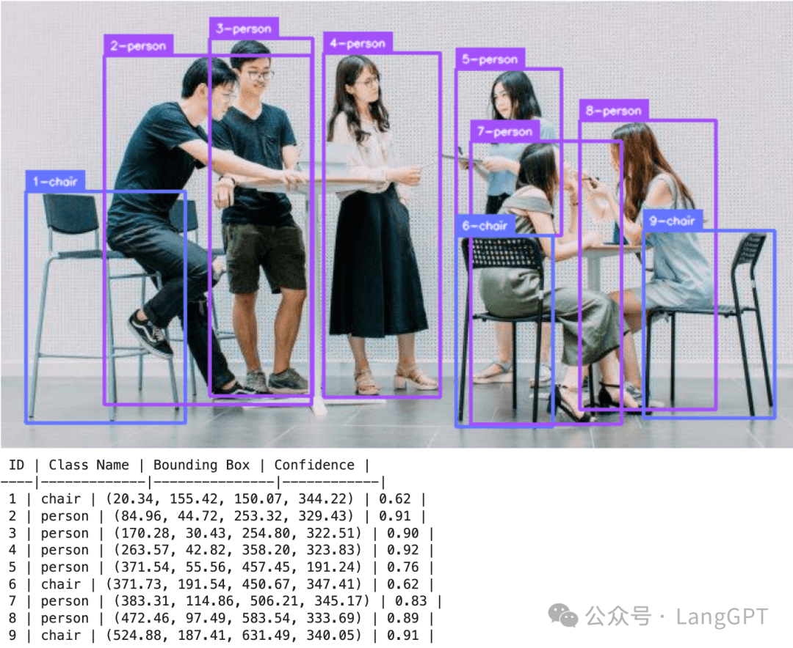


### <u>使用 SAM 标记</u>


相比 YOLO，使用 SAM 标记能够标记的更加精准，没有类别限制，效果更好，缺点是标记速度较慢，消耗GPU资源更多。


**代码**

> <https://github.com/langgptai/LangGPT/blob/main/src/SOMPromptingWithSAM.ipynb>


**效果**

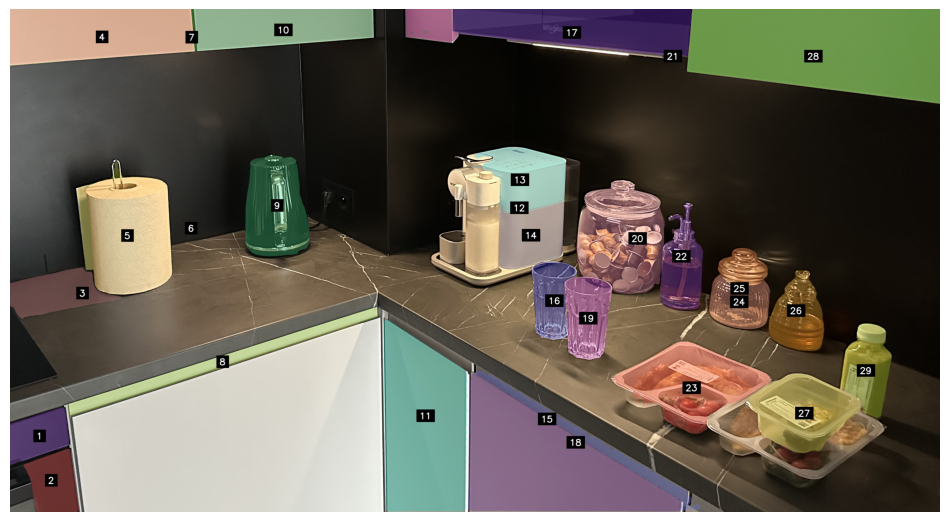


实践下来，图片、视频等视觉AI算法当前在实际使用中还是有非常多的问题，可以作为一种辅助提示手段缓解问题，但是无法从根本上解决问题。


用好多模态 AI，任重道远！多模态智能体，曙光在望\~


## 更新：标记提示法的实际应用案例

### PDF 完美解析 （20240705）

[<u>gptpdf 项目</u>](https://github.com/CosmosShadow/gptpdf) ： https://github.com/CosmosShadow/gptpdf/blob/main/README\_CN.md

使用 GPT4o 完美解析 PDF。

 方法简单但是很有效：

1. 使用 PyMuPDF 库，对 PDF 进行解析出所有**非文本区域，并做好标记。**

2. 然后使用视觉大语言模型（如 GPT-4o）将 PDF 解析为 markdown。

几乎可以完美地解析排版、数学公式、表格、图片、图表等。
