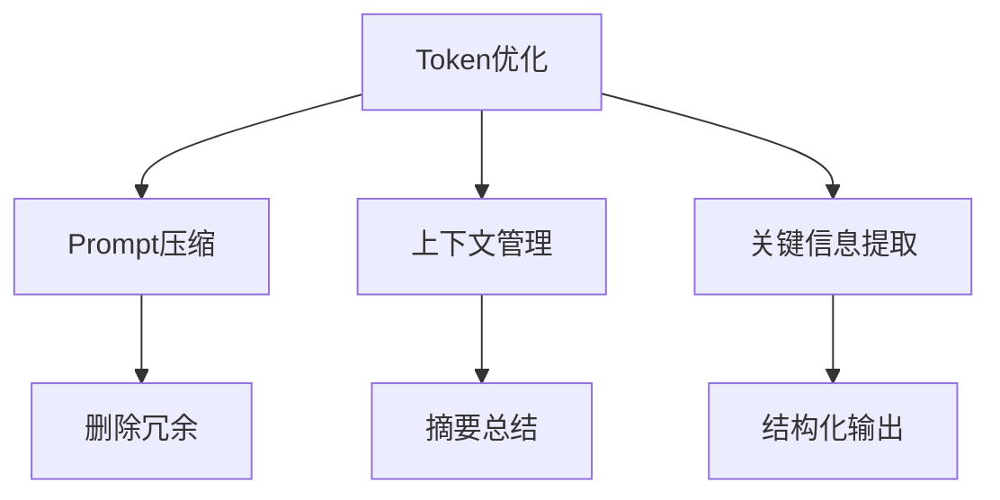

> **摘要** — Token 优化是通过减少 Token 消耗来降本增效的技术。涵盖 Prompt 压缩、上下文管理、关键信息提取等策略，在保证输出质量的前提下降低使用成本。



```markmap height=280
# Token 优化
## 策略
- 删除冗余描述
- 压缩 Prompt 长度
- 减少示例数量
## 上下文管理
- 长对话摘要
- 关键信息提取
- 窗口滑动
## 降本增效
- 减少 API 调用
- 提升响应速度
- 保证输出质量
```

---

# Token 优化
